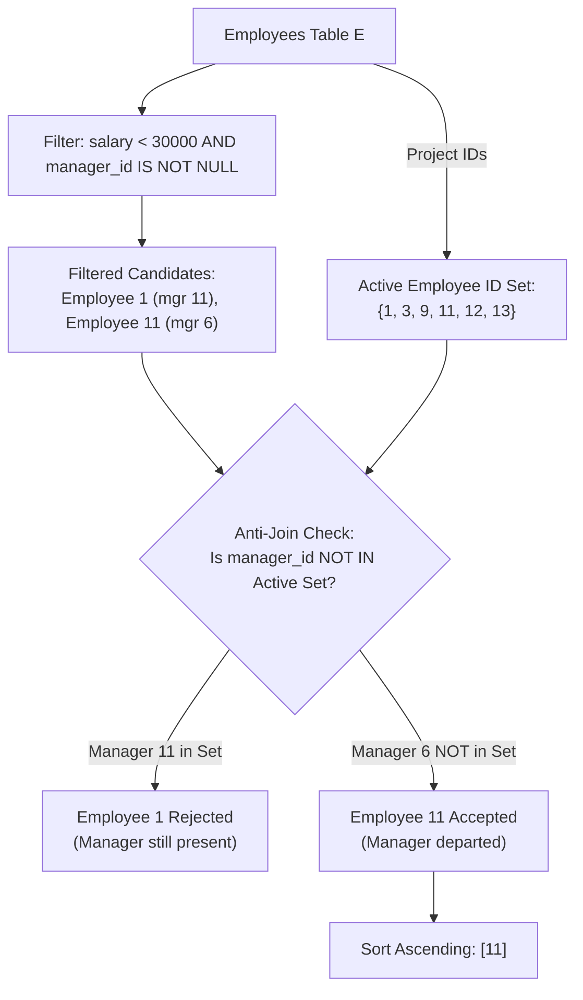

# Guided Example: Employees Whose Manager Left the Company

We formulate and analyze the relational left anti-join and predicate filtering algorithm on representative organizational tables to discover employees earning below a salary threshold whose referenced manager has departed.

- **Primary Instance:**
  - Employee 1: Salary = 21,241, Manager = 11 (Manager 11 exists in company)
  - Employee 11: Salary = 28,485, Manager = 6 (Manager 6 is absent from company)
  - Employee 3: Salary = 60,301, Manager = 9 (Salary $\ge 30{,}000$)
  - **Expected Output:** Employee `11`

---

## 1. Instance & Intuition

In corporate relational schemas, employee hierarchies are typically modeled with self-referential foreign keys (`manager_id` pointing to `employee_id` within the same `Employees` table). When a manager resigns, their row is deleted from the table, but existing subordinates' records may temporarily retain the old `manager_id`, creating an orphaned reference.

To report employees affected by this condition, a candidate record must satisfy three simultaneous criteria:
1. **Salary Constraint:** The employee's salary must be strictly below 30,000:
   $$\text{salary} < 30{,}000$$
2. **Subordinate Constraint:** The employee must have a manager assigned (i.e. `manager_id` is not null):
   $$\text{manager\_id} \neq \text{NULL}$$
3. **Orphaned Manager Constraint:** The recorded `manager_id` must not correspond to any current employee in the company:
   $$\text{manager\_id} \notin \pi_{\text{employee\_id}}(\text{Employees})$$

In our primary instance:
- Employee 3 earns 60,301, failing the salary condition ($60{,}301 \not< 30{,}000$).
- Employee 1 earns 21,241 ($< 30{,}000$) and references manager 11. However, employee 11 exists as an active employee, so manager 11 has not left.
- Employee 11 earns 28,485 ($< 30{,}000$) and references manager 6. ID 6 is absent from the company. Thus employee 11 qualifies.

---

## 2. Relational Formalism & Anti-Join Filter

Let the employee table be $E(\text{employee\_id}, \text{name}, \text{manager\_id}, \text{salary})$.

### Active Employee Set

The universe of active employees is:
$$\mathcal{A} = \pi_{\text{employee\_id}}(E)$$

### Relational Anti-Join

To isolate employees whose `manager_id` is missing from $\mathcal{A}$, we perform a left outer join between employees $e_1$ and manager records $e_2$:
$$J = e_1 \;\; \rlap{\raisebox{0.5ex}{$\subset$}}{\supset}_{e_1.\text{manager\_id} = e_2.\text{employee\_id}} \;\; e_2$$

The orphaned manager condition holds exactly when the joined record $e_2$ produces a null match:
$$e_2.\text{employee\_id is NULL}$$

### Composite Query Filter

The final qualifying relation is:
$$\mathcal{Q} = \sigma_{e_1.\text{salary} < 30000 \;\wedge\; e_1.\text{manager\_id IS NOT NULL} \;\wedge\; e_2.\text{employee\_id IS NULL}}(J)$$
Projected and sorted:
$$\text{Result} = \tau_{\text{employee\_id ASC}}(\pi_{e_1.\text{employee\_id}}(\mathcal{Q}))$$

---

## 3. Step-by-Step Selection and Exclusion Trace

We trace the representative company roster:
- Employee 1: `Kalel`, `manager_id = 11`, `salary = 21241`
- Employee 3: `Mila`, `manager_id = 9`, `salary = 60301`
- Employee 9: `Mikaela`, `manager_id = NULL`, `salary = 50937`
- Employee 11: `Joziah`, `manager_id = 6`, `salary = 28485`
- Employee 12: `Antonella`, `manager_id = NULL`, `salary = 31000`

### Step 1: Active Employee ID Domain ($\mathcal{A}$)
$$\mathcal{A} = \{1, 3, 9, 11, 12\}$$

### Step 2: Evaluating Candidates Against Criteria

1. **Employee 3:**
   - Salary: $60{,}301$. Check $60{,}301 < 30{,}000$ (False). Disqualified.
2. **Employee 9:**
   - Salary: $50{,}937$. Check $50{,}937 < 30{,}000$ (False). Disqualified.
3. **Employee 12:**
   - Salary: $31{,}000$. Check $31{,}000 < 30{,}000$ (False). Disqualified.
4. **Employee 1:**
   - Salary: $21{,}241 < 30{,}000$ (Pass).
   - Manager ID: $11 \neq \text{NULL}$ (Pass).
   - Check if manager 11 left: is $11 \in \mathcal{A}$?
     - ID 11 is present in $\mathcal{A}$!
     - Manager 11 is currently employed.
     - **Disqualified** (Manager has not left).
5. **Employee 11:**
   - Salary: $28{,}485 < 30{,}000$ (Pass).
   - Manager ID: $6 \neq \text{NULL}$ (Pass).
   - Check if manager 6 left: is $6 \in \mathcal{A}$?
     - ID 6 is absent from $\{1, 3, 9, 11, 12\}$!
     - Manager 6 has left the company.
     - **Qualified**!

Result emitted: `11`.

---

## 4. Execution Trace Table

### Complete Record Validation Log

| `employee_id` | Name | Salary | Salary $< 30000$? | `manager_id` | Manager Non-Null? | Manager in Active Set $\{1, 3, 9, 11, 12\}$? | Final Qualification |
|---|---|---|---|---|---|---|---|
| 1 | Kalel | 21,241 | **Yes** | 11 | **Yes** | **Yes (Active)** | Rejected (Active Manager) |
| 3 | Mila | 60,301 | No | 9 | Yes | Yes (Active) | Rejected (High Salary) |
| 9 | Mikaela | 50,937 | No | NULL | No | N/A | Rejected (High Salary, No Manager) |
| **11** | **Joziah** | **28,485** | **Yes** | **6** | **Yes** | **No (Departed)** | **Accepted** |
| 12 | Antonella | 31,000 | No | NULL | No | N/A | Rejected (High Salary) |

### Boundary Cases Summary

| Case Description | Salary | Manager ID | Active Manager Exists? | Result | Justification |
|---|---|---|---|---|---|
| Strict Salary Threshold | 30,000 | 8 | No | Rejected | Strict inequality required ($< 30{,}000$) |
| Just Below Threshold | 29,999 | 8 | No | **Accepted** | Meets strict inequality |
| Top-Level Executive | 25,000 | NULL | No | Rejected | Must have a manager |

---

## 5. Algorithmic Correctness & Soundness

**Soundness.** Every emitted employee ID satisfies all query requirements:
1. `salary < 30000` filters out high earners.
2. `manager_id IS NOT NULL` filters out executives and unmanaged staff.
3. The anti-join condition `manager_id NOT IN (SELECT employee_id FROM Employees)` guarantees that no active record matches the employee's manager ID, confirming the manager has left.
Ordering by `employee_id ASC` guarantees compliance with output sorting specifications.

**Completeness.** Any employee who qualifies belongs to the active `Employees` table. Sifting records through the logical conjunction of the three filters does not discard any qualifying employee. Since `employee_id` is the primary key, each qualifying person is emitted once.

---

## 6. Edge Cases & Traps

- **Strict vs. Non-Strict Inequality:** Employees earning exactly 30,000 must be excluded. The filter must strictly use `< 30000`, not `<= 30000`.
- **Three-Valued SQL Logic (`NULL` in `NOT IN`):** If the subquery `SELECT manager_id` contained nulls and was used as `WHERE x NOT IN (...)`, SQL three-valued logic would evaluate comparisons with `NULL` as `UNKNOWN`, causing the entire condition to return no rows. Using `manager_id NOT IN (SELECT employee_id FROM Employees)` is safe because `employee_id` is the primary key and cannot contain `NULL`.
- **Top-Level Staff with Low Salary:** An intern or founder with `manager_id = NULL` earning $< 30{,}000$ must not be reported; they do not have a departed manager.

---

## 7. Complexity Analysis

- **Time Complexity:**
  - Scanning `Employees` to construct the active ID set (or hash table) takes $\mathcal{O}(R)$ time, where $R$ is the number of rows.
  - Evaluating each row against the salary check, null check, and hash set lookup takes $\mathcal{O}(1)$ time.
  - Total filtering takes $\mathcal{O}(R)$ time.
  - Sorting the filtered output of size $K \le R$ takes $\mathcal{O}(K \log K)$ time.
  - Overall time complexity is $\mathcal{O}(R + K \log K)$.
- **Auxiliary Space Complexity:**
  - A hash index of current employee IDs requires $\mathcal{O}(R)$ auxiliary space.
