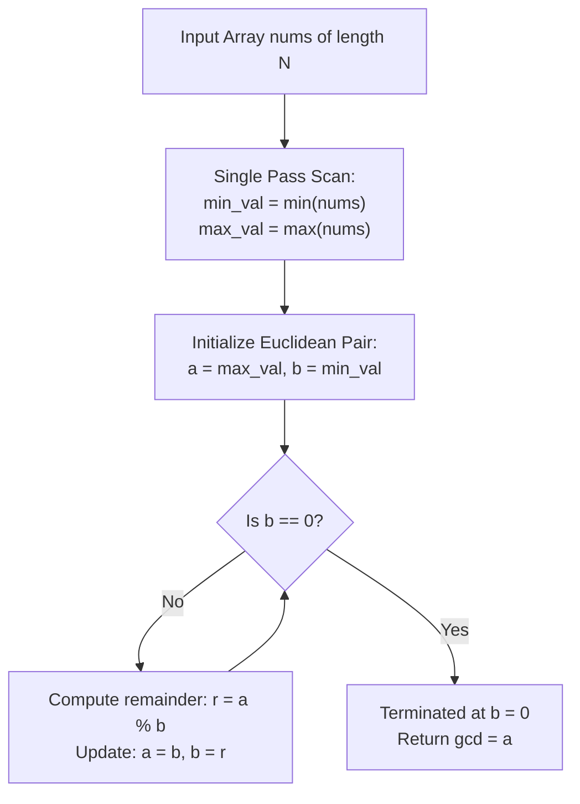

# Guided Example: Find Greatest Common Divisor of Array

We formulate and trace the linear extrema identification and Euclidean division algorithm on representative integer arrays to compute the greatest common divisor between the minimum and maximum elements.

- **Primary Instance (Coprime Endpoints):** `nums = [7, 5, 6, 8, 3]` ($N = 5$)
  - Minimum element: $3$
  - Maximum element: $8$
  - Expected Output: `1` ($\gcd(3, 8) = 1$)
- **Secondary Instance (Shared Factor Endpoints):** `nums = [2, 5, 6, 9, 10]` ($N = 5$)
  - Minimum element: $2$
  - Maximum element: $10$
  - Expected Output: `2` ($\gcd(2, 10) = 2$)

---

## 1. Instance & Intuition

The greatest common divisor $\gcd(a, b)$ of two positive integers is the largest integer $g \ge 1$ such that $g$ divides both $a$ and $b$ without remainder ($a \bmod g = 0$ and $b \bmod g = 0$).

The problem specification requires evaluating the greatest common divisor strictly between the **smallest** and **largest** elements of the array:
$$\text{Result} = \gcd\Big(\min(nums), \; \max(nums)\Big)$$
Any intermediate values between the two extrema have zero impact on the final answer.

The procedure cleanly decouples into two phases:
1. **Linear Extrema Scan:** A single pass through the array identifies $a = \min(nums)$ and $b = \max(nums)$ in $\mathcal{O}(N)$ time.
2. **Euclidean Algorithm:** We compute $\gcd(a, b)$ by repeatedly replacing the pair $(x, y)$ with $(y, x \bmod y)$ until the remainder becomes zero.

In our primary instance `nums = [7, 5, 6, 8, 3]`:
- Minimum is $3$, Maximum is $8$.
- $8 = 2 \times 3 + 2 \implies \gcd(8, 3) = \gcd(3, 2)$.
- $3 = 1 \times 2 + 1 \implies \gcd(3, 2) = \gcd(2, 1)$.
- $2 = 2 \times 1 + 0 \implies \gcd(2, 1) = \gcd(1, 0) = 1$.
- Output is `1`.

---

## 2. Mathematical Formalism & Euclidean Division Invariants

Let $nums = [x_0, x_1, \dots, x_{N-1}]$ with $x_i \ge 1$.

### Phase 1: Boundary Extraction

$$m = \min_{0 \le i < N} x_i, \quad M = \max_{0 \le i < N} x_i$$

### Phase 2: Euclidean Invariant

For any two positive integers $x$ and $y$ with $x \ge y$:
By the division algorithm:
$$x = q \cdot y + r \quad \text{where } 0 \le r < y$$
Any common divisor $d$ of $x$ and $y$ must also divide $r = x - q \cdot y$.
Conversely, any common divisor of $y$ and $r$ must divide $x = q \cdot y + r$.
Therefore, the set of common divisors of $(x, y)$ is identical to the set of common divisors of $(y, r)$:
$$\gcd(x, y) = \gcd(y, \; x \bmod y)$$

The sequence of remainders strictly decreases ($y > r_1 > r_2 > \dots \ge 0$), terminating in finite steps when remainder reaches $0$:
$$\gcd(g, 0) = g$$

---

## 3. Step-by-Step Extrema and Division Trace

We trace the primary instance `nums = [7, 5, 6, 8, 3]`:

### Phase 1: Extrema Scan
- Index 0: $x_0 = 7 \implies \text{min} = 7, \text{max} = 7$.
- Index 1: $x_1 = 5 \implies \text{min} = \min(7, 5) = 5, \text{max} = \max(7, 5) = 7$.
- Index 2: $x_2 = 6 \implies \text{min} = 5, \text{max} = 7$.
- Index 3: $x_3 = 8 \implies \text{min} = 5, \text{max} = \max(7, 8) = 8$.
- Index 4: $x_4 = 3 \implies \text{min} = \min(5, 3) = 3, \text{max} = 8$.
- Extrema finalized: $a = 8$ (max), $b = 3$ (min).

### Phase 2: Euclidean Division Steps
1. **Iteration 1:**
   - Active pair: $(a, b) = (8, 3)$.
   - Division: $8 = 2 \times 3 + 2$. Remainder $r = 8 \bmod 3 = 2$.
   - Next pair: $(a, b) \leftarrow (3, 2)$.
2. **Iteration 2:**
   - Active pair: $(a, b) = (3, 2)$.
   - Division: $3 = 1 \times 2 + 1$. Remainder $r = 3 \bmod 2 = 1$.
   - Next pair: $(a, b) \leftarrow (2, 1)$.
3. **Iteration 3:**
   - Active pair: $(a, b) = (2, 1)$.
   - Division: $2 = 2 \times 1 + 0$. Remainder $r = 2 \bmod 1 = 0$.
   - Next pair: $(a, b) \leftarrow (1, 0)$.
4. **Termination:**
   - $b = 0$. The greatest common divisor is $a = 1$.

---

## 4. Execution Trace Table

### Extrema Identification Pass

| Array Index $i$ | Element $nums[i]$ | Previous Min | New Min $\min(\text{old}, nums[i])$ | Previous Max | New Max $\max(\text{old}, nums[i])$ |
|---|---|---|---|---|---|
| 0 | 7 | $\infty$ | 7 | $-\infty$ | 7 |
| 1 | 5 | 7 | 5 | 7 | 7 |
| 2 | 6 | 5 | 5 | 7 | 7 |
| 3 | 8 | 5 | 5 | 7 | 8 |
| 4 | 3 | 5 | **3** | 8 | **8** |

### Euclidean Modulo Reduction on $(8, 3)$

| Step | Dividend $a$ | Divisor $b$ | Quotient $q = \lfloor a / b \rfloor$ | Remainder $r = a \bmod b$ | Invariant Form $\gcd(a, b) = \gcd(b, r)$ |
|---|---|---|---|---|---|
| 1 | 8 | 3 | 2 | 2 | $\gcd(8, 3) = \gcd(3, 2)$ |
| 2 | 3 | 2 | 1 | 1 | $\gcd(3, 2) = \gcd(2, 1)$ |
| 3 | 2 | 1 | 2 | 0 | $\gcd(2, 1) = \gcd(1, 0)$ |
| End | 1 | 0 | N/A | N/A | $\gcd(1, 0) = \mathbf{1}$ |

---

## 5. Algorithmic Correctness & Soundness

**Soundness.** A single linear scan through $nums$ inspects every element, guaranteeing that $m = \min(nums)$ and $M = \max(nums)$ are exact. By the division theorem of elementary number theory, for any positive integers $x$ and $y$, the set of common divisors $\text{CD}(x, y) = \text{CD}(y, x \bmod y)$. By induction on the number of division steps, $\gcd(M, m) = \gcd(g, 0) = g$. Thus the computed value $g$ is the exact greatest common divisor.

**Completeness.** Since $x \bmod y < y$, the sequence of non-negative integer remainders strictly decreases towards zero. Lamé's Theorem guarantees that the Euclidean algorithm terminates in at most $5 \log_{10}(\min(a, b))$ steps. Since inputs are bounded by $1000$, termination requires at most $5 \times 3 \approx 15$ modulo operations.

---

## 6. Edge Cases & Traps

- **Identical Extrema ($\min == \max$):** In an array with identical elements (e.g. `[3, 3]`), $m = 3$ and $M = 3$. The Euclidean step computes $3 \bmod 3 = 0$, yielding $\gcd(3, 0) = 3$.
- **Even Modulo Bounds:** Both numbers are positive ($nums[i] \ge 1$), so division by zero cannot occur on the initial step.
- **Array Extrema vs. Overall GCD:** A common misconception is to compute the GCD of the *entire* array. The problem explicitly specifies computing the GCD of only the smallest and largest numbers.

---

## 7. Complexity Analysis

- **Time Complexity:**
  - Finding the minimum and maximum takes $\mathcal{O}(N)$ comparisons.
  - The Euclidean algorithm on integers $\le 1000$ takes $\mathcal{O}(\log(\min(m, M)))$ steps.
  - Total time complexity is strictly $\mathcal{O}(N + \log M)$. For $N \le 1000$ and $M \le 1000$, this takes at most $\approx 1015$ operations, completing in under 1 millisecond.
- **Auxiliary Space Complexity:**
  - Only scalar integers (`min_val`, `max_val`, `a`, `b`, `r`) are stored.
  - Auxiliary space is strictly $\mathcal{O}(1)$.
