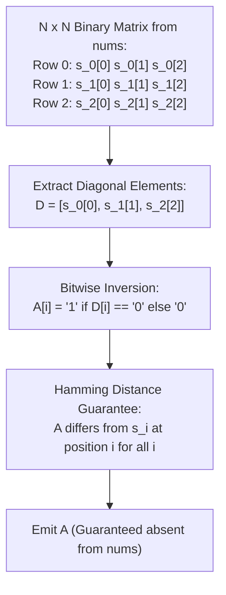

# Guided Example: Find Unique Binary String

We formulate and execute Cantor's diagonal construction on representative collections of binary strings to generate an absent length-$N$ binary string in deterministic $\mathcal{O}(N)$ time.

- **Primary Instance:** `nums = ["111", "011", "001"]` ($N = 3$)
  - Expected Output: `"000"` (or any binary string of length 3 not in `nums`)
- **Secondary Instance:** `nums = ["01", "10"]` ($N = 2$)
  - Expected Output: `"11"`

---

## 1. Instance & Intuition

We are provided an array of $N$ distinct binary strings, where every string has length exactly $N$. The space of all binary strings of length $N$ contains $2^N$ unique configurations. Because $2^N > N$ for all $N \ge 1$ (e.g. for $N = 3$, $2^3 = 8 > 3$), at least $2^N - N$ strings are missing from the array.

Rather than storing the $N$ strings in a hash set and searching through candidate numbers from $0$ to $2^N - 1$, we can apply **Cantor's Diagonal Argument**:
- Arrange the $N$ strings as rows of an $N \times N$ binary grid.
- Look down the primary diagonal: the $i$-th character of the $i$-th string, $nums[i][i]$.
- Form our answer string $A$ by **inverting** each diagonal bit:
  $$A[i] = \begin{cases} \texttt{'1'} & \text{if } nums[i][i] = \texttt{'0'} \\ \texttt{'0'} & \text{if } nums[i][i] = \texttt{'1'} \end{cases}$$

Why is string $A$ guaranteed to be absent from `nums`?
For every index $i \in \{0, \dots, N-1\}$:
$$A[i] \neq nums[i][i]$$
Because $A$ differs from string $nums[i]$ at position $i$, $A$ cannot be identical to $nums[0]$, nor $nums[1]$, nor $nums[2]$, ..., nor $nums[N-1]$.
A single pass of $N$ steps constructs a guaranteed absent string with zero search overhead!

---

## 2. Mathematical Formalism & Cantor's Diagonal Theorem

Let $\mathcal{S} = \{s_0, s_1, \dots, s_{N-1}\} \subset \{0, 1\}^N$ be the set of $N$ given strings.
We represent $\mathcal{S}$ as an $N \times N$ matrix of bits $M_{i, j} = s_i[j]$.

### Cantor Construction Function

We define the diagonal sequence $D \in \{0, 1\}^N$:
$$D_i = M_{i, i} \quad \text{for } 0 \le i < N$$

We define the complementary string $A \in \{0, 1\}^N$:
$$A_i = 1 - D_i = 1 - M_{i, i}$$

### Disjointness Theorem

For every row $i \in \{0, \dots, N-1\}$:
$$\text{dist}_{\text{Hamming}}(A, s_i) \ge \mathbb{I}(A_i \neq s_i[i]) = 1 > 0$$
Since the Hamming distance between $A$ and every $s_i \in \mathcal{S}$ is at least 1, $A \neq s_i$ for all $i$.
Therefore:
$$A \notin \mathcal{S}$$

---

## 3. Step-by-Step Diagonal Inversion Trace

We trace the primary instance `nums = ["111", "011", "001"]` ($N = 3$):

### Step 1: Lay Out the $3 \times 3$ Binary Matrix

$$\begin{pmatrix}
\mathbf{1} & 1 & 1 \\
0 & \mathbf{1} & 1 \\
0 & 0 & \mathbf{1}
\end{pmatrix}$$

### Step 2: Extract and Invert Diagonal Elements

1. **Index $i = 0$:**
   - Inspect string $nums[0] = \texttt{"111"}$ at column 0:
     $$nums[0][0] = \texttt{'1'}$$
   - Invert bit: $A[0] = \texttt{'0'}$.
   - Guarantees $A \neq nums[0]$ because they differ at index 0 ($A[0] = \texttt{'0'} \neq \texttt{'1'} = nums[0][0]$).

2. **Index $i = 1$:**
   - Inspect string $nums[1] = \texttt{"011"}$ at column 1:
     $$nums[1][1] = \texttt{'1'}$$
   - Invert bit: $A[1] = \texttt{'0'}$.
   - Guarantees $A \neq nums[1]$ because they differ at index 1 ($A[1] = \texttt{'0'} \neq \texttt{'1'} = nums[1][1]$).

3. **Index $i = 2$:**
   - Inspect string $nums[2] = \texttt{"001"}$ at column 2:
     $$nums[2][2] = \texttt{'1'}$$
   - Invert bit: $A[2] = \texttt{'0'}$.
   - Guarantees $A \neq nums[2]$ because they differ at index 2 ($A[2] = \texttt{'0'} \neq \texttt{'1'} = nums[2][2]$).

### Step 3: Assembled Output
$$A = \texttt{"000"}$$
Verification against all inputs:
- $\texttt{"000"} \neq \texttt{"111"}$ (Differs at positions 0, 1, 2)
- $\texttt{"000"} \neq \texttt{"011"}$ (Differs at positions 1, 2)
- $\texttt{"000"} \neq \texttt{"001"}$ (Differs at position 2)

---

## 4. Execution Trace Table

### Primary Trace: `nums = ["111", "011", "001"]`

| Row Index $i$ | Input String $nums[i]$ | Diagonal Element $nums[i][i]$ | Inversion Rule | Assigned Character $A[i]$ | Verified Discrepancy with $nums[i]$ |
|---|---|---|---|---|---|
| 0 | `"111"` | `'1'` | Invert `'1'` $\to$ `'0'` | `'0'` | $A[0] = \texttt{'0'} \neq nums[0][0] = \texttt{'1'}$ |
| 1 | `"011"` | `'1'` | Invert `'1'` $\to$ `'0'` | `'0'` | $A[1] = \texttt{'0'} \neq nums[1][1] = \texttt{'1'}$ |
| 2 | `"001"` | `'1'` | Invert `'1'` $\to$ `'0'` | `'0'` | $A[2] = \texttt{'0'} \neq nums[2][2] = \texttt{'1'}$ |

**Result String:** `"000"`.

### Secondary Trace: `nums = ["01", "10"]`

| Row Index $i$ | Input String $nums[i]$ | Diagonal Bit | Inverted Bit $A[i]$ | Assembled Prefix |
|---|---|---|---|---|
| 0 | `"01"` | $nums[0][0] = \texttt{'0'}$ | `'1'` | `"1"` |
| 1 | `"10"` | $nums[1][1] = \texttt{'0'}$ | `'1'` | `"11"` |

**Result String:** `"11"`. Verified absent: $\texttt{"11"} \notin \{\texttt{"01"}, \texttt{"10"}\}$.

---

## 5. Algorithmic Correctness & Soundness

**Soundness.** Let $A$ be the string produced by Cantor's diagonal inversion. Suppose for the sake of contradiction that $A \in \mathcal{S}$. Then there must exist some integer index $k \in \{0, \dots, N-1\}$ such that $A = nums[k]$.
Since the two strings are identical, their characters must match at all positions $j \in \{0, \dots, N-1\}$:
$$A[j] = nums[k][j] \quad \forall j$$
In particular, for coordinate $j = k$:
$$A[k] = nums[k][k]$$
However, by explicit construction:
$$A[k] = \begin{cases} \texttt{'1'} & \text{if } nums[k][k] = \texttt{'0'} \\ \texttt{'0'} & \text{if } nums[k][k] = \texttt{'1'} \end{cases}$$
which enforces $A[k] \neq nums[k][k]$.
This yields $nums[k][k] \neq nums[k][k]$, an immediate logical contradiction.
Therefore, $A$ cannot be equal to $nums[k]$ for any $k$, proving $A \notin \mathcal{S}$.

**Completeness.** Since $A$ has length $N$ and contains only characters $\texttt{'0'}$ and $\texttt{'1'}$, $A$ is a valid binary string of length $N$. The algorithm executes deterministically and always produces an answer in exactly $N$ iterations.

---

## 6. Edge Cases & Traps

- **Smallest Input ($N = 1$):** `nums = ["0"]`. The single diagonal bit is $nums[0][0] = \texttt{'0'}$. Inverting yields `"1"`, which is absent from `["0"]`.
- **Alternating Diagonals:** If the diagonal contains mixed bits `0101`, each bit is individually inverted, maintaining the discrepancy on each row independently.
- **Search Overhead Pitfall:** Converting strings to integers and testing membership via a hash set or boolean array of size $2^N$ incurs $\mathcal{O}(2^N)$ space and time. Cantor's construction solves the problem in optimal $\mathcal{O}(N)$ time with zero set lookups.

---

## 7. Complexity Analysis

- **Time Complexity:**
  - A single loop executes $N$ iterations from $i = 0$ to $N-1$.
  - In each iteration, reading $nums[i][i]$ and assigning the inverted character takes $\mathcal{O}(1)$ time.
  - Total time complexity is strictly $\mathcal{O}(N)$, optimal since even reading the length of the string takes $\mathcal{O}(N)$.
- **Auxiliary Space Complexity:**
  - Constructing the return string of length $N$ takes $\mathcal{O}(N)$ memory.
  - No auxiliary hash tables, sets, or recursive stacks are used.
  - Total auxiliary space is $\mathcal{O}(N)$ (or $\mathcal{O}(1)$ beyond the output string).
