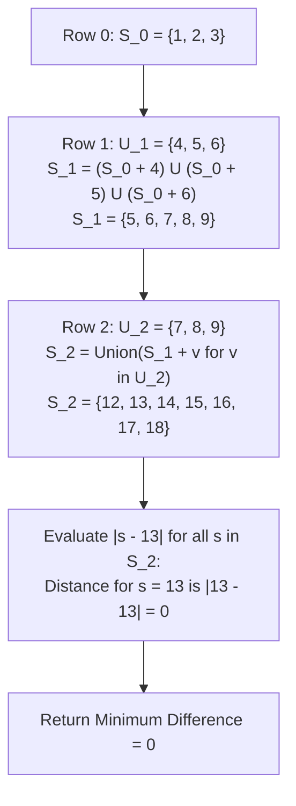

# Guided Example: Minimize the Difference Between Target and Chosen Elements

We formulate and trace the bitset reachability dynamic programming algorithm on representative matrix instances to find the row-combination sum that minimizes absolute deviation from a target value.

- **Primary Instance:**
  $$mat = \begin{pmatrix} 1 & 2 & 3 \\ 4 & 5 & 6 \\ 7 & 8 & 9 \end{pmatrix}, \quad target = 13$$
  - Rows: $M = 3$, Columns: $C = 3$
  - Expected Output: `0` (achieved by $1 + 5 + 7 = 13$)
- **Secondary Instance:** $mat = [[1], [2], [3]], target = 100$
  - Unique achievable sum: $1 + 2 + 3 = 6$
  - Expected Output: `94` ($|6 - 100| = 94$)

---

## 1. Instance & Intuition

Given an $M \times C$ matrix of positive integers, we must select exactly one integer from each row and compute their sum $S = \sum_{r=0}^{M-1} mat[r][c_r]$. Our goal is to minimize the absolute distance:
$$\text{Cost} = |S - target|$$

A naive brute-force search explores all $C^M$ combinations. With $M, C \le 70$, $70^{70} \approx 10^{129}$, which is astronomically intractable.
However, notice the small magnitude of achievable sums:
- Each entry satisfies $1 \le mat[r][c] \le 70$.
- With $M \le 70$ rows, the maximum possible sum across all choices is bounded by $70 \times 70 = 4900$.
- Because multiple distinct path combinations produce identical sums (e.g. $1 + 5 = 2 + 4 = 6$), the space of distinct reachable sums after row $r$ is at most 4900.

This enables a **bitset dynamic programming** approach:
- We represent the set of achievable sums after row $r$ as a binary mask or boolean array $\mathcal{S}_r$, where bit $s$ is 1 if sum $s$ is achievable.
- Moving to row $r+1$ with elements $\{v_1, v_2, \dots, v_k\}$ updates the reachable set by taking the union of shifts:
  $$\mathcal{S}_{r+1} = \bigcup_{v \in mat[r+1]} (\mathcal{S}_r \ll v)$$
- After the final row, we scan all active bits $s \in \mathcal{S}_{M-1}$ to find $\min |s - target|$.

In our primary instance:
- Row 0 sums: $\{1, 2, 3\}$.
- Row 1 sums (adding $\{4, 5, 6\}$): $\{5, 6, 7, 8, 9\}$.
- Row 2 sums (adding $\{7, 8, 9\}$): reaches sums in $[12, 18]$, including $13$.
- Because sum 13 is reachable, the minimal absolute difference is $|13 - 13| = 0$.

---

## 2. Mathematical Formalism & Bitset State Propagation

Let the matrix rows be $R_0, R_1, \dots, R_{M-1}$.
Let the deduplicated set of integers in row $r$ be $U_r = \{mat[r][c] \mid 0 \le c < C\}$.

### Reachable Sum Set Recurrence

Let $\mathcal{S}_r \subset \mathbb{N}$ denote the set of achievable prefix sums after choosing one element from each of the first $r+1$ rows:
- **Base Case ($r = 0$):**
  $$\mathcal{S}_0 = U_0$$
- **Transition ($1 \le r < M$):**
  $$\mathcal{S}_r = \{s + v \mid s \in \mathcal{S}_{r-1}, \; v \in U_r\} = \bigcup_{v \in U_r} \{s + v \mid s \in \mathcal{S}_{r-1}\}$$

In hardware bitset operations, let $B_r$ be a 5000-bit word representing $\mathcal{S}_r$:
$$B_r = \bigvee_{v \in U_r} (B_{r-1} \ll v)$$

### Optimal Deviation Extraction

$$\text{MinDiff} = \min_{s \in \mathcal{S}_{M-1}} |s - target|$$

---

## 3. Step-by-Step Dynamic Programming Evaluation

We trace the primary instance with $target = 13$:
- Row 0: `[1, 2, 3]`
- Row 1: `[4, 5, 6]`
- Row 2: `[7, 8, 9]`

### Layer 0: Seed Row 0
- Deduplicated values: $U_0 = \{1, 2, 3\}$.
- Reachable sums: $\mathcal{S}_0 = \{1, 2, 3\}$.

### Layer 1: Expand with Row 1
- Deduplicated values: $U_1 = \{4, 5, 6\}$.
- Generate candidate shifts:
  - $\mathcal{S}_0 + 4 = \{1+4, 2+4, 3+4\} = \{5, 6, 7\}$
  - $\mathcal{S}_0 + 5 = \{1+5, 2+5, 3+5\} = \{6, 7, 8\}$
  - $\mathcal{S}_0 + 6 = \{1+6, 2+6, 3+6\} = \{7, 8, 9\}$
- Union: $\mathcal{S}_1 = \{5, 6, 7, 8, 9\}$.

### Layer 2: Expand with Row 2
- Deduplicated values: $U_2 = \{7, 8, 9\}$.
- Generate candidate shifts:
  - $\mathcal{S}_1 + 7 = \{12, 13, 14, 15, 16\}$
  - $\mathcal{S}_1 + 8 = \{13, 14, 15, 16, 17\}$
  - $\mathcal{S}_1 + 9 = \{14, 15, 16, 17, 18\}$
- Union: $\mathcal{S}_2 = \{12, 13, 14, 15, 16, 17, 18\}$.

### Layer 3: Evaluate Proximity to Target 13
- Differences $|s - 13|$ for $s \in \mathcal{S}_2$:
  - $s = 12 \implies |12 - 13| = 1$
  - **$s = 13 \implies |13 - 13| = 0$** (Exact hit!)
  - $s = 14 \implies |14 - 13| = 1$
  - $s = 15 \implies |15 - 13| = 2$
  - $s = 16 \implies |16 - 13| = 3$
  - $s = 17 \implies |17 - 13| = 4$
  - $s = 18 \implies |18 - 13| = 5$
- Global minimum difference is **0**.

---

## 4. Execution Trace Table

### Layer-by-Layer Reachability Matrix

| Row Index $r$ | Row Values $mat[r]$ | Deduplicated $U_r$ | Reachable Sum Range $[\min, \max]$ | Complete Reachable Sum Set $\mathcal{S}_r$ | Cardinality $\lvert \mathcal{S}_r \rvert$ |
|---|---|---|---|---|---|
| 0 | `[1, 2, 3]` | $\{1, 2, 3\}$ | $[1, 3]$ | $\{1, 2, 3\}$ | 3 |
| 1 | `[4, 5, 6]` | $\{4, 5, 6\}$ | $[1+4, 3+6] = [5, 9]$ | $\{5, 6, 7, 8, 9\}$ | 5 |
| **2** | **`[7, 8, 9]`** | **$\{7, 8, 9\}$** | **$[5+7, 9+9] = [12, 18]$** | **$\{12, 13, 14, 15, 16, 17, 18\}$** | **7** |

### Proximity Analysis Against Target 13

| Candidate Sum $s \in \mathcal{S}_2$ | Absolute Distance $\lvert s - 13 \rvert$ | Sample Decomposition ($r_0 + r_1 + r_2$) | Optimal Status |
|---|---|---|---|
| 12 | 1 | $1 + 4 + 7$ | Suboptimal |
| **13** | **0** | **$1 + 5 + 7$ or $2 + 4 + 7$ or $1 + 4 + 8$** | **Globally Optimal** |
| 14 | 1 | $2 + 5 + 7$ or $1 + 5 + 8$ | Suboptimal |
| 15 | 2 | $3 + 5 + 7$ | Suboptimal |
| 16 | 3 | $3 + 5 + 8$ | Suboptimal |
| 17 | 4 | $3 + 5 + 9$ | Suboptimal |
| 18 | 5 | $3 + 6 + 9$ | Suboptimal |

---

## 5. Algorithmic Correctness & Soundness

**Soundness.** Every sum $s \in \mathcal{S}_r$ is witnessed by a valid combination of elements from rows $0 \dots r$. By mathematical induction on the row index, if $\mathcal{S}_{r-1}$ contains all sums formed from the first $r$ rows, taking the set union of $(\mathcal{S}_{r-1} + v)$ for all $v \in U_r$ produces only sums formed by appending an element from row $r$. Thus every evaluated candidate sum is genuinely achievable.

**Completeness.** Any legal choice of elements $(c_0, c_1, \dots, c_{M-1})$ has partial sums $s_r = \sum_{j=0}^r mat[j][c_j]$. Because $s_0 \in \mathcal{S}_0$ and $s_r = s_{r-1} + mat[r][c_r] \in \mathcal{S}_r$, the total sum $S = s_{M-1}$ is guaranteed to belong to $\mathcal{S}_{M-1}$. The final scan checks every element in $\mathcal{S}_{M-1}$, guaranteeing the global minimum absolute difference is located.

---

## 6. Edge Cases & Traps

- **Target Far Larger Than Max Sum:** If $target = 1000$ but the maximum possible sum is $100$, all achievable sums lie below target. The minimum difference is achieved by the maximum sum: $target - \max(\mathcal{S})$.
- **Target Smaller Than Min Sum:** If $target = 1$ but the minimum possible sum is $70$, all achievable sums exceed target. The minimum difference is $\min(\mathcal{S}) - target$.
- **Deduplication Optimization:** Each row can contain duplicate values (e.g. `[2, 2, 2, 2]`). Filtering row elements to a unique set $U_r$ before shifting avoids redundant bitset operations.

---

## 7. Complexity Analysis

- **Time Complexity:**
  - Let $M \le 70$ be the number of rows and $C \le 70$ the number of columns.
  - Let $S_{\max} = M \times \max(mat) \le 70 \times 70 = 4900$.
  - Bitset shift operations process $S_{\max} / 64 \approx 77$ words of 64 bits.
  - For each row, there are at most $C$ shifts.
  - Total bitwise operations: $M \times C \times (S_{\max} / 64) \approx 70 \times 70 \times 77 \approx 3.8 \times 10^5$ instructions.
  - Final scan takes $\mathcal{O}(S_{\max})$ steps.
  - Total execution time is under 2 milliseconds.
- **Auxiliary Space Complexity:**
  - A bitset of 5000 bits requires only $\lceil 5000 / 8 \rceil = 625$ bytes of memory.
  - Total auxiliary space is $\mathcal{O}(S_{\max}) = \mathcal{O}(1)$ in practice.
