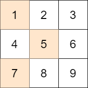
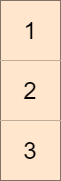
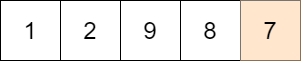

### 1. Description

You are given an `m x n` integer matrix `mat` and an integer `target`.

Choose one integer from **each row** in the matrix such that the **absolute difference** between `target` and the **sum** of the chosen elements is **minimized**.

Return *the **minimum absolute difference***.

The **absolute difference** between two numbers `a` and `b` is the absolute value of $a - b$.

### 2. Function Contract

**Inputs**

- `mat`: Input parameter (`List[List[int]]`).
- `target`: Input parameter (`int`).

**Return value**

- Returns `int`.

### 3. Examples

#### Example 1

- **Input:** $mat = [[1,2,3],[4,5,6],[7,8,9]], target = 13$
- **Output:** `0`
- **Explanation:** One possible choice is to:
- Choose 1 from the first row.
- Choose 5 from the second row.
- Choose 7 from the third row.
The sum of the chosen elements is 13, which equals the target, so the absolute difference is 0.

#### Example 2

- **Input:** $mat = [[1],[2],[3]], target = 100$
- **Output:** `94`
- **Explanation:** The best possible choice is to:
- Choose 1 from the first row.
- Choose 2 from the second row.
- Choose 3 from the third row.
The sum of the chosen elements is 6, and the absolute difference is 94.

#### Example 3

- **Input:** $mat = [[1,2,9,8,7]], target = 6$
- **Output:** `1`
- **Explanation:** The best choice is to choose 7 from the first row.
The absolute difference is 1.

### 4. Constraints

- $m = \text{mat.length}$

- $n = \text{mat}[i].length$

- $1 \le m, n \le 70$

- $1 \le \text{mat}[i][j] \le 70$

- $1 \le target \le 800$
