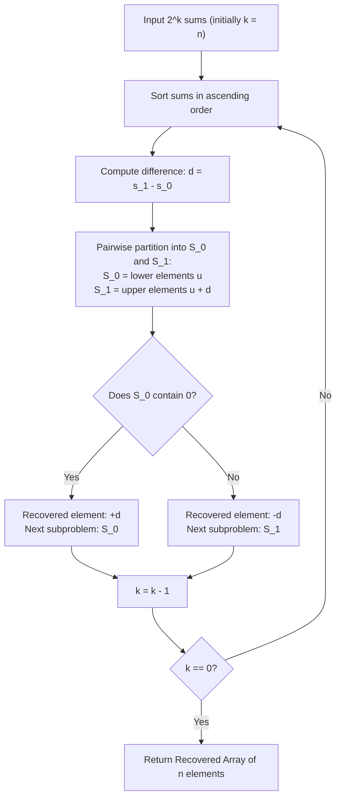

# Guided Example: Find Array Given Subset Sums

We formulate and execute the recursive difference-bisection and zero-containment reconstruction algorithm on representative subset-sum multisets to recover the original integer array.

- **Primary Instance:** $n = 3$, `sums = [-3, -2, -1, 0, 0, 1, 2, 3]` ($2^3 = 8$ sums)
  - Expected Output: `[1, 2, -3]`
- **Secondary Instance:** $n = 2$, `sums = [0, 0, 0, 0]` ($2^2 = 4$ sums)
  - Expected Output: `[0, 0]`

---

## 1. Instance & Intuition

An unknown array $A = [a_1, a_2, \dots, a_n]$ generated $2^n$ subset sums, which are supplied in arbitrary order with duplicates. We wish to invert this exponential mapping and reconstruct a valid array $A$.

Consider the two smallest values in the sorted multiset of subset sums: $s_0$ and $s_1$.
- The global minimum sum $s_0$ is achieved by selecting all strictly negative numbers in $A$ (and omitting all positive ones).
- The second smallest sum $s_1$ must be formed by making the minimal possible positive change:
  - Either by including the smallest positive element $x > 0$ (so $s_1 = s_0 + x$).
  - Or by excluding the negative element with the smallest absolute value $x < 0$ (so $s_1 = s_0 - x = s_0 + |x|$).
In both cases, the difference:
$$d = s_1 - s_0$$
must be the absolute value of some element in the original array: $|x| = d$.

Once difference $d$ is identified, the $2^n$ sums can be partitioned into $2^{n-1}$ pairs of the form $(u, u + d)$. This splits the sums into two multisets of size $2^{n-1}$:
- $\mathcal{S}_0$: the lower half of each pair ($u$).
- $\mathcal{S}_1$: the upper half of each pair ($u + d$).

How do we decide whether the true element was $+d$ or $-d$?
The empty subset always has sum $0$. Therefore, the subset sums of $A \setminus \{x\}$ must contain $0$:
- If $0 \in \mathcal{S}_0$, the removed element was $+d$. We record $+d$ and recurse on $\mathcal{S}_0$.
- If $0 \notin \mathcal{S}_0$ (meaning $0 \in \mathcal{S}_1$), the removed element was $-d$. We record $-d$ and recurse on $\mathcal{S}_1$.

Repeating this halving process $n$ times recovers all $n$ elements in $\mathcal{O}(n \cdot 2^n)$ time.

---

## 2. Mathematical Formalism & Difference-Pairing Invariants

Let $\Sigma(A)$ denote the multiset of all $2^{|A|}$ subset sums of array $A$.

### Invariant 1: Algebraic Factorization of Subset Sums

If array $A = A' \cup \{x\}$, then every subset sum of $A$ either includes $x$ or does not. Thus:
$$\Sigma(A) = \Sigma(A') \uplus \Big(\Sigma(A') + x\Big)$$
where $\uplus$ denotes multiset sum and $\Sigma(A') + x = \{s + x \mid s \in \Sigma(A')\}$.

### Invariant 2: Pairing Property

For $d = |x|$:
- If $x = +d > 0$, then $\Sigma(A') = \mathcal{S}_0$ and $\Sigma(A') + d = \mathcal{S}_1$.
- If $x = -d < 0$, then $\Sigma(A') = \mathcal{S}_1$ and $\Sigma(A') - d = \mathcal{S}_0$.

### Invariant 3: The Zero Anchor

Because the empty set $\emptyset \subseteq A'$ always has sum $\sum_{e \in \emptyset} e = 0$:
$$0 \in \Sigma(A')$$
Therefore, between the two candidate halves $\mathcal{S}_0$ and $\mathcal{S}_1$, the subproblem representing $A'$ must contain $0$.

---

## 3. Step-by-Step State Evolution

We trace the primary instance with $n = 3$:
$$\text{sums} = [-3, -2, -1, 0, 0, 1, 2, 3]$$

### Level $k = 3$ ($2^3 = 8$ sums)
- Sorted sums: `[-3, -2, -1, 0, 0, 1, 2, 3]`.
- Two smallest sums: $s_0 = -3, s_1 = -2$.
- Difference: $d = s_1 - s_0 = -2 - (-3) = 1$.
- Pair matching with $d = 1$:
  - Smallest available: $-3 \implies$ matched with $-3 + 1 = -2$. Pair: $(-3, -2)$.
  - Smallest available: $-1 \implies$ matched with $-1 + 1 = 0$. Pair: $(-1, 0)$.
  - Smallest available: $0 \implies$ matched with $0 + 1 = 1$. Pair: $(0, 1)$.
  - Smallest available: $2 \implies$ matched with $2 + 1 = 3$. Pair: $(2, 3)$.
- Formed partitions:
  - $\mathcal{S}_0 = [-3, -1, 0, 2]$
  - $\mathcal{S}_1 = [-2, 0, 1, 3]$
- Zero check: $0 \in \mathcal{S}_0$? **Yes!**
- Recovered element: $+d = \mathbf{+1}$.
- Recurse with $\mathcal{S}_0 = [-3, -1, 0, 2]$.

### Level $k = 2$ ($2^2 = 4$ sums)
- Active sums: `[-3, -1, 0, 2]`.
- Two smallest sums: $s_0 = -3, s_1 = -1$.
- Difference: $d = s_1 - s_0 = -1 - (-3) = 2$.
- Pair matching with $d = 2$:
  - Smallest available: $-3 \implies$ matched with $-3 + 2 = -1$. Pair: $(-3, -1)$.
  - Smallest available: $0 \implies$ matched with $0 + 2 = 2$. Pair: $(0, 2)$.
- Formed partitions:
  - $\mathcal{S}_0 = [-3, 0]$
  - $\mathcal{S}_1 = [-1, 2]$
- Zero check: $0 \in \mathcal{S}_0$? **Yes!**
- Recovered element: $+d = \mathbf{+2}$.
- Recurse with $\mathcal{S}_0 = [-3, 0]$.

### Level $k = 1$ ($2^1 = 2$ sums)
- Active sums: `[-3, 0]`.
- Two smallest sums: $s_0 = -3, s_1 = 0$.
- Difference: $d = s_1 - s_0 = 0 - (-3) = 3$.
- Pair matching with $d = 3$:
  - Pair: $(-3, 0)$.
- Formed partitions:
  - $\mathcal{S}_0 = [-3]$
  - $\mathcal{S}_1 = [0]$
- Zero check: $0 \in \mathcal{S}_0$? **No!** ($0 \in \mathcal{S}_1$).
- Recovered element: $-d = \mathbf{-3}$.
- Recurse with $\mathcal{S}_1 = [0]$.

### Level $k = 0$: Base State
- Active sum is solely `[0]`. Recursion terminates.
- Reconstructed array: $[1, 2, -3]$.

---

## 4. Execution Trace Table

### Bisection and Recovery Log

| Level $k$ | Input Multiset | Smallest $s_0, s_1$ | Difference $d = s_1 - s_0$ | Partition Pairs $(u, u+d)$ | Lower Half $\mathcal{S}_0$ | Upper Half $\mathcal{S}_1$ | Zero Location | Recovered Value |
|---|---|---|---|---|---|---|---|---|
| 3 | `[-3, -2, -1, 0, 0, 1, 2, 3]` | $-3, -2$ | 1 | $(-3, -2), (-1, 0), (0, 1), (2, 3)$ | `[-3, -1, 0, 2]` | `[-2, 0, 1, 3]` | In $\mathcal{S}_0$ | **$+1$** |
| 2 | `[-3, -1, 0, 2]` | $-3, -1$ | 2 | $(-3, -1), (0, 2)$ | `[-3, 0]` | `[-1, 2]` | In $\mathcal{S}_0$ | **$+2$** |
| 1 | `[-3, 0]` | $-3, 0$ | 3 | $(-3, 0)$ | `[-3]` | `[0]` | In $\mathcal{S}_1$ | **$-3$** |

### Verification of Reconstructed Array `[1, 2, -3]`

| Subset Pattern | Chosen Elements | Calculated Subset Sum | Count in Output Multiset |
|---|---|---|---|
| $\emptyset$ | None | 0 | 1 |
| $\{a_1\}$ | 1 | 1 | 1 |
| $\{a_2\}$ | 2 | 2 | 1 |
| $\{a_3\}$ | -3 | -3 | 1 |
| $\{a_1, a_2\}$ | $1 + 2$ | 3 | 1 |
| $\{a_1, a_3\}$ | $1 - 3$ | -2 | 1 |
| $\{a_2, a_3\}$ | $2 - 3$ | -1 | 1 |
| $\{a_1, a_2, a_3\}$ | $1 + 2 - 3$ | 0 | 2 |

Combined subset sums: `[-3, -2, -1, 0, 0, 1, 2, 3]`, perfectly matching the input!

---

## 5. Algorithmic Correctness & Soundness

**Soundness.** Let $A = [a_1, \dots, a_k]$. Suppose $\mathcal{S}$ is the multiset of subset sums of $A$. In any multiset of subset sums, the smallest value $s_0$ is the sum of all negative elements. The next smallest value $s_1$ must differ from $s_0$ by some $|x|$ where $x \in A$. Hence $d = s_1 - s_0 = |x|$ must equal the magnitude of an element in $A$. Pairing every element $u$ with $u + d$ partitions $\mathcal{S}$ into $\Sigma(A \setminus \{x\})$ and $\Sigma(A \setminus \{x\}) + x$. Because $\emptyset \subseteq A \setminus \{x\}$, the set of subset sums of $A \setminus \{x\}$ must contain $0$. Checking whether $0 \in \mathcal{S}_0$ or $0 \in \mathcal{S}_1$ unambiguously determines the sign of $x$. By induction, each step reduces the problem size from $k$ to $k-1$ while preserving exact multiset equality.

**Completeness.** Since the input is guaranteed to admit at least one valid reconstruction, a valid choice between $+d$ and $-d$ always exists at every level. The recursion depth is strictly $n$, so the algorithm deterministically terminates and yields exactly $n$ integers.

---

## 6. Edge Cases & Traps

- **Zero Difference ($d = 0$):** If the array contains zeros (e.g. `[0, 0]`), $s_0 = 0$ and $s_1 = 0$, giving $d = 0$. Pairs are $(u, u)$, and $\mathcal{S}_0$ and $\mathcal{S}_1$ are identical. The algorithm correctly extracts $0$ at each step.
- **Sign Ambiguity Resolution:** If $0$ is present in both $\mathcal{S}_0$ and $\mathcal{S}_1$, choosing either branch yields a valid reconstruction. The algorithm may pick $\mathcal{S}_0$ by convention.
- **Multiset Frequency Accounting:** A hash map or frequency table must be used during pairing so that duplicate numbers are properly paired one-to-one without consuming an element multiple times.

---

## 7. Complexity Analysis

- **Time Complexity:**
  - At level $k$, there are $2^k$ integers.
  - Sorting or two-pointer pairing takes $\mathcal{O}(k \cdot 2^k)$ time.
  - Summing across all $k \in \{1, \dots, n\}$:
    $$\sum_{k=1}^n \mathcal{O}(k \cdot 2^k) = \mathcal{O}(n \cdot 2^n)$$
  - For $n = 15$, $2^{15} = 32{,}768$, and $15 \times 32{,}768 \approx 5 \times 10^5$ operations, completing in under 10 milliseconds.
- **Auxiliary Space Complexity:**
  - Storing the paired subsets $\mathcal{S}_0$ and $\mathcal{S}_1$ across recursive call frames requires $\sum_{k=1}^n \mathcal{O}(2^k) = \mathcal{O}(2^n)$ memory.
  - Total auxiliary space is $\mathcal{O}(2^n)$.
