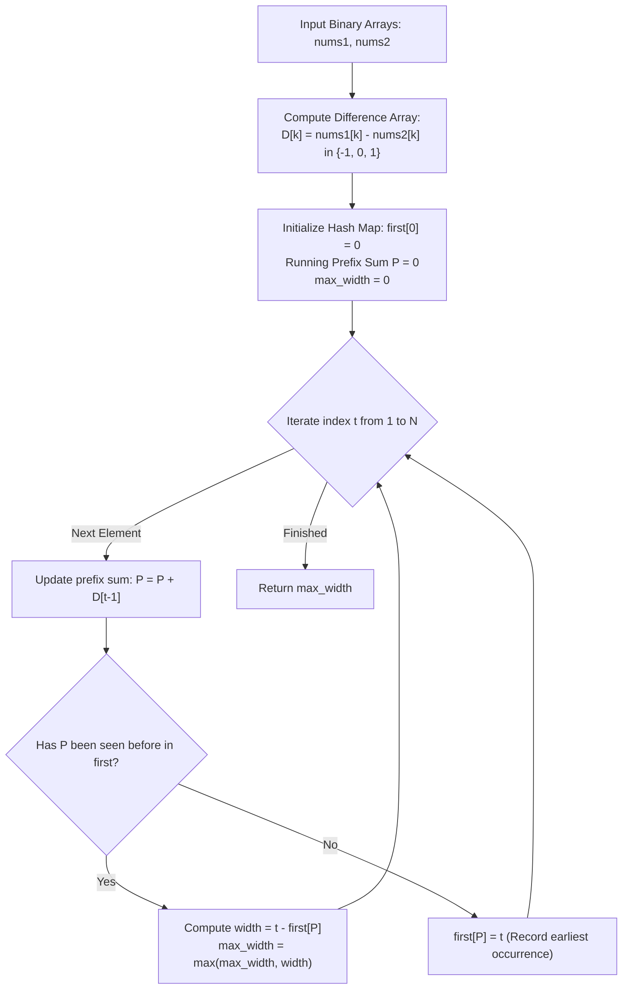

# Guided Example: Widest Pair of Indices With Equal Range Sum

We formulate and trace the differential prefix-sum reduction and first-occurrence hash map algorithm on representative binary arrays to determine the maximum width of a subarray possessing identical range sums.

- **Primary Instance:** `nums1 = [1, 1, 0, 1]`, `nums2 = [0, 1, 1, 0]` ($N = 4$)
  - Expected Output: `3` (achieved by index span $[1, 3]$ or $[0, 2]$)
- **Secondary Instance (No Equal Range):** `nums1 = [0]`, `nums2 = [1]` ($N = 1$)
  - Expected Output: `0`

---

## 1. Instance & Intuition

We are given two binary arrays `nums1` and `nums2` of equal length $N$. We seek an index pair $0 \le i \le j < N$ maximizing the window width $j - i + 1$ subject to:
$$\sum_{k=i}^j nums1[k] = \sum_{k=i}^j nums2[k]$$

Subtracting the right-hand summation from the left-hand summation yields an equivalent algebraic condition:
$$\sum_{k=i}^j \Big( nums1[k] - nums2[k] \Big) = 0$$

Let us define the **difference array** $D$:
$$D[k] = nums1[k] - nums2[k] \in \{-1, \; 0, \; +1\}$$
The problem reduces to finding the **longest contiguous subarray in $D$ whose sum is exactly zero**.

Using prefix sums $P[t] = \sum_{k=0}^{t-1} D[k]$ with $P[0] = 0$:
$$\sum_{k=i}^j D[k] = P[j+1] - P[i]$$
The subarray sum is zero if and only if:
$$P[j+1] = P[i]$$

To maximize the width $(j + 1) - i$, for each prefix sum value $v$, we should record the **earliest index** where $P$ first equaled $v$. When that same value $v$ recurs at a later index $t = j + 1$, the span $t - \text{first}[v]$ represents a maximal valid zero-sum window ending at $j$.

In our primary instance:
- Differences $D = [1-0, \; 1-1, \; 0-1, \; 1-0] = [+1, \; 0, \; -1, \; +1]$.
- Prefix sums: $P = [0, \; 1, \; 1, \; 0, \; 1]$.
- Prefix sum 0 appears at index 0 and index 3: width $3 - 0 = 3$ (range $[0, 2]$).
- Prefix sum 1 appears at index 1 and index 4: width $4 - 1 = 3$ (range $[1, 3]$).
- The maximum achievable width is 3.

---

## 2. Mathematical Formalism & First-Occurrence Mapping

Let $N$ be the length of the arrays.

### Difference Sequence and Prefix Sums

For each $k \in \{0, \dots, N-1\}$:
$$D[k] = nums1[k] - nums2[k]$$
The 0-indexed prefix sum array $P$ of length $N+1$ is defined as:
$$P[0] = 0, \quad P[t] = P[t-1] + D[t-1] \quad \text{for } 1 \le t \le N$$

### Zero-Sum Equivalence

$$\sum_{k=i}^j D[k] = 0 \iff P[j+1] = P[i]$$
The window length is $W(i, j) = j - i + 1 = (j + 1) - i$.

### Earliest Anchor Map

We maintain a hash table or offset array $\text{first}$ tracking the minimal index where each prefix sum appears:
$$\text{first}[v] = \min \{t \in \{0, \dots, N\} \mid P[t] = v\}$$

As $t$ advances from $1$ to $N$:
- If $P[t] \in \text{first}$:
  $$\text{width} = t - \text{first}[P[t]]$$
  $$\text{max\_width} \leftarrow \max(\text{max\_width}, \; \text{width})$$
- If $P[t] \notin \text{first}$:
  $$\text{first}[P[t]] \leftarrow t$$

---

## 3. Step-by-Step State Evolution

We trace the primary instance `nums1 = [1, 1, 0, 1]`, `nums2 = [0, 1, 1, 0]` ($N = 4$):

### Initialization
- Earliest occurrence map: $\text{first}[0] = 0$.
- Running prefix sum: $P = 0$.
- Maximum width: $\text{max\_width} = 0$.

### Iteration $t = 1$ ($k = 0$):
- Difference: $D[0] = nums1[0] - nums2[0] = 1 - 0 = +1$.
- New prefix sum: $P \leftarrow 0 + 1 = 1$.
- Check map: $1 \notin \text{first}$.
- Record: $\text{first}[1] = 1$.
- State: $\text{first} = \{0: 0, 1: 1\}$, $\text{max\_width} = 0$.

### Iteration $t = 2$ ($k = 1$):
- Difference: $D[1] = nums1[1] - nums2[1] = 1 - 1 = 0$.
- New prefix sum: $P \leftarrow 1 + 0 = 1$.
- Check map: $1 \in \text{first}$ (at anchor $1$).
- Candidate width: $t - \text{first}[1] = 2 - 1 = 1$.
- Update: $\text{max\_width} \leftarrow \max(0, 1) = 1$ (Subarray $[1, 1]$: $nums1[1]=1, nums2[1]=1$).

### Iteration $t = 3$ ($k = 2$):
- Difference: $D[2] = nums1[2] - nums2[2] = 0 - 1 = -1$.
- New prefix sum: $P \leftarrow 1 + (-1) = 0$.
- Check map: $0 \in \text{first}$ (at anchor $0$).
- Candidate width: $t - \text{first}[0] = 3 - 0 = 3$.
- Update: $\text{max\_width} \leftarrow \max(1, 3) = 3$ (Subarray $[0, 2]$: sums are $1+1+0=2$ and $0+1+1=2$).

### Iteration $t = 4$ ($k = 3$):
- Difference: $D[3] = nums1[3] - nums2[3] = 1 - 0 = +1$.
- New prefix sum: $P \leftarrow 0 + 1 = 1$.
- Check map: $1 \in \text{first}$ (at anchor $1$).
- Candidate width: $t - \text{first}[1] = 4 - 1 = 3$.
- Update: $\text{max\_width} \leftarrow \max(3, 3) = 3$ (Subarray $[1, 3]$: sums are $1+0+1=2$ and $1+1+0=2$).

Final result emitted: **3**.

---

## 4. Execution Trace Table

### Prefix Sum and Occurrence Trace

| Step $t$ | Index $k = t-1$ | $nums1[k]$ | $nums2[k]$ | $D[k] = nums1 - nums2$ | Prefix Sum $P[t]$ | First Seen At | Valid Window $(i, j)$ | Window Width $t - \text{first}$ | Running Max Width |
|---|---|---|---|---|---|---|---|---|---|
| 0 | None | N/A | N/A | N/A | 0 | 0 | None | N/A | 0 |
| 1 | 0 | 1 | 0 | +1 | 1 | 1 (New) | None | N/A | 0 |
| 2 | 1 | 1 | 1 | 0 | 1 | 1 | $[1, 1]$ | $2 - 1 = 1$ | 1 |
| **3** | **2** | **0** | **1** | **-1** | **0** | **0** | **$[0, 2]$** | **$3 - 0 = 3$** | **3** |
| **4** | **3** | **1** | **0** | **+1** | **1** | **1** | **$[1, 3]$** | **$4 - 1 = 3$** | **3** |

### Secondary Instance Trace: `nums1 = [0]`, `nums2 = [1]`

| Step $t$ | $nums1$ | $nums2$ | $D$ | $P[t]$ | Seen in $\text{first}$? | Action | Max Width |
|---|---|---|---|---|---|---|---|
| 0 | N/A | N/A | N/A | 0 | Yes (Init) | Seed $\text{first}[0] = 0$ | 0 |
| 1 | 0 | 1 | -1 | -1 | No | Record $\text{first}[-1] = 1$ | 0 |

Final maximum width: **0** (no matching range).

---

## 5. Algorithmic Correctness & Soundness

**Soundness.** Suppose the algorithm identifies a match with width $w = t - \text{first}[P[t]]$ for some $t > \text{first}[P[t]]$. Let $i = \text{first}[P[t]]$ and $j = t - 1$. Then $0 \le i \le j < N$. By definition of prefix sums:
$$\sum_{k=i}^j nums1[k] - \sum_{k=i}^j nums2[k] = \sum_{k=i}^j D[k] = P[t] - P[i] = P[t] - P[t] = 0$$
Thus, the sum over $[i, j]$ in `nums1` is equal to the sum over $[i, j]$ in `nums2`. The window width is $j - i + 1 = (t - 1) - i + 1 = t - i = w$. Any returned width is therefore guaranteed to be valid and achievable.

**Completeness & Maximality.** Suppose there exists an optimal qualifying range $[i^*, j^*]$ with maximum width $W^* = j^* - i^* + 1$. Then $P[j^*+1] = P[i^*] = v^*$. In the algorithm, $v^*$ is recorded in $\text{first}[v^*]$ at some index $i' \le i^*$. When the loop reaches $t = j^* + 1$, it evaluates width $(j^* + 1) - i' \ge (j^* + 1) - i^* = W^*$. Because the anchor $i'$ is the earliest possible occurrence of $v^*$, the computed span is maximal, guaranteeing no larger width is missed.

---

## 6. Edge Cases & Traps

- **Zero Width Return:** When no matching non-empty range exists (e.g. `[0]` and `[1]`), no prefix sum is ever revisited. The algorithm correctly returns 0.
- **Hash Table vs. Direct Array:** Because $D[k] \in \{-1, 0, 1\}$, prefix sums lie strictly in $[-N, N]$. Instead of a hash map with hashing overhead, an array of size $2N + 1$ with an offset of $N$ provides $\mathcal{O}(1)$ worst-case direct indexing.
- **Base Anchor $\text{first}[0] = 0$:** Omitting the initialization $\text{first}[0] = 0$ would fail to detect zero-sum ranges that start from the very beginning of the array ($i = 0$).

---

## 7. Complexity Analysis

- **Time Complexity:**
  - A single pass iterates $N$ times from $t = 1$ to $N$.
  - At each step, updating the running prefix sum, checking the anchor table, and updating the maximum width takes $\mathcal{O}(1)$ time.
  - Total time complexity is strictly $\mathcal{O}(N)$, completing in under 5 milliseconds for $N = 10^5$.
- **Auxiliary Space Complexity:**
  - The anchor array or hash table stores at most $2N + 1$ distinct prefix sums: $\mathcal{O}(N)$.
  - Total auxiliary space is $\mathcal{O}(N)$.
