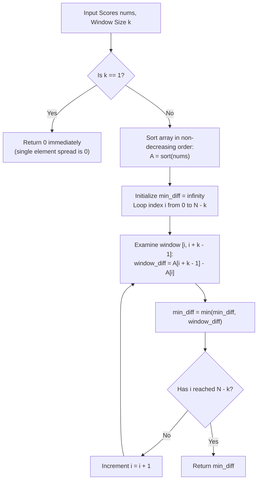

# Guided Example: Minimum Difference Between Highest and Lowest of K Scores

We analyze and trace the sorting and fixed-size sliding window algorithm on representative integer arrays to find the minimum possible difference between the highest and lowest of any $k$ selected student scores.

- **Primary Instance:** `nums = [9, 4, 1, 7]`, `k = 2` ($N = 4$)
  - Expected Output: `2` (achieved by choosing $\{7, 9\}$, difference $9 - 7 = 2$)
- **Secondary Instance:** `nums = [87, 45, 12, 99, 102, 53]`, `k = 3` ($N = 6$)
  - Expected Output: `15` (achieved by choosing $\{87, 99, 102\}$, difference $102 - 87 = 15$)
- **Boundary Instance ($k = 1$):** `nums = [90]`, `k = 1`
  - Expected Output: `0` (any single element has difference $x - x = 0$)

---

## 1. Instance & Intuition

We are given an array `nums` of student scores and an integer $k \ge 1$. We are asked to select any subset $S \subseteq nums$ of size $|S| = k$ such that the spread:
$$\text{spread}(S) = \max(S) - \min(S)$$
is as small as possible.

### Combinatorial Explosion vs. Ordering Insight

A naive search over all $\binom{N}{k}$ subsets is computationally prohibitive for $N = 1000$. For example, choosing $k = 500$ from $N = 1000$ yields $\binom{1000}{500} \approx 2.7 \times 10^{299}$ combinations.

However, consider any subset $S = \{s_1, s_2, \dots, s_k\}$ ordered such that $s_1 \le s_2 \le \dots \le s_k$. Its spread depends solely on its two extreme values:
$$\text{spread}(S) = s_k - s_1$$
Any elements in the full array `nums` that numerically fall between $s_1$ and $s_k$ could be substituted into $S$ without expanding this spread. Consequently, if the entire array `nums` is sorted in non-decreasing order:
$$nums[0] \le nums[1] \le nums[2] \le \dots \le nums[N-1]$$
any optimal subset of size $k$ can be chosen as **$k$ consecutive elements** in the sorted sequence:
$$S_i = \{nums[i], nums[i+1], \dots, nums[i+k-1]\}$$
The spread of such a contiguous window is simply:
$$\text{spread}(S_i) = nums[i+k-1] - nums[i]$$

This reduces the problem from an exponential subset search to sorting `nums` in $\mathcal{O}(N \log N)$ time, followed by a linear scan over all $N - k + 1$ contiguous windows of length $k$.

---

## 2. Mathematical Formalism & Contiguity Principle

Let the sorted array be $A = \text{sort}(nums)$ with $A[0] \le A[1] \le \dots \le A[N-1]$.

### Contiguity Lemma

> **Lemma.** There exists an optimal subset $S^* \subseteq A$ with $|S^*| = k$ whose elements form a contiguous subarray in $A$.
>
> **Proof.** Suppose an optimal subset $S^*$ has minimum element $A[p]$ and maximum element $A[q]$, with spread $A[q] - A[p]$. 
> Since $|S^*| = k$, there must be at least $k$ elements in $A$ between index $p$ and index $q$ inclusive, which implies $q - p + 1 \ge k$.
> Consider the contiguous subsegment of length $k$ starting at index $p$:
> $$S' = \{A[p], A[p+1], \dots, A[p+k-1]\}$$
> Because $A$ is sorted and $p + k - 1 \le q$, we have:
> $$\min(S') = A[p], \quad \max(S') = A[p+k-1] \le A[q]$$
> Therefore:
> $$\text{spread}(S') = A[p+k-1] - A[p] \le A[q] - A[p] = \text{spread}(S^*)$$
> Because $S^*$ is optimal, its spread cannot be strictly larger than that of $S'$, so $\text{spread}(S') = \text{spread}(S^*)$, confirming that the contiguous block $S'$ is equally optimal. $\blacksquare$

### Formulation of the Scan

The global minimum spread is given by:
$$\Delta^* = \begin{cases} 0 & \text{if } k = 1 \\ \min_{0 \le i \le N - k} \Big( A[i+k-1] - A[i] \Big) & \text{if } k > 1 \end{cases}$$

---

## 3. Step-by-Step State Evolution

### Primary Instance Walkthrough

- **Input:** `nums = [9, 4, 1, 7]`, `k = 2`, length $N = 4$.

#### Phase 1: Sort the Array
- Sorting `nums` yields $A = [1, 4, 7, 9]$.

#### Phase 2: Slide Window of Size $k = 2$
The number of valid windows is $N - k + 1 = 4 - 2 + 1 = 3$.
We inspect each window index $i \in \{0, 1, 2\}$:

1. **Window $i = 0$:**
   - Window elements: $[A[0], A[1]] = [1, 4]$.
   - Highest score: $A[1] = 4$.
   - Lowest score: $A[0] = 1$.
   - Difference: $4 - 1 = 3$.
   - Current best: $\min(\infty, 3) = 3$.

2. **Window $i = 1$:**
   - Window elements: $[A[1], A[2]] = [4, 7]$.
   - Highest score: $A[2] = 7$.
   - Lowest score: $A[1] = 4$.
   - Difference: $7 - 4 = 3$.
   - Current best: $\min(3, 3) = 3$.

3. **Window $i = 2$:**
   - Window elements: $[A[2], A[3]] = [7, 9]$.
   - Highest score: $A[3] = 9$.
   - Lowest score: $A[2] = 7$.
   - Difference: $9 - 7 = 2$.
   - Current best: $\min(3, 2) = 2$.

All windows evaluated. The minimum possible difference is **2**.

---

## 4. Complete Execution Trace

### Primary Instance: `nums = [9, 4, 1, 7]`, `k = 2`

Sorted Array: $A = [1, 4, 7, 9]$

| Window Index $i$ | Right Index $i + k - 1$ | Window $[A[i], \dots, A[i+k-1]]$ | Lowest $A[i]$ | Highest $A[i+k-1]$ | Difference | Running Minimum |
|---|---|---|---|---|---|---|
| 0 | 1 | $[1, 4]$ | 1 | 4 | $4 - 1 = 3$ | 3 |
| 1 | 2 | $[4, 7]$ | 4 | 7 | $7 - 4 = 3$ | 3 |
| 2 | 3 | $[7, 9]$ | 7 | 9 | $9 - 7 = 2$ | 2 |

### Secondary Instance: `nums = [87, 45, 12, 99, 102, 53]`, `k = 3`

Sorted Array: $A = [12, 45, 53, 87, 99, 102]$ ($N = 6$, $k = 3$, $N - k + 1 = 4$ windows)

| Window Index $i$ | Right Index $i + k - 1$ | Window Elements | Lowest $A[i]$ | Highest $A[i+k-1]$ | Difference | Running Minimum |
|---|---|---|---|---|---|---|
| 0 | 2 | $[12, 45, 53]$ | 12 | 53 | $53 - 12 = 41$ | 41 |
| 1 | 3 | $[45, 53, 87]$ | 45 | 87 | $87 - 45 = 42$ | 41 |
| 2 | 4 | $[53, 87, 99]$ | 53 | 99 | $99 - 53 = 46$ | 41 |
| 3 | 5 | $[87, 99, 102]$ | 87 | 102 | $102 - 87 = 15$ | 15 |

Final answer for secondary instance: **15**.

---

## 5. Algorithmic Correctness & Soundness

1. **Equivalence of Subsets to Sorted Intervals:**
   By the Contiguity Lemma, every non-contiguous selection of $k$ scores spanning from index $p$ to $q$ in the sorted array has spread $A[q] - A[p] \ge A[p+k-1] - A[p]$. Hence, restricting the search space strictly to contiguous subsegments of length $k$ in the sorted array is guaranteed to include at least one global minimizer.

2. **Exhaustive Window Coverage:**
   The loop index $i$ ranges from $0$ to $N - k$, inspecting every contiguous subarray of length $k$. Because the total number of contiguous subarrays of length $k$ is finite ($N - k + 1$), taking the minimum over all such windows guarantees finding the global minimum.

3. **Boundary Condition ($k = 1$):**
   When $k = 1$, any chosen single student score $x$ yields a difference of $x - x = 0$. The formula $A[i+0] - A[i] = 0$ holds universally.

---

## 6. Traps This Instance Exposes

- **Searching Subsets Without Sorting:** Attempting to find the minimum difference via greedy clustering or dynamic programming without sorting requires non-trivial combinatorial handling and fails to capitalize on the 1D ordering property.
- **Off-by-One Window Bounds:** For a window of length $k$ starting at index $i$, the terminal element is at index $i + k - 1$, not $i + k$. Using $i + k$ spans $k + 1$ elements and accesses out-of-bounds index $N$ when $i = N - k$.
- **Ignoring $k = 1$ Case:** Although the sliding window formula $A[i+0] - A[i] = 0$ evaluates to 0, handling $k = 1$ as an early exit avoids unnecessary window looping.
- **Assuming Differences Between Consecutive Elements:** The answer is not simply the minimum adjacent difference $\min(A[i+1] - A[i])$ unless $k = 2$. For $k > 2$, the spread spans $k$ elements, so individual adjacent differences must be accumulated across the entire window.

---

## 7. Complexity Analysis

- **Time Complexity:**
  - **Sorting:** Sorting an array of $N$ elements takes $\mathcal{O}(N \log N)$ comparisons using standard comparison sorts (e.g., Timsort, Quicksort).
  - **Window Scan:** Inspecting $N - k + 1$ windows takes $\mathcal{O}(N - k + 1) = \mathcal{O}(N)$ operations, where each window evaluates a single subtraction $A[i+k-1] - A[i]$ and a minimum comparison.
  - **Total Time:** $\mathcal{O}(N \log N)$, which runs in well under 2 milliseconds for $N \le 1000$.

- **Auxiliary Space Complexity:**
  - In-place sorting algorithms require $\mathcal{O}(1)$ or $\mathcal{O}(\log N)$ call-stack space.
  - The sliding window scan requires only $\mathcal{O}(1)$ auxiliary space to store index $i$ and the running scalar minimum.
  - **Total Auxiliary Space:** $\mathcal{O}(1)$ beyond standard sort overhead.
