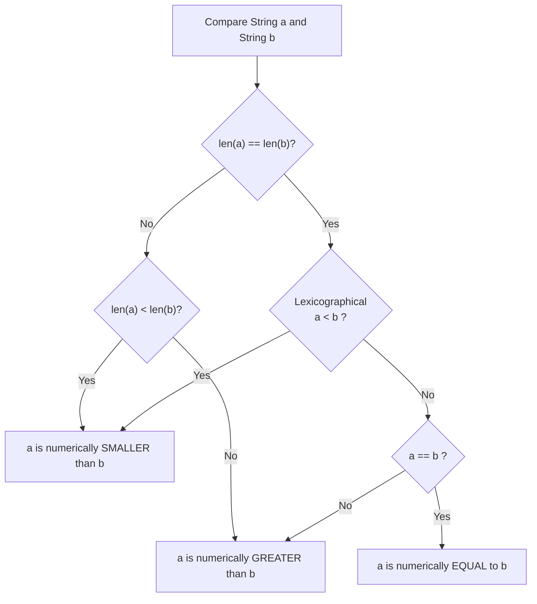
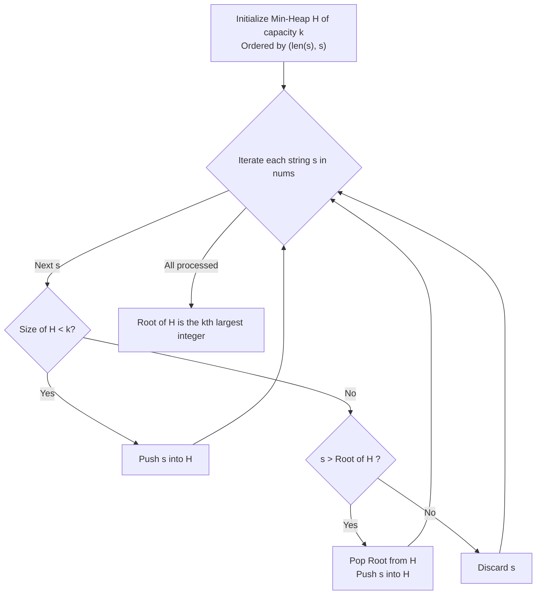

# Guided Example: Find the Kth Largest Integer in the Array

We analyze and trace the custom string comparator and min-heap selection algorithm on representative string arrays representing arbitrarily large integers, identifying the $k^{\text{th}}$ largest numerical value without numeric overflow.

- **Primary Instance:** `nums = ["2", "21", "12", "1"]`, `k = 3` ($N = 4$)
  - Expected Output: `"2"` (the sorted descending sequence is `["21", "12", "2", "1"]`, whose $3^{\text{rd}}$ element is `"2"`)
- **Secondary Instance:** `nums = ["3", "6", "7", "10"]`, `k = 4` ($N = 4$)
  - Expected Output: `"3"` (descending order is `["10", "7", "6", "3"]`, $4^{\text{th}}$ element is `"3"`)
- **Arbitrary Precision Instance:** `nums = ["100000000000000000000", "99999999999999999999"]`, `k = 1`
  - Expected Output: `"100000000000000000000"` (21 digits vs. 20 digits, demonstrating length-priority comparison)

---

## 1. Instance & Intuition

We are given an array `nums` of $N$ strings, where each string represents a positive integer (or zero) without leading zeros. Each integer string can be up to $L = 100$ digits long, far exceeding standard 64-bit unsigned integer capacities ($2^{64} - 1 \approx 1.84 \times 10^{19}$, or 20 digits). We must locate the $k^{\text{th}}$ largest number in the array.

### Why Standard Lexicographical Sorting Fails

In standard dictionary sorting, strings are compared character by character from left to right. Under dictionary order:
$$\text{"10"} <_{\text{lex}} \text{"2"} \quad \text{because } \text{'1'} < \text{'2'}$$
However, numerically:
$$10 > 2$$
Converting every string to a machine integer is invalid or undefined in typed languages with fixed bitwidths, and incurs arbitrary-precision conversion overhead in interpreted languages.

### The Length-Priority Comparator Principle

Because the inputs have no leading zeros, the number of digits in the string directly dictates its order of magnitude:
1. **Unequal Lengths:** If $\text{len}(a) > \text{len}(b)$, then $a$ represents a larger integer than $b$, regardless of individual digit values (e.g., `"10"` has length 2, while `"9"` has length 1, so $10 > 9$).
2. **Equal Lengths:** If $\text{len}(a) == \text{len}(b)$, the numbers share the same place value for every column. Therefore, standard left-to-right character comparison mirrors numerical magnitude exactly (e.g., for `"21"` and `"12"`, both have length 2; comparing the first character reveals `'2' > '1'`, so $21 > 12$).

Thus, the total ordering relation $\prec$ is defined as:
$$a \prec b \iff (\text{len}(a) < \text{len}(b)) \;\lor\; \big(\text{len}(a) == \text{len}(b) \;\land\; a <_{\text{lex}} b\big)$$

---

## 2. Selection Mechanics: Min-Heap of Size $k$

Rather than sorting the entire array of $N$ strings (costing $\mathcal{O}(N \log N \cdot L)$), we can track the $k$ largest elements dynamically using a **min-heap** of capacity $k$ ordered by $\prec$.

### Min-Heap Properties
- The heap retains at most $k$ elements at any moment.
- The root of the min-heap always stores the **smallest element among the current top $k$ candidates**.
- For each new element $x$:
  - If the heap contains fewer than $k$ elements, insert $x$.
  - If the heap already has $k$ elements and $x \succ \text{root}$, remove the root and insert $x$.
  - Otherwise ($x \preceq \text{root}$), discard $x$, as it cannot belong to the overall top $k$.
- After processing all $N$ elements, the root of the heap is precisely the $k^{\text{th}}$ largest integer in the entire array.

---

## 3. Step-by-Step State Evolution

We trace the Primary Instance: `nums = ["2", "21", "12", "1"]`, $k = 3$.

### Step 1: Processing `nums[0] = "2"`
- Current heap size is $0 < 3$.
- Insert `"2"`.
- Heap contents: `["2"]`. Root = `"2"`.

### Step 2: Processing `nums[1] = "21"`
- Current heap size is $1 < 3$.
- Insert `"21"`.
- Comparison: $\text{len}(\text{"2"}) = 1 < \text{len}(\text{"21"}) = 2$, so `"2"` $\prec$ `"21"`.
- Heap contents: `["2", "21"]`. Root = `"2"`.

### Step 3: Processing `nums[2] = "12"`
- Current heap size is $2 < 3$.
- Insert `"12"`.
- Comparison: $\text{len}(\text{"2"}) = 1 < \text{len}(\text{"12"}) = 2$.
- Comparing `"12"` and `"21"`: both length 2, `"12"` $<_{\text{lex}}$ `"21"`.
- Heap contents: `["2", "21", "12"]`. Root remains `"2"`.
- Heap has now reached maximum capacity $k = 3$.

### Step 4: Processing `nums[3] = "1"`
- Current heap size is $3 = k$.
- Current root is `"2"`.
- Compare candidate `"1"` with root `"2"`:
  - Both length 1.
  - Lexicographical check: `'1' < '2'`, so `"1"` $\prec$ `"2"`.
- Since `"1"` is strictly smaller than the root, it cannot be among the 3 largest elements.
- Action: Discard `"1"`.
- Heap remains: `["2", "21", "12"]`.

### Final Extraction
- Array iteration complete.
- The root of the min-heap is `"2"`.
- Output: `"2"`.

---

## 4. Complete Execution Trace

### Primary Instance: `nums = ["2", "21", "12", "1"]`, $k = 3$

| Step | Candidate $s$ | Action | Reason | Min-Heap State (Tree / Root) | Current $k^{\text{th}}$ Candidate |
|---|---|---|---|---|---|
| 1 | `"2"` | Push `"2"` | Heap size $0 < 3$ | `["2"]` (Root: `"2"`) | `"2"` |
| 2 | `"21"` | Push `"21"` | Heap size $1 < 3$ | `["2", "21"]` (Root: `"2"`) | `"2"` |
| 3 | `"12"` | Push `"12"` | Heap size $2 < 3$ | `["2", "21", "12"]` (Root: `"2"`) | `"2"` |
| 4 | `"1"` | Discard `"1"` | `"1"` $\prec$ Root `"2"` | `["2", "21", "12"]` (Root: `"2"`) | `"2"` |

Final Answer: `"2"`.

### Secondary Instance: `nums = ["3", "6", "7", "10"]`, $k = 4$

All 4 elements must fit into the heap of capacity $k = 4$:

| Step | Candidate $s$ | Action | Relative Rank Against Existing Elements | Min-Heap State | Heap Root (Minimum) |
|---|---|---|---|---|---|
| 1 | `"3"` | Push `"3"` | First element | `["3"]` | `"3"` |
| 2 | `"6"` | Push `"6"` | `"3"` $\prec$ `"6"` | `["3", "6"]` | `"3"` |
| 3 | `"7"` | Push `"7"` | `"3"` $\prec$ `"7"` | `["3", "6", "7"]` | `"3"` |
| 4 | `"10"` | Push `"10"` | `"3"` $\prec$ `"10"` ($\text{len } 1 < 2$) | `["3", "6", "7", "10"]` | `"3"` |

Final Answer: Root of heap is `"3"`.

---

## 5. Algorithmic Correctness & Soundness

1. **Validity of the Comparator:**
   Let $a, b$ represent non-negative integers without leading zeros.
   - If $\text{len}(a) < \text{len}(b)$, then $10^{\text{len}(a)-1} \le \text{val}(a) < 10^{\text{len}(a)} \le 10^{\text{len}(b)-1} \le \text{val}(b)$, so $\text{val}(a) < \text{val}(b)$.
   - If $\text{len}(a) == \text{len}(b)$, let $j$ be the first index from the left where digits differ ($a[j] \neq b[j]$). The higher place value $10^{\text{len}(a)-1-j}$ determines the total sign of $\text{val}(a) - \text{val}(b)$, proving $a[j] < b[j] \iff \text{val}(a) < \text{val}(b)$.
   - The relation $\prec$ is a strict weak ordering satisfying irreflexivity, asymmetry, and transitivity.

2. **Heap Invariant:**
   At any point after filling the heap to size $k$, the heap maintains the $k$ largest elements seen so far. The minimum among them resides at the root. Any incoming element smaller than or equal to the root is inferior to all $k$ members and can be safely discarded. Any incoming element larger than the root displaces the current minimum. By induction, upon consuming all $N$ elements, the heap contains the overall $k$ largest elements, and the root is the smallest of these $k$, which is by definition the $k^{\text{th}}$ largest element.

---

## 6. Traps This Instance Exposes

- **Integer Overflow:** Casting strings directly to standard 32-bit or 64-bit integer types causes numeric overflow on numbers having up to 100 digits.
- **Pure Lexicographical Sort Error:** Sorting strings without comparing lengths places `"10"` before `"2"`, incorrectly asserting that $10 < 2$. Length must strictly precede digit comparison.
- **Duplicate Value Collapsing:** Using a hash set to collect distinct elements violates the problem contract, which explicitly mandates that duplicates be counted distinctly (e.g., in `["1", "2", "2"]`, `"2"` is both $1^{\text{st}}$ and $2^{\text{nd}}$ largest).
- **Max-Heap vs. Min-Heap Confusion:** To maintain the top $k$ largest elements using a bounded collection of size $k$, a **min-heap** must be used so that the smallest candidate can be evicted when a larger value is encountered. A max-heap of size $k$ would evict the overall maximum.

---

## 7. Complexity Analysis

- **Time Complexity:**
  - **String Comparison:** Comparing two strings of maximum length $L$ takes $\mathcal{O}(1)$ for lengths and $\mathcal{O}(L)$ for lexicographical comparison in the worst case.
  - **Heap Operations:** Each element triggers at most one heap push and one heap pop on a heap of size $k$, requiring $\mathcal{O}(\log k)$ comparisons.
  - **Overall Bound:** Processing $N$ strings of length up to $L$ requires $\mathcal{O}(N \cdot L \log k)$ time. With $N \le 10^4$, $k \le 10^4$, and $L \le 100$, the total number of character operations is roughly $10^4 \times 100 \times 14 \approx 1.4 \times 10^7$, comfortably completing within 0.1 seconds.
  - *(Note: Using Quickselect with this comparator achieves $\mathcal{O}(N \cdot L)$ average time).*

- **Auxiliary Space Complexity:**
  - The min-heap stores at most $k$ string references of length at most $L$.
  - **Total Auxiliary Space:** $\mathcal{O}(k \cdot L)$ space to store the active candidate strings in the heap.
