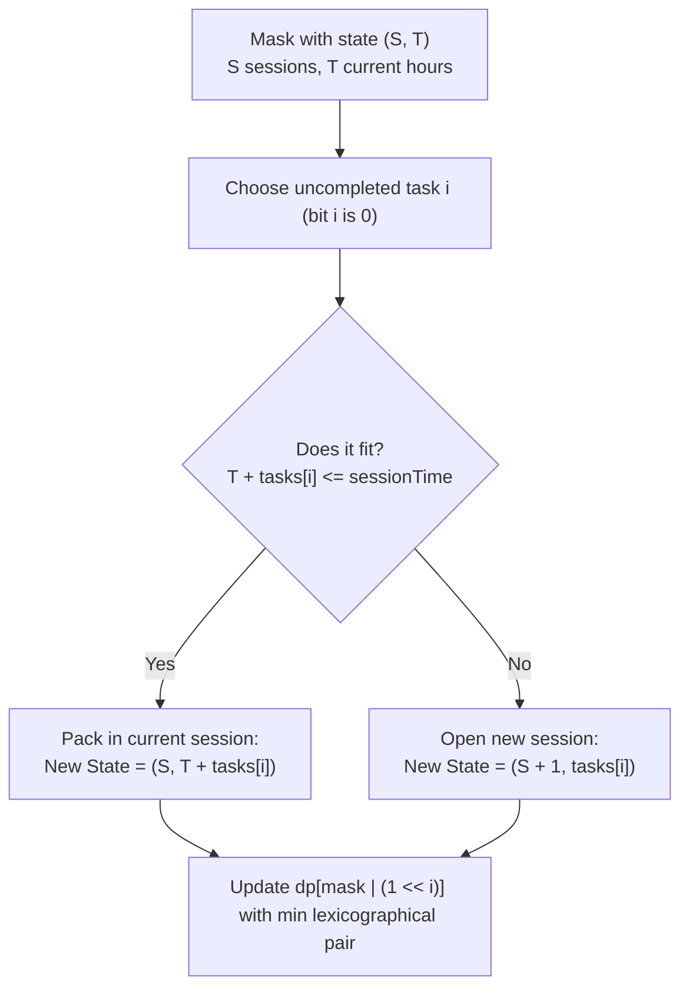

# Guided Example: Minimum Number of Work Sessions to Finish the Tasks

We formulate and trace the bitmask dynamic programming algorithm on representative task workloads to determine the exact minimum number of work sessions of capacity `sessionTime` needed to complete all tasks.

- **Primary Instance:** `tasks = [1, 2, 3]`, `sessionTime = 3` ($n = 3$)
  - Expected Output: `2` (Session 1 takes tasks $\{1, 2\}$ totaling 3 hours; Session 2 takes task $\{3\}$ totaling 3 hours)
- **Secondary Instance:** `tasks = [3, 1, 3, 1, 1]`, `sessionTime = 8` ($n = 5$)
  - Expected Output: `2` (Session 1 takes tasks $\{3, 1, 3, 1\}$ totaling 8 hours; Session 2 takes task $\{1\}$ totaling 1 hour)
- **Single Session Instance:** `tasks = [1, 2, 3, 4, 5]`, `sessionTime = 15` ($n = 5$)
  - Expected Output: `1` (all tasks sum to 15, fitting within a single session)

---

## 1. Instance & Intuition

We are given $n$ tasks where the $i^{\text{th}}$ task requires $tasks[i]$ hours. A session accommodates any set of tasks whose total duration does not exceed `sessionTime`. Tasks cannot be split across sessions. We seek to partition all $n$ tasks into the minimum number of valid sessions.

### NP-Hardness and Why Greedy Fails

This problem is an exact formulation of the classical **Bin Packing Problem**, which is NP-hard. Standard heuristics such as *First-Fit Decreasing* (sorting tasks in descending order and greedily placing each task into the first open bin that fits) are suboptimal.

Consider the counterexample:
- Tasks: $[4, 3, 3, 2, 2, 2]$, `sessionTime = 8`. Total sum = 16.
- A greedy descending placement pairs:
  - Session 1: $4 + 3 = 7$ (remaining space 1, cannot fit 3 or 2)
  - Session 2: $3 + 2 + 2 = 7$ (remaining space 1)
  - Session 3: $2$
  - Result: 3 sessions.
- However, an optimal partitioning exists:
  - Session 1: $4 + 2 + 2 = 8$
  - Session 2: $3 + 3 + 2 = 8$
  - Result: 2 sessions!

Because $n \le 14$, the number of subsets is $2^{14} = 16,384$. This small search space enables exact **Bitmask Dynamic Programming**.

---

## 2. Dynamic Programming Formulations

There are two primary bitmask DP formulations:

### Formulation A: Submask Enumeration
Precompute whether each subset of tasks $s \subseteq \{0, \dots, n-1\}$ can fit inside a single session:
$$\text{valid}[s] = \left(\sum_{i \in s} tasks[i] \le sessionTime\right)$$
Let $dp[mask]$ be the minimum sessions to complete subset $mask$:
$$dp[mask] = \min_{\substack{sub \subseteq mask \\ \text{valid}[sub]}} \Big( dp[mask \setminus sub] + 1 \Big)$$
Enumerating all submasks of all masks takes $\sum_{k=0}^n \binom{n}{k} 2^k = 3^n$ iterations ($3^{14} \approx 4.78 \times 10^6$ operations).

### Formulation B: Optimal State Tuple $(sessions, current\_time)$
Instead of iterating over submasks, we can evaluate task additions one task at a time.
For each subset $mask \in \{0, \dots, 2^n - 1\}$, we maintain a state pair:
$$dp[mask] = (S, T)$$
- $S$: the minimum number of work sessions used so far.
- $T$: the total time consumed in the current (most recent) active session ($0 \le T \le sessionTime$).

We order state pairs lexicographically:
$$(S_1, T_1) < (S_2, T_2) \iff (S_1 < S_2) \;\lor\; (S_1 == S_2 \;\land\; T_1 < T_2)$$
When adding an unassigned task $i \notin mask$ ($i^{\text{th}}$ bit of $mask$ is 0):
- If $T + tasks[i] \le sessionTime$, task $i$ fits into the current session:
  $$\text{candidate} = (S, \; T + tasks[i])$$
- If $T + tasks[i] > sessionTime$, a new session must be opened:
  $$\text{candidate} = (S + 1, \; tasks[i])$$

This formulation requires only $\mathcal{O}(n \cdot 2^n)$ transitions ($14 \times 16,384 \approx 2.3 \times 10^5$ operations), making it exceptionally fast.

---

## 3. Step-by-Step State Evolution

We trace the Primary Instance: `tasks = [1, 2, 3]`, `sessionTime = 3` ($n = 3$).

### Bit Representation
- Bit 0: task 0 with duration $tasks[0] = 1$
- Bit 1: task 1 with duration $tasks[1] = 2$
- Bit 2: task 2 with duration $tasks[2] = 3$

### Base State
- Empty mask `000` (no tasks completed):
  $$dp[0] = (1, 0)$$
  (1 session opened with 0 hours used, or 0 sessions with capacity full; setting $(1, 0)$ means the first task starts session 1).

### Mask Layer 1: 1 Task Completed (Size 1)

1. **Mask `001` (Task 0):**
   - From `000` ($(1, 0)$), adding task 0 ($tasks[0] = 1$):
   - $0 + 1 \le 3 \implies (1, 1)$.
   - $dp[001] = (1, 1)$.

2. **Mask `010` (Task 1):**
   - From `000` ($(1, 0)$), adding task 1 ($tasks[1] = 2$):
   - $0 + 2 \le 3 \implies (1, 2)$.
   - $dp[010] = (1, 2)$.

3. **Mask `100` (Task 2):**
   - From `000` ($(1, 0)$), adding task 2 ($tasks[2] = 3$):
   - $0 + 3 \le 3 \implies (1, 3)$.
   - $dp[100] = (1, 3)$.

---

### Mask Layer 2: 2 Tasks Completed (Size 2)

1. **Mask `011` (Tasks 0 and 1):**
   - Option A: from `001` ($(1, 1)$) adding task 1 ($tasks[1] = 2$):
     - $1 + 2 = 3 \le 3 \implies (1, 3)$.
   - Option B: from `010` ($(1, 2)$) adding task 0 ($tasks[0] = 1$):
     - $2 + 1 = 3 \le 3 \implies (1, 3)$.
   - Both yield $(1, 3)$. $dp[011] = (1, 3)$ (both tasks fit inside Session 1).

2. **Mask `101` (Tasks 0 and 2):**
   - Option A: from `001` ($(1, 1)$) adding task 2 ($tasks[2] = 3$):
     - $1 + 3 = 4 > 3 \implies$ cannot fit in current session.
     - Open session 2: $(1 + 1, 3) = (2, 3)$.
   - Option B: from `100` ($(1, 3)$) adding task 0 ($tasks[0] = 1$):
     - $3 + 1 = 4 > 3 \implies$ open session 2: $(2, 1)$.
   - Comparing $(2, 3)$ vs $(2, 1)$: $(2, 1) < (2, 3)$.
   - Minimum is $(2, 1)$. $dp[101] = (2, 1)$.

3. **Mask `110` (Tasks 1 and 2):**
   - Option A: from `010` ($(1, 2)$) adding task 2 ($tasks[2] = 3$):
     - $2 + 3 = 5 > 3 \implies (2, 3)$.
   - Option B: from `100` ($(1, 3)$) adding task 1 ($tasks[1] = 2$):
     - $3 + 2 = 5 > 3 \implies (2, 2)$.
   - Minimum is $(2, 2)$. $dp[110] = (2, 2)$.

---

### Mask Layer 3: All 3 Tasks Completed (Mask `111`)

1. **From `011` ($(1, 3)$) adding task 2 ($tasks[2] = 3$):**
   - $3 + 3 = 6 > 3 \implies$ open new session:
   - Candidate: $(1 + 1, 3) = (2, 3)$.

2. **From `101` ($(2, 1)$) adding task 1 ($tasks[1] = 2$):**
   - $1 + 2 = 3 \le 3 \implies$ fits in session 2!
   - Candidate: $(2, 1 + 2) = (2, 3)$.

3. **From `110` ($(2, 2)$) adding task 0 ($tasks[0] = 1$):**
   - $2 + 1 = 3 \le 3 \implies$ fits in session 2!
   - Candidate: $(2, 2 + 1) = (2, 3)$.

All paths reach $(2, 3)$.
Thus, $dp[111] = (2, 3)$.
The minimum number of work sessions is the first component: **2**.

---

## 4. Complete Execution Trace

### Primary Instance: `tasks = [1, 2, 3]`, `sessionTime = 3`

| Mask (Binary) | Tasks Included | Best Incoming Transition | Sessions $S$ | Current Time $T$ | State Pair $(S, T)$ |
|---|---|---|---|---|---|
| `000` | None | Base state | 1 | 0 | $(1, 0)$ |
| `001` | $\{0\}$ | From `000` + task 0 (cost 1) | 1 | 1 | $(1, 1)$ |
| `010` | $\{1\}$ | From `000` + task 1 (cost 2) | 1 | 2 | $(1, 2)$ |
| `100` | $\{2\}$ | From `000` + task 2 (cost 3) | 1 | 3 | $(1, 3)$ |
| `011` | $\{0, 1\}$ | From `010` + task 0 (cost 1) | 1 | 3 | $(1, 3)$ |
| `101` | $\{0, 2\}$ | From `100` + task 0 (cost 1) | 2 | 1 | $(2, 1)$ |
| `110` | $\{1, 2\}$ | From `100` + task 1 (cost 2) | 2 | 2 | $(2, 2)$ |
| `111` | $\{0, 1, 2\}$ | From `011` + task 2 (cost 3) | 2 | 3 | $(2, 3)$ |

Final sessions needed: $S = 2$.

### Secondary Instance: `tasks = [3, 1, 3, 1, 1]`, `sessionTime = 8`

Total workload sum = $3 + 1 + 3 + 1 + 1 = 9$ hours.
Since $9 > 8$, at least 2 sessions are required.

| Step / Mask Sample | Included Tasks | Total Hours | Session Allocation | State Pair $(S, T)$ |
|---|---|---|---|---|
| Mask `01111` | Tasks $\{0, 1, 2, 3\}$ (durations 3, 1, 3, 1) | $3+1+3+1 = 8$ | Exactly fills Session 1 | $(1, 8)$ |
| Mask `11111` | All 5 tasks | $8 + 1 = 9$ | Session 1: 8h, Session 2: 1h | $(2, 1)$ |

Final answer: **2** sessions.

---

## 5. Algorithmic Correctness & Soundness

1. **Optimal Substructure:**
   To complete any subset of tasks $mask$ with minimum sessions, the optimal choice of the final task $i \in mask$ must extend an optimal configuration for $mask \setminus \{i\}$. Because each session capacity is fixed and earlier sessions cannot be modified, minimizing $(S, T)$ lexicographically preserves the maximal remaining capacity for subsequent tasks without sacrificing session count.

2. **Topological Order of Subsets:**
   Iterating $mask$ from $0$ to $2^n - 1$ ensures that every submask $mask \setminus \{i\}$ is fully resolved before $mask$ is evaluated, satisfying standard DAG reachability and dynamic programming requirements.

3. **Exhaustive Minimization:**
   Every permutation of tasks is implicitly considered through subset states. No valid grouping into bins of size $\le sessionTime$ is pruned unless strictly dominated by a configuration with fewer sessions or less consumed time in the current session.

---

## 6. Traps This Instance Exposes

- **Greedy Bin Packing Flaw:** Placing largest items first into existing bins can block tighter pairings, leading to superfluous sessions.
- **Ignoring Current Session Residual:** Tracking only the number of sessions without the remaining time in the current session loses the information needed to determine if the next task fits.
- **State Initialization Error:** Starting with $dp[0] = (0, 0)$ requires special casing for the very first task (which transitions to session 1), whereas initializing $dp[0] = (1, 0)$ uniformly accounts for the first session.
- **Submask Enumeration vs. Bit Iteration:** Implementing $\mathcal{O}(3^n)$ submask DP without subset precomputation or bounds checks is slower than the direct $\mathcal{O}(n \cdot 2^n)$ state tuple transition.

---

## 7. Complexity Analysis

- **Time Complexity:**
  - **State Space:** There are $2^n$ distinct subsets (masks).
  - **Transitions per State:** For each mask, we examine at most $n$ possible next tasks ($i \in \{0, \dots, n-1\}$ where the $i^{\text{th}}$ bit is 0).
  - **Transition Work:** Checking $T + tasks[i] \le sessionTime$ and updating the minimum pair takes $\mathcal{O}(1)$ time.
  - **Total Time:** $\mathcal{O}(n \cdot 2^n)$. For $n = 14$, $14 \cdot 2^{14} = 14 \cdot 16,384 = 229,376$ operations, executing in under 10 milliseconds.

- **Auxiliary Space Complexity:**
  - The DP table stores $2^n$ pairs of integers $(S, T)$.
  - For $n = 14$, this requires an array of size $16,384 \times 8 \text{ bytes} \approx 131 \text{ KB}$.
  - **Total Auxiliary Space:** $\mathcal{O}(2^n)$, well within memory limits.
