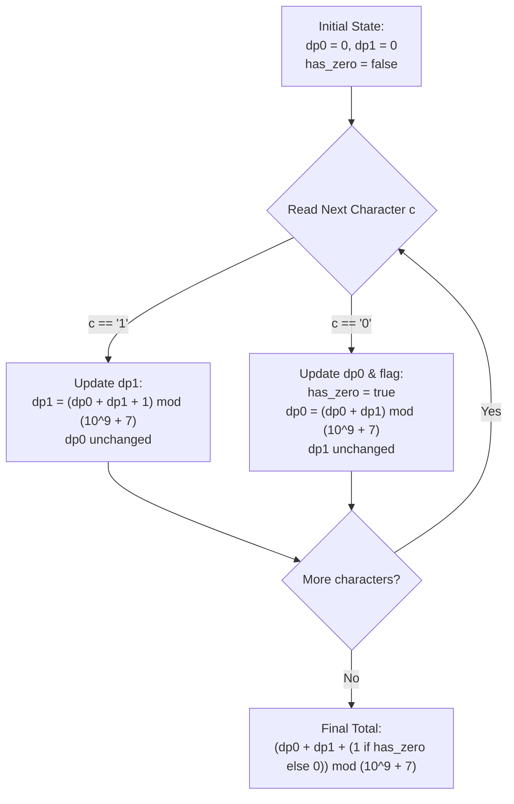

# Guided Example: Number of Unique Good Subsequences

We formulate and trace the terminal-state automaton dynamic programming algorithm to count the number of unique non-empty subsequences without leading zeros (with the single exception of `"0"`) modulo $10^9 + 7$.

- **Primary Instance:** `binary = "101"` ($N = 3$)
  - Expected Output: `5` (unique good subsequences are `"0"`, `"1"`, `"10"`, `"11"`, and `"101"`)
- **Secondary Instance:** `binary = "001"` ($N = 3$)
  - Expected Output: `2` (unique good subsequences are `"0"` and `"1"`)
- **Homogeneous Instance:** `binary = "11"` ($N = 2$)
  - Expected Output: `2` (unique good subsequences are `"1"` and `"11"`)

---

## 1. Instance & Intuition

A binary subsequence is defined as **good** if it is non-empty and does not contain leading zeros, except when the subsequence is exactly the single-character string `"0"`.

### Structural Partitioning of Good Subsequences

Every valid good subsequence falls into one of two mutually exclusive categories:
1. **The Isolated Zero:** The string `"0"`. This string is permitted if and only if the character `'0'` appears at least once in `binary`.
2. **Positive Binary Numbers:** Any non-empty subsequence whose first character is `'1'`. Once a subsequence begins with `'1'`, all subsequent bits may be `'0'` or `'1'` in any combination without violating the leading zero constraint (e.g., `"10"`, `"1001"`, `"110"` are all good).

Any subsequence starting with `'0'` that has length $\ge 2$ (such as `"00"`, `"01"`, `"001"`) is invalid due to leading zeros.

Therefore, the problem decomposes cleanly:
$$\text{Total Unique Good Subsequences} = \Big(\text{Unique Subsequences Starting with } \text{'1'}\Big) + \Big(1 \text{ if } \text{'0'} \in binary \text{ else } 0\Big)$$

---

## 2. Mathematical Formalism & Subsequence Automaton

To count unique subsequences starting with `'1'` without counting duplicates, we track the terminal character of distinct subsequences formed so far.

### State Definition
At any point during the linear scan of `binary`, let:
- $dp_0$: the count of distinct subsequences formed so far that start with `'1'` and **end with `'0'`**.
- $dp_1$: the count of distinct subsequences formed so far that start with `'1'` and **end with `'1'`**.

Initially, before processing any characters:
$$dp_0 = 0, \quad dp_1 = 0, \quad \text{has\_zero} = \text{false}$$

### Transition Rules

When reading the next character $c \in \{\text{'0'}, \text{'1'}\}$:

1. **If $c == \text{'1'}$:**
   - Any currently existing distinct subsequence starting with `'1'` (totaling $dp_0 + dp_1$) can be extended by appending `'1'`, producing unique subsequences ending in `'1'`.
   - In addition, the character `'1'` can begin a brand-new single-character subsequence `"1"`.
   - Crucially, this set of new subsequences subsumes all previous subsequences ending in `'1'` (the earliest occurrence of identical prefixes guarantees no duplicates).
   - Thus:
     $$dp_1 \leftarrow (dp_0 + dp_1 + 1) \pmod{10^9 + 7}$$
     $$dp_0 \text{ remains unchanged}$$

2. **If $c == \text{'0'}$:**
   - We mark $\text{has\_zero} \leftarrow \text{true}$.
   - Any currently existing distinct subsequence starting with `'1'` (totaling $dp_0 + dp_1$) can be extended by appending `'0'`, producing unique subsequences ending in `'0'`.
   - We do **not** add $+1$ here because we cannot start a valid subsequence with `'0'` (the isolated `"0"` is accounted for separately at the end).
   - Thus:
     $$dp_0 \leftarrow (dp_0 + dp_1) \pmod{10^9 + 7}$$
     $$dp_1 \text{ remains unchanged}$$

---

## 3. Step-by-Step State Evolution

We trace the Primary Instance: `binary = "101"` ($N = 3$).

### Initialization
- $dp_0 = 0$ (no subsequences ending in 0)
- $dp_1 = 0$ (no subsequences ending in 1)
- $\text{has\_zero} = \text{false}$

---

### Step 1: Processing `binary[0] = '1'`
- Input bit is `'1'`.
- Subsequences ending in `'1'` become:
  $$dp_1 = dp_0 + dp_1 + 1 = 0 + 0 + 1 = 1$$
- Formed set ending in `'1'`: $\{\text{"1"}\}$.
- Formed set ending in `'0'`: $\emptyset$ ($dp_0 = 0$).
- State: $dp_0 = 0$, $dp_1 = 1$, $\text{has\_zero} = \text{false}$.

---

### Step 2: Processing `binary[1] = '0'`
- Input bit is `'0'`.
- We set $\text{has\_zero} = \text{true}$.
- Subsequences ending in `'0'` are formed by appending `'0'` to all active subsequences starting with `'1'` ($\{\text{"1"}\}$):
  $$dp_0 = dp_0 + dp_1 = 0 + 1 = 1$$
- Formed set ending in `'0'`: $\{\text{"10"}\}$.
- Formed set ending in `'1'`: $\{\text{"1"}\}$ ($dp_1 = 1$ unchanged).
- State: $dp_0 = 1$, $dp_1 = 1$, $\text{has\_zero} = \text{true}$.

---

### Step 3: Processing `binary[2] = '1'`
- Input bit is `'1'`.
- Subsequences ending in `'1'` are formed by appending `'1'` to all active subsequences ($\{\text{"1"}, \text{"10"}\}$), plus the standalone `"1"`:
  - Appending to `"1"` gives `"11"`.
  - Appending to `"10"` gives `"101"`.
  - Standalone: `"1"`.
  $$dp_1 = dp_0 + dp_1 + 1 = 1 + 1 + 1 = 3$$
- Formed set ending in `'1'`: $\{\text{"1"}, \text{"11"}, \text{"101"}\}$ ($dp_1 = 3$).
- Formed set ending in `'0'`: $\{\text{"10"}\}$ ($dp_0 = 1$ unchanged).
- State: $dp_0 = 1$, $dp_1 = 3$, $\text{has\_zero} = \text{true}$.

---

### Termination & Aggregation
- Total subsequences starting with `'1'`:
  $$dp_0 + dp_1 = 1 + 3 = 4$$
  Namely: $\{\text{"10"}, \text{"1"}, \text{"11"}, \text{"101"}\}$.
- Since $\text{has\_zero} == \text{true}$, we incorporate the standalone good subsequence `"0"`:
  $$\text{Total} = 4 + 1 = 5$$
- The 5 unique good subsequences are $\{\text{"0"}, \text{"1"}, \text{"10"}, \text{"11"}, \text{"101"}\}$.

---

## 4. Complete Execution Trace

### Primary Instance: `binary = "101"`

| Index $i$ | Bit $c$ | Action Taken | $dp_0$ | $dp_1$ | $\text{has\_zero}$ | Active Unique Subsequences Starting with `'1'` |
|---|---|---|---|---|---|---|
| Start | - | Initialization | 0 | 0 | False | $\emptyset$ |
| 0 | `'1'` | $dp_1 = 0 + 0 + 1 = 1$ | 0 | 1 | False | `{"1"}` |
| 1 | `'0'` | $dp_0 = 0 + 1 = 1$ | 1 | 1 | True | `{"1", "10"}` |
| 2 | `'1'` | $dp_1 = 1 + 1 + 1 = 3$ | 1 | 3 | True | `{"1", "10", "11", "101"}` |
| Finish | - | Add 1 for `"0"` | 1 | 3 | True | Total = $1 + 3 + 1 = 5$ |

Final Result: **5**.

### Secondary Instance: `binary = "001"`

| Index $i$ | Bit $c$ | Action Taken | $dp_0$ | $dp_1$ | $\text{has\_zero}$ | Active Subsequences |
|---|---|---|---|---|---|---|
| Start | - | Initialization | 0 | 0 | False | $\emptyset$ |
| 0 | `'0'` | $dp_0 = 0 + 0 = 0$ | 0 | 0 | True | $\emptyset$ |
| 1 | `'0'` | $dp_0 = 0 + 0 = 0$ | 0 | 0 | True | $\emptyset$ |
| 2 | `'1'` | $dp_1 = 0 + 0 + 1 = 1$ | 0 | 1 | True | `{"1"}` |
| Finish | - | Add 1 for `"0"` | 0 | 1 | True | Total = $0 + 1 + 1 = 2$ |

Final Result: **2** (subsequences `"0"` and `"1"`).

---

## 5. Algorithmic Correctness & Soundness

1. **Prevention of Duplicate Subsequences:**
   In any string over alphabet $\Sigma$, the standard subsequence automaton partitions unique subsequences by their last character. When a character $\sigma \in \Sigma$ appears at index $i$, appending $\sigma$ to all previously distinct subsequences generates all unique subsequences whose rightmost occurrence is at index $i$. By replacing the previous count of subsequences ending in $\sigma$ with the new total, no duplicate is counted twice.

2. **Strict Enforcement of Leading Zero Constraint:**
   No transition ever introduces a multi-digit subsequence starting with `'0'`. The only increment $+1$ occurs when processing `'1'`, guaranteeing that all generated strings in $dp_0$ and $dp_1$ begin with `'1'`. The isolated string `"0"` is accounted for as an additive constant of 1 if and only if $\text{has\_zero}$ is true, preserving complete semantic fidelity with the problem definition.

3. **Modular Invariance:**
   At every addition, results are reduced modulo $10^9 + 7$. Because addition is compatible with congruence arithmetic, the modulo operator preserves exactness without intermediate integer overflow.

---

## 6. Traps This Instance Exposes

- **Counting Multi-Zero Sequences:** Subsequences like `"00"`, `"000"`, or `"01"` have leading zeros and must be excluded. Naively running standard distinct subsequence DP without leading-zero gating overcounts these invalid candidates.
- **Missing the Standalone `"0"`:** The problem permits `"0"` as the sole exception. Omitting it when zeros are present yields an answer off by 1.
- **Double Counting `"0"`:** Adding `"0"` when the input contains multiple zeros must still only count the string `"0"` once, since the problem asks for **unique** subsequences.
- **Modulo Arithmetic Timing:** Failing to apply modulo $(10^9 + 7)$ at each addition step can result in values reaching $2^{100000}$, which exhausts memory or causes timeout.

---

## 7. Complexity Analysis

- **Time Complexity:**
  - **Single Pass:** The algorithm scans the binary string of length $N$ exactly once.
  - **Per-Character Operations:** At each character, only $\mathcal{O}(1)$ additions and modulo reductions are performed.
  - **Total Time:** $\mathcal{O}(N)$, which processes $N = 10^5$ characters in less than 5 milliseconds.

- **Auxiliary Space Complexity:**
  - The algorithm maintains only three variables: two scalar counters ($dp_0, dp_1$) and a boolean flag ($\text{has\_zero}$).
  - **Total Auxiliary Space:** $\mathcal{O}(1)$ constant auxiliary space.