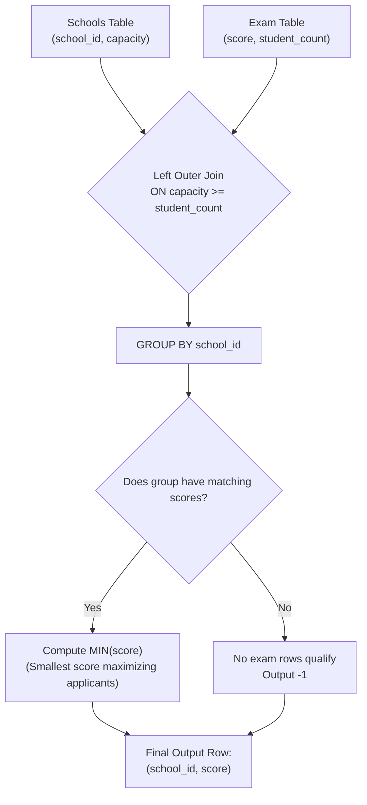

# Guided Example: Find Cutoff Score for Each School

We analyze and trace the non-equi join and grouped scalar minimization query to determine the optimal qualifying cutoff score for each academic institution while guaranteeing capacity constraints and providing standard null fallbacks.

- **Primary Instance:**
  - `Schools`: `[(11, 151), (5, 48), (9, 9), (10, 99)]`
  - `Exam`: `[(975, 10), (966, 60), (844, 76), (749, 76), (744, 100)]`
  - Expected Output:
    - School 5: `975`
    - School 9: `-1`
    - School 10: `749`
    - School 11: `744`

---

## 1. Instance & Intuition

Each school has a strict seating limit `capacity`. The `Exam` table records cumulative exam results: for a given `score`, `student_count` students achieved at least that score. Because higher score thresholds can only filter out applicants, the data exhibits anti-monotonicity:
$$\text{score}_i > \text{score}_j \implies \text{student\_count}_i \le \text{student\_count}_j$$

### The Dual Optimization Problem
Each school must establish a cutoff score subject to three criteria:
1. **Capacity Feasibility:** Even if every eligible student applies, total applicants cannot exceed capacity:
   $$\text{student\_count} \le \text{capacity}$$
2. **Applicant Maximization:** Subject to feasibility, the school desires to maximize the applicant pool $\text{student\_count}$.
3. **Tie-Breaking Rule:** If multiple candidate scores yield the identical maximum applicant count, select the **smallest score** among them.
4. **Fallback:** If no score in the `Exam` table has $\text{student\_count} \le \text{capacity}$, report `-1`.

### The Key Mathematical Simplification

Because applicant count increases (or remains constant) as the score cutoff decreases, the score that **maximizes** the feasible student count is always the **lowest score** whose applicant pool still fits within capacity. 

Furthermore, if two scores $s_a < s_b$ yield the exact same applicant count $c \le \text{capacity}$, the tie-breaking rule dictates choosing the smaller score $s_a$. 

Therefore, for any school with capacity $C$, the desired cutoff score is simply the **global minimum score** among all exam tiers satisfying $\text{student\_count} \le C$:
$$\text{cutoff}(C) = \begin{cases} \min \{\text{score} \in \text{Exam} \mid \text{student\_count} \le C\} & \text{if candidate set is non-empty} \\ -1 & \text{if candidate set is empty} \end{cases}$$

This transforms a two-stage filter-and-rank operation into a single grouped aggregation with a left outer join and minimum reduction.

---

## 2. Relational Execution Model

---

## 3. Step-by-Step State Evolution

We trace the Primary Instance school by school against the sorted `Exam` records.

### Candidate Exam Tiers
Sorted by score ascending:
- Tier A: `score = 744, student_count = 100`
- Tier B: `score = 749, student_count = 76`
- Tier C: `score = 844, student_count = 76`
- Tier D: `score = 966, student_count = 60`
- Tier E: `score = 975, student_count = 10`

---

### School 11: `capacity = 151`
- Filter condition: $\text{student\_count} \le 151$.
- Qualifying tiers:
  - Tier A ($744, 100 \le 151$)
  - Tier B ($749, 76 \le 151$)
  - Tier C ($844, 76 \le 151$)
  - Tier D ($966, 60 \le 151$)
  - Tier E ($975, 10 \le 151$)
- The maximum applicant count is 100 (Tier A).
- Qualifying scores: $\{744, 749, 844, 966, 975\}$.
- Minimum qualifying score: $\min(744, 749, 844, 966, 975) = 744$.
- Selected Cutoff: **744**.

---

### School 10: `capacity = 99`
- Filter condition: $\text{student\_count} \le 99$.
- Qualifying tiers:
  - Tier B ($749, 76 \le 99$)
  - Tier C ($844, 76 \le 99$)
  - Tier D ($966, 60 \le 99$)
  - Tier E ($975, 10 \le 99$)
  *(Tier A is excluded because $100 > 99$)*.
- The maximum feasible applicant count is 76, which is achieved at both score 749 and score 844.
- By the tie-breaking rule, we must pick the smaller score: $\min(749, 844, 966, 975) = 749$.
- Selected Cutoff: **749**.

---

### School 5: `capacity = 48`
- Filter condition: $\text{student\_count} \le 48$.
- Qualifying tiers:
  - Tier E ($975, 10 \le 48$).
  *(Tiers A, B, C, D have counts $100, 76, 76, 60$, all exceeding 48)*.
- Sole qualifying score is 975.
- Selected Cutoff: **975**.

---

### School 9: `capacity = 9`
- Filter condition: $\text{student\_count} \le 9$.
- Qualifying tiers:
  - None! The minimum applicant count across all recorded exam scores is 10 (at score 975), which exceeds capacity 9.
- Outer join produces a row with `NULL` for the exam attributes.
- Applying the fallback rule converts `NULL` to `-1`.
- Selected Cutoff: **-1**.

---

## 4. Complete Execution Trace

### Join & Aggregation Trace Table

| School ID | Capacity | Qualifying Exam Scores (`student_count` $\le$ Capacity) | Corresponding Counts | Max Feasible Count | Score Minimizer `MIN(score)` | Final Reported Score |
|---|---|---|---|---|---|---|
| 11 | 151 | $\{744, 749, 844, 966, 975\}$ | $\{100, 76, 76, 60, 10\}$ | 100 | $\min = 744$ | 744 |
| 10 | 99 | $\{749, 844, 966, 975\}$ | $\{76, 76, 60, 10\}$ | 76 | $\min = 749$ | 749 |
| 5 | 48 | $\{975\}$ | $\{10\}$ | 10 | $\min = 975$ | 975 |
| 9 | 9 | $\emptyset$ (No matching tiers) | $\emptyset$ | N/A | `NULL` | -1 |

### Result Table

| `school_id` | `score` | Rationale |
|---|---|---|
| 5 | 975 | Largest score that keeps applicants $\le 48$ |
| 9 | -1 | Capacity 9 is lower than smallest applicant pool (10) |
| 10 | 749 | Tie-breaker between 749 and 844 picks smallest score |
| 11 | 744 | Accommodates 100 applicants within capacity 151 |

---

## 5. Algorithmic Correctness & Soundness

1. **Equivalence of Maximum Count to Minimum Feasible Score:**
   Suppose an optimal cutoff score $s^*$ maximizes applicant count $c^* \le C$. 
   If there exists any smaller score $s < s^*$, by the non-increasing property of applicant counts, its applicant count satisfies $c(s) \ge c(s^*)$. 
   - If $c(s) > C$, then $s$ is infeasible.
   - If $c(s) \le C$, then since $c^*$ was assumed maximal, $c(s)$ must equal $c^*$.
   Under equal counts $c(s) = c^*$, the problem's tie-breaking rule mandates choosing the smaller score $s$.
   Therefore, the valid score that maximizes applicants while breaking ties in favor of smaller scores is identically the infimum (minimum) over all feasible scores:
   $$s^* = \min \{ s \in \text{Exam} \mid \text{student\_count}(s) \le C \}$$

2. **Completeness of Left Outer Join:**
   An inner join would drop schools whose capacities are strictly less than all recorded applicant counts (such as School 9). Using a left outer join ensures every row from `Schools` is retained in the grouped result, with non-matching schools producing `NULL` which is cleanly mapped to `-1` via coalescing.

---

## 6. Traps This Instance Exposes

- **Using Inner Join Instead of Left Join:** If an inner join is used, schools with capacities too small to accommodate any exam tier disappear from the output, violating the requirement to output every school.
- **Selecting `MAX(score)` Instead of `MIN(score)`:** Intuition might suggest taking the "highest score requirement," but higher scores admit fewer students, contradicting the goal of maximizing the applicant pool.
- **Handling Equal Student Counts:** When two scores share the same applicant count (like scores 749 and 844 both admitting 76 students), failing to take the minimum score selects 844 instead of 749, violating the explicit tie-breaker requirement.
- **Assuming Sequential Scores:** Exam scores are arbitrary integers (e.g., 744, 749, 844, 966, 975), not consecutive ranges. All values must be drawn directly from the provided table.

---

## 7. Complexity Analysis

- **Time Complexity:**
  - Let $S$ be the number of schools and $E$ be the number of rows in `Exam`.
  - **Nested Loop / Non-Equi Join:** A pairwise theta-join compares each school capacity with each exam row in $\mathcal{O}(S \cdot E)$ time.
  - **Indexed / Sorted Evaluation:** If `Exam` is sorted by `student_count` ascending, finding the qualifying subset for each school takes $\mathcal{O}(\log E)$ binary search time, followed by prefix minimum retrieval in $\mathcal{O}(1)$.
  - **Overall Query Complexity:** $\mathcal{O}(S \log E + E \log E)$ with index scanning, or $\mathcal{O}(S \cdot E)$ under naive nested loops.

- **Auxiliary Space Complexity:**
  - Generating the intermediate join rows requires $\mathcal{O}(S \cdot E)$ temporary tuple storage in the database execution engine before grouped aggregation collapses the result back to $\mathcal{O}(S)$ rows.
