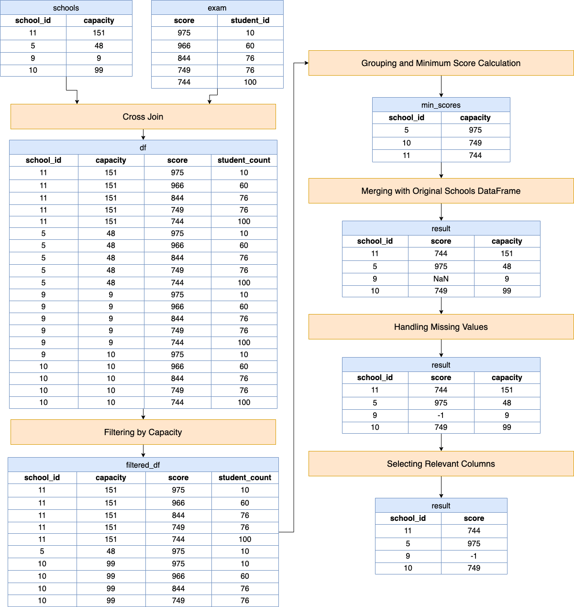

# Solution

---

## pandas

### Approach: Cross-Join and Grouping Method

The approach combines cross-joining, filtering, grouping, and merging operations to compute the minimum score threshold for each school based on its capacity and the distribution of exam scores. This process ensures that each school's capacity constraints are respected while aiming to maximize the number of students who can apply.

**Visualization of Approach:**



#### Intuition

Let's review the intuition behind each step given the following input DataFrames:

Schools DataFrame (`schools`):

<table>
  <tr>
    <th>school_id</th>
    <th>capacity</th>
  </tr>
  <tr>
    <td>11</td>
    <td>151</td>
  </tr>
  <tr>
    <td>5</td>
    <td>48</td>
  </tr>
  <tr>
    <td>9</td>
    <td>9</td>
  </tr>
  <tr>
    <td>10</td>
    <td>99</td>
  </tr>
</table>
<br>

Exam DataFrame (`exam`):

<table>
  <tr>
    <th>score</th>
    <th>student_count</th>
  </tr>
  <tr>
    <td>975</td>
    <td>10</td>
  </tr>
  <tr>
    <td>966</td>
    <td>60</td>
  </tr>
  <tr>
    <td>844</td>
    <td>76</td>
  </tr>
  <tr>
    <td>749</td>
    <td>76</td>
  </tr>
  <tr>
    <td>744</td>
    <td>100</td>
  </tr>
</table>
<br>

1. **Cross Join**

```python
df = schools.merge(exam, how='cross')
```
- A cross join (or Cartesian product) is used to create all possible combinations of `schools` and `exam` scores. This is necessary because we need to evaluate each school against every possible exam score to find the minimum score that meets the school's capacity. It sets up the dataframe for further filtering based on capacity constraints.

`df`:
<table>
  <tr>
    <th>school_id</th>
    <th>capacity</th>
    <th>score</th>
    <th>student_count</th>
  </tr>
  <tr>
    <td>11</td>
    <td>151</td>
    <td>975</td>
    <td>10</td>
  </tr>
  <tr>
    <td>11</td>
    <td>151</td>
    <td>966</td>
    <td>60</td>
  </tr>
  <tr>
    <td>11</td>
    <td>151</td>
    <td>844</td>
    <td>76</td>
  </tr>
  <tr>
    <td>11</td>
    <td>151</td>
    <td>749</td>
    <td>76</td>
  </tr>
  <tr>
    <td>11</td>
    <td>151</td>
    <td>744</td>
    <td>100</td>
  </tr>
  <tr>
    <td>5</td>
    <td>48</td>
    <td>975</td>
    <td>10</td>
  </tr>
  <tr>
    <td>5</td>
    <td>48</td>
    <td>966</td>
    <td>60</td>
  </tr>
  <tr>
    <td>5</td>
    <td>48</td>
    <td>844</td>
    <td>76</td>
  </tr>
  <tr>
    <td>5</td>
    <td>48</td>
    <td>749</td>
    <td>76</td>
  </tr>
  <tr>
    <td>5</td>
    <td>48</td>
    <td>744</td>
    <td>100</td>
  </tr>
  <tr>
    <td>9</td>
    <td>9</td>
    <td>975</td>
    <td>10</td>
  </tr>
  <tr>
    <td>9</td>
    <td>9</td>
    <td>966</td>
    <td>60</td>
  </tr>
  <tr>
    <td>9</td>
    <td>9</td>
    <td>844</td>
    <td>76</td>
  </tr>
  <tr>
    <td>9</td>
    <td>9</td>
    <td>749</td>
    <td>76</td>
  </tr>
  <tr>
    <td>9</td>
    <td>9</td>
    <td>744</td>
    <td>100</td>
  </tr>
  <tr>
    <td>10</td>
    <td>99</td>
    <td>975</td>
    <td>10</td>
  </tr>
  <tr>
    <td>10</td>
    <td>99</td>
    <td>966</td>
    <td>60</td>
  </tr>
  <tr>
    <td>10</td>
    <td>99</td>
    <td>844</td>
    <td>76</td>
  </tr>
  <tr>
    <td>10</td>
    <td>99</td>
    <td>749</td>
    <td>76</td>
  </tr>
  <tr>
    <td>10</td>
    <td>99</td>
    <td>744</td>
    <td>100</td>
  </tr>
</table>
<br>

2. **Filtering by Capacity**

```python
filtered_df = df[df.capacity >= df.student_count]
```
- This step filters out combinations where a school's capacity is less than the number of students who have achieved a given score or higher. It ensures that for each school, we only consider exam scores that the school can accommodate in terms of student numbers. This step is crucial for adhering to the constraint that schools should be able to accept all students who meet or exceed the score threshold.

`filtered_df`:
<table>
  <tr>
    <th>school_id</th>
    <th>capacity</th>
    <th>score</th>
    <th>student_count</th>
  </tr>
  <tr>
    <td>11</td>
    <td>151</td>
    <td>975</td>
    <td>10</td>
  </tr>
  <tr>
    <td>11</td>
    <td>151</td>
    <td>966</td>
    <td>60</td>
  </tr>
  <tr>
    <td>11</td>
    <td>151</td>
    <td>844</td>
    <td>76</td>
  </tr>
  <tr>
    <td>11</td>
    <td>151</td>
    <td>749</td>
    <td>76</td>
  </tr>
  <tr>
    <td>11</td>
    <td>151</td>
    <td>744</td>
    <td>100</td>
  </tr>
  <tr>
    <td>5</td>
    <td>48</td>
    <td>975</td>
    <td>10</td>
  </tr>
  <tr>
    <td>10</td>
    <td>99</td>
    <td>975</td>
    <td>10</td>
  </tr>
  <tr>
    <td>10</td>
    <td>99</td>
    <td>966</td>
    <td>60</td>
  </tr>
  <tr>
    <td>10</td>
    <td>99</td>
    <td>844</td>
    <td>76</td>
  </tr>
  <tr>
    <td>10</td>
    <td>99</td>
    <td>749</td>
    <td>76</td>
  </tr>
</table>
<br>

3. **Grouping and Minimum Score Calculation**

```python
min_scores = filtered_df.groupby('school_id')['score'].min().reset_index()
```
- After filtering, the data is grouped by each school (`school_id`). Within each group, we find the minimum score. This represents the lowest score at which the school can accept all students without exceeding its capacity. The `min` function is used because we are interested in the lowest possible score threshold that meets the capacity requirements.

`min_scores`:
<table>
  <tr>
    <th>school_id</th>
    <th>score</th>
  </tr>
  <tr>
    <td>5</td>
    <td>975</td>
  </tr>
  <tr>
    <td>10</td>
    <td>749</td>
  </tr>
  <tr>
    <td>11</td>
    <td>744</td>
  </tr>
</table>
<br>

4. **Merging with Original Schools DataFrame**

```python
result = min_scores.merge(schools, how='right')
```
- This merge operation ensures that the final output includes all schools, even those for which no suitable score threshold was found (e.g., schools with very low capacity). A right join with the original `schools` DataFrame ensures that every school is represented in the final result, maintaining the integrity of the original dataset.

`result`:
<table>
  <tr>
    <th>school_id</th>
    <th>score</th>
    <th>capacity</th>
  </tr>
  <tr>
    <td>11</td>
    <td>744</td>
    <td>151</td>
  </tr>
  <tr>
    <td>5</td>
    <td>975</td>
    <td>48</td>
  </tr>
  <tr>
    <td>9</td>
    <td>NaN</td>
    <td>9</td>
  </tr>
  <tr>
    <td>10</td>
    <td>749</td>
    <td>99</td>
  </tr>
</table>
<br>

5. **Handling Missing Values**

```python
result['score'] = result['score'].fillna(-1)
```
- We replace missing values (`NaN`) with `-1`. This scenario occurs for schools where no exam score can satisfy their capacity (i.e., the school's capacity is smaller than the student count for all scores). The value `-1` is used as a placeholder to indicate that no suitable score threshold exists for these schools.

`result`:
<table>
  <tr>
    <th>school_id</th>
    <th>score</th>
    <th>capacity</th>
  </tr>
  <tr>
    <td>11</td>
    <td>744</td>
    <td>151</td>
  </tr>
  <tr>
    <td>5</td>
    <td>975</td>
    <td>48</td>
  </tr>
  <tr>
    <td>9</td>
    <td>-1</td>
    <td>9</td>
  </tr>
  <tr>
    <td>10</td>
    <td>749</td>
    <td>99</td>
  </tr>
</table>
<br>

6. **Selecting Relevant Columns**

```python
return result[['school_id', 'score']]
```
- Finally, the function returns a DataFrame with only the relevant columns: `school_id` and `score`.

`return result[['school_id', 'score']]`:
<table>
  <tr>
    <th>school_id</th>
    <th>score</th>
  </tr>
  <tr>
    <td>11</td>
    <td>744</td>
  </tr>
  <tr>
    <td>5</td>
    <td>975</td>
  </tr>
  <tr>
    <td>9</td>
    <td>-1</td>
  </tr>
  <tr>
    <td>10</td>
    <td>749</td>
  </tr>
</table>
<br>

#### Implementation

```python
import pandas as pd

def find_cutoff_score(schools: pd.DataFrame, exam: pd.DataFrame) -> pd.DataFrame:

    df = schools.merge(exam, how='cross')

    filtered_df = df[df.capacity >= df.student_count]

    min_scores = filtered_df.groupby('school_id')['score'].min().reset_index()

    result = min_scores.merge(schools, how='right')

    result['score'] = result['score'].fillna(-1)

    return result[['school_id', 'score']]

```

We could also use method chaining to seamlessly integrate the intuition steps.

```python
import pandas as pd

def find_cutoff_score(schools: pd.DataFrame, exam: pd.DataFrame) -> pd.DataFrame:
    df = schools.merge(exam, how="cross")

    result = (
        df[df.capacity >= df.student_count]
        .groupby("school_id")["score"]
        .min()
        .reset_index()
        .merge(schools, how="right")
        .fillna(-1)
    )

    return result[["school_id", "score"]]

```

---

## Database

### Approach: Conditional Left Join and Aggregation Query

The query aims to determine the lowest exam score that each school can set as its minimum acceptance score without exceeding its capacity. If a school's capacity is such that it cannot accommodate the number of students who scored at any given level (i.e., for every score in the `Exam` table, the `student_count` is greater than the school's `capacity`), then the query assigns a score of `-1` to indicate that no suitable minimum score exists based on the available data.

#### Intuition

Here's a breakdown of the logic:

1. `SELECT school_id, IFNULL(MIN(score), -1) AS score`

- This part of the query selects two columns: `school_id` and the minimum `score` for each group (grouped by `school_id`).
- `IFNULL(MIN(score), -1)` is used to handle cases where there is no suitable minimum score (i.e., when `MIN(score)` is `NULL`). In such cases, it defaults to `-1`. This could happen if a school's capacity is less than the number of students at every score level.

2. `FROM Schools LEFT JOIN Exam ON capacity >= student_count`

- This part performs a left join between the `Schools` and `Exam` tables.
- The join condition `capacity >= student_count` ensures that we only consider scores where the number of students who achieved that score (or higher) is less than or equal to the school's capacity.
- A left join is used to ensure that all schools are included in the result, even if they don't have a minimum score in the `Exam` table.

3. `GROUP BY school_id`

- This groups the results by `school_id`, which is necessary because the query calculates an aggregate function (`MIN(score)`) for each school.
- Grouping by `school_id` means that each row in the result set will correspond to a unique school.

#### Implementation

```mysql []
SELECT
  school_id,
  IFNULL(
    MIN(score),
-1
  ) AS score
FROM
  Schools
  LEFT JOIN Exam ON capacity >= student_count
GROUP BY
  school_id

```