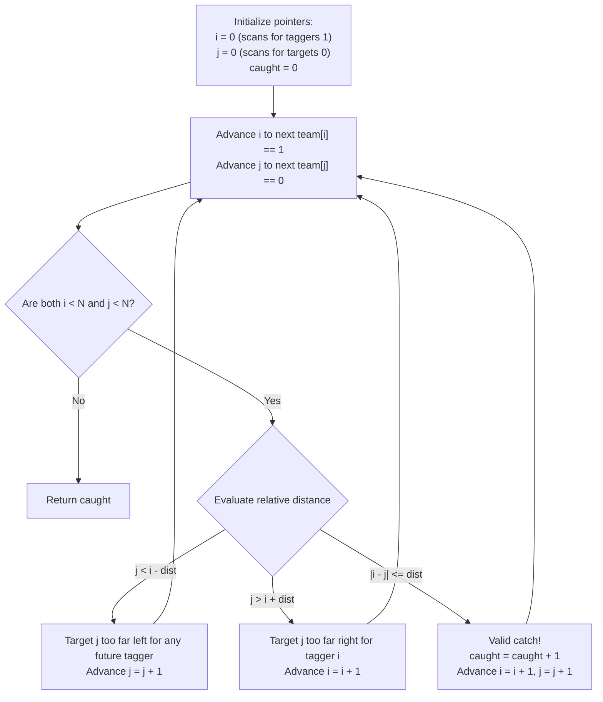

# Guided Example: Maximum Number of People That Can Be Caught in Tag

We formulate and trace the two-pointer greedy bipartite matching algorithm on representative binary team configurations to maximize the number of non-taggers caught within distance `dist`.

- **Primary Instance:** `team = [0, 1, 0, 1, 0]`, `dist = 3` ($N = 5$)
  - Expected Output: `2` (tagger at index 1 catches person at 0; tagger at 3 catches person at 2)
- **Secondary Instance:** `team = [1, 0, 0, 0, 1]`, `dist = 1` ($N = 5$)
  - Expected Output: `2` (tagger at 0 catches person at 1; tagger at 4 catches person at 3; person at 2 remains uncaught)
- **Degenerate Instance:** `team = [1, 1, 1]`, `dist = 2` ($N = 3$)
  - Expected Output: `0` (no non-taggers exist)

---

## 1. Instance & Intuition

In a game of tag on a 1D line:
- Elements with value `1` represent people who are **"it"** (taggers).
- Elements with value `0` represent people who are **not "it"** (targets).
- A tagger at position $i$ can catch any single target at position $j$ if:
  $$team[i] = 1, \quad team[j] = 0, \quad |i - j| \le dist$$
- Each tagger can catch at most one target, and each target can be caught at most once.

### Graph Perspective: Bipartite Matching on Intervals
This is fundamentally a Maximum Bipartite Matching problem between the set of taggers $I = \{i \mid team[i] = 1\}$ and targets $J = \{j \mid team[j] = 0\}$. Because all nodes lie on a 1D line and edge connectivity is defined by interval overlap $[i - dist, i + dist]$, the graph satisfies the **Monge property** (intervals cannot cross without nesting or intersecting sequentially). 

Consequently, the global maximum matching can be found greedily from left to right using **Two Pointers**.

### The Greedy Choice Principle
Consider the leftmost available tagger $i$ and leftmost available target $j$:
1. **Target Too Far Left ($j < i - dist$):**
   Target $j$ lies strictly behind the reach of tagger $i$. Because any subsequent tagger $i' > i$ has reach $i' - dist > i - dist > j$, target $j$ can **never** be caught by any tagger. Target $j$ is permanently abandoned; advance pointer $j$.
2. **Target Too Far Right ($j > i + dist$):**
   Target $j$ lies beyond the maximum forward reach of tagger $i$. Because all remaining targets $j' > j$ are even further to the right, tagger $i$ can **never** catch any target. Tagger $i$ expires with zero catches; advance pointer $i$.
3. **Target Within Reach ($|i - j| \le dist$):**
   Tagger $i$ can legally catch target $j$. Pairing $i$ with $j$ is always optimal because:
   - Reserving $j$ for a later tagger $i' > i$ cannot expand the set of reachable targets (since $i'$ can reach targets further to the right, whereas $i$ cannot).
   - Thus, greedily consuming the earliest available target $j$ conserves downstream targets for future taggers.
   - Action: Match $(i, j)$, increment catch count, and advance both pointers.

---

## 2. Pointer Evolution Workflow

---

## 3. Step-by-Step State Evolution

### Primary Instance: `team = [0, 1, 0, 1, 0]`, `dist = 3` ($N = 5$)

- Targets ($team = 0$): indices $\{0, 2, 4\}$.
- Taggers ($team = 1$): indices $\{1, 3\}$.

#### Initialization
- Tagger pointer: $i = 1$ (first 1).
- Target pointer: $j = 0$ (first 0).
- Catch count: $0$.

#### Step 1: Compare Tagger $i = 1$ and Target $j = 0$
- Distance: $|1 - 0| = 1$.
- Constraint: $1 \le dist = 3$.
- Decision: Valid match. Tagger 1 catches Target 0.
- State: $\text{caught} = 1$.
- Advance $i$ to next tagger: $i = 3$.
- Advance $j$ to next target: $j = 2$.

#### Step 2: Compare Tagger $i = 3$ and Target $j = 2$
- Distance: $|3 - 2| = 1$.
- Constraint: $1 \le dist = 3$.
- Decision: Valid match. Tagger 3 catches Target 2.
- State: $\text{caught} = 2$.
- Advance $i$ to next tagger: no more taggers ($i \ge N$).
- Advance $j$ to next target: $j = 4$.

#### Termination
- Pointer $i$ has exhausted all taggers.
- Final caught count: **2**.

---

### Secondary Instance: `team = [1, 0, 0, 0, 1]`, `dist = 1` ($N = 5$)

- Taggers: $\{0, 4\}$.
- Targets: $\{1, 2, 3\}$.

#### Step 1: Tagger $i = 0$, Target $j = 1$
- $|0 - 1| = 1 \le 1$. Match $(0, 1)$.
- $\text{caught} = 1$. Next tagger $i = 4$, next target $j = 2$.

#### Step 2: Tagger $i = 4$, Target $j = 2$
- Distance: $|4 - 2| = 2 > 1$.
- Relative position: $j = 2 < 4 - 1 = 3$ (Target 2 is strictly to the left of tagger 4's window $[3, 5]$).
- Since no future taggers exist at indices $> 4$, target 2 can never be caught.
- Action: Discard Target 2 ($j = 3$). Tagger $i = 4$ remains active.

#### Step 3: Tagger $i = 4$, Target $j = 3$
- Distance: $|4 - 3| = 1 \le 1$.
- Match $(4, 3)$.
- $\text{caught} = 2$.
- Next tagger: exhausted.

Final Result: **2**.

---

## 4. Complete Execution Trace

### Primary Instance Trace Table

| Step | Tagger Index $i$ | Target Index $j$ | Distance $\lvert i - j \rvert$ | Window $[i - dist, i + dist]$ | Condition Satisfied? | Action | Total Caught |
|---|---|---|---|---|---|---|---|
| 1 | 1 | 0 | 1 | $[-2, 4]$ | Yes ($1 \le 3$) | Match $(1, 0)$; $i \leftarrow 3, j \leftarrow 2$ | 1 |
| 2 | 3 | 2 | 1 | $[0, 6]$ | Yes ($1 \le 3$) | Match $(3, 2)$; $i \leftarrow \text{end}, j \leftarrow 4$ | 2 |
| 3 | End | 4 | - | - | Taggers exhausted | Terminate | 2 |

### Secondary Instance Trace Table

| Step | Tagger Index $i$ | Target Index $j$ | Distance $\lvert i - j \rvert$ | Window $[i - dist, i + dist]$ | Condition Satisfied? | Action | Total Caught |
|---|---|---|---|---|---|---|---|
| 1 | 0 | 1 | 1 | $[-1, 1]$ | Yes ($1 \le 1$) | Match $(0, 1)$; $i \leftarrow 4, j \leftarrow 2$ | 1 |
| 2 | 4 | 2 | 2 | $[3, 5]$ | No ($j < i - dist$) | Discard Target 2; $j \leftarrow 3$ | 1 |
| 3 | 4 | 3 | 1 | $[3, 5]$ | Yes ($1 \le 1$) | Match $(4, 3)$; $i \leftarrow \text{end}, j \leftarrow \text{end}$ | 2 |

---

## 5. Algorithmic Correctness & Soundness

1. **Greedy Exchange Argument:**
   Let $M$ be an optimal matching and let $(i, j)$ be the pair selected by the greedy algorithm for the earliest available tagger $i$.
   - If $(i, j) \in M$, the greedy step agrees with $M$.
   - If $i$ is matched to some $j' > j$ in $M$, then target $j$ is either unmatched in $M$ or matched to some tagger $i' > i$.
     - If $j$ is unmatched, replacing $(i, j')$ with $(i, j)$ yields a valid matching of equal size because $j$ is within reach of $i$.
     - If $j$ is matched to $i'$, we can swap partners: match $i$ with $j$ and $i'$ with $j'$. Because $j < j'$ and $i < i'$, the interval $[i, i']$ nests or overlaps with $[j, j']$. Since $i$ reaches $j'$ ($j' \le i + dist$) and $i'$ reaches $j$ ($i' - dist \le j$), it follows that $i$ reaches $j$ and $i'$ reaches $j'$, maintaining full feasibility.
   - In all cases, $M$ can be transformed into an equally optimal matching containing $(i, j)$ without reducing total cardinality.

2. **Monotonicity of Progress:**
   Both pointers $i$ and $j$ advance strictly forward. Neither pointer ever backtracks. Since each position in `team` is visited at most once by its respective pointer, the algorithm terminates deterministically in linear time.

---

## 6. Traps This Instance Exposes

- **Arbitrary Matching:** Pairing a tagger with the closest target rather than the leftmost target can prematurely claim targets needed by earlier taggers, leaving leftmost targets permanently stranded.
- **Off-by-One in Reach:** The distance constraint is **inclusive**: $|i - j| \le dist$, not $< dist$.
- **Pointer Asynchrony:** Forgetting to advance both pointers upon a successful catch results in the same person being caught multiple times or the same tagger catching multiple people.
- **Discarding the Wrong Pointer:** If $j < i - dist$, target $j$ is behind and can never be reached by future taggers; $j$ must advance. If $j > i + dist$, tagger $i$ is behind and cannot reach any future target; $i$ must advance. Swapping these directions causes infinite loops or invalid matches.

---

## 7. Complexity Analysis

- **Time Complexity:**
  - **Linear Traversal:** The pointers $i$ and $j$ start at index 0 and increment until reaching the end of the array of length $N$.
  - **Constant Work Per Step:** In each step, distance evaluation, comparisons, and pointer increments take $\mathcal{O}(1)$ operations.
  - **Total Time:** $\mathcal{O}(N)$, completing for $N = 10^5$ in under 2 milliseconds.

- **Auxiliary Space Complexity:**
  - The algorithm only requires two integer index pointers ($i, j$) and a running integer accumulator ($\text{caught}$).
  - **Total Auxiliary Space:** $\mathcal{O}(1)$ space, operating directly on the input array.
