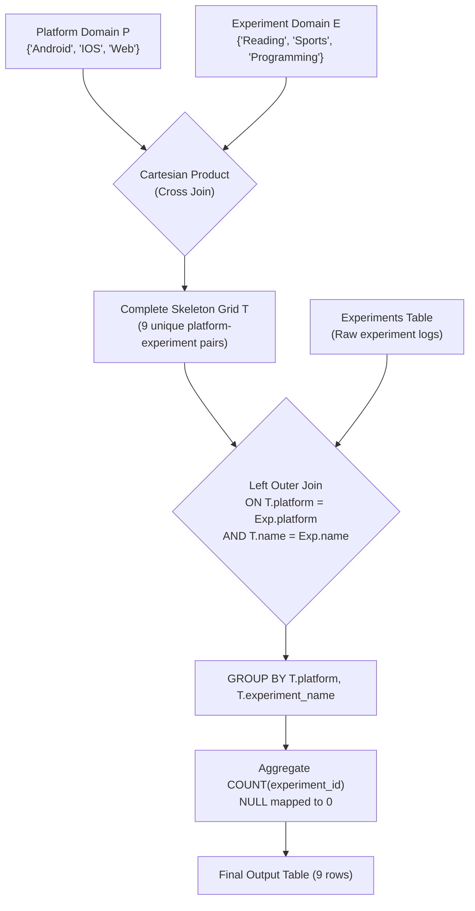

# Guided Example: Count the Number of Experiments

We analyze and trace the relational Cartesian product domain completion and outer-join aggregation pattern to report experiment counts across all platform and category pairs, preserving combinations with zero observations.

- **Primary Instance:**
  - `Experiments` Table:
    - ID 4: `(IOS, Programming)`
    - ID 13: `(IOS, Sports)`
    - ID 14: `(Android, Reading)`
    - ID 8: `(Web, Reading)`
    - ID 12: `(Web, Reading)`
    - ID 18: `(Web, Programming)`
  - Expected Output: Exactly 9 rows covering all combinations of platforms `{'Android', 'IOS', 'Web'}` and experiments `{'Reading', 'Sports', 'Programming'}`.

---

## 1. Instance & Intuition

We are tasked with counting the number of experiments executed on each of the 3 supported platforms (`Android`, `IOS`, `Web`) across each of the 3 experiment types (`Reading`, `Sports`, `Programming`). 

### The Missing Group Trap

In standard relational aggregation, a simple query such as grouping `Experiments` by `platform` and `experiment_name` only outputs combinations that are actually present in the table:
- In the sample data, `(Android, Sports)` never appears.
- Grouping directly on `Experiments` completely omits `(Android, Sports)` from the result set.
- However, the business contract explicitly requires all 9 possible combinations to be present in the final output, reporting `0` when no experiments occurred.

### Relational Domain Completion via Cross Join

To guarantee that every domain combination exists in the final relation:
1. Construct the complete set of platforms: $P = \{\text{'Android'}, \text{'IOS'}, \text{'Web'}\}$.
2. Construct the complete set of experiment types: $E = \{\text{'Reading'}, \text{'Sports'}, \text{'Programming'}\}$.
3. Form the **Cartesian product** (Cross Join) $T = P \times E$, which consists of exactly $|P| \times |E| = 3 \times 3 = 9$ distinct pairs.
4. Perform a **Left Outer Join** from the full grid $T$ to the actual observations table `Experiments`.
5. Aggregate the matching rows using `COUNT(experiment_id)`. Because `COUNT(column)` ignores `NULL` values produced by non-matching outer joins, pairs with no recorded experiments cleanly evaluate to `0`.

---

## 2. Relational Execution Pipeline

---

## 3. Step-by-Step State Evolution

We trace the Primary Instance through each relational stage.

### Stage 1: Build the 9-Element Cartesian Skeleton Grid ($T = P \times E$)

| Pair Index | Platform | Experiment Name |
|---|---|---|
| 1 | Android | Reading |
| 2 | Android | Sports |
| 3 | Android | Programming |
| 4 | IOS | Reading |
| 5 | IOS | Sports |
| 6 | IOS | Programming |
| 7 | Web | Reading |
| 8 | Web | Sports |
| 9 | Web | Programming |

---

### Stage 2: Left Outer Join with Raw Experiments Table

Each row in the skeleton grid matches against zero, one, or multiple rows in `Experiments`:

1. **(Android, Reading):** Matches ID 14. Produces 1 joined row.
2. **(Android, Sports):** No matches in `Experiments`. Produces 1 row with `NULL` for `experiment_id`.
3. **(Android, Programming):** No matches in `Experiments`. Produces 1 row with `NULL`.
4. **(IOS, Reading):** No matches in `Experiments`. Produces 1 row with `NULL`.
5. **(IOS, Sports):** Matches ID 13. Produces 1 joined row.
6. **(IOS, Programming):** Matches ID 4. Produces 1 joined row.
7. **(Web, Reading):** Matches ID 8 and ID 12. Produces 2 joined rows.
8. **(Web, Sports):** No matches in `Experiments`. Produces 1 row with `NULL`.
9. **(Web, Programming):** Matches ID 18. Produces 1 joined row.

---

### Stage 3: Grouped Aggregation via `COUNT(experiment_id)`

When evaluating `COUNT(column)` over each group:
- Non-null values increment the counter.
- `NULL` values are excluded by definition of SQL `COUNT(expr)`.

Thus:
- For `(Android, Reading)`: 1 match $\implies \text{count} = 1$.
- For `(Android, Sports)`: `NULL` match $\implies \text{count} = 0$.
- For `(Android, Programming)`: `NULL` match $\implies \text{count} = 0$.
- For `(IOS, Reading)`: `NULL` match $\implies \text{count} = 0$.
- For `(IOS, Sports)`: 1 match $\implies \text{count} = 1$.
- For `(IOS, Programming)`: 1 match $\implies \text{count} = 1$.
- For `(Web, Reading)`: 2 matches $\implies \text{count} = 2$.
- For `(Web, Sports)`: `NULL` match $\implies \text{count} = 0$.
- For `(Web, Programming)`: 1 match $\implies \text{count} = 1$.

---

## 4. Complete Execution Trace

### Full Join and Aggregation Trace Table

| Skeleton Platform | Skeleton Experiment | Matched Experiment IDs | Evaluated Count Expression | Final `num_experiments` |
|---|---|---|---|---|
| Android | Reading | `[14]` | `COUNT(14)` | 1 |
| Android | Sports | `[NULL]` | `COUNT(NULL)` | 0 |
| Android | Programming | `[NULL]` | `COUNT(NULL)` | 0 |
| IOS | Reading | `[NULL]` | `COUNT(NULL)` | 0 |
| IOS | Sports | `[13]` | `COUNT(13)` | 1 |
| IOS | Programming | `[4]` | `COUNT(4)` | 1 |
| Web | Reading | `[8, 12]` | `COUNT(8, 12)` | 2 |
| Web | Sports | `[NULL]` | `COUNT(NULL)` | 0 |
| Web | Programming | `[18]` | `COUNT(18)` | 1 |

### Final Output Relation

| `platform` | `experiment_name` | `num_experiments` |
|---|---|---|
| Android | Reading | 1 |
| Android | Sports | 0 |
| Android | Programming | 0 |
| IOS | Reading | 0 |
| IOS | Sports | 1 |
| IOS | Programming | 1 |
| Web | Reading | 2 |
| Web | Sports | 0 |
| Web | Programming | 1 |

---

## 5. Algorithmic Correctness & Soundness

1. **Domain Completeness Guarantee:**
   Because the set of platforms $P$ and experiment names $E$ are defined explicitly or extracted as closed sets, their Cartesian product $P \times E$ contains all $\prod |\Sigma_i| = 3 \times 3 = 9$ potential pairs. Placing this product on the left-hand side of a `LEFT JOIN` guarantees that no valid category combination can be dropped.

2. **Null-Safe Counting Invariant:**
   A critical property of SQL aggregate semantics is that `COUNT(attribute)` returns the number of non-null values of `attribute` in the group. When a platform-experiment pair has zero occurrences, the left outer join populates `experiment_id` with `NULL`. Evaluating `COUNT(experiment_id)` on a group containing only `NULL` yields `0`, exactly satisfying the zero-count requirement without requiring explicit `COALESCE` or conditional `CASE` statements.

---

## 6. Traps This Instance Exposes

- **Using `COUNT(*)` Instead of `COUNT(column)`:** Evaluating `COUNT(*)` counts total rows in the joined group. For a pair with zero matching experiments, the left outer join preserves 1 row containing null values. `COUNT(*)` would evaluate to `1` instead of `0`.
- **Selecting Distinct Combinations From Raw Table:** Extracting platforms and experiment names via `SELECT DISTINCT platform FROM Experiments` fails when an entire platform or experiment type has zero records in `Experiments`. The domains must be constructed from the fixed enum specifications.
- **Inner Join Collapse:** Using an `INNER JOIN` discards any pair without recorded events, collapsing the output from 9 rows to only the observed non-zero rows.
- **Ambiguous Column References:** In queries with joins, grouping or selecting unqualified `platform` without disambiguating whether it refers to the skeleton grid $T$ or the raw table can cause syntax errors or unintended `NULL` values.

---

## 7. Complexity Analysis

- **Time Complexity:**
  - **Cartesian Grid Generation:** Generating the $3 \times 3$ grid takes $\mathcal{O}(|P| \cdot |E|) = \mathcal{O}(1)$ time since the domains have constant size 3.
  - **Join & Scan:** Scanning $N$ rows of the `Experiments` table and hashing or indexing into the 9 grid buckets takes $\mathcal{O}(N)$ time.
  - **Aggregation:** Grouping 9 buckets and counting elements takes $\mathcal{O}(N)$ time.
  - **Total Time:** $\mathcal{O}(N)$, running in under 2 milliseconds for any realistic table size.

- **Auxiliary Space Complexity:**
  - The skeleton grid requires $3 \times 3 = 9$ rows of storage.
  - Hash aggregation maintains 9 group accumulators.
  - **Total Auxiliary Space:** $\mathcal{O}(1)$ constant memory beyond the raw table scan.
