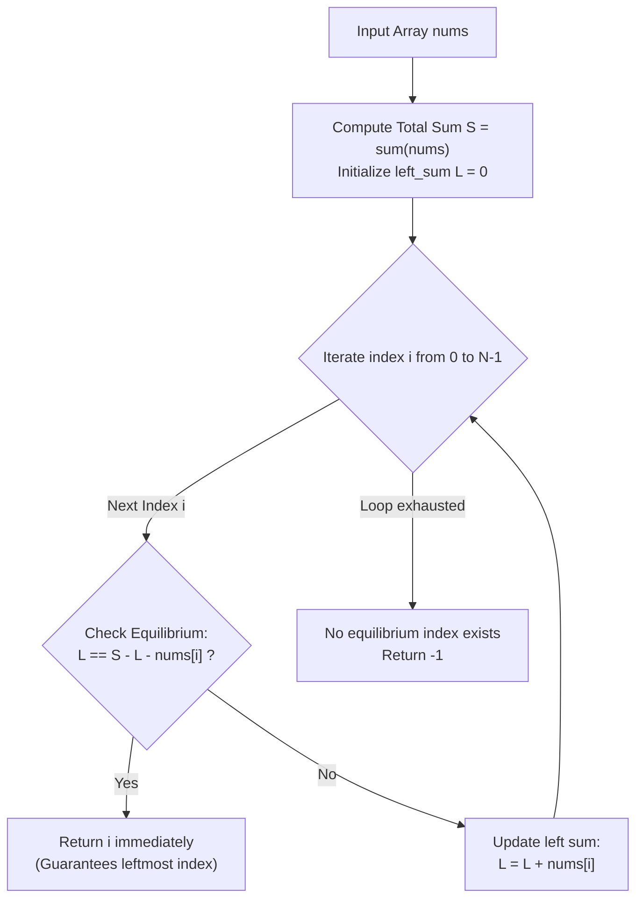

# Guided Example: Find the Middle Index in Array

We formulate and trace the total-sum prefix balance algorithm on representative integer arrays containing positive, negative, and zero values to identify the leftmost equilibrium pivot index in a single pass.

- **Primary Instance:** `nums = [2, 3, -1, 8, 4]` ($N = 5$)
  - Expected Output: `3` (prefix before index 3 sums to $2 + 3 - 1 = 4$; suffix after index 3 sums to $4$; $4 == 4$)
- **Secondary Instance:** `nums = [1, -1, 4]` ($N = 3$)
  - Expected Output: `2` (prefix before index 2 sums to $1 + (-1) = 0$; suffix after index 2 is empty, summing to $0$; $0 == 0$)
- **Unbalanced Instance:** `nums = [2, 5]` ($N = 2$)
  - Expected Output: `-1` (no index satisfies equal left and right sums)

---

## 1. Instance & Intuition

We seek the **leftmost** index $i \in \{0, \dots, N-1\}$ where the sum of all elements strictly to the left of $i$ equals the sum of all elements strictly to the right of $i$:
$$\sum_{j=0}^{i-1} nums[j] = \sum_{j=i+1}^{N-1} nums[j]$$
By definition:
- If $i = 0$, the left sum is empty: $L = 0$.
- If $i = N - 1$, the right sum is empty: $R = 0$.

### Overcoming $\mathcal{O}(N^2)$ Recomputation

Computing the sum of the left partition and right partition from scratch at each index $i$ requires $\mathcal{O}(N)$ summation per candidate, accumulating to $\mathcal{O}(N^2)$ overall.

However, notice that the total sum of the entire array is invariant:
$$S = \sum_{j=0}^{N-1} nums[j]$$
At any candidate pivot index $i$, the entire array is partitioned into three disjoint segments:
$$S = \Big(\text{Left Sum } L\Big) + nums[i] + \Big(\text{Right Sum } R\Big)$$
Rearranging this algebraic identity gives the right sum directly in terms of the total sum $S$ and current left sum $L$:
$$R = S - L - nums[i]$$
The equilibrium condition $L == R$ is therefore equivalent to:
$$L = S - L - nums[i] \iff 2 \cdot L + nums[i] = S$$

This allows us to precalculate total sum $S$ once, and then maintain a single running accumulator $L$ as we iterate $i$ from left to right.

---

## 2. Invariant Architecture & Execution Flow

---

## 3. Step-by-Step State Evolution

We trace the Primary Instance: `nums = [2, 3, -1, 8, 4]` ($N = 5$).

### Phase 1: Total Sum Calculation
$$S = 2 + 3 + (-1) + 8 + 4 = 16$$
Initialize running left sum $L = 0$.

---

### Phase 2: Forward Scan for Leftmost Pivot

#### Candidate $i = 0$ ($nums[0] = 2$)
- Left sum: $L = 0$.
- Right sum: $R = S - L - nums[0] = 16 - 0 - 2 = 14$.
- Check: $L == R \implies 0 == 14$ (False).
- Accumulate: $L \leftarrow L + nums[0] = 0 + 2 = 2$.

#### Candidate $i = 1$ ($nums[1] = 3$)
- Left sum: $L = 2$.
- Right sum: $R = S - L - nums[1] = 16 - 2 - 3 = 11$.
- Check: $L == R \implies 2 == 11$ (False).
- Accumulate: $L \leftarrow L + nums[1] = 2 + 3 = 5$.

#### Candidate $i = 2$ ($nums[2] = -1$)
- Left sum: $L = 5$.
- Right sum: $R = S - L - nums[2] = 16 - 5 - (-1) = 12$.
- Check: $L == R \implies 5 == 12$ (False).
- Accumulate: $L \leftarrow L + nums[2] = 5 + (-1) = 4$.

#### Candidate $i = 3$ ($nums[3] = 8$)
- Left sum: $L = 4$.
- Right sum: $R = S - L - nums[3] = 16 - 4 - 8 = 4$.
- Check: $L == R \implies 4 == 4$ (True!).
- Because we iterate strictly left-to-right, $i = 3$ is guaranteed to be the leftmost index satisfying the equilibrium requirement.
- Early exit: return **3**.

---

## 4. Complete Execution Trace

### Primary Instance: `nums = [2, 3, -1, 8, 4]`, $S = 16$

| Index $i$ | Element $nums[i]$ | Left Sum $L$ | Right Sum $R = S - L - nums[i]$ | $L == R$? | Action |
|---|---|---|---|---|---|
| 0 | 2 | 0 | $16 - 0 - 2 = 14$ | No ($0 \neq 14$) | $L \leftarrow 0 + 2 = 2$ |
| 1 | 3 | 2 | $16 - 2 - 3 = 11$ | No ($2 \neq 11$) | $L \leftarrow 2 + 3 = 5$ |
| 2 | -1 | 5 | $16 - 5 - (-1) = 12$ | No ($5 \neq 12$) | $L \leftarrow 5 - 1 = 4$ |
| 3 | 8 | 4 | $16 - 4 - 8 = 4$ | **Yes** ($4 == 4$) | **Return 3** |

Output: **3**.

### Secondary Instance: `nums = [1, -1, 4]`, $S = 4$

| Index $i$ | Element $nums[i]$ | Left Sum $L$ | Right Sum $R = S - L - nums[i]$ | $L == R$? | Action |
|---|---|---|---|---|---|
| 0 | 1 | 0 | $4 - 0 - 1 = 3$ | No ($0 \neq 3$) | $L \leftarrow 0 + 1 = 1$ |
| 1 | -1 | 1 | $4 - 1 - (-1) = 4$ | No ($1 \neq 4$) | $L \leftarrow 1 - 1 = 0$ |
| 2 | 4 | 0 | $4 - 0 - 4 = 0$ | **Yes** ($0 == 0$) | **Return 2** |

Output: **2**.

---

## 5. Algorithmic Correctness & Soundness

1. **Partition Exactness:**
   For any index $i \in \{0, \dots, N-1\}$, the elements of `nums` are uniquely partitioned into:
   - Left subsegment: indices $0$ to $i-1$ (sum $L$).
   - Current pivot: index $i$ (value $nums[i]$).
   - Right subsegment: indices $i+1$ to $N-1$ (sum $R$).
   Because total sum $S = L + nums[i] + R$, the identity $R = S - L - nums[i]$ holds unconditionally without approximation error.

2. **Leftmost Index Guarantee:**
   The algorithm evaluates indices in strictly increasing order $i = 0, 1, \dots, N-1$. The moment the equality condition $L == R$ is satisfied, the function returns immediately. Thus, no candidate index with a smaller value of $i$ could have been valid, ensuring the leftmost requirement is satisfied.

3. **Absence of Monotonicity Assumptions:**
   Because elements can be negative, $L$ does not necessarily increase monotonically. The linear scan evaluates exact algebraic balance rather than relying on binary search or two-pointer convergence, making it sound over arbitrary integer domains.

---

## 6. Traps This Instance Exposes

- **Assuming Two-Pointer Convergence:** In arrays with non-negative numbers, two pointers starting at opposite ends can find an equilibrium. However, when negative numbers are present, adding an element can decrease the prefix sum, breaking monotonicity and causing two-pointer heuristics to miss valid pivots.
- **Premature Left Sum Update:** If $nums[i]$ is added to $L$ before checking whether $L == R$, the left sum will erroneously include the pivot element itself, violating the strict exclusion rule.
- **Missing Boundary Pivots ($i = 0$ or $i = N - 1$):** At $i = 0$, the left sum is $0$. At $i = N - 1$, the right sum is $0$. Implementations that restrict the scan to $1 \le i \le N - 2$ fail on instances like `[1, -1, 4]` where the pivot is at an extreme boundary.
- **Integer Division Pitfall:** Writing the condition as $L == (S - nums[i]) / 2$ fails when $S - nums[i]$ is odd in integer division (e.g., $7 / 2 = 3$). The exact condition must be $2 \cdot L == S - nums[i]$ or $L == S - L - nums[i]$.

---

## 7. Complexity Analysis

- **Time Complexity:**
  - **Pass 1 (Total Sum):** Accumulating all $N$ elements requires $\mathcal{O}(N)$ arithmetic additions.
  - **Pass 2 (Pivot Search):** Evaluating the algebraic equality and updating $L$ takes $\mathcal{O}(1)$ time per index for at most $N$ steps.
  - **Total Time:** $\mathcal{O}(N) + \mathcal{O}(N) = \mathcal{O}(N)$, which completes for $N = 100$ in under 0.1 milliseconds.

- **Auxiliary Space Complexity:**
  - The algorithm only requires scalar registers to hold $S$, $L$, and loop index $i$.
  - **Total Auxiliary Space:** $\mathcal{O}(1)$ constant memory.
