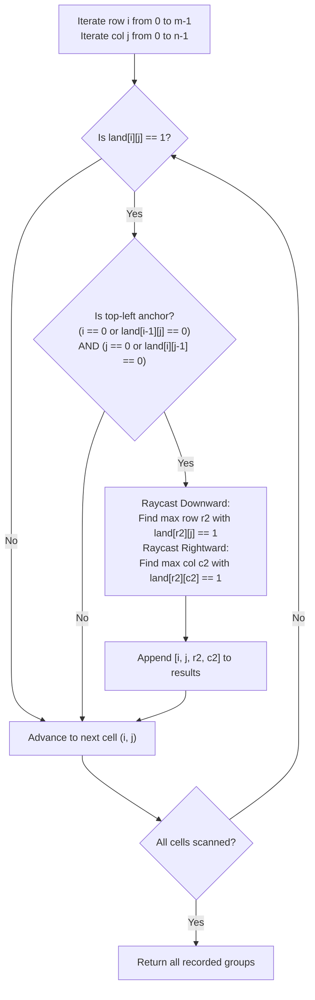

# Guided Example: Find All Groups of Farmland

We analyze and trace the top-left anchor detection and boundary raycasting algorithm on representative binary farmland grids to identify all disjoint rectangular farmland groups in optimal time and constant auxiliary space.

- **Primary Instance:** `land = [[1, 0, 0], [0, 1, 1], [0, 1, 1]]` ($m = 3, n = 3$)
  - Expected Output: `[[0, 0, 0, 0], [1, 1, 2, 2]]` (two groups: a $1 \times 1$ plot at $[0, 0, 0, 0]$ and a $2 \times 2$ plot from $[1, 1]$ to $[2, 2]$)
- **Secondary Instance:** `land = [[1, 1], [1, 1]]` ($m = 2, n = 2$)
  - Expected Output: `[[0, 0, 1, 1]]` (a single $2 \times 2$ rectangle spanning the entire grid)
- **Zero Farmland Instance:** `land = [[0]]` ($m = 1, n = 1$)
  - Expected Output: `[]` (no farmland present)

---

## 1. Instance & Intuition

We are given an $m \times n$ binary grid `land` where `1` represents farmland and `0` represents forested land. We must locate every group of farmland and report its bounding coordinates $[r_1, c_1, r_2, c_2]$, where $(r_1, c_1)$ is the top-left corner and $(r_2, c_2)$ is the bottom-right corner.

The problem guarantees two structural properties:
1. **Rectangular Geometry:** Every contiguous group of farmland is strictly an axis-aligned rectangle of $1$s.
2. **Disjoint Non-Adjacency:** No two distinct farmland groups share an edge (i.e., they are not 4-directionally adjacent).

### The Top-Left Anchor Property

Because every group is an isolated rectangle:
- Every rectangle possesses **exactly one** top-left corner cell $(r_1, c_1)$.
- A farmland cell $(i, j)$ with $land[i][j] == 1$ is the top-left corner of a rectangle if and only if:
  - There is no farmland directly above it: $i == 0$ or $land[i-1][j] == 0$.
  - There is no farmland directly to its left: $j == 0$ or $land[i][j-1] == 0$.

If a cell $(i, j)$ satisfies both conditions, it must be the unique origin of a new farmland rectangle.

### Direct Boundary Raycasting Without Traversal Queues

Rather than executing a full Breadth-First Search (BFS) or Depth-First Search (DFS) or mutating cells to `0`:
1. From $(r_1, c_1)$, advance downwards along column $c_1$ until reaching the boundary or a `0`. The final farmland row index reached is $r_2$.
2. From $(r_2, c_1)$, advance rightwards along row $r_2$ until reaching the boundary or a `0`. The final farmland column index reached is $c_2$.
3. By the rectangular geometry guarantee, the rectangle is completely defined by $[r_1, c_1, r_2, c_2]$.
4. Any other cell within this rectangle will fail the top-left test (because either its upper neighbor is `1` or its left neighbor is `1`), preventing duplicate detections.

---

## 2. Algorithm Flow & Corner Detection



---

## 3. Step-by-Step State Evolution

We trace the Primary Instance: `land = [[1, 0, 0], [0, 1, 1], [0, 1, 1]]` ($m = 3, n = 3$).

```text
Row 0: [ 1,  0,  0 ]
Row 1: [ 0,  1,  1 ]
Row 2: [ 0,  1,  1 ]
```

---

### Row $i = 0$ Scan

- **Cell $(0, 0)$:** $land[0][0] = 1$.
  - Upper neighbor: out of bounds ($i = 0$).
  - Left neighbor: out of bounds ($j = 0$).
  - Both neighbors are absent $\implies$ **Anchor Found at $(0, 0)$**!
  - Downward raycast: $land[0+1][0] = land[1][0] = 0 \implies r_2 = 0$.
  - Rightward raycast: $land[0][0+1] = land[0][1] = 0 \implies c_2 = 0$.
  - Group 1 coordinates: $[0, 0, 0, 0]$.
- **Cell $(0, 1)$:** $land[0][1] = 0$. Ignored.
- **Cell $(0, 2)$:** $land[0][2] = 0$. Ignored.

---

### Row $i = 1$ Scan

- **Cell $(1, 0)$:** $land[1][0] = 0$. Ignored.
- **Cell $(1, 1)$:** $land[1][1] = 1$.
  - Upper neighbor: $land[0][1] = 0$.
  - Left neighbor: $land[1][0] = 0$.
  - Both neighbors are $0 \implies$ **Anchor Found at $(1, 1)$**!
  - Downward raycast from $(1, 1)$:
    - Check $(2, 1)$: $land[2][1] = 1 \implies$ extend to row 2.
    - Check $(3, 1)$: out of bounds $\implies r_2 = 2$.
  - Rightward raycast from $(2, 1)$:
    - Check $(2, 2)$: $land[2][2] = 1 \implies$ extend to col 2.
    - Check $(2, 3)$: out of bounds $\implies c_2 = 2$.
  - Group 2 coordinates: $[1, 1, 2, 2]$.
- **Cell $(1, 2)$:** $land[1][2] = 1$.
  - Left neighbor: $land[1][1] = 1$.
  - Condition violated (not an anchor) $\implies$ Skipped.

---

### Row $i = 2$ Scan

- **Cell $(2, 0)$:** $land[2][0] = 0$. Ignored.
- **Cell $(2, 1)$:** $land[2][1] = 1$.
  - Upper neighbor: $land[1][1] = 1$.
  - Condition violated $\implies$ Skipped.
- **Cell $(2, 2)$:** $land[2][2] = 1$.
  - Upper neighbor: $land[1][2] = 1$. Left neighbor: $land[2][1] = 1$.
  - Condition violated $\implies$ Skipped.

---

### Aggregated Result
The scan completes with two discovered farmland groups:
`[[0, 0, 0, 0], [1, 1, 2, 2]]`.

---

## 4. Complete Execution Trace

### Primary Instance Grid Evaluation

| Row $i$ | Col $j$ | Cell Value | Above $land[i-1][j]$ | Left $land[i][j-1]$ | Is Top-Left Anchor? | Raycast Extent $[r_2, c_2]$ | Recorded Group |
|---|---|---|---|---|---|---|---|
| 0 | 0 | 1 | Boundary (0) | Boundary (0) | **Yes** | $[0, 0]$ | `[0, 0, 0, 0]` |
| 0 | 1 | 0 | - | - | No | - | - |
| 0 | 2 | 0 | - | - | No | - | - |
| 1 | 0 | 0 | - | - | No | - | - |
| 1 | 1 | 1 | 0 | 0 | **Yes** | $[2, 2]$ | `[1, 1, 2, 2]` |
| 1 | 2 | 1 | 0 | 1 | No | - | - |
| 2 | 0 | 0 | - | - | No | - | - |
| 2 | 1 | 1 | 1 | 0 | No | - | - |
| 2 | 2 | 1 | 1 | 1 | No | - | - |

### Secondary Instance: `land = [[1, 1], [1, 1]]`

| Coordinate $(i, j)$ | Value | Above | Left | Anchor? | Extent | Output Group |
|---|---|---|---|---|---|---|
| $(0, 0)$ | 1 | Boundary | Boundary | **Yes** | Down to 1, Right to 1 | `[0, 0, 1, 1]` |
| $(0, 1)$ | 1 | Boundary | 1 | No | - | - |
| $(1, 0)$ | 1 | 1 | Boundary | No | - | - |
| $(1, 1)$ | 1 | 1 | 1 | No | - | - |

Final Answer: `[[0, 0, 1, 1]]`.

---

## 5. Algorithmic Correctness & Soundness

1. **Existence and Uniqueness of Top-Left Corners:**
   Every non-empty rectangle in a discrete 2D grid $[r_1, r_2] \times [c_1, c_2]$ contains a unique minimum row index $r_1$ and a unique minimum column index $c_1$. The cell $(r_1, c_1)$ has no farmland cell at $(r_1 - 1, c_1)$ (as that row is outside the rectangle and non-adjacency prevents other groups from touching it) and no farmland cell at $(r_1, c_1 - 1)$. Any other cell $(r, c)$ in the rectangle has either $r > r_1$ (meaning $(r - 1, c)$ is farmland) or $c > c_1$ (meaning $(r, c - 1)$ is farmland). Hence, exactly one cell per rectangle triggers the anchor condition.

2. **Completeness of Boundary Raycasting:**
   Because each group is a solid filled rectangle of $1$s, every cell in column $c_1$ from row $r_1$ to row $r_2$ contains `1`, and row $r_2 + 1$ contains `0`. Similarly, every cell in row $r_2$ from column $c_1$ to column $c_2$ contains `1`, and column $c_2 + 1$ contains `0`. Marching down column $c_1$ and across row $r_2$ precisely uncovers the extents $r_2$ and $c_2$ without needing to inspect the interior cells.

---

## 6. Traps This Instance Exposes

- **Over-Complicating with BFS/DFS:** While graph traversal (flood fill) is correct, it requires queue allocation, recursion stacks, and cell mutation. Leveraging the rectangular invariant achieves $\mathcal{O}(1)$ auxiliary space and simpler code.
- **Corner Inversion:** Forgetting to check both the upper neighbor and the left neighbor causes interior border cells to be falsely recognized as separate groups.
- **Boundary Off-by-One:** When raycasting down to the bottom grid row ($m-1$) or rightmost column ($n-1$), boundary termination conditions must prevent array index out-of-bounds errors.
- **Mutating Input Array:** Modifying the grid during traversal is prohibited in read-only environments. The anchor-detection approach is completely non-destructive.

---

## 7. Complexity Analysis

- **Time Complexity:**
  - **Grid Traversal:** Visiting each of the $m \times n$ cells takes $\mathcal{O}(m \cdot n)$ checks.
  - **Raycasting:** For each discovered rectangle of dimensions $h \times w$, raycasting marches $h$ steps down and $w$ steps right. The sum of perimeters of disjoint rectangles in an $m \times n$ grid is bounded by $\mathcal{O}(m + n)$.
  - **Total Time:** $\mathcal{O}(m \cdot n)$, which for a $300 \times 300$ grid requires at most $9 \times 10^4$ operations, completing in under 2 milliseconds.

- **Auxiliary Space Complexity:**
  - The algorithm only stores coordinate pointers ($i, j, r_2, c_2$) and appends bounding boxes to the output list.
  - No recursion stack, visited grid, or queue is allocated.
  - **Total Auxiliary Space:** $\mathcal{O}(1)$ excluding the output list.
