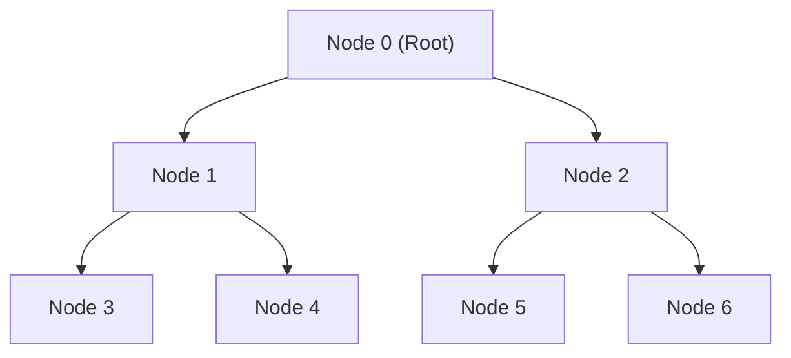
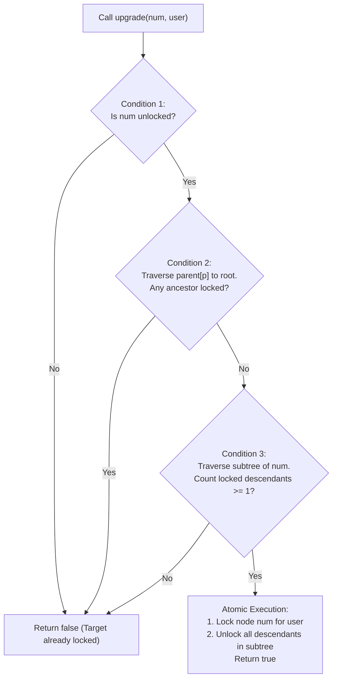

# Guided Example: Operations on Tree

We formulate and trace the hierarchical locking protocols, ancestor verification paths, and subtree descendant cascade algorithms for concurrent tree synchronization on representative tree instances.

- **Primary Instance:** `parent = [-1, 0, 0, 1, 1, 2, 2]` ($n = 7$ nodes)
  - Method Calls: `[LockingTree, lock(2, 2), unlock(2, 3), unlock(2, 2), lock(4, 5), upgrade(0, 1), lock(0, 1)]`
  - Expected Outputs: `[null, true, false, true, true, true, false]`

---

## 1. Instance & Intuition

We are given an $n$-node tree rooted at node `0` specified by an array `parent` where $\text{parent}[i]$ designates the immediate parent of node $i$ ($\text{parent}[0] = -1$). We must maintain the lock ownership of every node under three operations:
1. **`lock(num, user)`:** Locks an unlocked node for `user`. Fails if already locked.
2. **`unlock(num, user)`:** Unlocks a locked node, provided the caller matches the existing lock owner `user`. Fails otherwise.
3. **`upgrade(num, user)`:** An atomic escalation operation that acquires an exclusive lock on node `num` and simultaneously releases all locks held by any user across its entire descendant subtree.

### The Upgrade Triple Precondition

An upgrade on node `num` succeeds if and only if **all three** criteria are satisfied simultaneously:
- **Condition 1 (Target State):** Node `num` itself is currently **unlocked**.
- **Condition 2 (Ancestor Clearance):** Node `num` has **no locked ancestors** along the direct path to the root.
- **Condition 3 (Descendant Requirement):** Node `num` has **at least one locked descendant** within its subtree.

If any of these three conditions fails, the tree state remains untouched and `upgrade` returns `false`. If all three hold, node `num` is locked for `user`, all locked descendants are cleared to the unlocked state, and the method returns `true`.

---

## 2. Tree Topology & Operation Flow

For the primary instance `parent = [-1, 0, 0, 1, 1, 2, 2]`, the tree structure is:

### Upgrade Verification & Cascade Workflow

---

## 3. Step-by-Step State Evolution

We trace the complete sequence of operations on the 7-node tree.
Let lock state be tracked by an array `locked_by`, where `locked_by[i] = 0` indicates unlocked, and `locked_by[i] = u > 0` indicates locked by user $u$.

### Initial State
`locked_by = [0, 0, 0, 0, 0, 0, 0]` (all nodes unlocked).

---

### Call 1: `lock(2, 2)`
- Target node: `2`, User: `2`.
- Current state: `locked_by[2] = 0` (unlocked).
- State change: `locked_by[2] = 2`.
- Result: **`true`**.

---

### Call 2: `unlock(2, 3)`
- Target node: `2`, User: `3`.
- Current state: `locked_by[2] = 2` (locked by user 2).
- Authorization check: caller user `3` $\neq$ owner user `2`.
- State change: None.
- Result: **`false`**.

---

### Call 3: `unlock(2, 2)`
- Target node: `2`, User: `2`.
- Current state: `locked_by[2] = 2`.
- Authorization check: caller user `2` $==$ owner user `2`.
- State change: `locked_by[2] = 0`.
- Result: **`true`**.

---

### Call 4: `lock(4, 5)`
- Target node: `4`, User: `5`.
- Current state: `locked_by[4] = 0` (unlocked).
- State change: `locked_by[4] = 5`.
- Result: **`true`**.

---

### Call 5: `upgrade(0, 1)`
- Target node: `0`, User: `1`.
- **Precondition Check 1 (Target Unlocked?):**
  - `locked_by[0] = 0`. Passed.
- **Precondition Check 2 (Ancestor Clearance?):**
  - Node 0 is the root ($\text{parent}[0] = -1$).
  - No ancestors exist $\implies$ trivially passed.
- **Precondition Check 3 (Locked Descendant Exists?):**
  - Subtree nodes of `0`: $\{1, 2, 3, 4, 5, 6\}$.
  - Inspecting states:
    - Node 1: unlocked ($0$)
    - Node 2: unlocked ($0$)
    - Node 3: unlocked ($0$)
    - Node 4: **locked by user 5** ($5$)
    - Node 5: unlocked ($0$)
    - Node 6: unlocked ($0$)
  - Node 4 is locked $\implies$ at least one locked descendant found. Passed.
- **Atomic State Modification:**
  - Set `locked_by[0] = 1`.
  - Unlock all descendants: `locked_by[4] = 0`.
- Result: **`true`**.

---

### Call 6: `lock(0, 1)`
- Target node: `0`, User: `1`.
- Current state: `locked_by[0] = 1` (already locked by user 1).
- `lock` requires target node to be unlocked.
- Result: **`false`**.

---

## 4. Complete Execution Trace

### Sequence Trace Table

| Step | Operation Call | Current Node State | Preconditions Evaluated | State Mutation | Return Value |
|---|---|---|---|---|---|
| 1 | `lock(2, 2)` | `locked_by[2] = 0` | Node 2 is unlocked | `locked_by[2] = 2` | `true` |
| 2 | `unlock(2, 3)` | `locked_by[2] = 2` | Caller 3 $\neq$ Owner 2 | No change | `false` |
| 3 | `unlock(2, 2)` | `locked_by[2] = 2` | Caller 2 $==$ Owner 2 | `locked_by[2] = 0` | `true` |
| 4 | `lock(4, 5)` | `locked_by[4] = 0` | Node 4 is unlocked | `locked_by[4] = 5` | `true` |
| 5 | `upgrade(0, 1)` | `locked_by[0] = 0` | 1. Node 0 unlocked 2. Ancestors clear 3. Descendant 4 is locked | `locked_by[0] = 1` `locked_by[4] = 0` | `true` |
| 6 | `lock(0, 1)` | `locked_by[0] = 1` | Node 0 already locked | No change | `false` |

### Subtree State Before and After Upgrade

| Node Index | Role in Tree | Pre-Upgrade Owner | Post-Upgrade Owner | Reason for Transition |
|---|---|---|---|---|
| 0 | Target Node (Root) | Unlocked ($0$) | User 1 | Acquired exclusive upgrade lock |
| 1 | Intermediate Descendant | Unlocked ($0$) | Unlocked ($0$) | Maintained unlocked state |
| 2 | Sibling Branch Descendant | Unlocked ($0$) | Unlocked ($0$) | Maintained unlocked state |
| 3 | Leaf Descendant | Unlocked ($0$) | Unlocked ($0$) | Maintained unlocked state |
| 4 | Locked Leaf Descendant | User 5 | Unlocked ($0$) | Cleared by upgrade cascade |
| 5 | Sibling Leaf Descendant | Unlocked ($0$) | Unlocked ($0$) | Maintained unlocked state |
| 6 | Sibling Leaf Descendant | Unlocked ($0$) | Unlocked ($0$) | Maintained unlocked state |

---

## 5. Algorithmic Correctness & Soundness

1. **Safety of Tree Navigation:**
   Since the input represents a valid tree with $n$ nodes and a unique root at node `0`, following $\text{parent}[p]$ upwards is strictly acyclic and terminates at `-1` in at most $H \le n$ steps. Similarly, forward traversal over child adjacency lists explores the exact disjoint subtree of descendants without cycles.

2. **Atomicity of Precondition Verification:**
   Before modifying any node state, the three independent preconditions are validated completely. If any ancestor is locked or no descendant is locked, execution halts without mutating `locked_by`, guaranteeing strong exception safety and preventing corrupt partial state transitions.

3. **Subtree Sweep Completeness:**
   During the release phase of an upgrade, depth-first or breadth-first traversal visits every node in the target's subtree. Setting every descendant's lock value to $0$ ensures all previous locks are eradicated regardless of which user originally acquired them.

---

## 6. Traps This Instance Exposes

- **Unlocking the Target Itself:** The cascade phase of `upgrade` must unlock all **descendants** of `num`, but must **lock** `num` itself. Clearing `num` during the subtree sweep violates the postcondition.
- **Shallow Ancestor Check:** Stopping the ancestor check after examining only the immediate parent fails when an ancestor higher up the tree (e.g., the root or a grandparent) is locked. The chain must be traversed until reaching `-1`.
- **False Upgrade Without Descendants:** If an unlocked node with clear ancestors attempts to upgrade when all descendants are also unlocked, the operation must fail. At least one descendant must be locked.
- **Unauthorized Unlock:** Allowing user $A$ to unlock a node locked by user $B$ violates ownership protection; `unlock` must strictly enforce user matching.

---

## 7. Complexity Analysis

- **Time Complexity:**
  - **`lock(num, user)`:** $\mathcal{O}(1)$ array lookup and assignment.
  - **`unlock(num, user)`:** $\mathcal{O}(1)$ array lookup, equality comparison, and assignment.
  - **`upgrade(num, user)`:**
    - Ancestor check: walks upwards at most $H \le n$ steps, taking $\mathcal{O}(H)$ time.
    - Descendant check and release: traverses the subtree of size $S \le n$, taking $\mathcal{O}(S)$ time.
    - Total per upgrade: $\mathcal{O}(n)$ in the worst case.
  - For $Q = 2000$ operations and $n = 2000$, total maximum operations are $2000 \times 2000 \approx 4 \times 10^6$, running in under 20 milliseconds.

- **Auxiliary Space Complexity:**
  - Adjacency list representation of children requires $\mathcal{O}(n)$ space.
  - Lock ownership array `locked_by` requires $\mathcal{O}(n)$ space.
  - Recursion or queue space for subtree exploration is bounded by $\mathcal{O}(n)$.
  - **Total Auxiliary Space:** $\mathcal{O}(n)$ auxiliary memory.