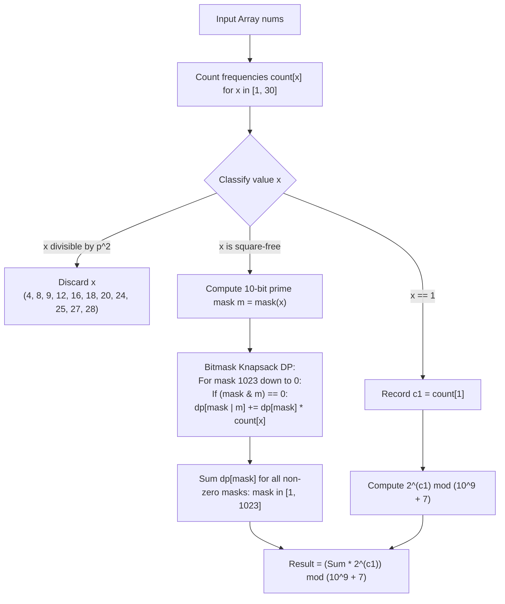

# Guided Example: The Number of Good Subsets

We formulate and trace the 10-prime bitmask dynamic programming and modular power scaling algorithm to count all unique subsets of `nums` whose element product decomposes into one or more distinct prime factors modulo $10^9 + 7$.

- **Primary Instance:** `nums = [4, 2, 3, 15]` ($N = 4$)
  - Expected Output: `5` (good subsets are `[2]`, `[3]`, `[15]`, `[2, 3]`, and `[2, 15]`)
- **Secondary Instance:** `nums = [1, 2, 3, 4]` ($N = 4$)
  - Expected Output: `6` (base subsets `[2]`, `[3]`, `[2, 3]` combined with the single `1` to produce 6 combinations)
- **Multi-One Instance:** `nums = [1, 1, 6]` ($N = 3$)
  - Expected Output: `4` (base subset `[6]` combined with any subset of two `1`s: $1 \times 2^2 = 4$)

---

## 1. Instance & Intuition

We are given an integer array `nums` where $1 \le nums[i] \le 30$. A subset of `nums` is **good** if its product can be expressed as a product of one or more **distinct prime numbers** (i.e., the product is square-free and strictly greater than 1).

### The Prime Basis of $[1, 30]$

The small upper bound $nums[i] \le 30$ is the fundamental insight. There are exactly 10 prime numbers less than or equal to 30:
$$\mathbb{P} = [2, 3, 5, 7, 11, 13, 17, 19, 23, 29]$$
Every square-free number $x \in [2, 30]$ corresponds to a unique subset of these 10 primes, which can be modeled as a 10-bit integer bitmask:
$$mask(x) = \sum_{j=0}^{9} \Big(1 \text{ if } \mathbb{P}[j] \mid x \text{ else } 0\Big) \cdot 2^j$$

### Filtering Numbers with Squared Primes

Any integer in $[2, 30]$ that is divisible by a square of a prime ($4, 9, 16, 25$ or composite multiples like $8, 12, 18, 20, 24, 27, 28$) can **never** be part of any good subset. Including such an element immediately causes the subset's product to have a squared prime factor. These numbers are immediately pruned.

### The Role of $1$

The number $1$ has no prime factors and does not alter the product. However, each distinct copy of $1$ in `nums` can independently be included or excluded from any valid non-empty subset of numbers $> 1$.
If $c_1$ copies of $1$ exist, every good subset formed from elements in $[2, 30]$ generates $2^{c_1}$ distinct index subsets.

---

## 2. Mathematical Formalism & Prime Mask Encoding

### Prime Bit Allocation Table

| Bit Index $j$ | Prime $\mathbb{P}[j]$ | Bit Value $2^j$ |
|---|---|---|
| 0 | 2 | 1 |
| 1 | 3 | 2 |
| 2 | 5 | 4 |
| 3 | 7 | 8 |
| 4 | 11 | 16 |
| 5 | 13 | 32 |
| 6 | 17 | 64 |
| 7 | 19 | 128 |
| 8 | 23 | 256 |
| 9 | 29 | 512 |

### Classification of Integers in $[1, 30]$

- **Multiplicative Identity:** $\{1\}$ (contributes factor $2^{c_1}$).
- **Invalid Numbers (Squared Prime Divisors):** $\{4, 8, 9, 12, 16, 18, 20, 24, 25, 27, 28\}$ (weight 0).
- **Valid Square-Free Numbers (18 values):**
  - Primes: $2, 3, 5, 7, 11, 13, 17, 19, 23, 29$
  - Products of two primes: $6, 10, 14, 15, 21, 22, 26$
  - Product of three primes: $30 = 2 \times 3 \times 5$

### 0/1 Knapsack Bitmask Dynamic Programming

Let $dp[mask]$ be the number of valid non-empty subsets of numbers from $\{2, \dots, 30\}$ whose prime factors combine to exactly $mask \in [0, 1023]$.
- Base case: $dp[0] = 1$ (empty set).
- For each valid number $x \in [2, 30]$ with frequency $count[x] > 0$ and mask $m = mask(x)$:
  - Iterate $mask$ downwards from $1023$ to $0$:
  - If $(mask \ \& \ m) == 0$ (no shared prime factors):
    $$dp[mask \mid m] \leftarrow \Big(dp[mask \mid m] + dp[mask] \times count[x]\Big) \pmod{10^9 + 7}$$

Final aggregation:
$$\text{Total} = \left( \sum_{mask = 1}^{1023} dp[mask] \right) \times 2^{c_1} \pmod{10^9 + 7}$$

---

## 3. Step-by-Step State Evolution

We trace the Primary Instance: `nums = [4, 2, 3, 15]`.

### Step 1: Frequency & Square-Free Filtering
- `count[4] = 1`: $4 = 2^2$, divisible by prime square $\implies$ Discard.
- `count[2] = 1`: prime 2 $\implies$ mask $m(2) = 2^0 = 1$.
- `count[3] = 1`: prime 3 $\implies$ mask $m(3) = 2^1 = 2$.
- `count[15] = 1`: $15 = 3 \times 5 \implies$ mask $m(15) = 2^1 + 2^2 = 2 + 4 = 6$.
- `count[1] = 0`: $c_1 = 0 \implies 2^0 = 1$.

---

### Step 2: Knapsack DP Transitions

Base initialization: $dp[0] = 1$, all other $dp[mask] = 0$.

#### 1. Incorporating $x = 2$ ($m = 1$, count = 1)
- From $mask = 0$: $(0 \ \& \ 1) == 0 \implies$ new mask $0 \mid 1 = 1$.
  $$dp[1] \leftarrow dp[1] + dp[0] \times 1 = 0 + 1 = 1$$
- Non-zero DP states: $dp[0] = 1, dp[1] = 1$.

#### 2. Incorporating $x = 3$ ($m = 2$, count = 1)
- From $mask = 1$: $(1 \ \& \ 2) == 0 \implies$ new mask $1 \mid 2 = 3$ (primes 2, 3; product 6).
  $$dp[3] \leftarrow dp[3] + dp[1] \times 1 = 0 + 1 = 1$$
- From $mask = 0$: $(0 \ \& \ 2) == 0 \implies$ new mask $0 \mid 2 = 2$ (prime 3; product 3).
  $$dp[2] \leftarrow dp[2] + dp[0] \times 1 = 0 + 1 = 1$$
- Non-zero DP states: $dp[0] = 1, dp[1] = 1, dp[2] = 1, dp[3] = 1$.

#### 3. Incorporating $x = 15$ ($m = 6$, count = 1)
- Check existing states against $m = 6$ (binary `110`, primes 3 and 5):
  - $mask = 3$ (`011`): $(3 \ \& \ 6) = 2 \neq 0$ (shares prime 3) $\implies$ Incompatible.
  - $mask = 2$ (`010`): $(2 \ \& \ 6) = 2 \neq 0$ (shares prime 3) $\implies$ Incompatible.
  - $mask = 1$ (`001`, prime 2): $(1 \ \& \ 6) = 0 \implies$ Compatible!
    - New mask: $1 \mid 6 = 7$ (`111`, primes 2, 3, 5; product $2 \times 15 = 30$).
    $$dp[7] \leftarrow dp[7] + dp[1] \times 1 = 0 + 1 = 1$$
  - $mask = 0$ (`000`): $(0 \ \& \ 6) = 0 \implies$ Compatible!
    - New mask: $0 \mid 6 = 6$ (`110`, primes 3, 5; product 15).
    $$dp[6] \leftarrow dp[6] + dp[0] \times 1 = 0 + 1 = 1$$

---

### Step 3: Aggregation
The non-zero positive masks are:
- $dp[1] = 1$ (subset `[2]`, product 2)
- $dp[2] = 1$ (subset `[3]`, product 3)
- $dp[3] = 1$ (subset `[2, 3]`, product 6)
- $dp[6] = 1$ (subset `[15]`, product 15)
- $dp[7] = 1$ (subset `[2, 15]`, product 30)

Sum of all non-empty masks:
$$\text{Sum} = 1 + 1 + 1 + 1 + 1 = 5$$
Scale by ones:
$$\text{Total} = 5 \times 2^0 = 5 \times 1 = 5$$

---

## 4. Complete Execution Trace

### State Transition Summary Table

| Processed Value $x$ | Prime Factors | Mask $m$ | Transition Sources $mask$ | Destination Masks $mask \mid m$ | Product Represented |
|---|---|---|---|---|---|
| Initial | - | - | Base: $dp[0] = 1$ | - | Empty set |
| $2$ | $\{2\}$ | $1$ (`001`) | $0$ | $1$ (`001`) | $2$ |
| $3$ | $\{3\}$ | $2$ (`010`) | $0, 1$ | $2$ (`010`), $3$ (`011`) | $3, 6$ |
| $15$ | $\{3, 5\}$ | $6$ (`110`) | $0, 1$ | $6$ (`110`), $7$ (`111`) | $15, 30$ |

### Secondary Instance Trace: `nums = [1, 2, 3, 4]`

| Phase | Mask $m$ | DP Count for Non-Zero Masks | Valid Base Subsets | Scaling Factor $2^{c_1}$ | Total Combinations |
|---|---|---|---|---|---|
| Base Subsets ($> 1$) | $1, 2, 3$ | $dp[1]=1, dp[2]=1, dp[3]=1$ | `[2]`, `[3]`, `[2, 3]` (Count = 3) | - | 3 |
| Inclusion of Ones | - | - | Above subsets paired with or without `1` | $2^1 = 2$ | $3 \times 2 = 6$ |

---

## 5. Algorithmic Correctness & Soundness

1. **Square-Free Preservation via Disjoint Bitmasks:**
   By the Fundamental Theorem of Arithmetic, the product of integers $x_1, \dots, x_k$ has distinct prime factors if and only if each $x_i$ is square-free and no two elements share a prime factor. In our representation, this holds if and only if each $mask(x_i)$ is valid and their pairwise bitwise AND is zero: $(mask_A \ \& \ mask(x)) == 0$. Thus, every transition preserves the square-free invariant.

2. **Independence of Identical Values:**
   If a valid number $x$ appears $count[x]$ times in `nums`, each instance corresponds to a distinct array index. Because we can include at most one copy of $x$ (as two copies of $x$ would square its prime factors), there are exactly $count[x]$ ways to choose which copy to include, justifying the transition weight $dp[mask] \times count[x]$.

3. **Subsets Formed Entirely of Ones Excluded:**
   The summation $\sum_{mask=1}^{1023} dp[mask]$ strictly excludes $mask = 0$. Consequently, subsets containing only copies of the number $1$ (which have product 1 and 0 distinct prime factors) are excluded, adhering strictly to the contract requiring at least one prime factor.

---

## 6. Traps This Instance Exposes

- **Including Squared Integers:** Allowing numbers like 4, 9, or 12 into the DP invalidates the distinct prime requirement, as their prime factorizations contain repeated primes.
- **Overcounting Identical Multiples:** If the number 6 appears three times, a subset cannot contain two of them (since $6 \times 6 = 36$ has $2^2 \times 3^2$). The transition must only permit picking one instance out of the available copies.
- **Counting Empty or All-One Subsets:** The product of an empty set or a set consisting solely of `1`s is 1. The definition of a good subset requires that the product decomposes into **one or more distinct primes**; hence 1 is not a good product.
- **Descending Knapsack Iteration:** Iterating the DP array from 0 up to 1023 would allow the same number to be used multiple times within the same subset, turning the 0/1 knapsack into an unbounded knapsack. The loop must iterate downwards from 1023 to 0.

---

## 7. Complexity Analysis

- **Time Complexity:**
  - **Frequency Count:** Scanning $N$ elements takes $\mathcal{O}(N)$ time.
  - **Knapsack DP:** There are at most 18 valid square-free numbers in $[2, 30]$. For each number, we iterate over $2^{10} = 1024$ bitmasks. Total operations: $18 \times 1024 \approx 1.84 \times 10^4$.
  - **Modular Exponentiation:** Computing $2^{c_1} \pmod{10^9 + 7}$ takes $\mathcal{O}(\log c_1)$ time.
  - **Total Time:** $\mathcal{O}(N + V \cdot 2^P)$ where $V \le 18$ and $P = 10$. For $N = 10^5$, this takes less than 3 milliseconds.

- **Auxiliary Space Complexity:**
  - The DP table requires $2^{10} = 1024$ integer entries.
  - Frequency table requires 31 entries.
  - **Total Auxiliary Space:** $\mathcal{O}(2^P) = \mathcal{O}(1)$ constant memory (under 8 KB).