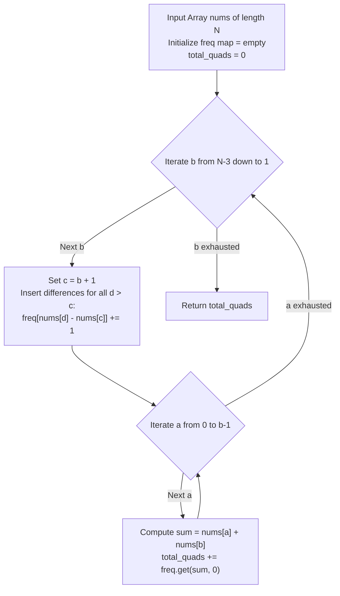

# Guided Example: Count Special Quadruplets

We analyze and trace the meet-in-the-middle frequency balance algorithm on representative integer arrays to enumerate all index quadruplets satisfying $nums[a] + nums[b] + nums[c] = nums[d]$ with $a < b < c < d$ in optimal quadratic time.

- **Primary Instance:** `nums = [1, 1, 1, 3, 5]` ($N = 5$)
  - Expected Output: `4` (the 4 quadruplets are $(0, 1, 2, 3)$, $(0, 1, 3, 4)$, $(0, 2, 3, 4)$, and $(1, 2, 3, 4)$)
- **Secondary Instance:** `nums = [1, 2, 3, 6]` ($N = 4$)
  - Expected Output: `1` (quadruplet $(0, 1, 2, 3)$ with $1 + 2 + 3 = 6$)
- **Zero Solution Instance:** `nums = [3, 3, 6, 4, 5]` ($N = 5$)
  - Expected Output: `0` (no quadruplet satisfies the equality)

---

## 1. Instance & Intuition

We seek the number of index quadruplets $(a, b, c, d)$ such that:
$$0 \le a < b < c < d < N \quad \text{and} \quad nums[a] + nums[b] + nums[c] = nums[d]$$

### The Quadratic Bottleneck of Brute Force
A naive four-loop brute force checks all $\binom{N}{4} = \frac{N(N-1)(N-2)(N-3)}{24}$ index combinations, scaling as $\mathcal{O}(N^4)$. For $N = 50$, this requires $\approx 230,000$ iterations.

### Meet-in-the-Middle Algebraic Transposition
By algebraically rearranging the condition across the boundary between index $b$ and index $c$:
$$nums[a] + nums[b] + nums[c] = nums[d] \iff nums[a] + nums[b] = nums[d] - nums[c]$$

The left side involves indices $a < b$, while the right side involves indices $c < d$. 
If we establish a dynamic partition line between index $b$ and index $c = b + 1$:
- The right-hand difference $nums[d] - nums[c]$ is evaluated for all $d > c$ and accumulated into a frequency map $\text{freq}[\Delta]$.
- The left-hand sum $nums[a] + nums[b]$ is evaluated for all $a < b$ and directly queried against $\text{freq}$.

By iterating the boundary index $b$ backwards from $N-3$ down to $1$:
1. At each step, the newly available $c = b + 1$ introduces new pairs $(c, d)$ for all $d > c$.
2. We add their differences $nums[d] - nums[c]$ into $\text{freq}$.
3. Then for all $a \in [0, b-1]$, the sum $nums[a] + nums[b]$ finds its exact number of matching $(c, d)$ pairs from $\text{freq}$ in $\mathcal{O}(1)$ time.

This drops the total time complexity from $\mathcal{O}(N^4)$ to $\mathcal{O}(N^2)$.

---

## 2. Invariant Architecture & Split Pipeline

---

## 3. Step-by-Step State Evolution

We trace the Primary Instance: `nums = [1, 1, 1, 3, 5]` ($N = 5$).
Indices:
- $nums[0] = 1$
- $nums[1] = 1$
- $nums[2] = 1$
- $nums[3] = 3$
- $nums[4] = 5$

Initialization: $\text{freq} = \{\}$, $\text{total\_quads} = 0$.

---

### Step 1: Boundary Index $b = 2$ ($N - 3 = 5 - 3 = 2$)
Current element: $nums[b] = nums[2] = 1$.

#### Phase A: Populate Differences for $c = b + 1 = 3$ ($nums[3] = 3$)
- $d = 4$ ($nums[4] = 5$):
  - Difference: $nums[d] - nums[c] = 5 - 3 = 2$.
  - Record: $\text{freq}[2] \leftarrow \text{freq}[2] + 1 = 1$.
- Active map: $\text{freq} = \{2: 1\}$.

#### Phase B: Query Left-Hand Sums for $a < 2$
- **$a = 0$ ($nums[0] = 1$):**
  - Sum: $nums[a] + nums[b] = nums[0] + nums[2] = 1 + 1 = 2$.
  - Lookup in $\text{freq}$: $\text{freq}[2] = 1$.
  - Quadruplet identified: $(0, 2, 3, 4)$ where $1 + 1 + 3 = 5$.
  - $\text{total\_quads} \leftarrow 0 + 1 = 1$.
- **$a = 1$ ($nums[1] = 1$):**
  - Sum: $nums[a] + nums[b] = nums[1] + nums[2] = 1 + 1 = 2$.
  - Lookup in $\text{freq}$: $\text{freq}[2] = 1$.
  - Quadruplet identified: $(1, 2, 3, 4)$ where $1 + 1 + 3 = 5$.
  - $\text{total\_quads} \leftarrow 1 + 1 = 2$.

---

### Step 2: Boundary Index $b = 1$
Current element: $nums[b] = nums[1] = 1$.

#### Phase A: Populate Differences for $c = b + 1 = 2$ ($nums[2] = 1$)
- Pairs $(c, d)$ with $d \in \{3, 4\}$:
  - $d = 3$ ($nums[3] = 3$):
    - Difference: $nums[3] - nums[2] = 3 - 1 = 2$.
    - Update: $\text{freq}[2] \leftarrow 1 + 1 = 2$.
  - $d = 4$ ($nums[4] = 5$):
    - Difference: $nums[4] - nums[2] = 5 - 1 = 4$.
    - Update: $\text{freq}[4] \leftarrow 0 + 1 = 1$.
- Active map: $\text{freq} = \{2: 2, \; 4: 1\}$.

#### Phase B: Query Left-Hand Sums for $a < 1$
- **$a = 0$ ($nums[0] = 1$):**
  - Sum: $nums[a] + nums[b] = nums[0] + nums[1] = 1 + 1 = 2$.
  - Lookup in $\text{freq}$: $\text{freq}[2] = 2$.
  - Two matching pairs $(c, d)$ with difference 2:
    - $(c=3, d=4)$ giving quadruplet $(0, 1, 3, 4)$ with $1 + 1 + 3 = 5$.
    - $(c=2, d=3)$ giving quadruplet $(0, 1, 2, 3)$ with $1 + 1 + 1 = 3$.
  - $\text{total\_quads} \leftarrow 2 + 2 = 4$.

---

### Termination
Boundary index $b$ has reached 1. No smaller $b \ge 1$ exists.
The total number of special quadruplets is **4**.

---

## 4. Complete Execution Trace

### Step Trace Table for Primary Instance

| Step ($b$) | Pivot $nums[b]$ | New $c = b + 1$ | Added Differences $nums[d] - nums[c]$ | Frequency State $\text{freq}$ | Searched $a$ | Sum $nums[a] + nums[b]$ | Count Added | Cumulative Total |
|---|---|---|---|---|---|---|---|---|
| $b = 2$ | $nums[2] = 1$ | $c = 3$ ($3$) | $(d=4): 5 - 3 = 2$ | $\{2: 1\}$ | $a = 0$ ($1$) $a = 1$ ($1$) | $1 + 1 = 2$ $1 + 1 = 2$ | $+1$ $+1$ | 2 |
| $b = 1$ | $nums[1] = 1$ | $c = 2$ ($1$) | $(d=3): 3 - 1 = 2$ $(d=4): 5 - 1 = 4$ | $\{2: 2, 4: 1\}$ | $a = 0$ ($1$) | $1 + 1 = 2$ | $+2$ | 4 |

### Secondary Instance Trace: `nums = [1, 2, 3, 6]` ($N = 4$)

| Boundary $b$ | $c = b + 1$ | $d$ | Difference $nums[d] - nums[c]$ | Frequency Map | Query $a$ | Sum $nums[a] + nums[b]$ | Found? | Quadruplet |
|---|---|---|---|---|---|---|---|---|
| $b = 1$ ($2$) | $c = 2$ ($3$) | $d = 3$ ($6$) | $6 - 3 = 3$ | $\{3: 1\}$ | $a = 0$ ($1$) | $1 + 2 = 3$ | Yes (1) | $(0, 1, 2, 3)$ |

Final Output: **1**.

---

## 5. Algorithmic Correctness & Soundness

1. **Strict Index Ordering $a < b < c < d$:**
   In every iteration of $b$, $c$ is set to $b + 1$ and $d$ ranges over $[c+1, N-1]$, guaranteeing $b < c < d$. The inner query loop evaluates $a \in [0, b-1]$, guaranteeing $a < b$. Thus, any matched combination $(a, b, c, d)$ satisfies $a < b < c < d$ by construction.

2. **Algebraic Equivalence:**
   The equation $nums[a] + nums[b] + nums[c] = nums[d]$ is algebraically identical to $nums[a] + nums[b] = nums[d] - nums[c]$ under standard integer arithmetic.

3. **Exhaustive and Disjoint Enumeration:**
   Every valid quadruplet $(a^*, b^*, c^*, d^*)$ has a unique second index $b^*$. When the outer loop visits $b = b^*$, all pairs $(c, d)$ with $c > b^*$ have already been added to $\text{freq}$, including $(c^*, d^*)$ (which was added when the loop was at $b = c^* - 1$). The query loop evaluates $a = a^*$ exactly once, registering the match. No quadruplet is counted under any other $b$, precluding duplicate counts.

---

## 6. Traps This Instance Exposes

- **Quadruplet Ordering Violation:** Attempting to count without enforcing $a < b < c < d$ leads to permutations of the same index multiset being counted multiple times.
- **Duplicate Value Collisions:** Multiple distinct index quadruplets can share the exact same numeric values (as in `[1, 1, 1, 3, 5]`, where indices 0, 1, and 2 all hold value `1`). The algorithm counts distinct **index sets**, not value sets.
- **Forward vs. Backward Boundary Scan:** If $b$ is incremented forward, maintaining the active set of $(c, d)$ pairs requires clearing or recomputing the frequency map. Scanning $b$ backward allows cumulative additive insertion of $(c, d)$ pairs without any eviction logic.
- **Negative Differences:** While $nums[i] \ge 1$, the difference $nums[d] - nums[c]$ can be zero or negative. A hash map or offset array cleanly accommodates arbitrary signs.

---

## 7. Complexity Analysis

- **Time Complexity:**
  - **Outer Loop ($b$):** Runs $N - 3$ iterations.
  - **Insertion Phase ($c = b + 1$):** Evaluates $d$ from $c + 1$ to $N - 1$, taking $\mathcal{O}(N - c) = \mathcal{O}(N)$ map updates.
  - **Query Phase ($a$):** Evaluates $a$ from $0$ to $b - 1$, taking $\mathcal{O}(b) = \mathcal{O}(N)$ map queries.
  - **Total Operations:** $\sum_{b=1}^{N-3} \Big( (N - b - 1) + b \Big) = \sum_{b=1}^{N-3} (N - 1) = \mathcal{O}(N^2)$.
  - For $N = 50$, total operations are roughly $\approx 1200$, executing in under 0.1 milliseconds.

- **Auxiliary Space Complexity:**
  - The frequency table stores differences $nums[d] - nums[c]$. With $nums[i] \le 100$, differences lie in $[-99, 99]$.
  - The map holds at most 200 distinct entries.
  - **Total Auxiliary Space:** $\mathcal{O}(\min(N^2, V))$ where $V \le 200$, consuming negligible memory.
