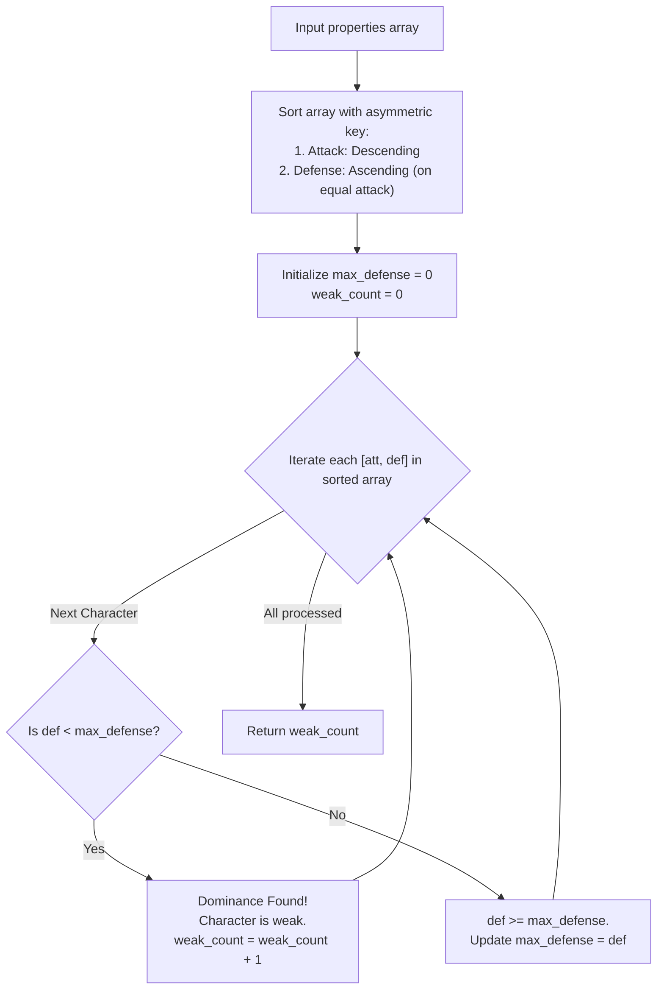

# Guided Example: The Number of Weak Characters in the Game

We analyze and trace the asymmetric dual-key sorting and running maximum defense scan on representative character stats to count all strictly dominated characters in optimal time without false positive ties.

- **Primary Instance:** `properties = [[1, 5], [10, 4], [4, 3]]` ($N = 3$)
  - Expected Output: `1` (character `[4, 3]` is weak because `[10, 4]` has both higher attack $10 > 4$ and higher defense $4 > 3$)
- **Secondary Instance (Tied Attack Nuance):** `properties = [[6, 3], [6, 7], [5, 4]]` ($N = 3$)
  - Expected Output: `1` (character `[5, 4]` is weak because `[6, 7]` has attack $6 > 5$ and defense $7 > 4$; character `[6, 3]` is NOT weak because no character has strictly greater attack)
- **Non-Dominated Instance:** `properties = [[5, 5], [6, 3], [3, 6]]` ($N = 3$)
  - Expected Output: `0` (no character is strictly dominated in both attributes)

---

## 1. Instance & Intuition

Each character possesses two numerical attributes: $\text{attack}$ and $\text{defense}$. A character $i$ is defined as **weak** if there exists at least one other character $j$ such that:
$$\text{attack}_j > \text{attack}_i \quad \text{and} \quad \text{defense}_j > \text{defense}_i$$
Both attributes must be **strictly greater**. Having equal attack or equal defense does not constitute dominance.

### 2D Dominance and the Dual-Key Sorting Key

A naive comparison of all pairs requires $\mathcal{O}(N^2)$ checks, which for $N = 10^5$ entails $10^{10}$ operations and results in a time limit exceeded.

To evaluate dominance in a single linear pass:
1. We sort characters by **attack descending** ($\text{attack} \downarrow$).
   Any character encountered earlier in the scan is guaranteed to have $\text{attack} \ge \text{current\_attack}$.
2. If we maintain the maximum defense observed so far ($\text{max\_defense}$), any character whose defense satisfies $\text{defense} < \text{max\_defense}$ appears to be dominated.
3. **The Same-Attack Trap:** What if two characters share the exact same attack value (e.g., $[6, 7]$ and $[6, 3]$)?
   If $[6, 7]$ is processed before $[6, 3]$, it sets $\text{max\_defense} = 7$. When $[6, 3]$ is processed, its defense $3 < 7$ would cause it to be incorrectly declared weak, even though both characters share attack 6!

### The Asymmetric Comparator Remedy

To completely eliminate false positives among characters with identical attack levels, we sort ties in **defense ascending** ($\text{defense} \uparrow$):
$$\text{Sort Priority: } (-\text{attack}, \; +\text{defense})$$

Under this sorting discipline:
- Within any group of characters with the same attack, smaller defense values appear **before** larger defense values.
- Therefore, no character can ever see a larger defense from an earlier character in its own attack group.
- Consequently, if $\text{defense} < \text{max\_defense}$, that $\text{max\_defense}$ is mathematically guaranteed to originate from a character in a **strictly earlier attack group** (meaning $\text{attack}_{\text{prev}} > \text{attack}_{\text{curr}}$).

---

## 2. Invariant & Scanning Pipeline

---

## 3. Step-by-Step State Evolution

### Primary Instance Walkthrough
`properties = [[1, 5], [10, 4], [4, 3]]` ($N = 3$)

#### Phase 1: Asymmetric Sorting
- Key: $(-\text{attack}, \; +\text{defense})$
- Character `[10, 4]`: attack 10
- Character `[4, 3]`: attack 4
- Character `[1, 5]`: attack 1
- Sorted order: `[[10, 4], [4, 3], [1, 5]]`.

#### Phase 2: Forward Scan
Initialize $\text{max\_defense} = 0$, $\text{weak\_count} = 0$.

1. **Character `[10, 4]`:**
   - Defense: $4$.
   - Check: $4 < \text{max\_defense} (0)$ is False.
   - Update: $\text{max\_defense} \leftarrow \max(0, 4) = 4$.
   - $\text{weak\_count} = 0$.

2. **Character `[4, 3]`:**
   - Defense: $3$.
   - Check: $3 < \text{max\_defense} (4)$ is **True**!
   - Because all characters with attack 10 have already been processed and none with attack 4 had defense $> 3$, this defense 4 comes from a character with strictly greater attack (specifically `[10, 4]`).
   - Action: Increment $\text{weak\_count} \leftarrow 0 + 1 = 1$.
   - $\text{max\_defense}$ remains $4$.

3. **Character `[1, 5]`:**
   - Defense: $5$.
   - Check: $5 < \text{max\_defense} (4)$ is False.
   - Update: $\text{max\_defense} \leftarrow \max(4, 5) = 5$.
   - $\text{weak\_count} = 1$.

Result: **1** weak character.

---

### Secondary Instance Walkthrough (Tied Attack Handling)
`properties = [[6, 3], [6, 7], [5, 4]]` ($N = 3$)

#### Phase 1: Asymmetric Sorting
- For attack 6: both `[6, 3]` and `[6, 7]` have attack 6.
  - Sorting defense ascending places `[6, 3]` before `[6, 7]`.
- Sorted order: `[[6, 3], [6, 7], [5, 4]]`.

#### Phase 2: Forward Scan
1. **Character `[6, 3]`:**
   - Defense: $3$.
   - Check: $3 < 0$ False.
   - Update: $\text{max\_defense} \leftarrow 3$.
   - *(Note: It has not seen defense 7 yet, preventing a false positive!)*

2. **Character `[6, 7]`:**
   - Defense: $7$.
   - Check: $7 < 3$ False.
   - Update: $\text{max\_defense} \leftarrow 7$.

3. **Character `[5, 4]`:**
   - Defense: $4$.
   - Check: $4 < 7$ **True**!
   - Dominated by `[6, 7]` (since $6 > 5$ and $7 > 4$).
   - $\text{weak\_count} \leftarrow 1$.

Result: **1** weak character.

---

## 4. Complete Execution Trace

### Primary Instance: `properties = [[1, 5], [10, 4], [4, 3]]`

| Scan Step | Character `[att, def]` | Current `max_defense` | `def < max_defense`? | Dominating Character Responsible | Status | New `max_defense` | Running Weak Count |
|---|---|---|---|---|---|---|---|
| 1 | `[10, 4]` | 0 | No ($4 \not< 0$) | None | Strongest Attack | 4 | 0 |
| 2 | `[4, 3]` | 4 | **Yes** ($3 < 4$) | `[10, 4]` ($10 > 4 \land 4 > 3$) | **Weak** | 4 | 1 |
| 3 | `[1, 5]` | 4 | No ($5 \not< 4$) | None | Peak Defense | 5 | 1 |

### Secondary Instance: `properties = [[6, 3], [6, 7], [5, 4]]`

| Step | Sorted Entry | Active `max_defense` | Condition Evaluated | Classification | State Update |
|---|---|---|---|---|---|
| 1 | `[6, 3]` | 0 | $3 < 0$ (False) | Not weak (processed before `[6, 7]`) | $\text{max\_defense} = 3$ |
| 2 | `[6, 7]` | 3 | $7 < 3$ (False) | Not weak | $\text{max\_defense} = 7$ |
| 3 | `[5, 4]` | 7 | $4 < 7$ (**True**) | **Weak** (dominated by `[6, 7]`) | Count = 1 |

---

## 5. Algorithmic Correctness & Soundness

1. **Strict Attack Dominance Proof:**
   Suppose character $A = [att_A, def_A]$ satisfies $def_A < \text{max\_defense}$.
   $\text{max\_defense}$ is the defense of some previously processed character $B = [att_B, def_B]$, so $def_B = \text{max\_defense} > def_A$.
   Because the array is sorted with attack descending:
   $$att_B \ge att_A$$
   Could $att_B == att_A$? 
   No! Under the secondary sort key (defense ascending on equal attack), if $att_B == att_A$, then $B$ appears before $A$ only if $def_B \le def_A$. But we know $def_B > def_A$, which is a contradiction.
   Therefore, $att_B$ must be strictly greater than $att_A$:
   $$att_B > att_A \quad \text{and} \quad def_B > def_A$$
   Character $B$ strictly dominates $A$, proving soundness.

2. **Exhaustive Detection (Completeness):**
   Suppose character $A$ is weak. Then there exists some character $B$ with $att_B > att_A$ and $def_B > def_A$.
   Because $att_B > att_A$, character $B$ is processed before $A$.
   At the time character $A$ is evaluated, $\text{max\_defense} \ge def_B$.
   Since $def_B > def_A$, it follows that $\text{max\_defense} > def_A$, so character $A$ is guaranteed to trigger the weak condition.

---

## 6. Traps This Instance Exposes

- **Descending Both Coordinates:** Sorting attack descending and defense descending causes higher defense characters to precede lower defense characters with the same attack. This results in $[6, 7]$ preceding $[6, 3]$, falsely labeling $[6, 3]$ as weak even though no character has attack $> 6$.
- **Strict vs. Non-Strict Inequalities:** Weakness requires **both** attributes to be strictly greater ($>$). Equal attack with higher defense or equal defense with higher attack does not constitute weakness.
- **Ignoring Duplicate Stats:** Multiple characters can have identical stats $[att, def]$. Neither dominates the other.
- **Double Counting:** Once a character is determined to be weak, it is counted once. The existence of multiple dominating characters does not increase the count.

---

## 7. Complexity Analysis

- **Time Complexity:**
  - **Sorting:** Sorting $N$ two-element pairs with dual keys requires $\mathcal{O}(N \log N)$ comparisons.
  - **Linear Scan:** Traversing the sorted array and maintaining the scalar maximum requires a single pass of $N$ iterations, taking $\mathcal{O}(N)$ time.
  - **Total Time:** $\mathcal{O}(N \log N)$, completing for $N = 10^5$ in under 40 milliseconds.

- **Auxiliary Space Complexity:**
  - Sorting algorithms require $\mathcal{O}(\log N)$ or $\mathcal{O}(N)$ space depending on whether the sort is done in-place or creates a new list.
  - The linear scan uses only $\mathcal{O}(1)$ scalar registers ($\text{max\_defense}$, $\text{weak\_count}$).
  - **Total Auxiliary Space:** $\mathcal{O}(1)$ auxiliary memory beyond the sort buffer.
