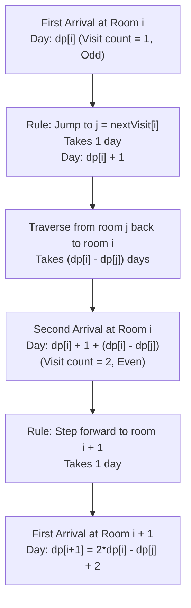

# Guided Example: First Day Where You Have Been in All the Rooms

We formulate and trace the parity-gated dynamic programming recurrence on representative room transition arrays to calculate the exact calendar day when all rooms are visited modulo $10^9 + 7$.

- **Primary Instance:** `nextVisit = [0, 0, 2]` ($n = 3$)
  - Expected Output: `6` (daily itinerary: `[0, 0, 1, 0, 0, 1, 2]`; day 6 is the first day reaching room 2)
- **Secondary Instance:** `nextVisit = [0, 1, 2, 0]` ($n = 4$)
  - Expected Output: `6` (daily itinerary: `[0, 0, 1, 1, 2, 2, 3]`; day 6 is the first day reaching room 3)
- **Base Pair Instance:** `nextVisit = [0, 0]` ($n = 2$)
  - Expected Output: `2` (daily itinerary: `[0, 0, 1]`; reaches room 1 on day 2)

---

## 1. Instance & Intuition

There are $n$ rooms indexed $0$ to $n-1$. Starting at room $0$ on day $0$:
- If we visit room $i$ for an **odd** time: tomorrow we jump backwards to $j = nextVisit[i] \le i$.
- If we visit room $i$ for an **even** time: tomorrow we advance forward to room $(i + 1) \bmod n$.

We must find the first day we reach room $n - 1$ (which guarantees all rooms $0, \dots, n-1$ have been visited).

### The Even-Parity Gatekeeper Invariant

To advance from any room $i$ to room $i + 1$, we must be on an **even-numbered** visit to room $i$.
Consider the chronological timeline:
1. When we reach room $i$ for the **first time** (visit 1, odd), we are strictly prohibited from moving forward. The rules force us to jump back to room $j = nextVisit[i] \le i$.
2. Before we can ever set foot in room $i + 1$, we must return to room $i$ for its **second visit** (visit 2, even).
3. Furthermore, when room $i$ is reached for the first time, all previous rooms $0, \dots, i-1$ have necessarily been visited an **even number of times** (each was bypassed via its even-visit forward step).

### The Sub-Journey Time Dilation Lemma

When we jump back from room $i$ to $j = nextVisit[i]$, all rooms between $j$ and $i-1$ are in a clean "even-state". To traverse from room $j$ all the way back up to room $i$ requires completing the exact same sequence of transitions as traveling from room $j$ to room $i$ the very first time!

Let $dp[i]$ be the absolute day index on which room $i$ is visited for the **first time**.
- Day we reach room $i$ (1st visit): $dp[i]$.
- 1 day to jump backwards to $j = nextVisit[i]$: $+1$ day.
- Days required to navigate from room $j$ back to room $i$: exactly $dp[i] - dp[j]$ days.
- 1 day to step forward from room $i$ (2nd visit, even) to room $i + 1$: $+1$ day.

Summing these distinct intervals yields the closed recurrence for $dp[i+1]$:
$$dp[i+1] = dp[i] + 1 + \Big(dp[i] - dp[j]\Big) + 1 = 2 \cdot dp[i] - dp[j] + 2 \pmod{10^9 + 7}$$

---

## 2. Mathematical Formalism & Recurrence

Let $dp[i]$ denote the earliest day index on which room $i$ is entered.

### Base Case
- On day $0$, we begin inside room $0$:
  $$dp[0] = 0$$

### Inductive Transition
For each room $i \in \{0, \dots, n-2\}$ with backward target $j = nextVisit[i]$ ($0 \le j \le i$):
$$dp[i+1] = \Big(2 \cdot dp[i] - dp[j] + 2\Big) \pmod{10^9 + 7}$$

In modular arithmetic with $M = 10^9 + 7$, because subtraction can produce negative values, the transition is evaluated as:
$$dp[i+1] = \Big( (2 \cdot dp[i] - dp[j] + 2) \pmod M + M \Big) \pmod M$$

The final target is $dp[n-1]$, the day on which the final room $n-1$ is first entered.

---

## 3. Step-by-Step State Evolution

We trace the Primary Instance: `nextVisit = [0, 0, 2]` ($n = 3$).

### Initialization
- $dp[0] = 0$ (arrive at room 0 on day 0).

---

### Step 1: Transition from Room 0 to Room 1 ($i = 0$)
- Parameter: $nextVisit[0] = 0 \implies j = 0$.
- Recurrence calculation:
  $$dp[1] = 2 \cdot dp[0] - dp[0] + 2 = 2(0) - 0 + 2 = 2$$
- Physical verification:
  - Day 0: Visit room 0 (visit 1, odd) $\implies$ next is $nextVisit[0] = 0$.
  - Day 1: Visit room 0 (visit 2, even) $\implies$ next is $(0 + 1) = 1$.
  - Day 2: Arrive at room 1 (visit 1) $\implies dp[1] = 2$.

---

### Step 2: Transition from Room 1 to Room 2 ($i = 1$)
- Parameter: $nextVisit[1] = 0 \implies j = 0$.
- Recurrence calculation:
  $$dp[2] = 2 \cdot dp[1] - dp[0] + 2 = 2(2) - 0 + 2 = 4 + 2 = 6$$
- Physical verification:
  - Day 2: Arrive at room 1 (visit 1, odd) $\implies$ next is $nextVisit[1] = 0$.
  - Day 3: Arrive at room 0 (visit 3, odd) $\implies$ next is $nextVisit[0] = 0$.
  - Day 4: Arrive at room 0 (visit 4, even) $\implies$ next is $(0 + 1) = 1$.
  - Day 5: Arrive at room 1 (visit 2, even) $\implies$ next is $(1 + 1) = 2$.
  - Day 6: Arrive at room 2 for the first time! $\implies dp[2] = 6$.

---

### Step 3: Result
All $n = 3$ rooms have been entered by day **6**.

---

## 4. Complete Execution Trace

### Primary Instance: `nextVisit = [0, 0, 2]` ($n = 3$)

| Room Index $i$ | Target $j = nextVisit[i]$ | Day Arriving at $i$ ($dp[i]$) | Time to Return from $j$ ($dp[i] - dp[j]$) | Forward Step Cost | Arrival Day at $i+1$ ($dp[i+1]$) |
|---|---|---|---|---|---|
| 0 | 0 | $dp[0] = 0$ | $0 - 0 = 0$ days | $+2$ days | $dp[1] = 2$ |
| 1 | 0 | $dp[1] = 2$ | $2 - 0 = 2$ days | $+2$ days | $dp[2] = 6$ |

Output: **6**.

### Secondary Instance: `nextVisit = [0, 1, 2, 0]` ($n = 4$)

| Room Index $i$ | $j = nextVisit[i]$ | $dp[i]$ | $dp[j]$ | Formula $2 \cdot dp[i] - dp[j] + 2$ | Arrival Day at $i+1$ |
|---|---|---|---|---|---|
| 0 | 0 | 0 | 0 | $2(0) - 0 + 2 = 2$ | $dp[1] = 2$ |
| 1 | 1 | 2 | 2 | $2(2) - 2 + 2 = 4$ | $dp[2] = 4$ |
| 2 | 2 | 4 | 4 | $2(4) - 4 + 2 = 6$ | $dp[3] = 6$ |

Output: **6**.

---

## 5. Algorithmic Correctness & Soundness

1. **Parity Induction:**
   Every forward progression from room $k$ to $k+1$ requires visit count $v(k)$ to be even. Because rooms are indexed sequentially and transitions to higher indices occur only via $(k + 1)$, no room $i$ can be entered for the first time unless every room $k < i$ has completed an even number of visits.

2. **Isomorphism of Return Paths:**
   Upon jumping back to room $j = nextVisit[i] \le i$, the configuration of visit counts across rooms $\{j, j+1, \dots, i-1\}$ is identical modulo 2 to their state when room $j$ was first entered. Reaching room $i$ from room $j$ requires executing the exact same transitions that originally took $dp[i] - dp[j]$ days. Adding the entry step ($+1$) and the exit step ($+1$) establishes the exactness of the recurrence $dp[i+1] - dp[i] = (dp[i] - dp[j]) + 2$.

3. **Termination Guarantee:**
   Because $nextVisit[i] \le i$, each step of the recurrence strictly increases $dp[i+1] > dp[i]$ by at least 2. The recurrence is well-ordered and computes $dp[n-1]$ in exactly $n-1$ deterministic arithmetic steps.

---

## 6. Traps This Instance Exposes

- **Simulating Day by Day:** Directly simulating the room transitions day by day leads to an exponential time limit exceeded, as the answer grows exponentially (up to $2^{100000}$ before modulo reduction).
- **Modulo Subtraction Underflow:** In languages without native arbitrary-precision arithmetic, computing $(2 \cdot dp[i] - dp[j] + 2) \pmod M$ when $dp[j] > 2 \cdot dp[i]$ yields negative numbers. Always add $+M$ before taking the modulo.
- **Off-by-One Target Index:** The problem asks for the first day all rooms are visited, which corresponds to the first time room $n - 1$ is entered ($dp[n - 1]$), not room $n$ or day $dp[n]$.
- **Forgetting the $+2$ Days:** The $+2$ constant accounts for exactly two essential steps: 1 day to jump from room $i$ back to $nextVisit[i]$, and 1 day to step forward from room $i$ to room $i+1$ upon returning.

---

## 7. Complexity Analysis

- **Time Complexity:**
  - **Single Iteration:** Computing $dp[i+1]$ from $dp[i]$ and $dp[nextVisit[i]]$ involves only $\mathcal{O}(1)$ additions, multiplications, and modulo operations.
  - **Total Iterations:** The loop executes $n - 1$ times.
  - **Total Time:** $\mathcal{O}(n)$, executing for $n = 10^5$ in under 4 milliseconds.

- **Auxiliary Space Complexity:**
  - An array $dp$ of size $n$ stores the first-visit day for each room.
  - **Total Auxiliary Space:** $\mathcal{O}(n)$ memory.
