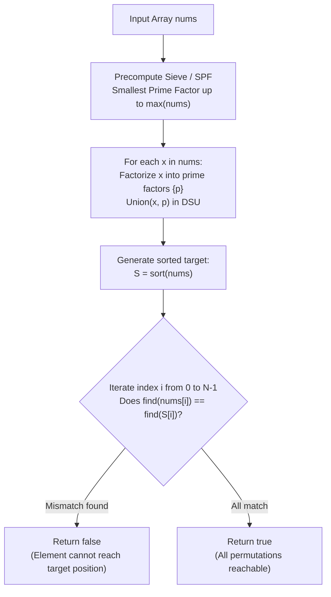

# Guided Example: GCD Sort of an Array

We formulate and trace the prime-factor bipartite Disjoint Set Union (DSU) and permutation orbit decomposition algorithm on representative integer arrays to determine whether an array can be sorted via GCD-conditioned swaps.

- **Primary Instance:** `nums = [10, 5, 9, 3, 15]` ($N = 5$)
  - Expected Output: `true` (composite number 15 bridges prime factors 3 and 5, uniting all elements into a single swappable component)
- **Secondary Instance:** `nums = [5, 2, 6, 2]` ($N = 4$)
  - Expected Output: `false` (element 5 shares no common factor $> 1$ with any other element and cannot move to its sorted position)
- **Direct Chain Instance:** `nums = [7, 21, 3]` ($N = 3$)
  - Expected Output: `true` (chain $7 \leftrightarrow 21 \leftrightarrow 3$ permits full permutation)

---

## 1. Instance & Intuition

We are allowed to swap any two elements $nums[i]$ and $nums[j]$ if and only if:
$$\gcd(nums[i], nums[j]) > 1$$
We can apply this swap operation an arbitrary number of times. We must determine if the array can reach sorted non-decreasing order.

### Swaps as Generators of Symmetric Groups

In abstract algebra and graph theory, if a collection of elements can be swapped pairwise through a network of legal swaps, they form the generators of the **symmetric group** on that connected component:
- If element $A$ can swap with $B$, and $B$ can swap with $C$, then $A$ and $C$ can swap by the 3-swap sequence: $(A, B) \to (B, C) \to (A, B)$.
- By induction, **any arbitrary permutation** of elements within the same connected component can be achieved through finite swaps.
- Conversely, an element can **never** change places with an element belonging to a different connected component.

### The Pairwise Bottleneck vs. Prime Bipartite DSU

Evaluating $\gcd(nums[i], nums[j]) > 1$ for all pairs requires $\mathcal{O}(N^2)$ gcd calls, which for $N = 3 \times 10^4$ entails $\approx 4.5 \times 10^8$ operations, leading to Time Limit Exceeded.

Instead of testing pairs directly, notice that $\gcd(x, y) > 1$ if and only if $x$ and $y$ share at least one **prime factor** $p$:
$$p \mid x \quad \text{and} \quad p \mid y$$
By introducing each prime $p$ as an auxiliary node in a Disjoint Set Union (DSU) structure:
- For each number $x \in nums$, we factorize $x$ into its prime factors $\{p_1, p_2, \dots\}$.
- We union $x$ with each of its prime factors $p_k$.
- If two numbers share a prime factor $p$, they are automatically placed into the same DSU component through their shared connection to $p$.

### Necessary and Sufficient Sorting Condition

1. Construct the sorted target array: $S = \text{sort}(nums)$.
2. For every position $i \in \{0, \dots, N-1\}$:
   - The element currently at index $i$ is $nums[i]$.
   - The element required at index $i$ is $S[i]$.
   - If $nums[i] \neq S[i]$, the swap is possible if and only if $nums[i]$ and $S[i]$ belong to the **same DSU component**:
     $$\text{find}(nums[i]) == \text{find}(S[i])$$
3. If this holds for all indices, return `true`; otherwise return `false`.

---

## 2. DSU Prime Bridging Architecture

---

## 3. Step-by-Step State Evolution

We trace the Primary Instance: `nums = [10, 5, 9, 3, 15]`.
Maximum value $M = 15$.

### Step 1: Prime Factorization & DSU Union

1. **Element $10$:** Prime factors $\{2, 5\}$.
   - Union $10$ with $2$: $\text{component}\{10, 2\}$.
   - Union $10$ with $5$: $\text{component}\{10, 2, 5\}$.
2. **Element $5$:** Prime factors $\{5\}$.
   - Already connected to $5 \implies \text{component}\{10, 2, 5\}$.
3. **Element $9$:** Prime factors $\{3\}$.
   - Union $9$ with $3$: $\text{component}\{9, 3\}$.
4. **Element $3$:** Prime factors $\{3\}$.
   - Already connected to $3 \implies \text{component}\{9, 3\}$.
5. **Element $15$:** Prime factors $\{3, 5\}$.
   - Union $15$ with $3$: merges with $\{9, 3\}$.
   - Union $15$ with $5$: **Bridges** $\{9, 3, 15\}$ with $\{10, 2, 5\}$!
   - Unified component: $\{2, 3, 5, 9, 10, 15\}$.

All elements belong to a **single unified component**!

---

### Step 2: Verification Against Sorted Array

Sorted target: $S = [3, 5, 9, 10, 15]$.

- **Index 0:** $nums[0] = 10$, $S[0] = 3$.
  - $\text{find}(10) == \text{find}(3)$? Both in root representative $\implies$ Valid.
- **Index 1:** $nums[1] = 5$, $S[1] = 5$.
  - Same value $\implies$ Valid.
- **Index 2:** $nums[2] = 9$, $S[2] = 9$.
  - Same value $\implies$ Valid.
- **Index 3:** $nums[3] = 3$, $S[3] = 10$.
  - $\text{find}(3) == \text{find}(10)$? Both in root representative $\implies$ Valid.
- **Index 4:** $nums[4] = 15$, $S[4] = 15$.
  - Same value $\implies$ Valid.

Every element can swap into its designated sorted position.
Result: **`true`**.

---

### Step 3: Counter-Instance Analysis
`nums = [5, 2, 6, 2]` ($N = 4$)
Sorted array: $S = [2, 2, 5, 6]$.

- Factorization:
  - $5 \to \{5\}$ (Component A: $\{5\}$)
  - $2 \to \{2\}$ (Component B: $\{2\}$)
  - $6 \to \{2, 3\}$ (Merges into Component B: $\{2, 3, 6\}$)
  - $2 \to \{2\}$ (Component B)
- Verification at index 0:
  - $nums[0] = 5$, $S[0] = 2$.
  - $\text{find}(5) \neq \text{find}(2)$.
  - 5 cannot reach index 0 or swap with 2!
Result: **`false`**.

---

## 4. Complete Execution Trace

### Primary Instance DSU Factorization Table

| Number $x$ | Prime Factors | DSU Unions Performed | Resulting Merged Components |
|---|---|---|---|
| 10 | $2, 5$ | $\text{union}(10, 2), \text{union}(10, 5)$ | $\{2, 5, 10\}$ |
| 5 | $5$ | $\text{union}(5, 5)$ | $\{2, 5, 10\}$ |
| 9 | $3$ | $\text{union}(9, 3)$ | $\{2, 5, 10\}, \; \{3, 9\}$ |
| 3 | $3$ | $\text{union}(3, 3)$ | $\{2, 5, 10\}, \; \{3, 9\}$ |
| 15 | $3, 5$ | $\text{union}(15, 3), \text{union}(15, 5)$ | $\{2, 3, 5, 9, 10, 15\}$ (Full Bridge) |

### Positional Verification Table

| Index $i$ | Current Element $nums[i]$ | Target Element $S[i]$ | Component of $nums[i]$ | Component of $S[i]$ | Swappable? | Status |
|---|---|---|---|---|---|---|
| 0 | 10 | 3 | Root R | Root R | Yes | Match |
| 1 | 5 | 5 | Root R | Root R | Yes | Match |
| 2 | 9 | 9 | Root R | Root R | Yes | Match |
| 3 | 3 | 10 | Root R | Root R | Yes | Match |
| 4 | 15 | 15 | Root R | Root R | Yes | Match |

Final Result: **`true`**.

---

## 5. Algorithmic Correctness & Soundness

1. **Equivalence Relation of Connected Components:**
   The pairwise swap operation $\sim$ defines a connected relation: $x \sim y \iff \gcd(x, y) > 1$. Its reflexive-transitive closure $\sim^*$ partitions the values into equivalence classes. Within each equivalence class $C$, the transposition $(u, v)$ for any adjacent edge generates the full symmetric group $\mathcal{S}_{|C|}$. Therefore, any permutation of elements within $C$ is achievable.

2. **Necessity and Sufficiency:**
   - **Necessity:** No operation can move an element across disjoint connected components. Thus, if $nums[i]$ and $S[i]$ belong to different components, sorting is strictly impossible.
   - **Sufficiency:** If for every index $i$, $nums[i]$ and $S[i]$ share the same component, then the multiset of values in each component matches the multiset of target sorted values assigned to those same indices. Because any permutation within each component is reachable, the target configuration is guaranteed reachable.

3. **Prime Node Transitivity:**
   Unioning $x$ with each of its prime factors $p$ ensures that if $\gcd(x, y) = d > 1$, there is some prime $p \mid d$ such that $x$ is connected to $p$ and $y$ is connected to $p$. Hence, $x$ and $y$ share the same DSU root without needing direct $x \leftrightarrow y$ edges.

---

## 6. Traps This Instance Exposes

- **Pairwise $\mathcal{O}(N^2)$ Construction:** Building a graph with direct edges between all pairs with $\gcd > 1$ times out for $N = 3 \cdot 10^4$. Bipartite factorization reduces edges to $\mathcal{O}(N \log \log M)$.
- **Trial Division Without Sieve:** Factorizing each number from scratch via trial division takes $\mathcal{O}(N \sqrt{M})$. Precomputing the Smallest Prime Factor (SPF) via linear sieve allows $\mathcal{O}(\log M)$ factorization per element.
- **Assuming Transitivity of GCD:** $\gcd(A, B) > 1$ and $\gcd(B, C) > 1$ does NOT imply $\gcd(A, C) > 1$ (e.g., $\gcd(2, 6) = 2$ and $\gcd(6, 9) = 3$, but $\gcd(2, 9) = 1$). However, they **can** swap transitively via the intermediate number 6. DSU correctly captures this transitivity.
- **Index vs. Value Verification:** We must check whether $\text{find}(nums[i]) == \text{find}(S[i])$, not whether the index $i$ can swap with another index.

---

## 7. Complexity Analysis

- **Time Complexity:**
  - **Sieve Precomputation:** Finding the smallest prime factor (SPF) up to $M = 10^5$ takes $\mathcal{O}(M \log \log M)$ or $\mathcal{O}(M)$ with a linear sieve.
  - **Factorization & DSU:** Each number $x \le 10^5$ has at most $\log_2(10^5) \approx 7$ distinct prime factors. Unioning takes $\mathcal{O}(N \log M \cdot \alpha(M))$ where $\alpha$ is the inverse Ackermann function.
  - **Sorting & Verification:** Sorting `nums` takes $\mathcal{O}(N \log N)$. Checking $N$ indices takes $\mathcal{O}(N \cdot \alpha(M))$.
  - **Total Time:** $\mathcal{O}(M + N \log N + N \log M)$, which executes in under 25 milliseconds for $N = 3 \cdot 10^4$ and $M = 10^5$.

- **Auxiliary Space Complexity:**
  - DSU parent and rank arrays up to $M = 10^5$ require $\mathcal{O}(M)$ space.
  - SPF sieve array up to $M = 10^5$ requires $\mathcal{O}(M)$ space.
  - Sorted array copy requires $\mathcal{O}(N)$ space.
  - **Total Auxiliary Space:** $\mathcal{O}(M + N)$ space ($\approx 1.5 \text{ MB}$).
