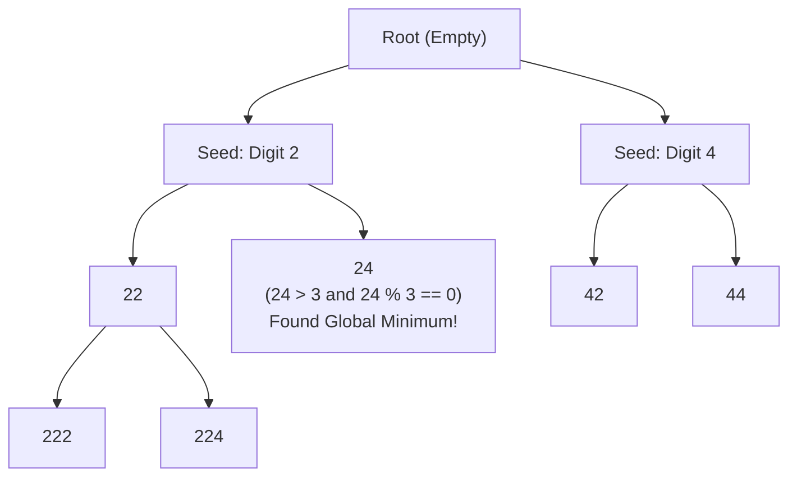

# Guided Example: Smallest Greater Multiple Made of Two Digits

We analyze and trace the monotonic radix-tree Breadth-First Search (BFS) algorithm to discover the smallest integer strictly greater than $k$, divisible by $k$, and composed solely of two specified decimal digits within signed 32-bit integer limits.

- **Primary Instance:** $k = 3, digit1 = 4, digit2 = 2$
  - Expected Output: `24` (candidate progression: `2`, `4`, `22`, `24`; $24 > 3$ and $24 \equiv 0 \pmod 3$)
- **Secondary Instance:** $k = 2, digit1 = 0, digit2 = 2$
  - Expected Output: `20` (first valid candidate with non-zero leading digit is `20`, which is $> 2$ and divisible by 2)
- **Zero-Only Degenerate Instance:** $k = 2, digit1 = 0, digit2 = 0$
  - Expected Output: `-1` (no positive integer can be constructed)

---

## 1. Instance & Intuition

Given an integer $k \ge 1$ and two decimal digits $digit1, digit2 \in \{0, \dots, 9\}$, we must construct the smallest integer $X$ satisfying four concurrent requirements:
1. **Strict Inequality:** $X > k$.
2. **Divisibility:** $X \pmod k == 0$.
3. **Alphabet Restriction:** The decimal representation of $X$ consists **only** of the digits $digit1$ and/or $digit2$ (with no leading zeros).
4. **Bitwidth Constraint:** $X \le 2^{31} - 1 = 2,147,483,647$. If no such integer exists, return $-1$.

### Why Bounded Search Space Makes BFS Optimal

Because $X$ is constrained by the maximum 32-bit signed integer value:
$$X \le 2,147,483,647$$
any candidate integer can have at most **10 decimal digits**.
With at most two distinct digits $\{d_{\min}, d_{\max}\}$:
- Length 1: at most 2 candidates.
- Length 2: at most $2^2 = 4$ candidates.
- $\dots$
- Length 10: at most $2^{10} = 1024$ candidates.

The entire universe of valid positive numbers comprised of two digits up to 10 digits is bounded by:
$$\sum_{L=1}^{10} 2^L = 2^{11} - 2 = 2046 \text{ candidates}$$

Evaluating at most 2046 candidates is computationally trivial. By generating candidates using a queue in **strictly increasing numerical order**, the very first number that satisfies $X > k$ and $X \pmod k == 0$ is mathematically guaranteed to be the global minimum!

---

## 2. Radix-2 BFS Tree & Monotonic Expansion

To ensure numbers are evaluated in strictly non-decreasing order:
1. Sort the unique digits in ascending order: $D = [d_1, d_2]$ with $d_1 \le d_2$.
2. Seed the BFS queue with all non-zero digits in $D$ (positive integers cannot start with digit `0`).
3. For each popped candidate $curr$:
   - If $curr > 2^{31} - 1$, terminate branch (overflow).
   - If $curr > k$ and $curr \pmod k == 0$, **return $curr$ immediately**.
   - Otherwise, append next digits: push $curr \times 10 + d_1$ and $curr \times 10 + d_2$ to the queue.

---

## 3. Step-by-Step State Evolution

We trace the Primary Instance: $k = 3, digit1 = 4, digit2 = 2$.

### Initialization
- Available distinct digits: $D = [2, 4]$.
- Positive non-zero seeds: `[2, 4]`.
- Queue initialized to: `[2, 4]`.

---

### Iteration 1: Pop `curr = 2`
- Check 32-bit limit: $2 \le 2^{31} - 1$ (Valid).
- Check conditions:
  - $curr > k \implies 2 > 3$ (False).
- Expand children:
  - $2 \times 10 + 2 = 22$. Push 22.
  - $2 \times 10 + 4 = 24$. Push 24.
- Queue now: `[4, 22, 24]`.

---

### Iteration 2: Pop `curr = 4`
- Check 32-bit limit: $4 \le 2^{31} - 1$ (Valid).
- Check conditions:
  - $curr > k \implies 4 > 3$ (True).
  - $curr \pmod k == 0 \implies 4 \pmod 3 = 1 \neq 0$ (False).
- Expand children:
  - $4 \times 10 + 2 = 42$. Push 42.
  - $4 \times 10 + 4 = 44$. Push 44.
- Queue now: `[22, 24, 42, 44]`.

---

### Iteration 3: Pop `curr = 22`
- Check 32-bit limit: $22 \le 2^{31} - 1$ (Valid).
- Check conditions:
  - $curr > k \implies 22 > 3$ (True).
  - $curr \pmod k == 0 \implies 22 \pmod 3 = 1 \neq 0$ (False).
- Expand children:
  - $22 \times 10 + 2 = 222$. Push 222.
  - $22 \times 10 + 4 = 224$. Push 224.
- Queue now: `[24, 42, 44, 222, 224]`.

---

### Iteration 4: Pop `curr = 24`
- Check 32-bit limit: $24 \le 2^{31} - 1$ (Valid).
- Check conditions:
  - $curr > k \implies 24 > 3$ (True).
  - $curr \pmod k == 0 \implies 24 \pmod 3 == 0$ (**True**!).
- Both conditions satisfied!
- Early exit: return **24**.

---

## 4. Complete Execution Trace

### Primary Instance: $k = 3, \text{digits} \in \{2, 4\}$

| Step | Popped Candidate $curr$ | Length $L$ | $curr > 3$? | $curr \pmod 3$ | Feasible? | Children Enqueued | Active Queue |
|---|---|---|---|---|---|---|---|
| 0 | Start | - | - | - | - | Seeds: `[2, 4]` | `[2, 4]` |
| 1 | 2 | 1 | No ($2 \le 3$) | - | No | 22, 24 | `[4, 22, 24]` |
| 2 | 4 | 1 | Yes ($4 > 3$) | $1 \neq 0$ | No | 42, 44 | `[22, 24, 42, 44]` |
| 3 | 22 | 2 | Yes ($22 > 3$) | $1 \neq 0$ | No | 222, 224 | `[24, 42, 44, 222, 224]` |
| 4 | 24 | 2 | **Yes** ($24 > 3$) | **0** ($24 \equiv 0$) | **Yes** | - | **Terminated** |

Final Result: **24**.

### Secondary Instance: $k = 2, digit1 = 0, digit2 = 2$

Digits: $\{0, 2\}$. Non-zero seed is exclusively `2`.

| Step | Popped Candidate | $curr > 2$? | $curr \pmod 2 == 0$? | Outcome | Next Enqueued |
|---|---|---|---|---|---|
| 1 | 2 | No ($2 \ngtr 2$) | Yes | Infeasible ($curr \ngtr k$) | $20, 22$ |
| 2 | 20 | **Yes** ($20 > 2$) | **Yes** ($20 \equiv 0$) | **Optimal Solution** | Terminate |

Final Result: **20**.

---

## 5. Algorithmic Correctness & Soundness

1. **Monotonic Generation Ordering:**
   In base 10, any positive integer of length $L_1$ is strictly smaller than any integer of length $L_2 > L_1$. Furthermore, for numbers of identical length $L$, appending smaller digits first generates children in ascending order. Since a FIFO queue processes elements level by level and left to right within each level, the sequence of popped numbers is strictly monotonically increasing:
   $$curr_1 < curr_2 < curr_3 < \dots$$

2. **First-Hit Optimality:**
   Because elements are inspected in strictly increasing numerical order, the first number $curr$ popped from the queue that satisfies both $curr > k$ and $curr \equiv 0 \pmod k$ must be the infimum of all feasible numbers in the positive integer domain.

3. **Leading Zero Prevention:**
   Seeding the queue strictly with positive non-zero digits ($d > 0$) guarantees that no candidate ever begins with digit `0`, preventing numbers like `02` or `00` from entering the search space.

---

## 6. Traps This Instance Exposes

- **Accepting $curr == k$:** The problem statement mandates that the integer must be **larger** than $k$ ($X > k$). Returning $k$ itself when $k$ is made of the two digits (e.g., $k = 2$ with digit 2) is incorrect; the answer for $k=2$ with digits $\{0, 2\}$ is 20, not 2.
- **Leading Zeros Allowed in Internal Positions Only:** If $0$ is one of the digits, it can appear anywhere except as the very first digit (e.g., 20 is valid, 02 is invalid).
- **32-bit Integer Overflow:** Generating children via $curr \times 10 + d$ can overflow 32-bit signed integer limits ($> 2^{31} - 1$). Calculations must be checked before pushing or executed using 64-bit integer variables.
- **All-Zero Digits:** When $digit1 = 0$ and $digit2 = 0$, no non-zero seed exists. The queue initializes empty, correctly returning $-1$.

---

## 7. Complexity Analysis

- **Time Complexity:**
  - **Tree Depth:** Maximum decimal length is 10 (since $2^{31} - 1 = 2,147,483,647$ has 10 digits).
  - **Branching Factor:** At most 2 children per node.
  - **Total Visited Nodes:** At most $\sum_{L=1}^{10} 2^L \approx 2046$ nodes in the worst case.
  - **Per-Node Work:** $\mathcal{O}(1)$ arithmetic and modulo operations.
  - **Total Time:** $\mathcal{O}(2^{\text{digits}}) = \mathcal{O}(1)$ constant bounded time, finishing in under 0.2 milliseconds.

- **Auxiliary Space Complexity:**
  - The BFS queue holds at most the widest level of the binary tree, which is $2^{10} = 1024$ integers.
  - **Total Auxiliary Space:** $\mathcal{O}(1)$ constant memory (under 8 KB).
