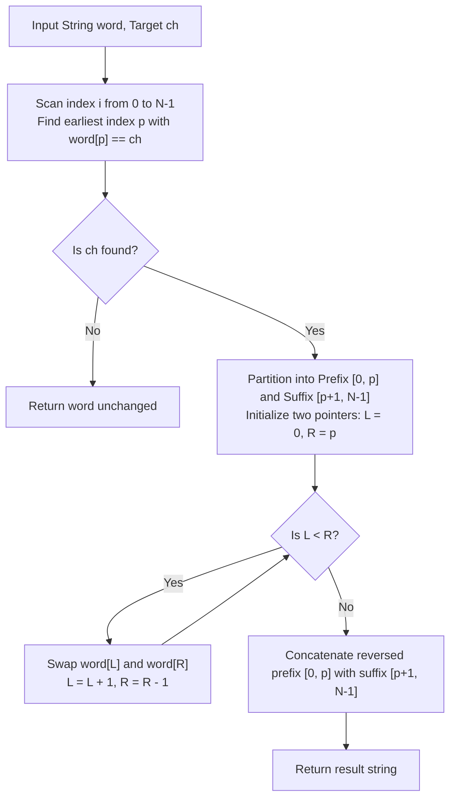

# Guided Example: Reverse Prefix of Word

We analyze and trace the first-occurrence linear scan and two-pointer prefix inversion algorithm on representative strings to invert the substring from index 0 to the earliest target character index.

- **Primary Instance:** `word = "abcdefd"`, `ch = "d"` ($N = 7$)
  - Expected Output: `"dcbaefd"` (first `'d'` is at index 3; prefix `"abcd"` reverses to `"dcba"`; suffix `"efd"` remains intact)
- **Secondary Instance:** `word = "xyxzxe"`, `ch = "z"` ($N = 6$)
  - Expected Output: `"zxyxxe"` (prefix `"xyxz"` reverses to `"zxyx"`; suffix `"xe"` is preserved)
- **Absent Character Instance:** `word = "abcd"`, `ch = "z"` ($N = 4$)
  - Expected Output: `"abcd"` (target character does not occur; string is returned unaltered)

---

## 1. Instance & Intuition

We are given a string `word` and a character `ch`. We must find the index $p$ of the **first occurrence** of `ch` in `word`:
$$p = \min \{i \in \{0, \dots, N-1\} \mid word[i] == ch\}$$
- If no such character exists in `word`, the string remains untouched.
- If $p$ exists, we reverse the segment spanning indices $0$ to $p$ inclusive:
  $$word[0 \dots p] \longrightarrow \text{reverse}(word[0 \dots p])$$
  while leaving the suffix subsegment $word[p+1 \dots N-1]$ entirely unaltered.

### The First-Occurrence Invariant
A string may contain multiple instances of `ch` (such as `"abcdefd"`, where `'d'` appears at index 3 and index 6). The problem contract strictly mandates halting at the **first** occurrence. Reversing up to subsequent occurrences violates problem specifications.

---

## 2. Inversion Mechanics & Suffix Preservation

---

## 3. Step-by-Step State Evolution

We trace the Primary Instance: `word = "abcdefd"`, `ch = "d"` ($N = 7$).

### Phase 1: Locate Earliest Occurrence $p$
We scan indices from left to right:
- Index 0: `word[0] = 'a'` $\neq$ `'d'`
- Index 1: `word[1] = 'b'` $\neq$ `'d'`
- Index 2: `word[2] = 'c'` $\neq$ `'d'`
- Index 3: `word[3] = 'd'` $==$ `'d'` $\implies$ **First occurrence located at $p = 3$**!
Scan terminates immediately.

---

### Phase 2: Prefix Inversion via Two Pointers
The active prefix to reverse is $word[0 \dots 3] = \text{"abcd"}$.
The immutable suffix is $word[4 \dots 6] = \text{"efd"}$.

Initialize boundary pointers:
$$L = 0, \quad R = 3$$

#### Swap Iteration 1 ($L = 0, R = 3$)
- Character at $L = 0$: `'a'`
- Character at $R = 3$: `'d'`
- Swap positions $0$ and $3$:
  $$\text{String becomes: } \text{"\underline{d}bc\underline{a}efd"}$$
- Advance pointers: $L \leftarrow 0 + 1 = 1$, $R \leftarrow 3 - 1 = 2$.

#### Swap Iteration 2 ($L = 1, R = 2$)
- Character at $L = 1$: `'b'`
- Character at $R = 2$: `'c'`
- Swap positions $1$ and $2$:
  $$\text{String becomes: } \text{"d\underline{c}\underline{b}aefd"}$$
- Advance pointers: $L \leftarrow 1 + 1 = 2$, $R \leftarrow 2 - 1 = 1$.

#### Termination
- Pointer check: $L = 2 \ge R = 1$.
- Inversion complete.
- Suffix segment indices $4 \dots 6$ (`"efd"`) remained untouched throughout.
- Final resulting string: `"dcbaefd"`.

---

## 4. Complete Execution Trace

### Primary Instance: `word = "abcdefd"`, `ch = "d"`

| Phase | Pointer $L$ | Pointer $R$ | Active Characters $(word[L], word[R])$ | Action Taken | Prefix Substring $[0 \dots 3]$ | Suffix Substring $[4 \dots 6]$ |
|---|---|---|---|---|---|---|
| Scan | - | - | - | Target `'d'` found at index 3 | `"abcd"` | `"efd"` |
| Swap 1 | 0 | 3 | `('a', 'd')` | Swap indices 0 and 3 | `"dbca"` | `"efd"` |
| Swap 2 | 1 | 2 | `('b', 'c')` | Swap indices 1 and 2 | `"dcba"` | `"efd"` |
| Finish | 2 | 1 | - | Condition $L < R$ false; stop | `"dcba"` | `"efd"` |

Final Output: `"dcbaefd"`.

### Secondary Instance: `word = "xyxzxe"`, `ch = "z"`

First occurrence of `'z'` is at index $p = 3$.

| Step | State Description | Characters at Swapping Boundaries | Substring Transformation | Current Array State |
|---|---|---|---|---|
| Initial | Locate target $p = 3$ | Target: `word[3] = 'z'` | Prefix: `"xyxz"`, Suffix: `"xe"` | `"xyxzxe"` |
| Swap 1 | $L = 0, R = 3$ | Swap `word[0] ('x')` and `word[3] ('z')` | `"xyxz"` $\to$ `"zyxx"` | `"zyxxxe"` |
| Swap 2 | $L = 1, R = 2$ | Swap `word[1] ('y')` and `word[2] ('x')` | `"zyxx"` $\to$ `"zxyx"` | `"zxyxxe"` |
| Complete | $L = 2, R = 1$ | Inversion boundary crossed | Suffix unchanged | `"zxyxxe"` |

Final Output: `"zxyxxe"`.

---

## 5. Algorithmic Correctness & Soundness

1. **Leftmost Character Invariant:**
   The initial linear search advances index $i$ from $0$ to $N - 1$, returning as soon as $word[i] == ch$. By induction, no index $j < i$ has $word[j] == ch$. This guarantees that $p$ is strictly the earliest occurrence of $ch$.

2. **Symmetric Inversion Mapping:**
   The two-pointer swap systematically exchanges element $k$ with element $p - k$ for all $0 \le k \le \lfloor p / 2 \rfloor$. This realizes the exact mathematical reflection:
   $$\pi(k) = p - k \quad \text{for } 0 \le k \le p$$
   which precisely defines the reversing bijection.

3. **Suffix Invariance:**
   Indices strictly greater than $p$ ($k \in [p + 1, N - 1]$) are never accessed or mutated by the two-pointer loop. Thus, their relative order and values are perfectly conserved.

---

## 6. Traps This Instance Exposes

- **Reversing on Later Occurrences:** Scanning backwards or using `rfind` selects the last occurrence of `ch` instead of the first, reversing an oversized prefix when multiple duplicate characters exist.
- **Off-by-One in Reversal Bound:** The reversal includes the character `ch` itself (**inclusive**). Reversing up to $p - 1$ leaves `ch` in place, producing an incorrect prefix.
- **Empty String or Single Character:** When $p = 0$ (the first character is `ch`), the reversal window is $[0, 0]$ of length 1, which correctly leaves the string unchanged.
- **Handling Absent Characters:** If `ch` does not exist in `word`, attempting to slice with an unvalidated lookup index (such as `-1`) can reverse the whole string or corrupt the output. A presence check must guard the reversal.

---

## 7. Complexity Analysis

- **Time Complexity:**
  - **First Occurrence Search:** Scanning for `ch` inspects at most $N$ characters, taking $\mathcal{O}(N)$ time.
  - **Two-Pointer Reversal:** Swapping the prefix segment of length $p + 1$ requires at most $\lfloor (p + 1) / 2 \rfloor$ swaps, taking $\mathcal{O}(p) = \mathcal{O}(N)$ time.
  - **Total Time:** $\mathcal{O}(N)$, which for $N \le 250$ executes in less than 0.05 milliseconds.

- **Auxiliary Space Complexity:**
  - In languages with mutable character arrays, the reversal is performed in-place with $\mathcal{O}(1)$ auxiliary space.
  - In languages with immutable strings, constructing the output string requires $\mathcal{O}(N)$ space for the final result.
  - **Total Auxiliary Space:** $\mathcal{O}(1)$ beyond the required output buffer.
