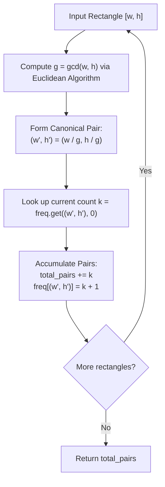

# Guided Example: Number of Pairs of Interchangeable Rectangles

We formulate and trace the exact Euclidean GCD fraction normalization and combinatorial frequency grouping algorithm on representative geometric rectangles to count interchangeable aspect ratio pairs without floating-point inaccuracies.

- **Primary Instance:** `rectangles = [[4, 8], [3, 6], [10, 20], [15, 30]]` ($N = 4$)
  - Expected Output: `6` (all 4 rectangles reduce to the canonical aspect ratio $1:2$, yielding $\binom{4}{2} = 6$ interchangeable pairs)
- **Secondary Instance:** `rectangles = [[1, 2], [2, 4], [3, 5], [6, 10]]` ($N = 4$)
  - Expected Output: `2` (two rectangles with ratio $1:2$ form 1 pair; two rectangles with ratio $3:5$ form 1 pair; total = $1 + 1 = 2$)
- **Disjoint Instance:** `rectangles = [[4, 5], [7, 8]]` ($N = 2$)
  - Expected Output: `0` (ratios $4:5$ and $7:8$ are coprime and distinct)

---

## 1. Instance & Intuition

Two rectangles $i$ and $j$ ($i < j$) with dimensions $[w_i, h_i]$ and $[w_j, h_j]$ are **interchangeable** if and only if they share the exact same width-to-height ratio:
$$\frac{w_i}{h_i} = \frac{w_j}{h_j}$$
We wish to determine the total number of index pairs $(i, j)$ satisfying this relationship.

### The Pitfall of Floating-Point Division

Using IEEE-754 floating-point division ($w / h$) is fraught with precision issues. For large integers, binary floating-point representations can suffer from rounding errors, causing mathematically identical fractions to produce slightly different floating-point bit patterns (e.g., $1/3$ represented in binary vs decimal).

### Exact Fraction Normalization via Greatest Common Divisor

To represent every ratio unambiguously using exact integer arithmetic:
1. For each rectangle $[w, h]$, compute $g = \gcd(w, h)$ using the Euclidean algorithm.
2. Reduce the fraction to lowest terms:
   $$w' = \frac{w}{g}, \quad h' = \frac{h}{g}$$
3. The reduced integer pair $(w', h')$ is a unique canonical identifier for the aspect ratio.

### Combinatorial Aggregation

If an aspect ratio $(w', h')$ appears with frequency $c$ across the entire dataset:
- Every selection of 2 rectangles from this group forms an interchangeable pair.
- The number of distinct pairs contributed by this group is given by the binomial coefficient:
  $$\binom{c}{2} = \frac{c(c - 1)}{2}$$
- Summing $\binom{c}{2}$ over all distinct canonical ratios yields the global total.

Alternatively, in a single forward pass, as each rectangle is processed:
- If its canonical ratio has been observed $k$ times previously, it forms $k$ new pairs with those existing rectangles.
- We add $k$ to the running total and increment the frequency.

---

## 2. Invariant Architecture & Normalization Pipeline

---

## 3. Step-by-Step State Evolution

We trace the Primary Instance: `rectangles = [[4, 8], [3, 6], [10, 20], [15, 30]]` ($N = 4$).

Initialize:
- Frequency map: $\text{freq} = \{\}$
- Running pairs counter: $\text{total\_pairs} = 0$

---

### Step 1: Process Rectangle 0 (`[4, 8]`)
- Compute divisor: $\gcd(4, 8) = 4$.
- Canonical ratio:
  $$w' = \frac{4}{4} = 1, \quad h' = \frac{8}{4} = 2 \implies (1, 2)$$
- Lookup $\text{freq}[(1, 2)]$: not found (count $k = 0$).
- Pairs added: $\text{total\_pairs} \leftarrow 0 + 0 = 0$.
- Update map: $\text{freq}[(1, 2)] \leftarrow 1$.

---

### Step 2: Process Rectangle 1 (`[3, 6]`)
- Compute divisor: $\gcd(3, 6) = 3$.
- Canonical ratio:
  $$w' = \frac{3}{3} = 1, \quad h' = \frac{6}{3} = 2 \implies (1, 2)$$
- Lookup $\text{freq}[(1, 2)]$: currently $1$.
- Rectangle 1 pairs with Rectangle 0: $+1$ pair.
- Update pairs: $\text{total\_pairs} \leftarrow 0 + 1 = 1$.
- Update map: $\text{freq}[(1, 2)] \leftarrow 1 + 1 = 2$.

---

### Step 3: Process Rectangle 2 (`[10, 20]`)
- Compute divisor: $\gcd(10, 20) = 10$.
- Canonical ratio:
  $$w' = \frac{10}{10} = 1, \quad h' = \frac{20}{10} = 2 \implies (1, 2)$$
- Lookup $\text{freq}[(1, 2)]$: currently $2$.
- Rectangle 2 pairs with Rectangles 0 and 1: $+2$ pairs.
- Update pairs: $\text{total\_pairs} \leftarrow 1 + 2 = 3$.
- Update map: $\text{freq}[(1, 2)] \leftarrow 2 + 1 = 3$.

---

### Step 4: Process Rectangle 3 (`[15, 30]`)
- Compute divisor: $\gcd(15, 30) = 15$.
- Canonical ratio:
  $$w' = \frac{15}{15} = 1, \quad h' = \frac{30}{15} = 2 \implies (1, 2)$$
- Lookup $\text{freq}[(1, 2)]$: currently $3$.
- Rectangle 3 pairs with Rectangles 0, 1, and 2: $+3$ pairs.
- Update pairs: $\text{total\_pairs} \leftarrow 3 + 3 = 6$.
- Update map: $\text{freq}[(1, 2)] \leftarrow 3 + 1 = 4$.

---

### Termination
All $N = 4$ rectangles processed.
Total interchangeable pairs: **6**.

---

## 4. Complete Execution Trace

### Primary Instance Trace Table

| Index $i$ | Dimensions $[w_i, h_i]$ | Divisor $\gcd(w_i, h_i)$ | Canonical Key $(w'_i, h'_i)$ | Prior Frequency $k$ | Pairs Added | New Frequency | Running Total Pairs |
|---|---|---|---|---|---|---|---|
| 0 | `[4, 8]` | 4 | `(1, 2)` | 0 | 0 | 1 | 0 |
| 1 | `[3, 6]` | 3 | `(1, 2)` | 1 | 1 | 2 | 1 |
| 2 | `[10, 20]` | 10 | `(1, 2)` | 2 | 2 | 3 | 3 |
| 3 | `[15, 30]` | 15 | `(1, 2)` | 3 | 3 | 4 | 6 |

Final Result: **6**.

### Secondary Instance Trace Table

`rectangles = [[1, 2], [2, 4], [3, 5], [6, 10]]`

| Index $i$ | Dimensions | $\gcd$ | Canonical Key | Prior Frequency | Pairs Added | Running Total |
|---|---|---|---|---|---|---|
| 0 | `[1, 2]` | 1 | `(1, 2)` | 0 | 0 | 0 |
| 1 | `[2, 4]` | 2 | `(1, 2)` | 1 | 1 | 1 |
| 2 | `[3, 5]` | 1 | `(3, 5)` | 0 | 0 | 1 |
| 3 | `[6, 10]` | 2 | `(3, 5)` | 1 | 1 | 2 |

Final Result: **2**.

---

## 5. Algorithmic Correctness & Soundness

1. **Uniqueness of Irreducible Form:**
   By the Fundamental Theorem of Arithmetic, for any pair of positive integers $w, h$, dividing by their greatest common divisor $g = \gcd(w, h)$ yields coprime integers $w', h'$ such that $\gcd(w', h') = 1$. Two fractions $w_1 / h_1$ and $w_2 / h_2$ represent the same rational number if and only if their irreducible representations $(w_1', h_1')$ and $(w_2', h_2')$ are identical.

2. **Equivalence Partitioning and Pair Summation:**
   The relation $R(i, j) \iff w_i / h_i = w_j / h_j$ is an equivalence relation. By the handshake lemma, a partition of size $c$ contains exactly $\binom{c}{2} = \frac{c(c-1)}{2}$ mutually compatible pairs. Accumulating $k$ at the $k^{\text{th}}$ occurrence of each key computes:
   $$\sum_{k=0}^{c-1} k = \frac{(c-1)c}{2} = \binom{c}{2}$$
   correctly yielding the exact pair count without overcounting or omitting pairs.

---

## 6. Traps This Instance Exposes

- **Floating-Point Imprecision:** Using float division `w / h` as a dictionary key or set element can map identical ratios to different hash buckets due to binary floating-point representation limits. Integer tuple reduction via GCD is exact.
- **32-bit Integer Overflow:** When $N = 10^5$ and all rectangles share the same aspect ratio, the total number of pairs is:
  $$\binom{10^5}{2} = \frac{10^5 \times (10^5 - 1)}{2} = 4,999,950,000 \approx 5 \times 10^9$$
  This exceeds the maximum value of a signed 32-bit integer ($2^{31} - 1 \approx 2.14 \times 10^9$). The accumulator must use a 64-bit integer type (`long long` in C++, `int64` in Go).
- **Pairwise Comparison $\mathcal{O}(N^2)$ TLE:** Comparing all pairs directly times out on $N = 10^5$. Hash map aggregation reduces the problem to linear time.

---

## 7. Complexity Analysis

- **Time Complexity:**
  - **GCD Computation:** For each rectangle, computing $\gcd(w, h)$ via the Euclidean algorithm takes $\mathcal{O}(\log(\min(w, h)))$ steps. With $w, h \le 10^5$, $\log(10^5) \le 17$ divisions.
  - **Hash Map Operations:** Hashing and inserting integer tuples of length 2 takes $\mathcal{O}(1)$ average time.
  - **Total Time:** $\mathcal{O}(N \log(\min(W, H)))$, which for $N = 10^5$ takes less than 25 milliseconds.

- **Auxiliary Space Complexity:**
  - The frequency hash map stores at most $N$ distinct canonical ratio pairs.
  - **Total Auxiliary Space:** $\mathcal{O}(N)$ memory to maintain the frequency map.
