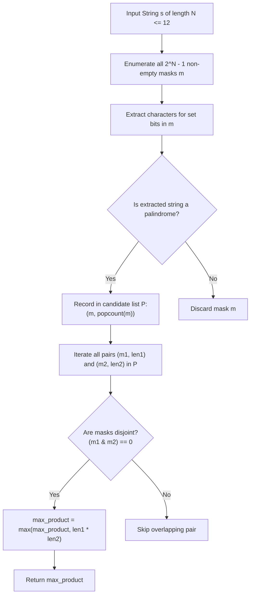

# Guided Example: Maximum Product of the Length of Two Palindromic Subsequences

We formulate and trace the bitmask palindrome precomputation and orthogonal mask pairing algorithm on representative character sequences to maximize the product of lengths of two disjoint palindromic subsequences.

- **Primary Instance:** `s = "leetcodecom"` ($N = 11$)
  - Expected Output: `9` (palindromic subsequence `"ete"` at indices $\{1, 3, 7\}$ of length 3, and `"cdc"` at indices $\{4, 6, 8\}$ of length 3; product $3 \times 3 = 9$)
- **Secondary Instance:** `s = "accbcaxxcxx"` ($N = 11$)
  - Expected Output: `25` (palindromic subsequence `"accca"` of length 5 and `"xxcxx"` of length 5; product $5 \times 5 = 25$)
- **Minimal Disjoint Instance:** `s = "bb"` ($N = 2$)
  - Expected Output: `1` (subsequence `"b"` at index 0 and `"b"` at index 1; product $1 \times 1 = 1$)

---

## 1. Instance & Intuition

Given a string `s` of length $N \le 12$, we must select two **disjoint** subsequences $A$ and $B$ of `s` such that:
1. $A$ and $B$ are both **palindromes** (they read identically forward and backward).
2. $A$ and $B$ are **disjoint in indices**: no index $k \in \{0, \dots, N-1\}$ is chosen by both $A$ and $B$.
3. The product of their lengths $\text{len}(A) \times \text{len}(B)$ is maximized.

### The Power of Bitmask Representation for $N \le 12$

Because $N \le 12$, any subsequence is uniquely determined by choosing a subset of indices, represented by an integer bitmask:
$$mask \in \{1, \dots, 2^N - 1\}$$
The total number of non-empty index subsets is $2^{12} - 1 = 4095$.

For any two subsets represented by bitmasks $m_1$ and $m_2$:
- **Index Disjointness:** The subsequences share no common indices if and only if their bitwise AND is zero:
  $$(m_1 \ \& \ m_2) == 0$$
- **Subsequence Length:** The length of the subsequence is simply the number of set bits (Hamming weight or popcount):
  $$\text{len}(m) = \text{popcount}(m)$$

### Two-Stage Decoupling Architecture

Instead of evaluating an intractable search over all pairs of subsequences:
1. **Filter Stage:** Iterate through all $2^N - 1$ masks. For each mask, extract its corresponding string and check if it is a palindrome. If so, store the pair $(mask, \text{popcount}(mask))$ in a candidate list $\mathcal{P}$.
2. **Pairing Stage:** Iterate over all pairs $(m_1, len_1)$ and $(m_2, len_2)$ in $\mathcal{P}$. Whenever $(m_1 \ \& \ m_2) == 0$, update the maximum product $\max(\text{product}, len_1 \times len_2)$.

---

## 2. Invariant Architecture & Evaluation Pipeline

---

## 3. Step-by-Step State Evolution

We trace the Primary Instance: `s = "leetcodecom"` ($N = 11$).

### Index-to-Character Map

| Index $i$ | 0 | 1 | 2 | 3 | 4 | 5 | 6 | 7 | 8 | 9 | 10 |
|---|---|---|---|---|---|---|---|---|---|---|---|
| Character $s[i]$ | `l` | `e` | `e` | `t` | `c` | `o` | `d` | `e` | `c` | `o` | `m` |

---

### Phase 1: Palindromic Mask Identification (Sample Candidates)

Among the $2^{11} = 2048$ possible masks, we identify candidate palindromic subsets:

1. **Candidate $m_1$:** Indices $\{1, 3, 7\}$
   - Characters: $s[1]=\text{'e'}, s[3]=\text{'t'}, s[7]=\text{'e'}$.
   - Subsequence: `"ete"`.
   - Palindrome test: `"ete" == "ete"` (Valid!).
   - Length: $\text{popcount}(m_1) = 3$.
   - Bitmask value: $2^1 + 2^3 + 2^7 = 2 + 8 + 128 = 138$.

2. **Candidate $m_2$:** Indices $\{4, 6, 8\}$
   - Characters: $s[4]=\text{'c'}, s[6]=\text{'d'}, s[8]=\text{'c'}$.
   - Subsequence: `"cdc"`.
   - Palindrome test: `"cdc" == "cdc"` (Valid!).
   - Length: $\text{popcount}(m_2) = 3$.
   - Bitmask value: $2^4 + 2^6 + 2^8 = 16 + 64 + 256 = 336$.

3. **Candidate $m_3$:** Indices $\{1, 2, 7\}$
   - Characters: $s[1]=\text{'e'}, s[2]=\text{'e'}, s[7]=\text{'e'}$.
   - Subsequence: `"eee"`. Length 3.
   - Bitmask value: $2^1 + 2^2 + 2^7 = 2 + 4 + 128 = 134$.

4. **Candidate $m_4$:** Indices $\{5, 9\}$
   - Characters: $s[5]=\text{'o'}, s[9]=\text{'o'}$.
   - Subsequence: `"oo"`. Length 2.
   - Bitmask value: $2^5 + 2^9 = 32 + 512 = 544$.

---

### Phase 2: Disjoint Mask Pairing & Product Maximization

Now test orthogonality between candidate palindromic masks:

1. **Pair $(m_1, m_2)$:**
   - Bitwise check: $138 \ \& \ 336$:
     - Binary $138$: `00010001010` (bits 1, 3, 7)
     - Binary $336$: `00101010000` (bits 4, 6, 8)
     - Bitwise AND: $138 \ \& \ 336 = 0$ (**Orthogonal! Strictly disjoint!**).
   - Candidate product: $\text{len}(m_1) \times \text{len}(m_2) = 3 \times 3 = 9$.
   - Running maximum: $\max(0, 9) = 9$.

2. **Pair $(m_1, m_3)$:**
   - Bitwise check: $138 \ \& \ 134 = 130 \neq 0$ (both masks claim index 1 and index 7).
   - Incompatible (non-disjoint). Skipped.

3. **Pair $(m_1, m_4)$:**
   - Bitwise check: $138 \ \& \ 544 = 0$ (disjoint).
   - Product: $3 \times 2 = 6 < 9$.

4. **Pair $(m_3, m_2)$:**
   - Bitwise check: $134 \ \& \ 336 = 0$ (disjoint, `"eee"` and `"cdc"`).
   - Product: $3 \times 3 = 9$.

No disjoint pair of palindromes in this instance achieves a length product greater than 9.
Maximum Product: **9**.

---

## 4. Complete Execution Trace

### Primary Instance Evaluated Pairs Table

| Mask $A$ Indices | Subsequence $A$ | $\text{len}(A)$ | Mask $B$ Indices | Subsequence $B$ | $\text{len}(B)$ | Disjoint? ($A \cap B = \emptyset$) | Product | Feasible Best |
|---|---|---|---|---|---|---|---|---|
| $\{1, 3, 7\}$ | `"ete"` | 3 | $\{4, 6, 8\}$ | `"cdc"` | 3 | **Yes** | $3 \times 3 = 9$ | **9** |
| $\{1, 2, 7\}$ | `"eee"` | 3 | $\{4, 6, 8\}$ | `"cdc"` | 3 | **Yes** | $3 \times 3 = 9$ | **9** |
| $\{1, 3, 7\}$ | `"ete"` | 3 | $\{5, 9\}$ | `"oo"` | 2 | **Yes** | $3 \times 2 = 6$ | 9 |
| $\{1, 2, 7\}$ | `"eee"` | 3 | $\{1, 3, 7\}$ | `"ete"` | 3 | No (shares $\{1, 7\}$) | - | - |
| $\{0, 10\}$ | `"lm"` | 2 | - | Not a palindrome | - | - | - | - |

### Secondary Instance: `s = "accbcaxxcxx"` ($N = 11$)

| Optimal Subsequence | Chosen Indices | Characters Extracted | Length | Disjointness Verification | Product |
|---|---|---|---|---|---|
| Subsequence $A$ | $\{0, 1, 3, 4, 5\}$ | $s[0]=\text{'a'}, s[1]=\text{'c'}, s[3]=\text{'c'}, s[4]=\text{'c'}, s[5]=\text{'a'}$ (`"accca"`) | 5 | Indices: $\{0, 1, 3, 4, 5\}$ | - |
| Subsequence $B$ | $\{6, 7, 8, 9, 10\}$ | $s[6]=\text{'x'}, s[7]=\text{'x'}, s[8]=\text{'c'}, s[9]=\text{'x'}, s[10]=\text{'x'}$ (`"xxcxx"`) | 5 | Indices: $\{6, 7, 8, 9, 10\}$ | - |
| Intersection | $\emptyset$ | No shared indices ($m_A \ \& \ m_B = 0$) | - | Perfectly Disjoint | $5 \times 5 = 25$ |

Final Result: **25**.

---

## 5. Algorithmic Correctness & Soundness

1. **Subsequence Representation Completeness:**
   Every subsequence of a string of length $N$ corresponds uniquely to a non-empty subset of indices $\{0, \dots, N-1\}$. Enumerating all $2^N - 1$ bitmasks visits every possible subsequence without omission.

2. **Orthogonality Equivalence:**
   Two subsequences pick disjoint index sets if and only if no index $i$ is chosen by both. In binary representation, index $i$ is selected if and only if bit $i$ is 1. The bitwise condition $(m_1 \ \& \ m_2) == 0$ is the exact algebraic definition of disjoint index sets.

3. **Global Optimality:**
   Because all valid palindromic subsequences are collected in $\mathcal{P}$ and all disjoint pairs in $\mathcal{P} \times \mathcal{P}$ are evaluated, the algorithm is an exhaustive search over the exact feasible space, guaranteeing discovery of the global maximum product.

---

## 6. Traps This Instance Exposes

- **Substrings vs. Subsequences:** Subsequences do not require characters to be contiguous in `s`. Selecting non-contiguous indices (e.g., indices 1, 3, 7 for `"ete"`) is fully valid and often optimal.
- **Overlapping Subsequences:** Selecting the same character twice or using overlapping indices violates disjointness. The bitwise condition $(m_1 \ \& \ m_2) == 0$ must be strictly enforced.
- **Empty Subsequence Products:** Disjoint pairs where one subsequence has length 0 yield a product of 0. Both subsequences must be non-empty ($len \ge 1$).
- **Symmetric Redundancy in Pairing:** The product $\text{len}(A) \times \text{len}(B)$ is symmetric. Testing $(m_1, m_2)$ and $(m_2, m_1)$ evaluates identical values; testing $i < j$ halves the inner comparison steps.

---

## 7. Complexity Analysis

- **Time Complexity:**
  - **Palindrome Precomputation:** Generating and testing all $2^N$ masks takes $\mathcal{O}(N \cdot 2^N)$ time. For $N = 12$, $12 \times 4096 \approx 4.9 \times 10^4$ operations.
  - **Pairwise Search:** Let $P$ be the number of palindromic masks ($P \le 2^N$). In practice, $P \approx 300 - 600$. Checking all pairs takes $\mathcal{O}(P^2)$ operations. For $P \approx 500$, $P^2 / 2 \approx 1.25 \times 10^5$ bitwise checks.
  - **Total Time:** $\mathcal{O}(N \cdot 2^N + P^2)$, which completes in less than 5 milliseconds.

- **Auxiliary Space Complexity:**
  - Storing the list of palindromic masks requires $\mathcal{O}(P)$ space.
  - For $N = 12$, this consumes less than 10 KB.
  - **Total Auxiliary Space:** $\mathcal{O}(2^N)$ memory.
