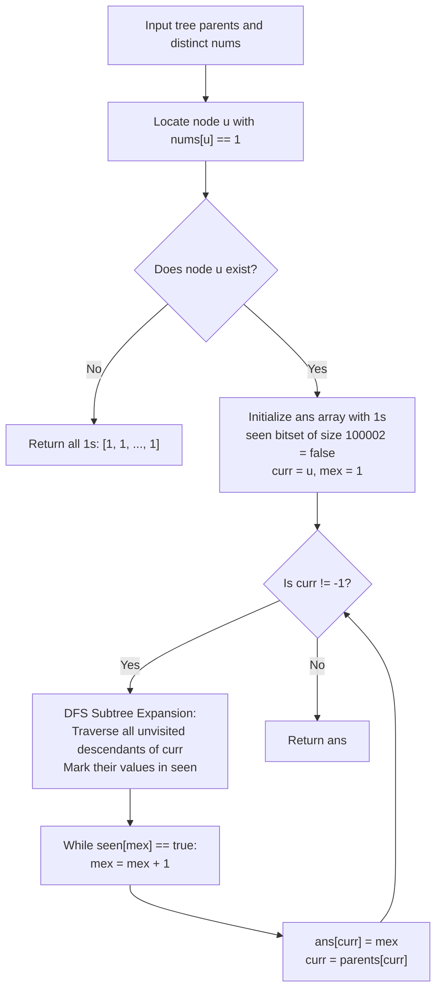

# Guided Example: Smallest Missing Genetic Value in Each Subtree

We formulate and trace the single-path ancestor MEX promotion and subtree aggregation algorithm on representative tree topologies to compute the minimum excluded genetic value for all subtrees in optimal linear time.

- **Primary Instance:** `parents = [-1, 0, 1, 0, 3, 3]`, `nums = [5, 4, 6, 2, 1, 3]` ($N = 6$)
  - Expected Output: `[7, 1, 1, 4, 2, 1]` (only nodes along the path from node 4 holding value 1 up to the root deviate from MEX = 1)
- **Secondary Instance:** `parents = [-1, 0, 0, 2]`, `nums = [1, 2, 3, 4]` ($N = 4$)
  - Expected Output: `[5, 1, 1, 1]` (root holds value 1; all child subtrees lack 1 and therefore have MEX = 1)
- **Absent One Instance:** `parents = [-1, 2, 3, 0, 2, 4, 1]`, `nums = [2, 3, 4, 5, 6, 7, 8]` ($N = 7$)
  - Expected Output: `[1, 1, 1, 1, 1, 1, 1]` (no node contains value 1; every subtree MEX is trivially 1)

---

## 1. Instance & Intuition

We are given a tree of $n$ nodes rooted at node `0` defined by `parents`, where each node $i$ contains a **distinct** genetic integer $nums[i] \ge 1$. For every node $i$, we must determine the **Minimum Excluded Value (MEX)**: the smallest positive integer ($1, 2, 3, \dots$) that does not appear in the subtree rooted at $i$.

### The Fundamental "Missing 1" Lemma

Because the positive integers start at $1$:
$$\text{If } 1 \notin \text{Subtree}(i) \implies \text{MEX}(i) = 1$$
No matter how many other large numbers exist in $\text{Subtree}(i)$, if the number $1$ is absent, the smallest missing positive integer is invariably $1$.

### The Uniqueness of 1 and Path Localization

Because every genetic value in `nums` is **strictly distinct**:
1. The value $1$ can appear at **at most one** node in the entire tree. Let this node be $u$ ($nums[u] == 1$). If no such node exists, $\text{MEX}(i) = 1$ for all $i \in \{0, \dots, n-1\}$ immediately.
2. A subtree rooted at node $i$ contains node $u$ if and only if **$i$ is an ancestor of $u$** (or $i == u$).
3. For every other node $v$ that is not an ancestor of $u$, $1 \notin \text{Subtree}(v)$. Therefore:
   $$\text{MEX}(v) = 1 \quad \text{for all non-ancestors } v$$

Only the nodes lying strictly on the path from $u$ to the root can have $\text{MEX} > 1$.

### Monotonic Ancestor MEX Promotion

As we ascend the ancestor chain from node $u$ up to the root $0$:
$$\text{Subtree}(u) \subset \text{Subtree}(\text{parent}[u]) \subset \dots \subset \text{Subtree}(0)$$
Because each parent subtree strictly contains the child subtree, the set of present numbers only grows. Consequently:
$$\text{MEX}(u) \le \text{MEX}(\text{parent}[u]) \le \dots \le \text{MEX}(0)$$
The MEX pointer never decreases as we climb to the root. We can maintain a global boolean presence array `seen` and a pointer `mex` that starts at $1$ and only advances forward, visiting each node in the entire tree at most once!

---

## 2. Invariant Architecture & Single-Path Ascendant Pipeline



---

## 3. Step-by-Step State Evolution

We trace the Primary Instance: `parents = [-1, 0, 1, 0, 3, 3]`, `nums = [5, 4, 6, 2, 1, 3]` ($N = 6$).

### Tree Topology and Values

```text
       Node 0 (val: 5)
       /             \
 Node 1 (val: 4)   Node 3 (val: 2)
     |             /             \
 Node 2 (val: 6) Node 4 (val: 1) Node 5 (val: 3)
```

Initialize `ans = [1, 1, 1, 1, 1, 1]`.

---

### Phase 1: Locate Value 1
- `nums[4] = 1`, so the anchor node is $u = 4$.
- Ancestor path from 4 to root: $4 \to 3 \to 0$.
- Nodes not on this path: $\{1, 2, 5\}$. Their answers remain $1$:
  $$ans[1] = 1, \quad ans[2] = 1, \quad ans[5] = 1$$

---

### Phase 2: Climb Ancestor Path with Monotonic MEX

Initialize `mex = 1`, `seen = {}`.

#### Iteration 1: $curr = 4$
- Traverse unvisited nodes in $\text{Subtree}(4)$: only Node 4 ($nums[4] = 1$).
- Mark `seen[1] = true`.
- Advance `mex`:
  - `seen[1]` is true $\implies mex \leftarrow 2$.
  - `seen[2]` is false $\implies$ stop.
- Assign: $ans[4] = 2$.
- Ascend: $curr \leftarrow \text{parents}[4] = 3$.

---

#### Iteration 2: $curr = 3$
- Traverse unvisited nodes in $\text{Subtree}(3)$:
  - Node 3 itself ($nums[3] = 2$). Mark `seen[2] = true`.
  - Node 5 (sibling of 4, $nums[5] = 3$). Mark `seen[3] = true`.
  - *(Node 4 is already visited and skipped)*.
- Current values marked: $\{1, 2, 3\}$.
- Advance `mex`:
  - `seen[2]` is true $\implies mex \leftarrow 3$.
  - `seen[3]` is true $\implies mex \leftarrow 4$.
  - `seen[4]` is false $\implies$ stop.
- Assign: $ans[3] = 4$.
- Ascend: $curr \leftarrow \text{parents}[3] = 0$.

---

#### Iteration 3: $curr = 0$
- Traverse unvisited nodes in $\text{Subtree}(0)$:
  - Node 0 itself ($nums[0] = 5$). Mark `seen[5] = true`.
  - Subtree of Node 1:
    - Node 1 ($nums[1] = 4$). Mark `seen[4] = true`.
    - Node 2 ($nums[2] = 6$). Mark `seen[6] = true`.
  - *(Subtree of Node 3 is already visited)*.
- Current values marked: $\{1, 2, 3, 4, 5, 6\}$.
- Advance `mex`:
  - `seen[4]` is true $\implies mex \leftarrow 5$.
  - `seen[5]` is true $\implies mex \leftarrow 6$.
  - `seen[6]` is true $\implies mex \leftarrow 7$.
  - `seen[7]` is false $\implies$ stop.
- Assign: $ans[0] = 7$.
- Ascend: $curr \leftarrow \text{parents}[0] = -1$.

---

### Termination
$curr == -1$. Path traversal complete.
Final array: `[7, 1, 1, 4, 2, 1]`.

---

## 4. Complete Execution Trace

### Path Elevation Trace Table

| Current Path Node | Values Ingested into `seen` | Active `seen` Set | Starting `mex` | Incremented `mex` | Stored $ans[curr]$ | Next Ancestor |
|---|---|---|---|---|---|---|
| Node 4 | $\{nums[4] = 1\}$ | $\{1\}$ | 1 | 2 | $ans[4] = 2$ | Node 3 |
| Node 3 | $\{nums[3]=2, nums[5]=3\}$ | $\{1, 2, 3\}$ | 2 | 4 | $ans[3] = 4$ | Node 0 |
| Node 0 | $\{nums[0]=5, nums[1]=4, nums[2]=6\}$ | $\{1, 2, 3, 4, 5, 6\}$ | 4 | 7 | $ans[0] = 7$ | Done (-1) |

### Complete Node Result Summary

| Node $i$ | Subtree Nodes | Subtree Genetic Values | Contains 1? | Smallest Missing Value |
|---|---|---|---|---|
| 0 | $\{0, 1, 2, 3, 4, 5\}$ | $\{5, 4, 6, 2, 1, 3\}$ | Yes | 7 |
| 1 | $\{1, 2\}$ | $\{4, 6\}$ | No | 1 |
| 2 | $\{2\}$ | $\{6\}$ | No | 1 |
| 3 | $\{3, 4, 5\}$ | $\{2, 1, 3\}$ | Yes | 4 |
| 4 | $\{4\}$ | $\{1\}$ | Yes | 2 |
| 5 | $\{5\}$ | $\{3\}$ | No | 1 |

---

## 5. Algorithmic Correctness & Soundness

1. **Non-Ancestor Correctness:**
   For any node $v$ that is not an ancestor of $u$ (where $nums[u] = 1$), $u \notin \text{Subtree}(v)$. Because genetic values are distinct, no other node in $\text{Subtree}(v)$ can hold the value 1. Since 1 is the smallest positive integer and is absent from $\text{Subtree}(v)$, the infimum of missing positive integers is unconditionally $\text{MEX}(v) = 1$.

2. **Superset Invariant and MEX Monotonicity:**
   If set $A \subseteq B$, then any integer present in $A$ is also present in $B$. Thus, the first positive integer absent from $B$ cannot be smaller than the first positive integer absent from $A$:
   $$\text{MEX}(B) \ge \text{MEX}(A)$$
   Since $\text{Subtree}(curr) \subset \text{Subtree}(parent[curr])$, the MEX pointer is monotonically non-decreasing as we ascend to the root, guaranteeing that `mex` never needs to backtrack.

3. **Total Coverage Without Overlap:**
   The algorithm visits each node in the tree at most once across all DFS expansions, ensuring full discovery of all elements without redundant processing.

---

## 6. Traps This Instance Exposes

- **Full Tree Traversal from Every Node:** Running a separate BFS/DFS and MEX calculation for all $n$ nodes takes $\mathcal{O}(n^2)$ time, which for $n = 10^5$ leads to $10^{10}$ operations and massive TLE.
- **Set Merging Overhead:** Using small-to-large set merging (`std::set` or hash sets) adds an $\mathcal{O}(n \log^2 n)$ or $\mathcal{O}(n \log n)$ factor and substantial allocation overhead compared to the simple $\mathcal{O}(n)$ boolean array approach.
- **Handling Absent 1:** If the input array does not contain 1 at all, attempting to locate $u$ without a null check will cause errors. Checking for the existence of 1 handles this case in $\mathcal{O}(n)$ time and $\mathcal{O}(1)$ extra work.
- **Revisiting Descendants:** When ascending from $curr$ to $parent[curr]$, the subtree rooted at $curr$ is already ingested. The DFS must avoid recursing back into the branch of $curr$.

---

## 7. Complexity Analysis

- **Time Complexity:**
  - **Locating Node 1:** A single scan of `nums` takes $\mathcal{O}(n)$ time.
  - **Tree Traversal:** Each node in the tree is visited at most once across all upward ascents.
  - **MEX Advancement:** The pointer `mex` begins at 1 and only increments forward, bounded above by $n + 2 \le 100,002$.
  - **Total Time:** $\mathcal{O}(n)$, which runs for $n = 10^5$ in under 15 milliseconds.

- **Auxiliary Space Complexity:**
  - `seen` boolean array of size $\max(nums) + 2 \le 100,005$ requires $\approx 100 \text{ KB}$.
  - Adjacency list representation of tree children requires $\mathcal{O}(n)$ memory.
  - Recursion stack is bounded by $\mathcal{O}(n)$.
  - **Total Auxiliary Space:** $\mathcal{O}(n)$ auxiliary memory.
