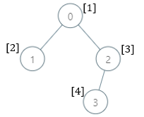
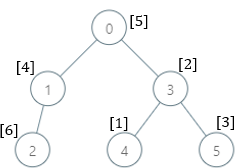

### 1. Description

There is a **family tree** rooted at `0` consisting of `n` nodes numbered `0` to $n - 1$. You are given a **0-indexed** integer array `parents`, where $\text{parents}[i]$ is the parent for node `i`. Since node `0` is the **root**, $\text{parents}[0] = -1$.

There are $10^{5}$ genetic values, each represented by an integer in the **inclusive** range $[1, 10^{5}]$. You are given a **0-indexed** integer array `nums`, where $\text{nums}[i]$ is a **distinct **genetic value for node `i`.

Return *an array *`ans`* of length *`n`* where *$\text{ans}[i]$* is* *the **smallest** genetic value that is **missing** from the subtree rooted at node* `i`.

The **subtree** rooted at a node `x` contains node `x` and all of its **descendant** nodes.

### 2. Function Contract

**Inputs**

- `parents`: Input parameter (`List[int]`).
- `nums`: Input parameter (`List[int]`).

**Return value**

- Returns `List[int]`.

### 3. Examples

#### Example 1

- **Input:** $parents = [-1,0,0,2], nums = [1,2,3,4]$
- **Output:** `[5,1,1,1]`
- **Explanation:** The answer for each subtree is calculated as follows:
- 0: The subtree contains nodes [0,1,2,3] with values [1,2,3,4]. 5 is the smallest missing value.
- 1: The subtree contains only node 1 with value 2. 1 is the smallest missing value.
- 2: The subtree contains nodes [2,3] with values [3,4]. 1 is the smallest missing value.
- 3: The subtree contains only node 3 with value 4. 1 is the smallest missing value.

#### Example 2

- **Input:** $parents = [-1,0,1,0,3,3], nums = [5,4,6,2,1,3]$
- **Output:** `[7,1,1,4,2,1]`
- **Explanation:** The answer for each subtree is calculated as follows:
- 0: The subtree contains nodes [0,1,2,3,4,5] with values [5,4,6,2,1,3]. 7 is the smallest missing value.
- 1: The subtree contains nodes [1,2] with values [4,6]. 1 is the smallest missing value.
- 2: The subtree contains only node 2 with value 6. 1 is the smallest missing value.
- 3: The subtree contains nodes [3,4,5] with values [2,1,3]. 4 is the smallest missing value.
- 4: The subtree contains only node 4 with value 1. 2 is the smallest missing value.
- 5: The subtree contains only node 5 with value 3. 1 is the smallest missing value.

#### Example 3

- **Input:** $parents = [-1,2,3,0,2,4,1], nums = [2,3,4,5,6,7,8]$
- **Output:** `[1,1,1,1,1,1,1]`
- **Explanation:** The value 1 is missing from all the subtrees.

### 4. Constraints

- $n = \text{parents.length} = \text{nums.length}$

- $2 \le n \le 10^{5}$

- $0 \le \text{parents}[i] \le n - 1$ for $i \neq 0$

- $\text{parents}[0] = -1$

- `parents` represents a valid tree.

- $1 \le \text{nums}[i] \le 10^{5}$

- Each $\text{nums}[i]$ is distinct.
