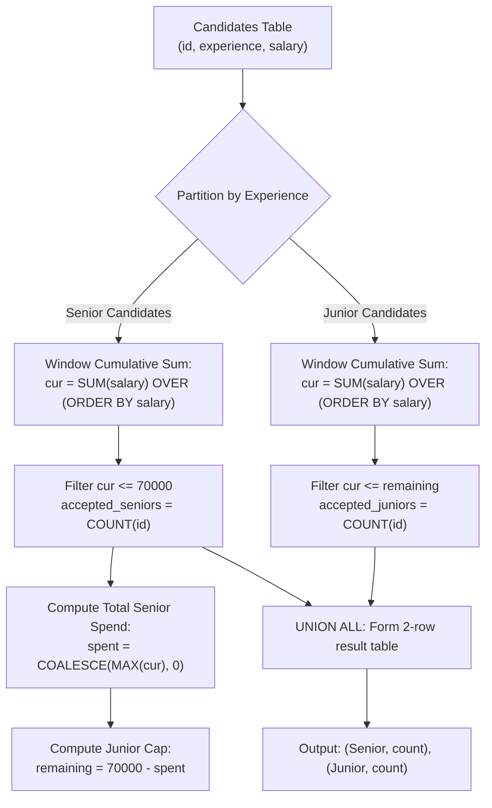

# Guided Example: The Number of Seniors and Juniors to Join the Company

We analyze and trace the window-function cumulative cost evaluation and hierarchical greedy budget allocation pattern to determine the maximum number of Senior and Junior candidates hired under a strict 70,000 payroll budget limit.

- **Primary Instance:**
  - Candidates:
    - Junior: ID 1 (10000), ID 9 (10000), ID 4 (40000)
    - Senior: ID 2 (20000), ID 11 (20000), ID 13 (50000)
  - Total Budget: `70000`
  - Expected Output:
    - Senior: `2` (IDs 2 and 11, consuming 40000)
    - Junior: `2` (IDs 1 and 9, consuming 20000 of the remaining 30000)
- **Zero Senior Feasibility Instance:**
  - Seniors all demand 80000 (each exceeds the 70000 budget).
  - Expected Output:
    - Senior: `0`
    - Junior: `3` (all juniors hired using the intact 70000 budget)

---

## 1. Instance & Intuition

A company possesses a fixed hiring budget of 70000 and evaluates candidates with experience tiers `'Senior'` and `'Junior'`. The hiring policy follows a two-tier priority policy:
1. **Tier 1 (Senior Maximization):** Hire the maximum possible number of Senior candidates without exceeding 70000.
2. **Tier 2 (Junior Residual Allocation):** After paying all hired Seniors, allocate the remaining budget:
   $$\text{Budget}_{\text{junior}} = 70000 - \text{Total Spent on Seniors}$$
   to hire the maximum possible number of Junior candidates.
3. **Format Mandate:** The output table must contain exactly two rows: `'Senior'` and `'Junior'`, reporting `0` if no candidate in a category is hired.

### The Greedy Minimum-Salary Principle

To maximize headcount under a fixed monetary cap, candidates within each category must be selected in **ascending order of salary**. Sorting candidates from cheapest to most expensive guarantees that each hired employee consumes the minimum possible fraction of the budget, maximizing the count of hired individuals before exhausting funds.

### Two-Stage Cascading Window Aggregation

Using SQL window functions:
1. Calculate the running total of Senior salaries ordered ascending:
   $$\text{cur}_{\text{senior}} = \sum \text{salary} \quad \text{OVER (ORDER BY salary)}$$
   Hired Seniors are those with $\text{cur}_{\text{senior}} \le 70000$.
2. The total expenditure on Seniors is the maximum running total among accepted Seniors (or $0$ if no Seniors qualify).
3. Compute the residual budget for Juniors and evaluate their ascending running totals to determine how many Juniors fit within $\text{Budget}_{\text{junior}}$.

---

## 2. Relational Execution Pipeline

---

## 3. Step-by-Step State Evolution

We trace the Primary Instance: Total Budget = 70000.

### Phase 1: Senior Hiring Evaluation
Candidates with `experience = 'Senior'`:
- ID 2: Salary 20000
- ID 11: Salary 20000
- ID 13: Salary 50000

Sort ascending by salary and compute running total:
1. Candidate 2: Running cost $= 20000 \le 70000$. Accepted.
2. Candidate 11: Running cost $= 20000 + 20000 = 40000 \le 70000$. Accepted.
3. Candidate 13: Running cost $= 40000 + 50000 = 90000 > 70000$. Exceeds budget $\implies$ Rejected.

**Senior Outcome:**
- Accepted candidates count: **2**.
- Total budget consumed: **40000**.
- Remaining budget for Juniors:
  $$\text{Budget}_{\text{junior}} = 70000 - 40000 = 30000$$

---

### Phase 2: Junior Hiring Evaluation
Candidates with `experience = 'Junior'`:
- ID 1: Salary 10000
- ID 9: Salary 10000
- ID 4: Salary 40000

Sort ascending by salary and compute running total against 30000:
1. Candidate 1: Running cost $= 10000 \le 30000$. Accepted.
2. Candidate 9: Running cost $= 10000 + 10000 = 20000 \le 30000$. Accepted.
3. Candidate 4: Running cost $= 20000 + 40000 = 60000 > 30000$. Exceeds remaining budget $\implies$ Rejected.

**Junior Outcome:**
- Accepted candidates count: **2**.
- Total junior spend: **20000**.

---

### Phase 3: Result Assembly
Combine the aggregated results into the canonical two-row schema:
- `'Senior'`: `2`
- `'Junior'`: `2`

---

## 4. Complete Execution Trace

### Primary Instance Candidate Running Totals

| Employee ID | Experience | Salary | Ascending Order | Window Cumulative Sum | Feasibility Threshold | Decision |
|---|---|---|---|---|---|---|
| 2 | Senior | 20000 | 1st Senior | 20000 | $\le 70000$ | **Accepted** |
| 11 | Senior | 20000 | 2nd Senior | 40000 | $\le 70000$ | **Accepted** |
| 13 | Senior | 50000 | 3rd Senior | 90000 | $> 70000$ | Rejected |
| 1 | Junior | 10000 | 1st Junior | 10000 | $\le 30000$ | **Accepted** |
| 9 | Junior | 10000 | 2nd Junior | 20000 | $\le 30000$ | **Accepted** |
| 4 | Junior | 40000 | 3rd Junior | 60000 | $> 30000$ | Rejected |

### Secondary Instance Trace: Zero Seniors Accepted

Seniors salaries: `[80000, 80000, 80000]`. Juniors salaries: `[10000, 10000, 40000]`.

| Stage | Candidate Pool | Cumulative Cost | Budget Cap | Accepted Count | Senior Spend |
|---|---|---|---|---|---|
| Senior Stage | IDs $\{2, 11, 13\}$ | 80000 (1st candidate) | 70000 | **0** | 0 |
| Junior Stage | IDs $\{1, 9, 4\}$ | 10000, 20000, 60000 $\le 70000$ | $70000 - 0 = 70000$ | **3** | - |

Final Output:
- `Senior`: `0`
- `Junior`: `3`

---

## 5. Algorithmic Correctness & Soundness

1. **Greedy Choice Property:**
   Let salaries in a tier be sorted $s_1 \le s_2 \le \dots \le s_m$. Any valid selection of $k$ candidates has total salary $\sum_{i \in I} s_i \ge \sum_{j=1}^k s_j$. Thus, if any subset of size $k$ is feasible within budget $B$, the first $k$ cheapest candidates must also be feasible. Choosing the cheapest candidates guarantees maximizing the number of hires.

2. **Strict Hierarchy Enforcement:**
   Because Senior hiring takes absolute precedence, maximizing Senior candidates is independent of Junior availability. Senior spend is defined as $\sum_{i=1}^{k_{\text{senior}}} s_i^{\text{senior}}$. Subtracting this spend from 70000 provides the exact maximal remaining budget for Juniors.

3. **Guaranteed Output Cardinality:**
   Using `UNION ALL` between static literal queries (`'Senior'` and `'Junior'`) ensures that both categories are represented in the final result table, preventing empty result sets when zero candidates qualify in a tier.

---

## 6. Traps This Instance Exposes

- **Missing Zero-Count Rows:** If no Seniors can be hired (as in Example 2), a simple group-by query might omit the `'Senior'` row entirely. The schema requires reporting `Senior: 0`.
- **Global Knapsack Fallacy:** Attempting to solve this as a standard 0/1 knapsack maximizing total headcount across both tiers violates the priority rule. Seniors **must** be maximized first, even if hiring fewer seniors would allow hiring many more juniors.
- **Null Handling on Senior Spend:** When zero Seniors qualify, `MAX(cur)` over qualifying seniors evaluates to `NULL`. Coalescing `NULL` to `0` is essential so that Juniors receive the full 70000 budget rather than being nullified.
- **Equal Salary Ties:** When two candidates have the same salary, window functions must specify unambiguous ordering (or running sum) to ensure candidates are accumulated one by one rather than jumping across ties simultaneously.

---

## 7. Complexity Analysis

- **Time Complexity:**
  - **Filtering & Window Sorting:** Partitioning candidates into Seniors and Juniors and sorting by salary takes $\mathcal{O}(N \log N)$ where $N$ is the number of rows in `Candidates`.
  - **Running Cumulative Sums:** Computing the window prefix sums takes $\mathcal{O}(N)$ time.
  - **Aggregation:** Filtering and counting takes $\mathcal{O}(N)$ time.
  - **Total Time:** $\mathcal{O}(N \log N)$, running in under 2 milliseconds for typical database table sizes.

- **Auxiliary Space Complexity:**
  - Temporary CTE storage holds $N$ rows for intermediate running totals.
  - **Total Auxiliary Space:** $\mathcal{O}(N)$ temporary query execution memory.
