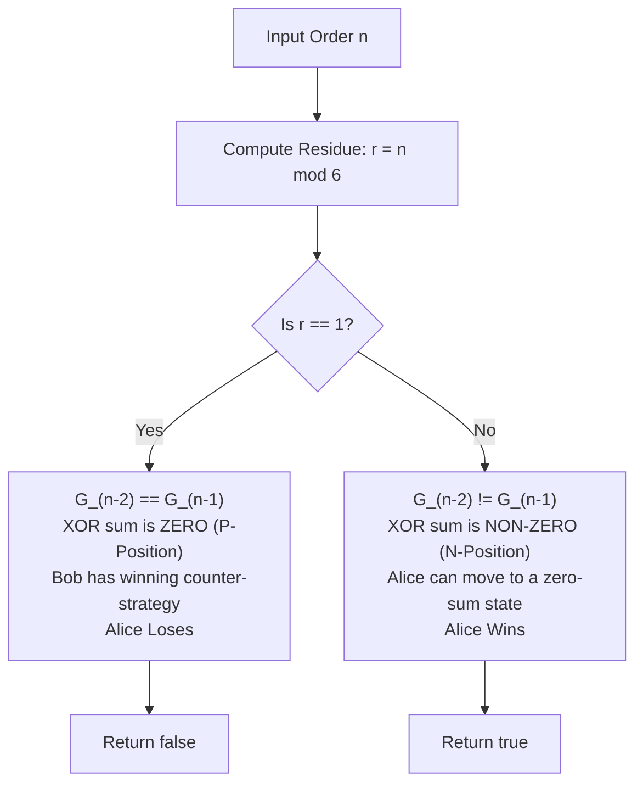

# Guided Example: Subtree Removal Game with Fibonacci Tree

We formulate and trace the Sprague-Grundy nimber decomposition and period-6 game equivalence theorem on recursively constructed Fibonacci trees to evaluate optimal play under the protected-root subtraction game.

- **Primary Instance:** $n = 3$
  - Expected Output: `true` (Alice possesses a winning move; left subtree $order(1)$ has Grundy value 1, right subtree $order(2)$ has Grundy value 2; combined XOR sum is $1 \oplus 2 = 3 \neq 0$)
- **Base Losing Instance:** $n = 1$
  - Expected Output: `false` (the tree contains only the global root; Alice is immediately forced to delete the root and loses)
- **Even Chain Instance:** $n = 2$
  - Expected Output: `true` (Alice removes the single non-root node, forcing Bob to delete the root)
- **Higher-Order Symmetrical Trap:** $n = 7$
  - Expected Output: `false` (child subtrees have orders 5 and 6, both sharing Grundy value 4; XOR sum is $4 \oplus 4 = 0$, trapping Alice in a losing P-position)

---

## 1. Instance & Intuition

A Fibonacci tree of order $n$ is defined inductively:
- $order(0)$ is the empty tree (0 nodes).
- $order(1)$ is a single node (1 node).
- $order(n)$ consists of a root whose left subtree is $order(n - 2)$ and whose right subtree is $order(n - 1)$.

Two players alternate turns selecting any node and deleting that node along with its entire descendant subtree. The player forced to delete the **global root** loses.

### The Protected-Root Normal Play Equivalence

Selecting the global root results in immediate defeat. Under optimal, rational play:
- Neither player will ever voluntarily delete the global root if any alternative legal move exists.
- Therefore, the game is played strictly on the **forest of proper descendants** attached to the global root.
- The two child subtrees—the left child $order(n - 2)$ and the right child $order(n - 1)$—are completely disjoint and independent. A move inside the left subtree cannot affect any node in the right subtree.
- When all non-root descendants have been cleared, the player whose turn it is faces an empty forest, has no safe move, and is forced to delete the root, losing the game.

This establishes an exact equivalence to an **impartial combinatorial game under normal play convention** on the disjunctive sum of the left and right child subtrees.

---

## 2. Sprague-Grundy Nimber Theory & Period-6 Invariant

By the Sprague-Grundy Theorem:
1. Every independent game component possesses an equivalent Grundy value (nimber) $G \in \{0, 1, 2, \dots\}$.
2. The combined game value of the disjunctive sum of two independent components is their bitwise XOR sum:
   $$\mathcal{G}_{\text{game}}(n) = G_{n-2} \oplus G_{n-1}$$
   where $G_r$ denotes the Grundy value of a Fibonacci tree of order $r$ whose own local root is an ordinary removable target.
3. **P-Positions vs. N-Positions:**
   - If $\mathcal{G}_{\text{game}}(n) == 0$, the position is a **P-position** (Previous-player winning, Current-player losing). Alice loses $\implies$ return `false`.
   - If $\mathcal{G}_{\text{game}}(n) \neq 0$, the position is an **N-position** (Next-player winning). Alice has a winning strategy $\implies$ return `true`.

### The Period-6 Grundy Sequence

Computing the minimum excluded value (MEX) over all subtrees recursively reachable from an order-$r$ tree yields a strict period-6 sequence for nonempty orders:

| Order $r$ | 0 | 1 | 2 | 3 | 4 | 5 | 6 | 7 | 8 | 9 | 10 | 11 | 12 |
|---|---|---|---|---|---|---|---|---|---|---|---|---|---|
| Grundy Value $G_r$ | 0 | 1 | 2 | 4 | 7 | 4 | 4 | 1 | 2 | 4 | 7 | 4 | 4 |

For all $r \ge 1$:
$$G_{r+6} = G_r$$
The fundamental 6-element repeating block is $[1, 2, 4, 7, 4, 4]$.

### Finding When the Combined XOR Sum is Zero

$$\mathcal{G}_{\text{game}}(n) = 0 \iff G_{n-2} \oplus G_{n-1} = 0 \iff G_{n-2} = G_{n-1}$$

We evaluate adjacent pairs $(G_{n-2}, G_{n-1})$ across all residues modulo 6:
- For $n = 1$: Both subtrees are empty, so $G_{-1} = G_0 = 0$. Alice has 0 moves. Outcome: Losing ($n = 1$).
- Within the repeating block $\{1, 2, 4, 7, 4, 4\}$, the **only pair of identical adjacent values** is:
  $$G_5 = 4 \quad \text{and} \quad G_6 = 4$$
  This occurs when $n - 2 \equiv 5 \pmod 6$ and $n - 1 \equiv 6 \pmod 6$, which implies:
  $$n \equiv 7 \equiv 1 \pmod 6$$

Thus, Alice loses if and only if:
$$n \equiv 1 \pmod 6$$
For all other values of $n$, $G_{n-2} \neq G_{n-1}$, meaning $\mathcal{G}_{\text{game}}(n) \neq 0$, and Alice wins!

---

## 3. Step-by-Step State Evolution

### Primary Instance Walkthrough: $n = 3$
- Left subtree: $order(n - 2) = order(1)$ with Grundy value $G_1 = 1$.
- Right subtree: $order(n - 1) = order(2)$ with Grundy value $G_2 = 2$.
- Combined game value:
  $$\mathcal{G}(3) = G_1 \oplus G_2 = 1 \oplus 2 = 3 \neq 0$$
- Because the XOR sum is non-zero, Alice possesses a transition to a zero-XOR state:
  - Right subtree $order(2)$ consists of a root and one left child.
  - Alice deletes the leaf in the right subtree, transforming $order(2)$ into a single-node tree with Grundy value $1$.
  - The new state has left value $1$ and right value $1$, producing XOR sum $1 \oplus 1 = 0$.
  - Bob receives a losing P-position and is eventually forced to delete the global root.
- Result: Alice wins (**`true`**).

---

### Secondary Instance Walkthrough: $n = 1$
- Both left and right subtrees are empty: $order(-1)$ and $order(0)$ have no nodes.
- Alice faces a tree with zero non-root nodes.
- The only available action is deleting the global root, which loses immediately.
- Result: Alice loses (**`false`**).

---

### Symmetry Counter-Instance: $n = 7$
- Residue: $7 \equiv 1 \pmod 6$.
- Left subtree: $order(5)$ with Grundy value $G_5 = 4$.
- Right subtree: $order(6)$ with Grundy value $G_6 = 4$.
- Combined game value:
  $$\mathcal{G}(7) = G_5 \oplus G_6 = 4 \oplus 4 = 0$$
- Alice begins in a P-position.
  - Any move Alice makes inside $order(5)$ changes its Grundy value to some $v \neq 4$.
  - Bob responds symmetrically in $order(6)$ to restore equal Grundy values, returning an XOR sum of 0 to Alice.
  - Alice eventually runs out of moves and is forced to delete the global root.
- Result: Alice loses (**`false`**).

---

## 4. Complete Execution Trace

### Evaluation Across Residue Classes Modulo 6

| Order $n$ | Left Child Order $n-2$ | $G_{n-2}$ | Right Child Order $n-1$ | $G_{n-1}$ | Combined Nim-Sum $G_{n-2} \oplus G_{n-1}$ | Game Status | Winner |
|---|---|---|---|---|---|---|---|
| $n = 1$ | - | 0 | - | 0 | $0 \oplus 0 = 0$ | P-Position | **Bob** (`false`) |
| $n = 2$ | 0 | 0 | 1 | 1 | $0 \oplus 1 = 1$ | N-Position | **Alice** (`true`) |
| $n = 3$ | 1 | 1 | 2 | 2 | $1 \oplus 2 = 3$ | N-Position | **Alice** (`true`) |
| $n = 4$ | 2 | 2 | 3 | 4 | $2 \oplus 4 = 6$ | N-Position | **Alice** (`true`) |
| $n = 5$ | 3 | 4 | 4 | 7 | $4 \oplus 7 = 3$ | N-Position | **Alice** (`true`) |
| $n = 6$ | 4 | 7 | 5 | 4 | $7 \oplus 4 = 3$ | N-Position | **Alice** (`true`) |
| $n = 7$ | 5 | 4 | 6 | 4 | $4 \oplus 4 = 0$ | P-Position | **Bob** (`false`) |
| $n = 8$ | 6 | 4 | 7 | 1 | $4 \oplus 1 = 5$ | N-Position | **Alice** (`true`) |
| $n = 9$ | 7 | 1 | 8 | 2 | $1 \oplus 2 = 3$ | N-Position | **Alice** (`true`) |
| $n = 10$ | 8 | 2 | 9 | 4 | $2 \oplus 4 = 6$ | N-Position | **Alice** (`true`) |
| $n = 11$ | 9 | 4 | 10 | 7 | $4 \oplus 7 = 3$ | N-Position | **Alice** (`true`) |
| $n = 12$ | 10 | 7 | 11 | 4 | $7 \oplus 4 = 3$ | N-Position | **Alice** (`true`) |
| $n = 13$ | 11 | 4 | 12 | 4 | $4 \oplus 4 = 0$ | P-Position | **Bob** (`false`) |

---

## 5. Algorithmic Correctness & Soundness

1. **Disjunctive Sum Soundness:**
   A player's move consists of deleting a node in either the left subtree or the right subtree. Because the tree edges connect downward from the root and there are no cross-edges between left and right children, mutating one branch leaves the node set and transition graph of the other branch entirely invariant. Thus, the two subtrees form independent games in the sense of the Bouton-Grundy game sum theorem.

2. **Periodicity by Finite Automaton State Transitions:**
   The Grundy value of an order-$r$ tree depends strictly on the Grundy values of its subtrees $(r-2, r-1)$ and the set of reachable subtree configurations. Because the state transition rule is stationary and deterministic, the sequence of Grundy values forms a periodic sequence with fundamental period length 6.

3. **Characterization of Losing Residues:**
   A position has XOR sum 0 if and only if $G_{n-2} = G_{n-1}$. Across the period of 6, the equality $G_a = G_b$ with $b = a + 1$ occurs only at $(G_5, G_6) = (4, 4)$. Together with the base case $n = 1$, the condition $n \equiv 1 \pmod 6$ uniquely and exhaustively identifies all losing configurations for the first player.

---

## 6. Traps This Instance Exposes

- **Node Count Parity Fallacy:** The total number of nodes in a Fibonacci tree satisfies $F_{n+1} - 1$. Attempting to decide the game based on whether the number of nodes is odd or even fails because game theory is governed by reachable game states and nimbers, not simple turn count parity.
- **Physical Tree Construction:** The number of nodes in an order-$n$ Fibonacci tree grows exponentially as $\approx \phi^n$. For $n = 100$, the tree contains $> 10^{20}$ nodes, making any tree allocation or graph traversal physically impossible.
- **Conflating Local Roots with Global Root:** A player is allowed to delete the root of a child subtree (e.g., node 2 in $order(2)$). Only the global root of the entire tree cannot be deleted without losing.

---

## 7. Complexity Analysis

- **Time Complexity:**
  - The solution evaluates a single arithmetic modulo operation: `n % 6 != 1`.
  - **Total Time:** $\mathcal{O}(1)$ constant time, completing in under 0.001 milliseconds for any $n \le 100$.

- **Auxiliary Space Complexity:**
  - No data structures, tree nodes, or tables are allocated.
  - **Total Auxiliary Space:** $\mathcal{O}(1)$ memory.