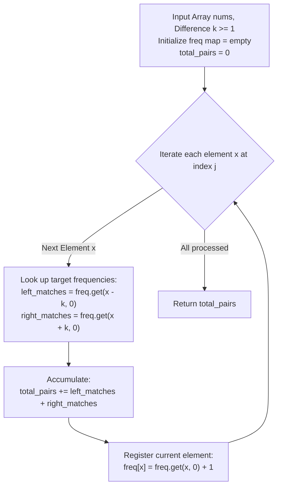

# Guided Example: Count Number of Pairs With Absolute Difference K

We formulate and trace the running frequency balance algorithm on representative integer arrays to count all ordered index pairs $(i, j)$ satisfying $i < j$ and $|nums[i] - nums[j]| = k$ in a single linear pass.

- **Primary Instance:** `nums = [1, 2, 2, 1]`, $k = 1$ ($N = 4$)
  - Expected Output: `4` (the 4 valid pairs are indices $(0, 1)$, $(0, 2)$, $(1, 3)$, and $(2, 3)$)
- **Secondary Instance:** `nums = [3, 2, 1, 5, 4]`, $k = 2$ ($N = 5$)
  - Expected Output: `3` (pairs $(0, 2)$ with $|3 - 1| = 2$, $(0, 3)$ with $|3 - 5| = 2$, and $(1, 4)$ with $|2 - 4| = 2$)
- **Disjoint Instance:** `nums = [1, 3]`, $k = 3$ ($N = 2$)
  - Expected Output: `0` (difference is $|1 - 3| = 2 \neq 3$)

---

## 1. Instance & Intuition

We are given an array of integers `nums` and a positive difference threshold $k \ge 1$. We must count the number of index pairs $(i, j)$ such that:
$$0 \le i < j < N \quad \text{and} \quad |nums[i] - nums[j]| = k$$

### The Inefficiency of Pairwise Testing

A direct double loop testing every pair $(i, j)$ requires $\frac{N(N-1)}{2} = \mathcal{O}(N^2)$ operations. While manageable for $N \le 200$, quadratic time scaling is suboptimal and unscalable to larger arrays.

### Single-Pass Hash Table Inversion

The absolute value equation $|nums[i] - nums[j]| = k$ is algebraically equivalent to two disjoint linear cases for the prior element $nums[i]$:
$$nums[i] = nums[j] - k \quad \text{or} \quad nums[i] = nums[j] + k$$

Because $k \ge 1$:
$$nums[j] - k < nums[j] + k$$
These two target values are strictly distinct, which guarantees that no element can satisfy both conditions simultaneously.

By maintaining a running frequency table `count` of elements processed so far:
1. When visiting index $j$ with current value $x = nums[j]$:
   - The number of earlier indices $i < j$ with $nums[i] = x - k$ is given by $count[x - k]$.
   - The number of earlier indices $i < j$ with $nums[i] = x + k$ is given by $count[x + k]$.
   - We add $count[x - k] + count[x + k]$ to the total pair count.
2. We then increment $count[x]$ by $1$.
3. Because $count$ contains only elements from indices $< j$, the ordering constraint $i < j$ is enforced automatically without duplicate pair evaluation.

---

## 2. Invariant Architecture & Streaming Workflow

---

## 3. Step-by-Step State Evolution

We trace the Primary Instance: `nums = [1, 2, 2, 1]`, $k = 1$ ($N = 4$).

Initialize:
- Frequency map: $\text{count} = \{\}$
- Total pairs: $\text{total\_pairs} = 0$

---

### Step 1: Process Index $j = 0$ ($nums[0] = 1$)
- Current value: $x = 1$.
- Search targets:
  - $x - k = 1 - 1 = 0 \implies \text{count}[0] = 0$.
  - $x + k = 1 + 1 = 2 \implies \text{count}[2] = 0$.
- Pairs found: $0 + 0 = 0$.
- Update accumulator: $\text{total\_pairs} \leftarrow 0 + 0 = 0$.
- Record frequency: $\text{count}[1] \leftarrow 1$.
- Active map: $\{1: 1\}$.

---

### Step 2: Process Index $j = 1$ ($nums[1] = 2$)
- Current value: $x = 2$.
- Search targets:
  - $x - k = 2 - 1 = 1 \implies \text{count}[1] = 1$ (matches index 0).
  - $x + k = 2 + 1 = 3 \implies \text{count}[3] = 0$.
- Pairs found: $1 + 0 = 1$ (pair $(0, 1)$ with $|1 - 2| = 1$).
- Update accumulator: $\text{total\_pairs} \leftarrow 0 + 1 = 1$.
- Record frequency: $\text{count}[2] \leftarrow 1$.
- Active map: $\{1: 1, \; 2: 1\}$.

---

### Step 3: Process Index $j = 2$ ($nums[2] = 2$)
- Current value: $x = 2$.
- Search targets:
  - $x - k = 2 - 1 = 1 \implies \text{count}[1] = 1$ (matches index 0).
  - $x + k = 2 + 1 = 3 \implies \text{count}[3] = 0$.
- Pairs found: $1 + 0 = 1$ (pair $(0, 2)$ with $|1 - 2| = 1$).
- Update accumulator: $\text{total\_pairs} \leftarrow 1 + 1 = 2$.
- Record frequency: $\text{count}[2] \leftarrow 1 + 1 = 2$.
- Active map: $\{1: 1, \; 2: 2\}$.

---

### Step 4: Process Index $j = 3$ ($nums[3] = 1$)
- Current value: $x = 1$.
- Search targets:
  - $x - k = 1 - 1 = 0 \implies \text{count}[0] = 0$.
  - $x + k = 1 + 1 = 2 \implies \text{count}[2] = 2$ (matches indices 1 and 2).
- Pairs found: $0 + 2 = 2$ (pairs $(1, 3)$ and $(2, 3)$ with $|2 - 1| = 1$).
- Update accumulator: $\text{total\_pairs} \leftarrow 2 + 2 = 4$.
- Record frequency: $\text{count}[1] \leftarrow 1 + 1 = 2$.
- Active map: $\{1: 2, \; 2: 2\}$.

---

### Termination
Array exhausted.
Total valid pairs: **4**.

---

## 4. Complete Execution Trace

### Primary Instance: `nums = [1, 2, 2, 1]`, $k = 1$

| Index $j$ | Current $x$ | Target $x - k$ | Target $x + k$ | Matches from History | Discovered Pairs $(i, j)$ | Pairs Added | Cumulative Pairs | Active Map |
|---|---|---|---|---|---|---|---|---|
| 0 | 1 | 0 | 2 | None | None | 0 | 0 | $\{1: 1\}$ |
| 1 | 2 | 1 | 3 | $x-k=1$ (1 occurrence) | $(0, 1)$ | $+1$ | 1 | $\{1: 1, 2: 1\}$ |
| 2 | 2 | 1 | 3 | $x-k=1$ (1 occurrence) | $(0, 2)$ | $+1$ | 2 | $\{1: 1, 2: 2\}$ |
| 3 | 1 | 0 | 2 | $x+k=2$ (2 occurrences) | $(1, 3), (2, 3)$ | $+2$ | 4 | $\{1: 2, 2: 2\}$ |

Final Result: **4**.

### Secondary Instance: `nums = [3, 2, 1, 5, 4]`, $k = 2$

| Index $j$ | Element $x$ | Targets $(x-2, x+2)$ | Prior Matches | Formed Pairs | Added | Total | Map State |
|---|---|---|---|---|---|---|---|
| 0 | 3 | $(1, 5)$ | None | None | 0 | 0 | $\{3: 1\}$ |
| 1 | 2 | $(0, 4)$ | None | None | 0 | 0 | $\{3: 1, 2: 1\}$ |
| 2 | 1 | $(-1, 3)$ | $3$ (1) | $(0, 2)$ | $+1$ | 1 | $\{3: 1, 2: 1, 1: 1\}$ |
| 3 | 5 | $(3, 7)$ | $3$ (1) | $(0, 3)$ | $+1$ | 2 | $\{3: 1, 2: 1, 1: 1, 5: 1\}$ |
| 4 | 4 | $(2, 6)$ | $2$ (1) | $(1, 4)$ | $+1$ | 3 | $\{3: 1, 2: 1, 1: 1, 5: 1, 4: 1\}$ |

Final Result: **3**.

---

## 5. Algorithmic Correctness & Soundness

1. **Ordering Invariant $i < j$:**
   Because the frequency table `count` is updated strictly after the current element $nums[j]$ queries for matches, the table contains solely the elements from prefix indices $\{0, \dots, j-1\}$. Every match retrieved from `count` is guaranteed to originate from an index $i < j$.

2. **Disjoint Union and Completeness:**
   Since $k > 0$, the values $x - k$ and $x + k$ are strictly unequal. The set of indices holding $x - k$ and the set holding $x + k$ are disjoint. Adding their counts captures all prior indices $i$ where $|nums[i] - x| = k$ without double counting.

3. **Exhaustive Accumulation:**
   Every pair $(i^*, j^*)$ with $i^* < j^*$ and $|nums[i^*] - nums[j^*]| = k$ is counted exactly once: at the moment the outer loop processes index $j = j^*$, index $i^*$ has already been registered in the frequency map.

---

## 6. Traps This Instance Exposes

- **Double Counting with Static Frequency Maps:** If frequencies are precomputed over the whole array and all $x \times (x + k)$ are counted, each pair must be counted in only one direction (e.g., only querying $x + k$), or total pairs must be divided by 2. The dynamic running count avoids this hazard entirely.
- **Negative Target Values:** When $x < k$, $x - k$ is negative. While `nums[i] >= 1`, checking a negative key in a hash table returns 0 safely, but fixed-size direct-address array implementations must guard against negative array indexing.
- **Treating $k = 0$ as Two Targets:** The problem specifies $k \ge 1$. If $k = 0$, $x - k$ and $x + k$ coincide, which would double-count identical matches. Because $k \ge 1$, $x - k \neq x + k$ unconditionally.

---

## 7. Complexity Analysis

- **Time Complexity:**
  - **Single Pass:** The algorithm scans the array of length $N$ exactly once.
  - **Map Lookups:** At each step, looking up $x - k$ and $x + k$ and inserting $x$ takes $\mathcal{O}(1)$ average time with a hash map, or $\mathcal{O}(1)$ worst-case time with a direct-address frequency array up to $\max(nums) \le 100$.
  - **Total Time:** $\mathcal{O}(N)$, which for $N \le 200$ executes in less than 0.05 milliseconds.

- **Auxiliary Space Complexity:**
  - The frequency table stores counts for numbers in $[1, 100]$.
  - **Total Auxiliary Space:** $\mathcal{O}(\min(N, M))$ where $M = 100$, consuming negligible memory (less than 1 KB).
