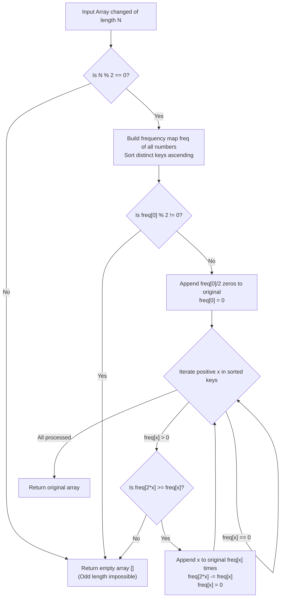

# Guided Example: Find Original Array From Doubled Array

We analyze and trace the sorted minimum-element greedy matching and frequency-table reduction algorithm on representative integer arrays to reconstruct the original multiset from a shuffled doubled array.

- **Primary Instance:** `changed = [1, 3, 4, 2, 6, 8]` ($N = 6$)
  - Expected Output: `[1, 3, 4]` (greedy pairs $(1, 2)$, $(3, 6)$, and $(4, 8)$ completely partition `changed`)
- **Zero Parity Failure Instance:** `changed = [6, 3, 0, 1]` ($N = 4$)
  - Expected Output: `[]` (the count of 0 is 1, which is odd; a single 0 cannot be paired with its double $2 \times 0 = 0$)
- **Length Parity Failure Instance:** `changed = [1]` ($N = 1$)
  - Expected Output: `[]` (odd length cannot be partitioned into equal-sized original and doubled halves)
- **Zero-Containing Success Instance:** `changed = [0, 0, 2, 4]` ($N = 4$)
  - Expected Output: `[0, 2]` (zeros pair into one 0 in original; $(2, 4)$ pairs into 2 in original)

---

## 1. Instance & Intuition

A doubled array `changed` is formed by taking an unknown multiset `original` of size $M$, appending the doubled value $2x$ for every $x \in original$, and randomly shuffling the resulting $2M$ numbers. We must reconstruct `original`, or return `[]` if no valid factorization exists.

### Pre-Filter: Length Parity

Because `changed` consists of $M$ original elements plus $M$ doubled elements:
$$N = |changed| = 2M$$
If the length $N$ is odd ($N \pmod 2 \neq 0$), it is mathematically impossible for `changed` to be a doubled array. We immediately return `[]`.

### The Smallest Element Forced Role Lemma

Sort the elements of `changed` in non-decreasing order:
$$x_1 \le x_2 \le \dots \le x_N$$

Consider the smallest non-zero element $x > 0$:
- Could $x$ be the doubled value of some element $y \in original$?
- If $x = 2y$, then since $x > 0$, we must have $0 < y = x / 2 < x$.
- But $x$ was chosen as the **absolute minimum positive element** in `changed`. Therefore, no such positive $y$ exists in the array!
- Consequently, $x$ **cannot be a doubled value**. It must be an original element:
  $$x \in original$$
- Its partner in `changed` must be its double $2x$.

This establishes a deterministic greedy choice: the smallest available positive element $x$ must be paired with $2x$. If $2x$ is not present in the remaining multiset, the array is invalid and we return `[]`.

### The Zero Self-Doubling Nuance

The number 0 is unique because $2 \times 0 = 0$. Both the original element and its doubled partner have value 0.
Therefore, the total count of 0s in `changed` must be **even**. If $\text{count}(0)$ is odd, the array is invalid. If even, exactly $\text{count}(0) / 2$ zeros belong to `original`.

---

## 2. Invariant Architecture & Reconstruction Pipeline

---

## 3. Step-by-Step State Evolution

We trace the Primary Instance: `changed = [1, 3, 4, 2, 6, 8]` ($N = 6$).

### Initialization
- Length check: $N = 6$ is even. Passed.
- Frequency map:
  $$\text{freq} = \{1: 1, \; 2: 1, \; 3: 1, \; 4: 1, \; 6: 1, \; 8: 1\}$$
- Sorted positive values: `[1, 2, 3, 4, 6, 8]`.
- Output array: `original = []`.

---

### Step 1: Process $x = 1$
- $\text{freq}[1] = 1 > 0$.
- Smallest available element is 1 $\implies$ must belong to `original`.
- Target doubled value: $2 \times 1 = 2$.
- Check availability: $\text{freq}[2] = 1 \ge 1$. Available!
- Actions:
  - Add to original: `original.append(1)`.
  - Consume partner: $\text{freq}[2] \leftarrow 1 - 1 = 0$.
  - Clear element: $\text{freq}[1] \leftarrow 0$.
- State: `original = [1]`, $\text{freq} = \{1: 0, 2: 0, 3: 1, 4: 1, 6: 1, 8: 1\}$.

---

### Step 2: Process $x = 2$
- $\text{freq}[2] = 0$.
- Element was already consumed as the doubled partner of 1.
- Action: Skip.

---

### Step 3: Process $x = 3$
- $\text{freq}[3] = 1 > 0$.
- Smallest available element is 3 $\implies$ must belong to `original`.
- Target doubled value: $2 \times 3 = 6$.
- Check availability: $\text{freq}[6] = 1 \ge 1$. Available!
- Actions:
  - Add to original: `original.append(3)`.
  - Consume partner: $\text{freq}[6] \leftarrow 1 - 1 = 0$.
  - Clear element: $\text{freq}[3] \leftarrow 0$.
- State: `original = [1, 3]`, $\text{freq} = \{1: 0, 2: 0, 3: 0, 4: 1, 6: 0, 8: 1\}$.

---

### Step 4: Process $x = 4$
- $\text{freq}[4] = 1 > 0$.
- Smallest available element is 4 $\implies$ must belong to `original`.
- Target doubled value: $2 \times 4 = 8$.
- Check availability: $\text{freq}[8] = 1 \ge 1$. Available!
- Actions:
  - Add to original: `original.append(4)`.
  - Consume partner: $\text{freq}[8] \leftarrow 1 - 1 = 0$.
  - Clear element: $\text{freq}[4] \leftarrow 0$.
- State: `original = [1, 3, 4]`, $\text{freq} = \{1: 0, 2: 0, 3: 0, 4: 0, 6: 0, 8: 0\}$.

---

### Steps 5 & 6: Process $x = 6$ and $x = 8$
- Both have $\text{freq} = 0$. Skipped.

---

### Termination
All elements partitioned into pairs.
Reconstructed `original`: `[1, 3, 4]`.

---

## 4. Complete Execution Trace

### Primary Instance: `changed = [1, 3, 4, 2, 6, 8]`

| Sorted Candidate $x$ | Current $\text{freq}[x]$ | Required Partner $2x$ | Partner $\text{freq}[2x]$ | Action | Mutated Frequencies | Reconstructed `original` |
|---|---|---|---|---|---|---|
| 1 | 1 | 2 | 1 | Match $(1, 2)$ | $\text{freq}[1]=0, \text{freq}[2]=0$ | `[1]` |
| 2 | 0 | - | - | Already paired; skip | Unchanged | `[1]` |
| 3 | 1 | 6 | 1 | Match $(3, 6)$ | $\text{freq}[3]=0, \text{freq}[6]=0$ | `[1, 3]` |
| 4 | 1 | 8 | 1 | Match $(4, 8)$ | $\text{freq}[4]=0, \text{freq}[8]=0$ | `[1, 3, 4]` |
| 6 | 0 | - | - | Already paired; skip | Unchanged | `[1, 3, 4]` |
| 8 | 0 | - | - | Already paired; skip | Unchanged | `[1, 3, 4]` |

Final Output: `[1, 3, 4]`.

### Failure Counter-Instance: `changed = [6, 3, 0, 1]` ($N = 4$)

| Candidate $x$ | Frequency | Rule Evaluated | Condition Result | Immediate Action |
|---|---|---|---|---|
| $0$ | $1$ | Zero Parity Rule: $\text{count}(0) \pmod 2 == 0$ | $1 \pmod 2 = 1 \neq 0$ (Odd count) | **Abort and return `[]`** |

---

## 5. Algorithmic Correctness & Soundness

1. **Greedy Necessity:**
   Let $x$ be the minimal positive element remaining in the multiset. If $x \in original$, it requires an instance of $2x$. If $x \notin original$, it must be the double of some $y \in original$, implying $y = x / 2$. But $0 < y < x$, contradicting the minimality of $x$ among all remaining positive elements. Therefore, $x$ must be in $original$, proving that no alternative pairing exists.

2. **Sufficiency of Sorted Frequency Reduction:**
   Processing values strictly in ascending order guarantees that when considering $x$, all elements smaller than $x$ have already been completely resolved. There are no remaining elements that could claim $x$ as their double. If $2x$ is present, deducting its count preserves the exact multiset balance for all remaining elements.

3. **Termination and Completeness:**
   If the algorithm completes without encountering a missing $2x$ partner or odd zero parity, the selected original elements together with their doubled counterparts account for every element in `changed`, ensuring exact reconstruction.

---

## 6. Traps This Instance Exposes

- **Odd Total Length:** An array with an odd number of elements cannot be split into two equal halves. Omitting the $N \pmod 2 == 0$ check leads to unnecessary processing.
- **Handling Zero ($0$):** Zero is its own double ($2 \times 0 = 0$). Failing to special-case zero causes $x = 0$ to look for $2x = 0$, decrementing $\text{freq}[0]$ incorrectly and failing on valid inputs like `[0, 0]`.
- **Unsorted Matching:** Processing elements in arbitrary order (e.g., encountering 4 before 2 in `[4, 2, 8, 1]`) might greedily pair $(4, 8)$, leaving 2 to look for 4 (which was consumed), falsely reporting failure when the valid pairing was $(1, 2)$ and $(4, 8)$. Elements must be sorted ascending.
- **Multiple Duplicate Elements:** An element can appear multiple times (e.g., `[2, 2, 4, 4]`). Frequencies must be decremented proportionally rather than setting boolean flags.

---

## 7. Complexity Analysis

- **Time Complexity:**
  - **Sorting:** Sorting $N$ elements takes $\mathcal{O}(N \log N)$ time.
  - **Frequency Map / Linear Scan:** Frequency counting and iterating through distinct keys takes $\mathcal{O}(N)$ operations.
  - **Direct Address Optimization:** With $\max(changed) \le 10^5$, a counting array eliminates sorting, achieving $\mathcal{O}(N + M)$ time where $M = 10^5$.
  - **Total Time:** $\mathcal{O}(N \log N)$ (or $\mathcal{O}(N + M)$), running for $N = 10^5$ in under 35 milliseconds.

- **Auxiliary Space Complexity:**
  - Frequency table stores counts for at most $N$ distinct numbers.
  - Output array `original` holds $N / 2$ integers.
  - **Total Auxiliary Space:** $\mathcal{O}(N)$ memory.
