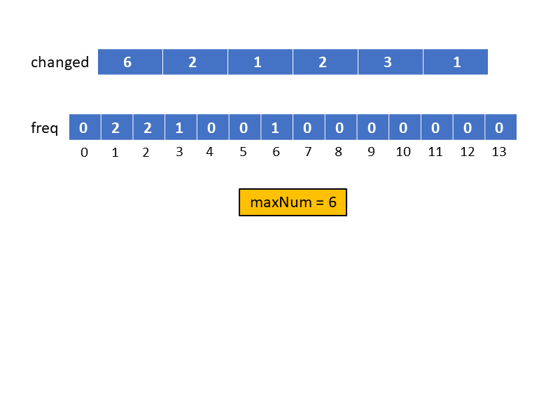
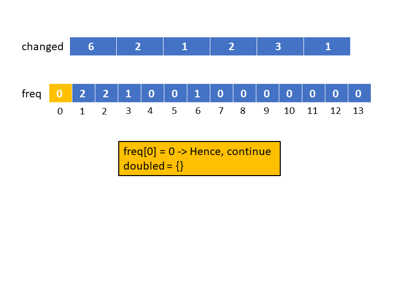
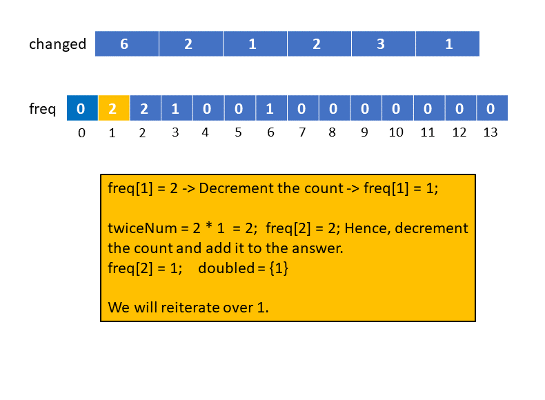
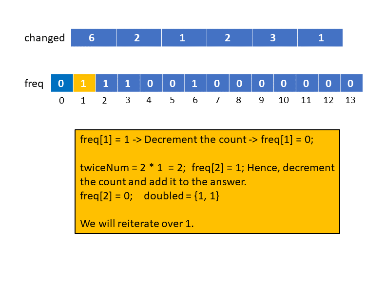
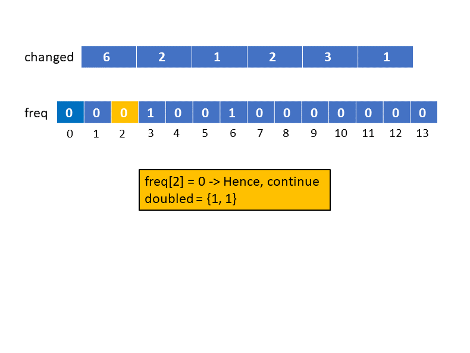
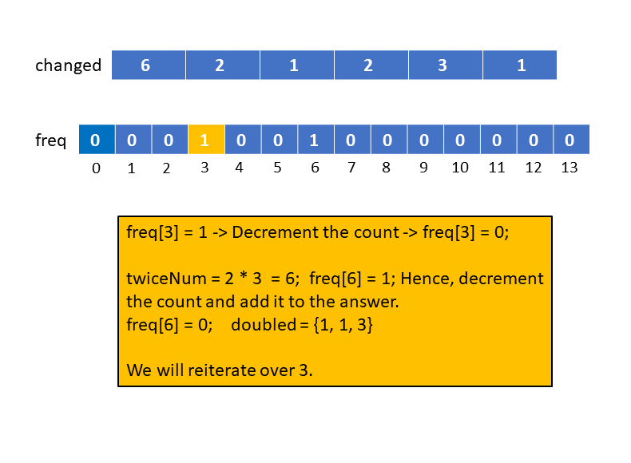
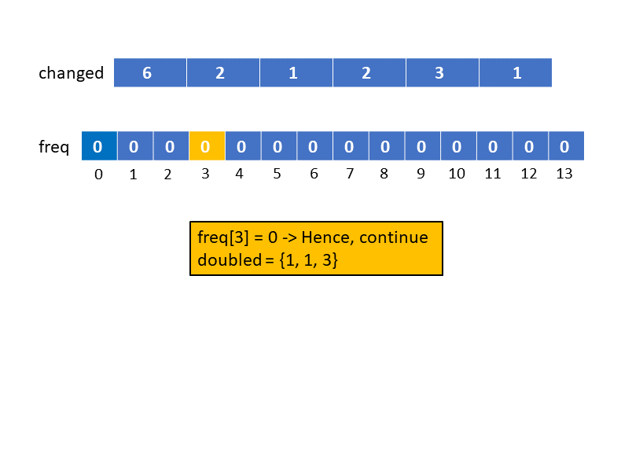
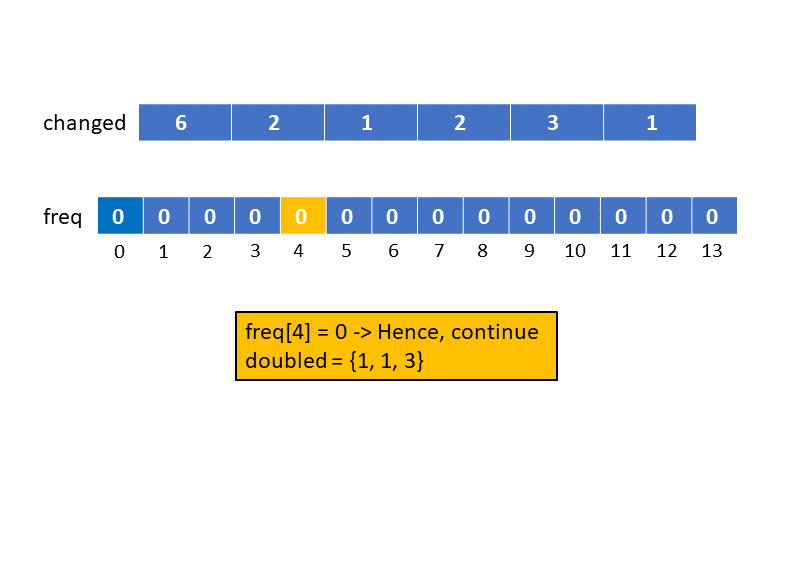
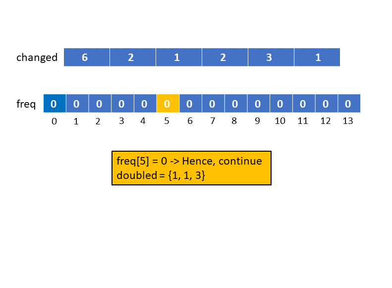
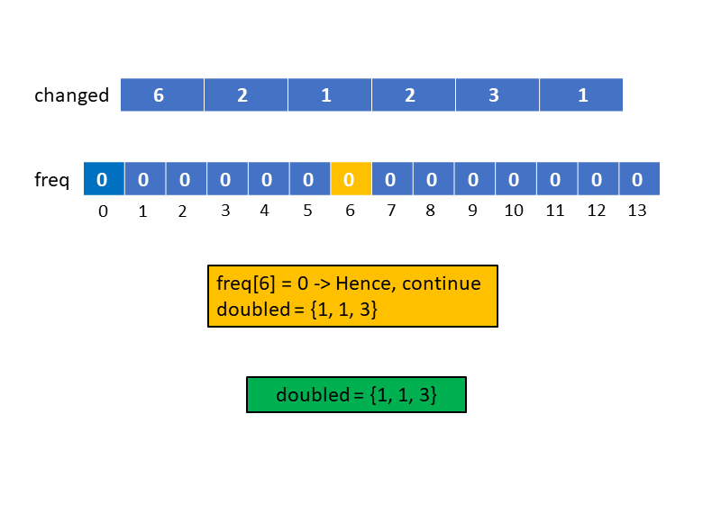

[TOC]

## Solution

---

### Overview

We need to find if the given array is `doubled` array or not. In a `doubled` array, for every element `X` in the array, we should either have `2X` or `X/2` in the array.

This implies that in the `doubled` array, for every element `X` we will have to check for two options and if we can pair up all the elements using these options then we can deduce that the array is doubled. This approach is, however not efficient as well as complicated. The complexity of the above approach lies in the two options at each step, can we do something to make it easy to choose the transition from an element? Can we choose such an element say `X` that makes it trivial to choose one of `X/2` and `2X`?

If `X` is the smallest element in the array then element `X/2` will not exist in the array, hence we will have to check for element `2X`. Similarly, if `X` is the greatest element in the array then element `2X` will not exist in the array, hence we will have to check for `X/2` only. Therefore, the trick is to go for the smallest or greatest element always because this way we will have only one option to go for. In the two approaches below we chose the smallest element always.
</br>

---

### Approach 1: Sort + HashMap

**Intuition**

We need to pair up elements in the array as explained above. Thus, the first validation we should do is, if the array size is even or not. If it's not we cannot have an answer.

Now, as per the above discussion, we need to find the smallest element at each iteration. Hence, we can sort the original array in increasing order, then iterating from left to right will provide us with the smallest element. Once we got the smallest element say `X` we need to check if the element `2X` exists in the array or not. To check this, we can store the array elements in a HashMap for an efficient lookup at each iteration. If the element `2X` is present in the HashMap we will decrement its count else the element `X` cannot be paired with any other element and hence we return an empty array.

**Algorithm**

1. Return empty array `{}` if the size of the given array `changed` is odd.
2. Sort the array `changed` in increasing order.
3. Store the element count in the HashMap `freq`. Iterate over the elements in the array `changed` and increment the count corresponding to the element in the map.
4. Iterate over the elements in the array `changed`, for each element `num`:
- Check if the count of `num` in the map `freq` is more than zero or not.
- Decrement the frequency of `num` in the map.
- Check if the count of `twiceNum` ($2 * num$)  in the map `freq` is positive or not. If it is then decrement the count and add the element `num` to the answer array `original`.
   - If it is not, then return an empty `{}` array.
5. Return the array `original`.

**Note:** This approach requires modifying the input. In an interview setting, we should first confirm it with the interviewer.

**Implementation**

```cpp
class Solution {
public:
    vector<int> findOriginalArray(vector<int>& changed) {
        // It can't be doubled array, if the size is odd
        if (changed.size() % 2) {
            return {};
        }

        // Sort in ascending order
        sort(changed.begin(), changed.end());
        unordered_map<int, int> freq;
        // Store the frequency in the map
        for (int num : changed) {
            freq[num]++;
        }

        vector<int> original;
        for (int num : changed) {
            // If element exists
            if (freq[num]) {
				freq[num]--;
                int twiceNum = num * 2;
                if (freq[twiceNum] > 0) {
                    // Pair up the elements, decrement the count
                    freq[twiceNum]--;
                    // Add the original number to answer
                    original.push_back(num);
                } else {
                    return {};
                }
            }
        }

        return original;
    }
};
```

**Complexity Analysis**

Here, $N$ is the size of the given array.

* Time complexity: $O(N\log N)$

  Sorting the array `changed` will take $O(N\log N)$ and then we iterate over it which will take $O(N)$ time. Hence, the time complexity is equal to $O(N\log N)$.

* Space complexity: $O(N)$

  Storing the element frequency in the HashMap `freq` will require $O(N)$ space. Some space will be used for sorting the list. The space complexity of the sorting algorithm depends on the implementation of each programming language. For instance, in Java, the `Arrays.sort()` for primitives is implemented as a variant of the quicksort algorithm whose space complexity is $O(\log N)$. In C++, the common implementation of `std::sort()` function provided by STL is a hybrid of Quick Sort, Heap Sort, and Insertion Sort and has a worst-case space complexity of $O(\log N)$. Thus, the use of the inbuilt `std::sort()` function might add up to $O(\log N)$ to space complexity.
<br/>

---

### Approach 2: Counting Sort

**Intuition**

Similar to the previous approach, we will find the smallest element always. The only difference here is that instead of sorting the original array using built-in sorting functions we will use counting sort. We will use an array `freq` to store the frequency of each element in the given array. Now, we will iterate from `0` to the maximum value that is present in the array. For each element `num`  we will follow the exact same process as we did previously, we check for the element $2 * num$ and proceed accordingly.

Note that for every element we will be iterating once however there might be multiple instances of it in the original array. Hence, once we iterate over an element we will decrement the counter to reiterate it, this time if the instances are over the `if` condition will fail and we move to the next number.

**Algorithm**

1. Return empty array `{}` if the size of the given array `changed` is odd.
2. Find the maximum element present in the array `changed`  and store it in the variable `maxNum`.
3. Declare the array `freq` with size $2 * maxNum + 1$ and initialize the indices to `0`. This is because we will iterate over numbers upto `maxNum` and hence we might check for $2 * maxNum$ in the `freq` array.
4. Iterate over the numbers from `0` to `maxNum`, for each element `num`:
- Check if the count of `num` in the map `freq` is more than zero or not.
- Decrement the frequency of `num` in the map.
- Check if the count of `twiceNum` ($2 * num$)  in the map `freq` is positive or not. If it is then decrement the count and add the element `num` to the answer array `original`. Also decrement the value of `num` to reiterate it.
   - If it is not, then return an empty `{}` array.
5. Return the array `original`.

The following slideshow demonstrates the algorithm:





















 <br>

**Implementation**

```cpp
class Solution {
public:
    vector<int> findOriginalArray(vector<int>& changed) {
        // It can't be doubled array, if the size is odd
        if (changed.size() % 2) {
            return {};
        }

        int maxNum = 0;
        // Find the max element in the array
        for (int num : changed) {
            maxNum = max(maxNum, num);
        }

        vector<int> freq(2 * maxNum + 1, 0);
        // Store the frequency in the map
        for (int num : changed) {
            freq[num]++;
        }

        vector<int> original;
        for (int num = 0; num <= maxNum; num++) {
            // If element exists
            if (freq[num]) {
                freq[num]--;

                int twiceNum = num * 2;
                if (freq[twiceNum] > 0) {
                    // Pair up the elements, decrement the count
                    freq[twiceNum]--;
                    // Add the original number to answer
                    original.push_back(num);
                    num--;
                } else {
                    return {};
                }
            }
        }

        return original;
    }
};
```

**Complexity Analysis**

Here, $N$ is the size of the given array, and $K$ is equal to the maximum number in the array `changed`.

* Time complexity: $O(N + K)$

  The time to find the greatest element in the array is $O(N)$, similarly storing the element frequency in the array `freq` is $O(N)$. We iterate over the numbers from $0$ to $K$ to pair up the elements, hence the time required will be $O(K)$. Hence, the total time complexity will be equal to $(N + K)$.

* Space complexity: $O(K)$

   The space required for the array `freq` will be equal to $O(K)$. Therefore, the space complexity will be equal to $O(K)$.
<br/>

---