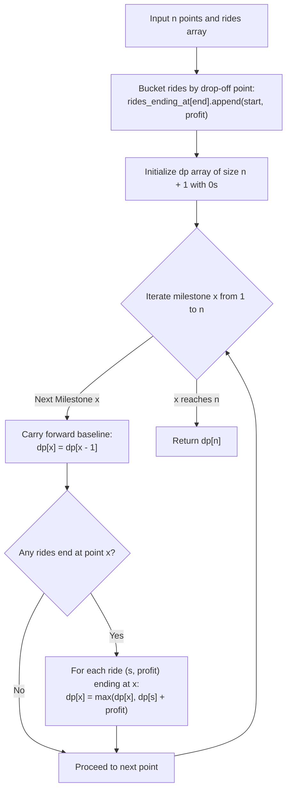

# Guided Example: Maximum Earnings From Taxi

We formulate and trace the point-bucketed dynamic programming and weighted interval scheduling algorithm along a 1D travel corridor to maximize cumulative taxi fare and tip earnings.

- **Primary Instance:** $n = 20$, `rides = [[1, 6, 1], [3, 10, 2], [10, 12, 3], [11, 12, 2], [12, 15, 2], [13, 18, 1]]`
  - Expected Output: `20` (optimal ride chain: $[3, 10]$ earning 9, $[10, 12]$ earning 5, and $[13, 18]$ earning 6; total = $9 + 5 + 6 = 20$)
- **Secondary Instance:** $n = 5$, `rides = [[2, 5, 4], [1, 5, 1]]`
  - Expected Output: `7` (passenger $[2, 5, 4]$ yields $5 - 2 + 4 = 7$, beating $[1, 5, 1]$ which yields $5 - 1 + 1 = 5$)

---

## 1. Instance & Intuition

A taxi drives in a fixed forward direction along a road spanning points $1$ through $n$. There are passenger ride requests $[start_i, end_i, tip_i]$:
- The taxi can carry **at most one passenger** at any given moment.
- The monetary earnings from passenger $i$ equal:
  $$\text{profit}_i = end_i - start_i + tip_i$$
- Seamless transfers are permitted: dropping off a passenger at milestone $p$ allows picking up a new passenger at that exact same milestone $p$.

We must choose a compatible subset of non-overlapping rides that maximizes total profit.

### Weighted Interval Scheduling & Point-Indexed DP

This is an exact instance of the classic **Weighted Interval Scheduling** problem.
Because the road milestones are bounded by $n \le 10^5$, instead of running an $\mathcal{O}(M \log M)$ sorting and binary search algorithm over the $M$ rides, we can group rides by their **drop-off destination** $end_i$ and march forward point by point along the road in linear time $\mathcal{O}(n + M)$.

Let $dp[x]$ denote the maximum earnings possible after reaching road point $x \in [1, n]$.
At any point $x$:
1. **Idle / Transit Step:** The taxi may simply drive from $x - 1$ to $x$ without completing any ride at $x$. The earnings match the best earnings up to point $x - 1$:
   $$\text{candidate} = dp[x - 1]$$
2. **Ride Completion Step:** The taxi may drop off a passenger who was picked up at $s < x$ with tip $t$. The earnings equal the optimal profit achievable before picking up this passenger ($dp[s]$) plus the revenue generated by this trip:
   $$\text{candidate} = dp[s] + (x - s + t)$$

Taking the maximum over all possibilities yields the recurrence:
$$dp[x] = \max\left(dp[x - 1], \; \max_{(s, x, t) \in \text{rides}} \Big(dp[s] + x - s + t\Big)\right)$$

---

## 2. Invariant Architecture & DP Recurrence

---

## 3. Step-by-Step State Evolution

We trace the Primary Instance: $n = 20$.
Rides:
- Ride 1: $[1, 6, 1] \implies \text{profit} = 6 - 1 + 1 = 6$
- Ride 2: $[3, 10, 2] \implies \text{profit} = 10 - 3 + 2 = 9$
- Ride 3: $[10, 12, 3] \implies \text{profit} = 12 - 10 + 3 = 5$
- Ride 4: $[11, 12, 2] \implies \text{profit} = 12 - 11 + 2 = 3$
- Ride 5: $[12, 15, 2] \implies \text{profit} = 15 - 12 + 2 = 5$
- Ride 6: $[13, 18, 1] \implies \text{profit} = 18 - 13 + 1 = 6$

---

### Milestone Progression ($x = 1 \dots 20$)

- **$x = 1 \dots 5$:** No rides end.
  $$dp[1] = dp[2] = dp[3] = dp[4] = dp[5] = 0$$

- **$x = 6$:** Ride 1 ends ($s = 1$, profit = 6).
  $$dp[6] = \max(dp[5], \; dp[1] + 6) = \max(0, 0 + 6) = 6$$

- **$x = 7 \dots 9$:** No rides end.
  $$dp[7] = dp[8] = dp[9] = dp[6] = 6$$

- **$x = 10$:** Ride 2 ends ($s = 3$, profit = 9).
  $$dp[10] = \max(dp[9], \; dp[3] + 9) = \max(6, 0 + 9) = 9$$

- **$x = 11$:** No rides end.
  $$dp[11] = dp[10] = 9$$

- **$x = 12$:** Two rides end:
  - Ride 3 ($s = 10$, profit = 5): $dp[10] + 5 = 9 + 5 = 14$.
  - Ride 4 ($s = 11$, profit = 3): $dp[11] + 3 = 9 + 3 = 12$.
  - Baseline: $dp[11] = 9$.
  $$dp[12] = \max(9, 14, 12) = 14$$

- **$x = 13 \dots 14$:** No rides end.
  $$dp[13] = dp[14] = dp[12] = 14$$

- **$x = 15$:** Ride 5 ends ($s = 12$, profit = 5).
  $$dp[15] = \max(dp[14], \; dp[12] + 5) = \max(14, 14 + 5) = 19$$

- **$x = 16 \dots 17$:** No rides end.
  $$dp[16] = dp[17] = dp[15] = 19$$

- **$x = 18$:** Ride 6 ends ($s = 13$, profit = 6).
  - Transit baseline: $dp[17] = 19$.
  - Ride 6 value: $dp[13] + 6 = 14 + 6 = 20$.
  $$dp[18] = \max(19, 20) = 20$$

- **$x = 19 \dots 20$:** No rides end.
  $$dp[19] = dp[20] = dp[18] = 20$$

Final maximum earnings: **20**.

---

## 4. Complete Execution Trace

### Primary Instance Milestone DP Table

| Milestone $x$ | Incoming Baseline $dp[x-1]$ | Completed Rides $(s \to x)$ | Ride Earnings ($x - s + tip$) | Evaluation Candidates | Final $dp[x]$ |
|---|---|---|---|---|---|
| $1 \dots 5$ | 0 | None | - | 0 | 0 |
| 6 | 0 | $1 \to 6$ ($tip=1$) | $6 - 1 + 1 = 6$ | $\max(0, 0 + 6)$ | 6 |
| $7 \dots 9$ | 6 | None | - | 6 | 6 |
| 10 | 6 | $3 \to 10$ ($tip=2$) | $10 - 3 + 2 = 9$ | $\max(6, 0 + 9)$ | 9 |
| 11 | 9 | None | - | 9 | 9 |
| 12 | 9 | $10 \to 12$ ($tip=3$) $11 \to 12$ ($tip=2$) | $12 - 10 + 3 = 5$ $12 - 11 + 2 = 3$ | $\max(9, 9 + 5, 9 + 3)$ | 14 |
| $13 \dots 14$ | 14 | None | - | 14 | 14 |
| 15 | 14 | $12 \to 15$ ($tip=2$) | $15 - 12 + 2 = 5$ | $\max(14, 14 + 5)$ | 19 |
| $16 \dots 17$ | 19 | None | - | 19 | 19 |
| 18 | 19 | $13 \to 18$ ($tip=1$) | $18 - 13 + 1 = 6$ | $\max(19, 14 + 6)$ | 20 |
| $19 \dots 20$ | 20 | None | - | 20 | 20 |

Final Answer: **20**.

### Secondary Instance Trace: $n = 5$

| Milestone $x$ | Completed Rides | Formula | Selected $dp[x]$ |
|---|---|---|---|
| $1 \dots 4$ | None | Baseline propagation | 0 |
| 5 | $[2 \to 5]$ (gain 7) $[1 \to 5]$ (gain 5) | $\max(dp[4], dp[2]+7, dp[1]+5) = \max(0, 7, 5)$ | **7** |

Final Answer: **7**.

---

## 5. Algorithmic Correctness & Soundness

1. **Optimal Substructure:**
   Consider an optimal sequence of non-overlapping rides ending at or before point $x$. Either no ride ends exactly at $x$ (in which case the optimal earnings equal $dp[x-1]$), or some ride ending at $x$ from start point $s$ is included. Because time only flows forward, the optimal schedule preceding this ride cannot utilize any time after $s$. Hence, the maximum earnings achievable prior to this trip is precisely $dp[s]$.

2. **Feasibility of Seamless Handoffs:**
   Because a ride ending at $x$ leaves the taxi at point $x$, another passenger starting at $x$ can immediately board without overlapping in travel time. The condition $s \le x$ accurately models valid consecutive pick-ups.

3. **Monotonicity:**
   Because $dp[x] = \max(dp[x-1], \dots)$, $dp[x] \ge dp[x-1]$ holds for all $x$. The earnings never decrease as the taxi advances forward.

---

## 6. Traps This Instance Exposes

- **Greedy by Profit Density:** Choosing rides with the highest profit per mile (or highest tip) fails because a short, highly profitable ride may block a sequence of longer rides that yield a much higher combined sum. Dynamic programming is required.
- **Forgetting the Base Distance Earnings:** The earnings formula is $end - start + tip$, not just $tip$. Missing the mileage component severely undercounts revenue.
- **Concurrent Passenger Overlap:** A ride $[s, e]$ occupies the taxi for the open interval $(s, e)$. Allowing another ride to start strictly before $e$ violates the single-passenger capacity constraint.
- **Integer Overflow:** With $n \le 10^5$, $M \le 3 \cdot 10^4$, and tips up to $10^5$, cumulative earnings can exceed $3 \cdot 10^4 \times 2 \cdot 10^5 = 6 \times 10^9$, exceeding 32-bit signed integers. 64-bit integers must be used for DP states.

---

## 7. Complexity Analysis

- **Time Complexity:**
  - **Bucketing Rides:** Appending $M$ rides into adjacency lists indexed by $end$ takes $\mathcal{O}(M)$ time.
  - **DP Linear Scan:** The outer loop runs $n$ times. Across all iterations, each ride is evaluated as an incoming relaxation exactly once.
  - **Total Operations:** $\mathcal{O}(n + M)$. For $n = 10^5$ and $M = 3 \cdot 10^4$, this requires $\approx 1.3 \times 10^5$ operations, completing in under 10 milliseconds.

- **Auxiliary Space Complexity:**
  - The DP array requires $n + 1$ 64-bit integer elements ($\approx 800 \text{ KB}$).
  - The bucketing list stores $M$ entries of 2 integers ($\approx 500 \text{ KB}$).
  - **Total Auxiliary Space:** $\mathcal{O}(n + M)$ memory.
