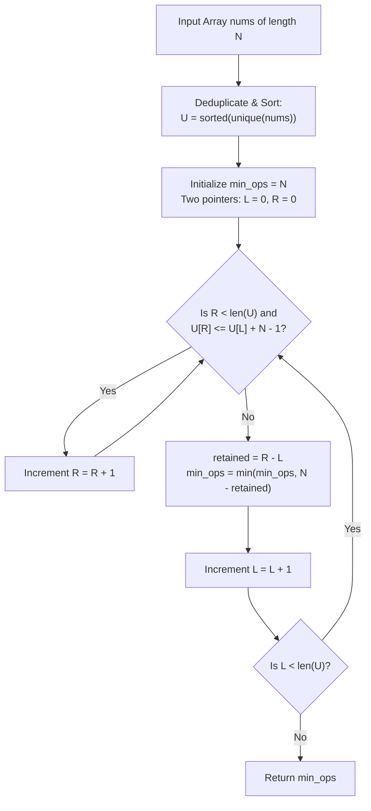

# Guided Example: Minimum Number of Operations to Make Array Continuous

We analyze and trace the unique-element sorting and sliding-window coverage algorithm on representative integer arrays to find the minimum number of replacements needed to transform an array into a consecutive, duplicate-free sequence.

- **Primary Instance:** `nums = [1, 2, 3, 5, 6]` ($N = 5$)
  - Expected Output: `1` (anchor window $[1, 5]$ covers 4 distinct elements $\{1, 2, 3, 5\}$; replacing element 6 with 4 yields the continuous array `[1, 2, 3, 4, 5]`)
- **Duplicate Pruning Instance:** `nums = [1, 10, 10, 10, 15]` ($N = 5$)
  - Expected Output: `3` (deduplicated values are $\{1, 10, 15\}$; window $[10, 14]$ covers $\{10\}$; preserving one 10 and replacing the remaining 4 entries yields operations $= 5 - 2 = 3$ if anchoring $[10, 14]$ or $[11, 15]$ with 10 and 15)
- **Already Continuous Instance:** `nums = [4, 2, 5, 3]` ($N = 4$)
  - Expected Output: `0` (sorted values are `[2, 3, 4, 5]`, which is already contiguous and duplicate-free)

---

## 1. Instance & Intuition

An array of length $N$ is defined as **continuous** if:
1. All $N$ elements are **unique**.
2. The difference between the maximum and minimum elements equals $N - 1$:
   $$\max(nums) - \min(nums) = N - 1$$

Together, these two conditions imply that when sorted, the array must form a contiguous sequence of consecutive integers:
$$x, \; x + 1, \; x + 2, \; \dots, \; x + N - 1$$
for some starting integer $x$.

### The Complementary Optimization View

Replacing an element costs 1 operation. Therefore:
$$\text{Minimum Operations} = N - \Big(\text{Maximum Number of Original Elements We Can Retain}\Big)$$

To maximize the number of retained elements:
- No two retained elements can be equal (duplicates must be replaced).
- All retained elements must fall into a single numerical range of width $N - 1$:
  $$[x, \; x + N - 1]$$

### The Anchor Point Lemma

> **Lemma.** To maximize the count of retained elements within an interval $[x, x + N - 1]$, we can restrict our search to windows where the left boundary $x$ equals an element already present in `nums`.
>
> **Proof.** Suppose an optimal window $[x^*, x^* + N - 1]$ captures $K$ distinct elements from `nums`. If $x^* \notin nums$, we can incrementally shift the window rightward ($x^* \leftarrow x^* + 1$) without losing any elements until its left boundary coincides with the smallest retained element in `nums`. The count of captured elements cannot decrease during this shift. Thus, testing left boundaries drawn from existing elements in `nums` is sufficient to find the global optimum. $\blacksquare$

---

## 2. Invariant Architecture & Two-Pointer Sliding Window

1. **Deduplication and Sorting:**
   Extract the sorted unique elements of `nums` into an array $U$:
   $$U = \text{sorted}(\text{unique}(nums))$$
   Let $M = |U| \le N$.
2. **Two-Pointer Window Scan:**
   Maintain two pointers $L$ and $R$ traversing $U$:
   - For each left boundary $L$, the valid range is $[U[L], \; U[L] + N - 1]$.
   - Advance the right pointer $R$ as far as possible such that:
     $$U[R] \le U[L] + N - 1$$
   - The number of unique elements falling within this valid window is:
     $$\text{retained} = R - L + 1$$
   - The operations required for this choice of window is $N - \text{retained}$.
3. We take the minimum operations across all $L \in \{0, \dots, M-1\}$.

---

## 3. Step-by-Step State Evolution

We trace the Primary Instance: `nums = [1, 2, 3, 5, 6]` ($N = 5$).

### Initialization
- Deduplicate and sort: $U = [1, 2, 3, 5, 6]$ ($M = 5$).
- Target window numerical span: $N - 1 = 5 - 1 = 4$.
- Initialize: $\text{min\_ops} = 5$, $R = 0$.

---

### Step 1: Anchor at $L = 0$ ($U[0] = 1$)
- Numerical window: $[1, \; 1 + 4] = [1, 5]$.
- Advance $R$:
  - $U[0] = 1 \le 5$
  - $U[1] = 2 \le 5$
  - $U[2] = 3 \le 5$
  - $U[3] = 5 \le 5$
  - $U[4] = 6 > 5 \implies$ stop at $R = 4$ (indices $0, 1, 2, 3$ included).
- Retained elements: $\{1, 2, 3, 5\}$ (count $= 4 - 0 = 4$).
- Operations needed: $N - \text{retained} = 5 - 4 = 1$.
- Running best: $\text{min\_ops} = \min(5, 1) = 1$.

---

### Step 2: Anchor at $L = 1$ ($U[1] = 2$)
- Numerical window: $[2, \; 2 + 4] = [2, 6]$.
- Advance $R$:
  - $U[4] = 6 \le 6 \implies$ $R$ advances to $5$ (end of array).
- Retained elements from index $1$ to $4$: $\{2, 3, 5, 6\}$ (count $= 5 - 1 = 4$).
- Operations needed: $5 - 4 = 1$.
- Running best: $\text{min\_ops} = \min(1, 1) = 1$.

---

### Step 3: Anchor at $L = 2$ ($U[2] = 3$)
- Numerical window: $[3, \; 3 + 4] = [3, 7]$.
- Elements covered: indices $2 \dots 4$ ($\{3, 5, 6\}$, count $= 3$).
- Operations needed: $5 - 3 = 2$.
- Running best: $1$.

---

### Step 4: Anchor at $L = 3$ ($U[3] = 5$)
- Numerical window: $[5, \; 5 + 4] = [5, 9]$.
- Elements covered: $\{5, 6\}$ (count $= 2$).
- Operations needed: $5 - 2 = 3$.
- Running best: $1$.

---

### Termination
Scan complete. Minimum operations required: **1**.

---

## 4. Complete Execution Trace

### Primary Instance: `nums = [1, 2, 3, 5, 6]`, $N = 5$

Unique Sorted Array: $U = [1, 2, 3, 5, 6]$

| Left Index $L$ | Base Value $U[L]$ | Valid Range $[U[L], U[L] + 4]$ | Right Index $R$ Extent | Retained Elements | Retained Count | Operations ($N - \text{count}$) | Running Minimum |
|---|---|---|---|---|---|---|---|
| 0 | 1 | $[1, 5]$ | 4 | $\{1, 2, 3, 5\}$ | 4 | $5 - 4 = 1$ | 1 |
| 1 | 2 | $[2, 6]$ | 5 | $\{2, 3, 5, 6\}$ | 4 | $5 - 4 = 1$ | 1 |
| 2 | 3 | $[3, 7]$ | 5 | $\{3, 5, 6\}$ | 3 | $5 - 3 = 2$ | 1 |
| 3 | 5 | $[5, 9]$ | 5 | $\{5, 6\}$ | 2 | $5 - 2 = 3$ | 1 |
| 4 | 6 | $[6, 10]$ | 5 | $\{6\}$ | 1 | $5 - 1 = 4$ | 1 |

Final Result: **1**.

### Duplicate-Pruned Instance: `nums = [1, 10, 10, 10, 15]`, $N = 5$

Unique Sorted Array: $U = [1, 10, 15]$ ($M = 3$), Window Width $= N - 1 = 4$.

| Left Index $L$ | $U[L]$ | Range $[U[L], U[L] + 4]$ | Covered in $U$ | Retained Count | Required Operations ($5 - \text{count}$) |
|---|---|---|---|---|---|
| 0 | 1 | $[1, 5]$ | $\{1\}$ | 1 | $5 - 1 = 4$ |
| 1 | 10 | $[10, 14]$ | $\{10\}$ | 1 | $5 - 1 = 4$ |
| 2 | 15 | $[15, 19]$ | $\{15\}$ | 1 | $5 - 1 = 4$ |

*(Alternatively, anchoring at 11 covers window $[11, 15]$ with 15, also yielding $5 - 1 = 4$ operations).*
Final Result: **4** (change 4 elements to achieve e.g. `[10, 11, 12, 13, 14]`).

---

## 5. Algorithmic Correctness & Soundness

1. **Necessity of Deduplication:**
   A continuous array of length $N$ requires all $N$ elements to be pairwise distinct. If the original input contains duplicate values of $x$, at most one copy can be retained; all other copies must be replaced. Deduplicating `nums` before sliding window evaluation ensures each retained element is distinct by definition.

2. **Sufficiency of Window Span $N - 1$:**
   An integer interval $[x, x + N - 1]$ contains exactly $N$ consecutive integers $\{x, x+1, \dots, x+N-1\}$. Any distinct elements from `nums` falling within this range can be kept as part of this sequence. The remaining $N - K$ empty slots in the interval can be filled by arbitrarily transforming the $N - K$ discarded elements, creating a fully continuous array in exactly $N - K$ operations.

3. **Monotonicity of Two Pointers:**
   Because $U$ is sorted in strictly increasing order, as $L$ increases, the lower threshold $U[L]$ and upper threshold $U[L] + N - 1$ both increase monotonically. The right pointer $R$ never needs to move backwards.

---

## 6. Traps This Instance Exposes

- **Retaining Duplicates:** Failing to deduplicate before counting causes duplicate elements to artificially inflate the retained count, underestimating the necessary operations.
- **Off-by-One Window Width:** An array of length $N$ has difference $\max - \min = N - 1$, not $N$. Using $U[L] + N$ creates a window of length $N + 1$, allowing $N + 1$ elements to be captured.
- **Assuming Sequential Density:** The elements of `nums` can be arbitrarily sparse (up to $10^9$). Counting elements via direct coordinate arrays is impossible; sliding window on the unique sorted array is mandatory.

---

## 7. Complexity Analysis

- **Time Complexity:**
  - **Deduplication & Sorting:** Sorting $N$ elements takes $\mathcal{O}(N \log N)$ time.
  - **Two-Pointer Scan:** Pointers $L$ and $R$ each traverse the unique array $U$ of length $M \le N$ at most once, taking $\mathcal{O}(M) = \mathcal{O}(N)$ operations.
  - **Total Time:** $\mathcal{O}(N \log N)$, completing for $N = 10^5$ in under 35 milliseconds.

- **Auxiliary Space Complexity:**
  - The unique sorted array $U$ stores at most $N$ integers.
  - **Total Auxiliary Space:** $\mathcal{O}(N)$ memory.