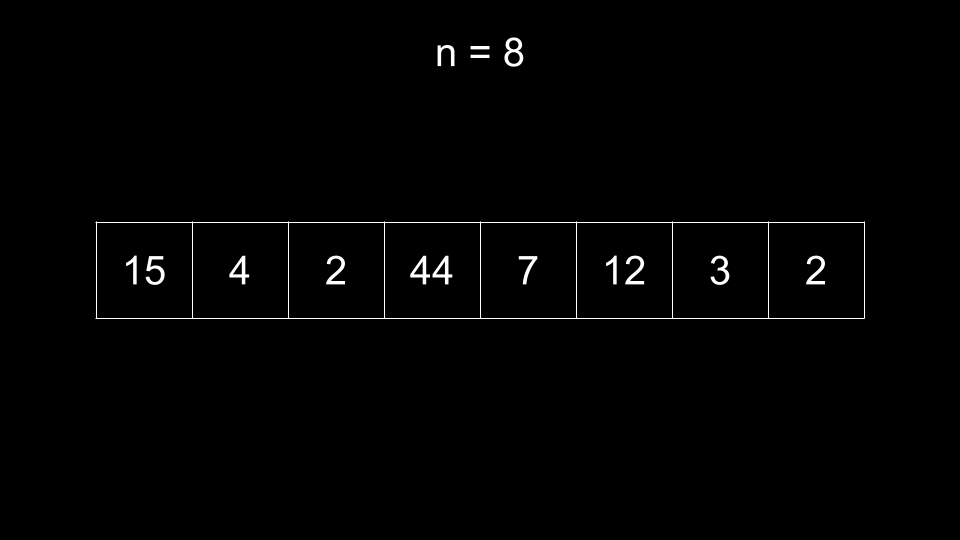
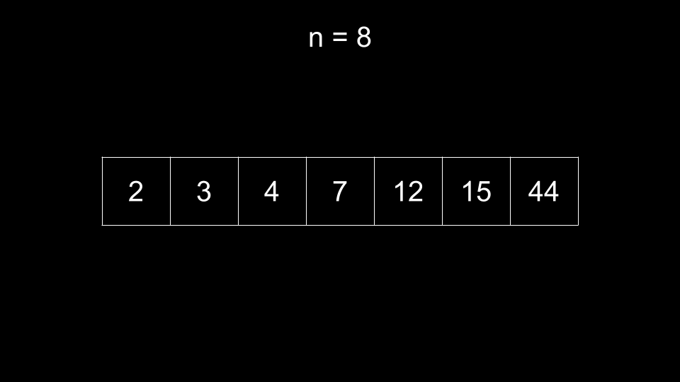
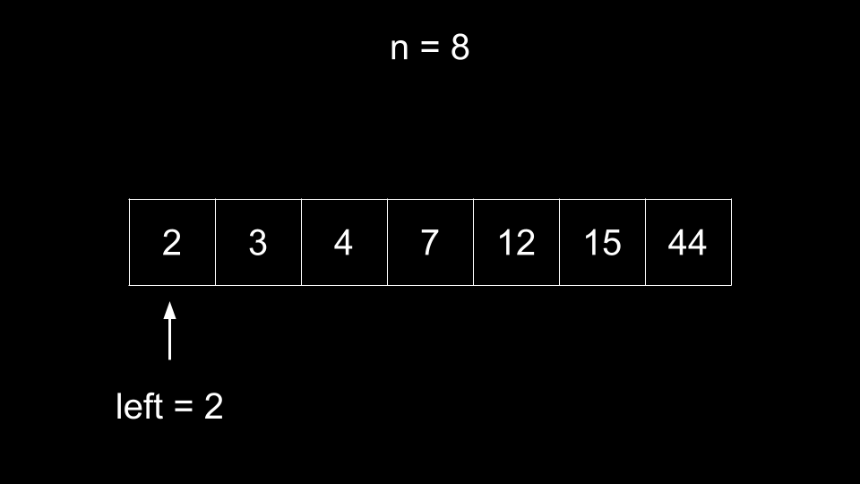
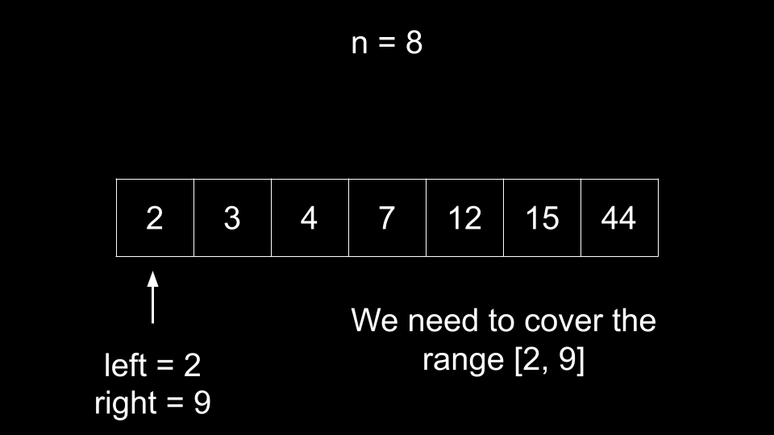
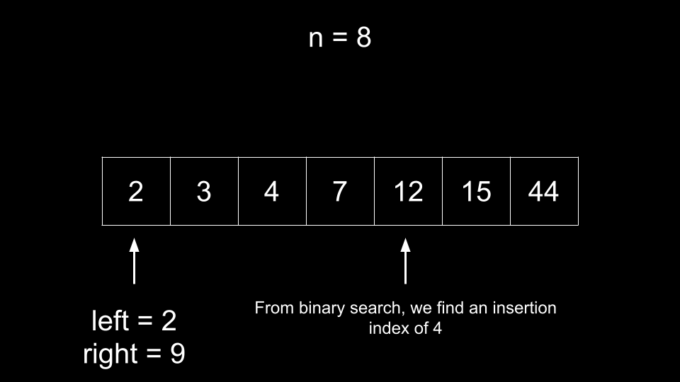
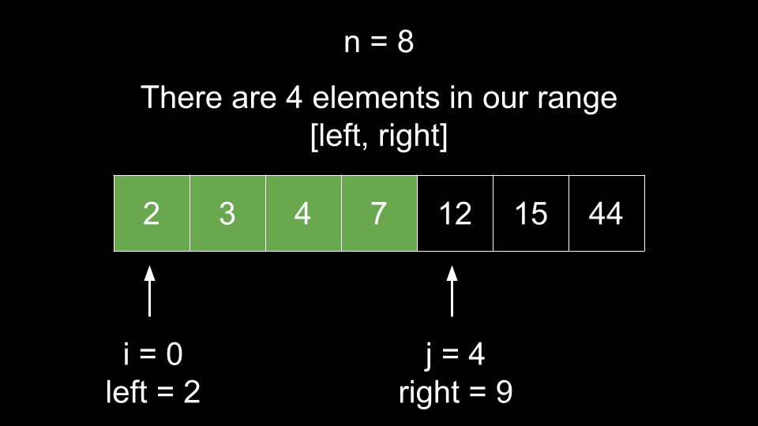
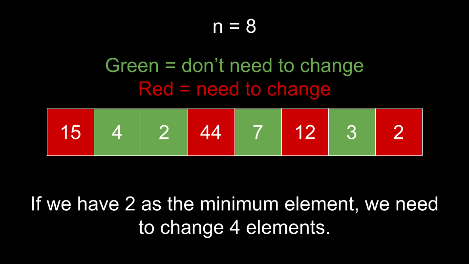
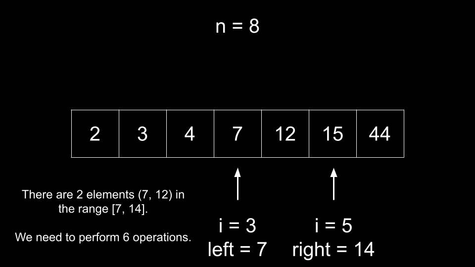

[TOC]

## Solution

---

### Approach 1: Binary Search

**Intuition**

The problem description gives some rules for what a continuous array is, but we can simplify it to help us better understand the problem. A continuous array covers all the elements in a range of size `n`. Essentially, if we sort a continuous array, it will continuously count up by `1`.

We can define a continuous array by giving its bounds - `left` and `right`. For example, in the following continuous array:

`[6, 3, 5, 4]`

The bounds are $left = 3$ and $right = 6$. As you can see, the array fully covers all elements in the range `[3, 6]`. If we were to sort it, we would get `[3, 4, 5, 6]`, which starts at `left` and counts up by `1` until we reach `right`.

To solve this problem, we will iterate over the array and treat each element as `left`. We can then calculate $right = left + n - 1$. We now want to convert the array into a continuous array that covers all elements in the range `[left, right]`. How many operations do we need to accomplish this?

We need to find how many elements in the array are already in the range `[left, right]`. We can leave these elements unchanged and fill in the rest of the range using operations. Note that if there are duplicate elements in the input, this strategy will not work properly. For example, let's say we had the following input:

`6, 3, 3, 5, 4`

If we had $left = 3$, we would have $right = 7$. Every element in the input is in the range `[3, 7]`, so it appears that we don't need any operations. However, the number `7` is missing because we have `3` twice. Thus, we should first convert `nums` into a set to get rid of duplicate numbers.

Now that we have gotten rid of the duplicates, how can we quickly find how many elements in the array are in a given range `[left, right]`? If the array is sorted, then we can binary search to efficiently find how many elements are less than or equal to `right`. We already know how many elements are less than `left` because we treat $left = \text{nums}[i]$ during iteration.

Let's summarize the algorithm with an example.


<br>

First, we remove duplicates from the array, then sort it. Note the original length before removing duplicates as $n = 8$.


<br>

Now, we iterate over the array. For each index `i`, we treat $left = \text{nums}[i]$.


<br>

If we were to create a continuous array with $left = 2$ as the minimum, we would need a maximum of $right = left + n - 1 = 9$.


<br>

How many operations do we need? We start by finding how many elements in the array are already in the desired range `[left, right]`. Binary search to find the insertion index of `right`. Note that the binary search here is finding the index **after** the greatest element less than or equal to `right`.


<br>

Let's call this index `j`. We have `j` as the index of the first element that falls outside our range due to it being too large. We also have `i` as the index of the first element in our range. Thus, we can calculate the number of elements already in our range as $j - i$.


<br>

As you can see, we have `4` elements already in the range `[left, right]`. Thus, these elements do not need to be changed. As we must construct an array of length `8`, we require $8 - 4 = 4$ operations (one for each other element) to create a continuous array if we treat `2` as the minimum.


<br>

We can repeat this process for every index in the sorted, duplicate-free array. For example, if we treat $\text{nums}[3] = 7$ as the minimum, then our range is `[7, 14]`. We can binary search to find `j` and then calculate $j - i = 2$ as the number of elements already in our range. Thus, we need to perform $8 - 2 = 6$ operations if we treat `7` as the minimum.


<br>

As we iterate over all indices and perform the above process, we keep track of the minimum operations needed.

**Algorithm**

1. Set $n = \text{nums.length}$ and the answer $ans = n$.
2. Remove duplicates from `nums` and then sort it. We will call this new array `newNums`.
3. Iterate `i` over the indices of `newNums`:
- Set $left = \text{newNums}[i]$.
- Calculate $right = left + n - 1$.
- Calculate `j`, the insertion index of `right` in `newNums` using binary search.
- Calculate $count = j - i$, the number of elements already in our range.
- Update `ans` with $n - count$ if it is smaller.
4. Return `ans`.

**Implementation**

```python
class Solution:
    def minOperations(self, nums: List[int]) -> int:
        n = len(nums)
        ans = n
        new_nums = sorted(set(nums))

        for i in range(len(new_nums)):
            left = new_nums[i]
            right = left + n - 1
            j = bisect_right(new_nums, right)
            count = j - i
            ans = min(ans, n - count)

        return ans
```

**Complexity Analysis**

Given $n$ as the length of `nums`,

* Time complexity: $O(n \cdot \log{}n)$

    To remove duplicates and sort `nums`, we require $O(n \cdot \log{}n)$ time.

    Then, we iterate over $n$ indices and perform a $O(\log{}n)$ binary search at each index.

* Space complexity: $O(n)$

    We create a new array `newNums` of size $O(n)$. Note that even if you were to modify the input directly, we still use $O(n)$ space creating a hash set to remove duplicates. Also, it is considered a bad practice to modify the input, and many people will argue that modifying the input makes it part of the space complexity anyway.

<br/>

---

### Approach 2: Sliding Window

**Intuition**

In the previous approach, we locked in an element $\text{newNums}[i]$ as `left`, calculated `right`, then found the insertion index of `right` as `j`. We used an $O(\log{}n)$ binary search to find `j`, but we can do better using a sliding window.

Because `newNums` is sorted:
- As `i` increases, so does $left = \text{newNums}[i]$.
- An increase in the lower bound `left` means an increase in the upper bound `right` as well.
- As `right` increases, `j` either remains the same or increases.

Thus, as `i` increases, `j` will stay the same or increase.

We initialize $j = 0$ and follow the same process as in the last approach. Iterate `i` over the indices of `newNums` and treat each $left = \text{newNums}[i]$ as the minimum element. This gives us $right = \text{newNums}[i] + n - 1$ as our maximum element.

How do we update `j`? Similar to the last approach, we have `j` as the index of the first element out of our range. Thus, we increment `j` until it points to an element out of our range. The condition for this is:

$while (\text{newNums}[j] < \text{newNums}[i] + n)$

Once this condition is broken, $\text{newNums}[j]$ is out of our range `[left, right]` and correctly positioned. We can calculate the number of elements already in our range as $j - i$ just like in the previous approach.

Because `j` starts at `0` and cannot exceed the length of `newNums`, it will only be incremented at most $n$ times across the entire algorithm. This means it costs $O(1)$ amortized to calculate `j`, an improvement from the $O(\log{}n)$ binary search.

**Algorithm**

1. Set $n = \text{nums.length}$ and the answer $ans = n$.
2. Remove duplicates from `nums` and then sort it. We will call this new array `newNums`.
3. Initialize $j = 0$ and iterate `i` over the indices of `newNums`:
- While $\text{newNums}[j]$ is within our range (less than $\text{newNums}[i] + n$), increment `j`.
- Calculate $count = j - i$, the number of elements already in our range.
- Update `ans` with $n - count$ if it is smaller.
4. Return `ans`.

**Implementation**

```python
class Solution:
    def minOperations(self, nums: List[int]) -> int:
        n = len(nums)
        ans = n
        new_nums = sorted(set(nums))
        j = 0

        for i in range(len(new_nums)):
            while j < len(new_nums) and new_nums[j] < new_nums[i] + n:
                j += 1

            count = j - i
            ans = min(ans, n - count)

        return ans
```

**Complexity Analysis**

Given $n$ as the length of `nums`,

* Time complexity: $O(n \cdot \log{}n)$

    To remove duplicates and sort `nums`, we require $O(n \cdot \log{}n)$ time.

    Then, we iterate over $n$ indices and perform $O(1)$ amortized work at each iteration. The while loop inside the for loop can only iterate at most $n$ times total across all iterations of the for loop. Each element in `newNums` can only be iterated over once by this while loop.

    Despite this approach having the same time complexity as the previous approach (due to the sort), it is a slight practical improvement as the sliding window portion is $O(n)$.

* Space complexity: $O(n)$

    We create a new array `newNums` of size $O(n)$. Note that even if you were to modify the input directly, we still use $O(n)$ space creating a hash set to remove duplicates. Also, it is considered a bad practice to modify the input, and many people will argue that modifying the input makes it part of the space complexity anyway.

<br/>

---