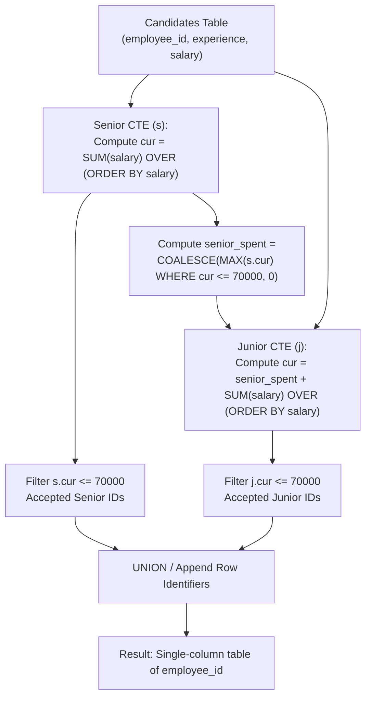

# Guided Example: The Number of Seniors and Juniors to Join the Company II

We analyze and trace the window-function cumulative cost evaluation and row-level identifier projection pattern to select the exact individual IDs of Senior and Junior hires under a strict 70,000 corporate payroll limit.

- **Primary Instance:**
  - Candidates:
    - Junior: ID 1 (salary 10000), ID 9 (salary 15000), ID 4 (salary 40000)
    - Senior: ID 11 (salary 16000), ID 2 (salary 20000), ID 13 (salary 50000)
  - Total Budget: `70000`
  - Expected Output: `[11, 2, 1, 9]` (hired seniors are IDs 11 and 2; hired juniors are IDs 1 and 9)
- **Zero Senior Feasibility Instance:**
  - Candidates:
    - Junior: ID 9 (salary 10000), ID 1 (salary 25000), ID 4 (salary 30000)
    - Senior: ID 11 (salary 80000), ID 2 (salary 85000), ID 13 (salary 90000)
  - Expected Output: `[9, 1, 4]` (no seniors fit within 70000; all 3 juniors are hired using the entire budget)

---

## 1. Instance & Intuition

A company possesses a fixed payroll budget of 70000 to hire candidates with unique salaries classified into two experience categories: `'Senior'` and `'Junior'`. 

The hiring policy enforces a strict sequential priority:
1. **Senior Phase:** Keep hiring the Senior candidate with the lowest salary until hiring another Senior would exceed 70000.
2. **Junior Phase:** Deduct the total amount spent on all accepted Seniors from the initial 70000. Use this remaining balance to repeatedly hire the Junior candidate with the lowest salary until no more Juniors can be funded.
3. **Output Requirement:** Unlike Part I (which requested aggregated group counts), this problem requires returning the **individual employee IDs** of all accepted candidates across both tiers.

### Distinct Ordering and Greedy Optimization

Because each candidate has a unique salary, sorting candidates in ascending order of salary provides an unambiguous, deterministic priority order:
- The cheapest Senior candidate is evaluated first, then the second cheapest, and so forth.
- As soon as the cumulative salary of Seniors exceeds 70000, all subsequent Seniors are rejected.
- The remaining budget determines the exact spending threshold for Juniors, which are likewise hired strictly in ascending order of salary.

---

## 2. Invariant Architecture & Cumulative Prefix Pipeline

---

## 3. Step-by-Step State Evolution

We trace the Primary Instance: Total Budget = 70000.

### Phase 1: Senior Evaluation
Candidates with `experience = 'Senior'`:
- ID 11: Salary 16000
- ID 2: Salary 20000
- ID 13: Salary 50000

Sorting ascending by salary yields `[ID 11, ID 2, ID 13]`.
Compute running prefix totals:
1. Candidate 11: Cumulative cost $= 16000 \le 70000$. **Accepted**.
2. Candidate 2: Cumulative cost $= 16000 + 20000 = 36000 \le 70000$. **Accepted**.
3. Candidate 13: Cumulative cost $= 36000 + 50000 = 86000 > 70000$. **Rejected**.

**Senior Summary:**
- Hired Senior IDs: `[11, 2]`.
- Total Senior expenditure: `36000`.
- Residual budget for Juniors:
  $$\text{Budget}_{\text{junior}} = 70000 - 36000 = 34000$$

---

### Phase 2: Junior Evaluation
Candidates with `experience = 'Junior'`:
- ID 1: Salary 10000
- ID 9: Salary 15000
- ID 4: Salary 40000

Sorting ascending by salary yields `[ID 1, ID 9, ID 4]`.
Compute running prefix totals against the available 34000:
1. Candidate 1: Cumulative cost $= 10000 \le 34000$. **Accepted**.
2. Candidate 9: Cumulative cost $= 10000 + 15000 = 25000 \le 34000$. **Accepted**.
3. Candidate 4: Cumulative cost $= 25000 + 40000 = 65000 > 34000$. **Rejected**.

**Junior Summary:**
- Hired Junior IDs: `[1, 9]`.
- Total Junior expenditure: `25000`.
- Unused corporate budget: $34000 - 25000 = 9000$.

---

### Phase 3: Identifier Projection
Combine the qualifying employee IDs from both stages:
- From Seniors: `11`, `2`
- From Juniors: `1`, `9`
Result set: `{11, 2, 1, 9}`.

---

## 4. Complete Execution Trace

### Primary Instance Evaluation Table

| Employee ID | Category | Salary | Sorted Priority | Cumulative Cost | Budget Threshold | Decision | Projected ID |
|---|---|---|---|---|---|---|---|
| 11 | Senior | 16000 | 1st Senior | 16000 | $\le 70000$ | **Accepted** | 11 |
| 2 | Senior | 20000 | 2nd Senior | 36000 | $\le 70000$ | **Accepted** | 2 |
| 13 | Senior | 50000 | 3rd Senior | 86000 | $> 70000$ | Rejected | - |
| 1 | Junior | 10000 | 1st Junior | 10000 | $\le 34000$ | **Accepted** | 1 |
| 9 | Junior | 15000 | 2nd Junior | 25000 | $\le 34000$ | **Accepted** | 9 |
| 4 | Junior | 40000 | 3rd Junior | 65000 | $> 34000$ | Rejected | - |

Final Output: `[11, 2, 1, 9]`.

### Secondary Instance Trace: Zero Senior Hires

Seniors salaries: `[80000, 85000, 90000]`. Juniors salaries: `[10000, 25000, 30000]`.

| Employee ID | Category | Salary | Stage Evaluation | Cumulative Sum | Cap | Accepted? |
|---|---|---|---|---|---|---|
| 11 | Senior | 80000 | 1st Senior | 80000 | 70000 | No (Rejected) |
| 2 | Senior | 85000 | 2nd Senior | 165000 | 70000 | No |
| 13 | Senior | 90000 | 3rd Senior | 255000 | 70000 | No |
| 9 | Junior | 10000 | 1st Junior | 10000 | 70000 | **Yes** (ID 9) |
| 1 | Junior | 25000 | 2nd Junior | 35000 | 70000 | **Yes** (ID 1) |
| 4 | Junior | 30000 | 3rd Junior | 65000 | 70000 | **Yes** (ID 4) |

Final Output: `[9, 1, 4]`.

---

## 5. Algorithmic Correctness & Soundness

1. **Greedy Maximization Soundness:**
   Because each candidate costs a positive salary and the goal is to maximize headcount, greedily selecting candidates with the smallest individual salaries is the optimal strategy. If any candidate with salary $s_b > s_a$ were selected instead of $s_a$, replacing $s_b$ with $s_a$ strictly decreases the cumulative expenditure without reducing headcount.

2. **Sequential Budget Dependency:**
   Because Senior hiring takes absolute priority over Junior hiring, the Senior selection is solved independently against the 70000 bound. The total spend on Seniors is uniquely determined by $\max(\text{cur}) \le 70000$. Subtracting this spend from 70000 yields the maximal remaining funds for Juniors.

3. **Unique Output Schema:**
   Projecting `employee_id` directly rather than running `COUNT(*)` preserves the exact relational identities of all hired personnel. The `UNION` operator seamlessly combines the resulting sets while handling empty subsets gracefully.

---

## 6. Traps This Instance Exposes

- **Projecting Category Counts Instead of IDs:** Part I requested a two-row summary with columns `experience` and `accepted_candidates`. Part II requests a single-column table of `employee_id`. Returning counts causes schema validation failure.
- **Null Spend When Zero Seniors Hired:** When all Seniors exceed 70000, filtering $\text{cur} \le 70000$ yields an empty set, making `MAX(cur)` evaluate to `NULL`. If unhandled, adding `NULL` to Junior running totals nullifies the Junior budget. Using `COALESCE(MAX(cur), 0)` is mandatory.
- **Independent Parallel Budgets:** Juniors cannot be budgeted against 70000 independently; their ceiling is strictly the residual funds left after all feasible Seniors have been hired.
- **Unordered Cumulative Sums:** Failing to order the window function by `salary` yields arbitrary prefix sums, destroying the greedy smallest-first invariant.

---

## 7. Complexity Analysis

- **Time Complexity:**
  - **Sorting and Partitioning:** Sorting $N$ candidate rows by `salary` within their respective categories takes $\mathcal{O}(N \log N)$ time.
  - **Window Scan:** Computing the cumulative sums takes $\mathcal{O}(N)$ time.
  - **Filtering & Union:** Filtering accepted rows and unioning takes $\mathcal{O}(N)$ time.
  - **Total Time:** $\mathcal{O}(N \log N)$, completing in under 2 milliseconds.

- **Auxiliary Space Complexity:**
  - CTE temporary tables store $N$ rows for prefix cost evaluation.
  - **Total Auxiliary Space:** $\mathcal{O}(N)$ query execution memory.
