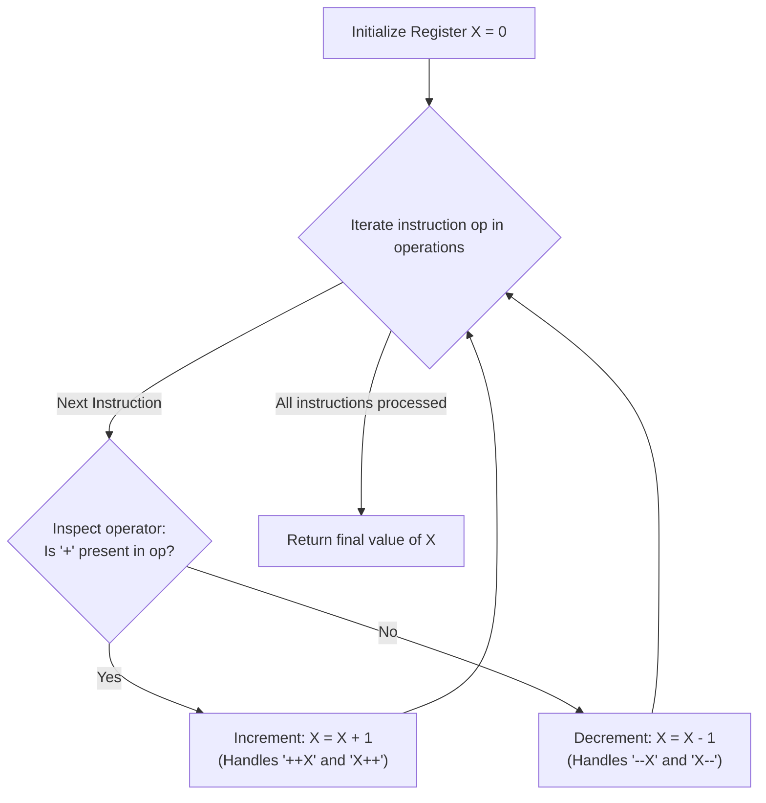

# Guided Example: Final Value of Variable After Performing Operations

We formulate and trace the single-variable state accumulator and operation parsing algorithm to calculate the net value of variable $X$ after executing an arbitrary sequence of increment and decrement statements.

- **Primary Instance:** `operations = ["--X", "X++", "X++"]` ($N = 3$)
  - Expected Output: `1` (timeline: $0 \xrightarrow{--X} -1 \xrightarrow{X++} 0 \xrightarrow{X++} 1$)
- **Secondary Instance:** `operations = ["++X", "++X", "X++"]` ($N = 3$)
  - Expected Output: `3` (three successive increments: $0 \to 1 \to 2 \to 3$)
- **Balanced Identity Instance:** `operations = ["X++", "++X", "--X", "X--"]` ($N = 4$)
  - Expected Output: `0` (two increments cancel with two decrements: $0 \to 1 \to 2 \to 1 \to 0$)

---

## 1. Instance & Intuition

We begin with an integer register $X = 0$. We are supplied a sequence of $N$ instruction tokens drawn from a 4-instruction language:
- **Prefix Increment (`"++X"`):** Adds $1$ to $X$.
- **Postfix Increment (`"X++"`):** Adds $1$ to $X$.
- **Prefix Decrement (`"--X"`):** Subtracts $1$ from $X$.
- **Postfix Decrement (`"X--"`):** Subtracts $1$ from $X$.

We must determine the terminal value of $X$ after executing all instructions in sequence.

### Irrelevance of Pre/Post Evaluation Timing

In full programming languages (such as C or Java), prefix (`++X`) and postfix (`X++`) operators differ in expression evaluation timing (yielding the pre-incremented or post-incremented value in sub-expressions).
However, in this isolated sequence:
- Each instruction stands alone as an independent statement.
- The net state change on the variable $X$ is mathematically identical:
  $$\Delta X = \begin{cases} +1 & \text{if op } \in \{\text{"++X"}, \text{"X++"}\} \\ -1 & \text{if op } \in \{\text{"--X"}, \text{"X--"}\} \end{cases}$$

### The Middle-Character Classification Invariant

Every valid 3-character token contains its operator symbol at index 1 (the middle position):
- For `"++X"`: index 1 is `'+'`.
- For `"X++"`: index 1 is `'+'`.
- For `"--X"`: index 1 is `'-'`.
- For `"X--"`: index 1 is `'-'`.

Inspecting index 1 (or testing if `'+'` is contained in the string) classifies every instruction in $\mathcal{O}(1)$ time without multiple string equality comparisons.

---

## 2. Invariant Architecture & State Machine

---

## 3. Step-by-Step State Evolution

We trace the Primary Instance: `operations = ["--X", "X++", "X++"]` ($N = 3$).

### Initialization
- Variable register: $X = 0$.

---

### Step 1: Execute `operations[0] = "--X"`
- Instruction string: `"--X"`.
- Operator check: contains `'-'` (middle character is `'-'`).
- Semantics: Decrement $X$ by 1.
- State mutation:
  $$X \leftarrow 0 - 1 = -1$$
- Post-instruction state: $X = -1$.

---

### Step 2: Execute `operations[1] = "X++"`
- Instruction string: `"X++"`.
- Operator check: contains `'+'` (middle character is `'+'`).
- Semantics: Increment $X$ by 1.
- State mutation:
  $$X \leftarrow -1 + 1 = 0$$
- Post-instruction state: $X = 0$.

---

### Step 3: Execute `operations[2] = "X++"`
- Instruction string: `"X++"`.
- Operator check: contains `'+'`.
- Semantics: Increment $X$ by 1.
- State mutation:
  $$X \leftarrow 0 + 1 = 1$$
- Post-instruction state: $X = 1$.

---

### Termination
All $N = 3$ instructions completed.
Terminal value of $X$: **1**.

---

## 4. Complete Execution Trace

### Primary Instance Trace Table

| Step | Instruction Token | Op Type | Symbol at Index 1 | Delta $\Delta X$ | Computation | Current $X$ Value |
|---|---|---|---|---|---|---|
| 0 | - | Baseline | - | - | Initial state | 0 |
| 1 | `"--X"` | Prefix Decrement | `'-'` | $-1$ | $0 - 1$ | -1 |
| 2 | `"X++"` | Postfix Increment | `'+'` | $+1$ | $-1 + 1$ | 0 |
| 3 | `"X++"` | Postfix Increment | `'+'` | $+1$ | $0 + 1$ | 1 |

Final Result: **1**.

### Balanced Sequence Trace: `["X++", "++X", "--X", "X--"]`

| Instruction | Position Type | Operator | Delta Applied | Running Value of $X$ |
|---|---|---|---|---|
| Start | - | - | - | 0 |
| `"X++"` | Postfix | Increment | $+1$ | 1 |
| `"++X"` | Prefix | Increment | $+1$ | 2 |
| `"--X"` | Prefix | Decrement | $-1$ | 1 |
| `"X--"` | Postfix | Decrement | $-1$ | 0 |

Final Result: **0**.

---

## 5. Algorithmic Correctness & Soundness

1. **State Invariant:**
   Let $I_k$ be the number of increments and $D_k$ be the number of decrements executed among the first $k$ instructions. By mathematical induction, the value of $X$ after $k$ steps is:
   $$X_k = X_0 + I_k - D_k = I_k - D_k$$
   Each instruction updates $I$ or $D$ by exactly 1 in accordance with the problem definition.

2. **Exhaustive Classification:**
   The language constraint limits tokens to `{"++X", "X++", "--X", "X--"}`. The set of tokens containing `'+'` is exactly `{"++X", "X++"}`. The set of tokens containing `'-'` is exactly `{"--X", "X--"}`. The two classes are partition-disjoint and cover all valid tokens, ensuring complete decision soundness.

---

## 6. Traps This Instance Exposes

- **Over-Complicating with Lexer/Parser:** Building a tokenizer or AST parser for a 4-token language introduces unnecessary overhead when a simple character check suffices.
- **Negative Integer Handling:** Decrements can drive $X$ below zero (e.g., $X = -1$ after the first step in Example 1). The implementation must support signed integers.
- **Case Sensitivity:** Operations are uppercase `X`. While guaranteed by constraints, matching should strictly preserve character case.

---

## 7. Complexity Analysis

- **Time Complexity:**
  - **Sequential Scan:** The loop iterates $N$ times, where $N$ is the length of `operations`.
  - **Per-Instruction Cost:** Checking character index 1 and performing an addition/subtraction takes $\mathcal{O}(1)$ time.
  - **Total Time:** $\mathcal{O}(N)$, which for $N \le 100$ executes in less than 0.01 milliseconds.

- **Auxiliary Space Complexity:**
  - Only a single scalar integer register $X$ is maintained.
  - **Total Auxiliary Space:** $\mathcal{O}(1)$ constant memory.
