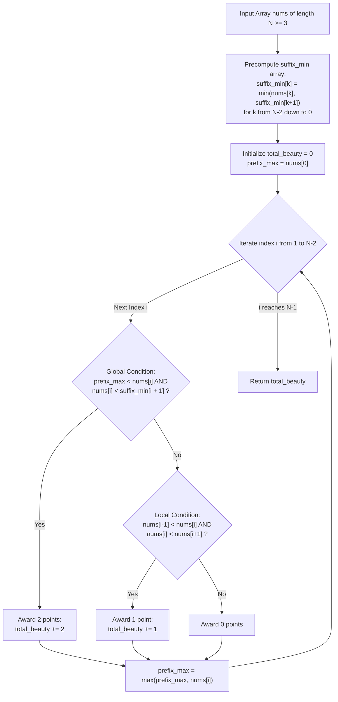

# Guided Example: Sum of Beauty in the Array

We formulate and trace the bidirectional prefix-maximum and suffix-minimum sweep algorithm on representative integer arrays to evaluate global and local monotonicity beauty scores in linear time.

- **Primary Instance:** `nums = [2, 4, 6, 4]` ($N = 4$)
  - Expected Output: `1` (index 1 satisfies local monotonicity for 1 point; index 2 satisfies neither condition for 0 points; total = $1 + 0 = 1$)
- **Secondary Instance:** `nums = [1, 2, 3]` ($N = 3$)
  - Expected Output: `2` (index 1 strictly exceeds all predecessors and is strictly less than all successors for 2 points)
- **Strictly Decreasing Instance:** `nums = [3, 2, 1]` ($N = 3$)
  - Expected Output: `0` (no element satisfies any ascending condition)

---

## 1. Instance & Intuition

For every interior index $i \in [1, N - 2]$ of an array `nums`, we assign a **beauty score**:
- **Score 2 (Global Monotonicity Partition):** If $nums[i]$ is strictly greater than **every** element to its left and strictly less than **every** element to its right:
  $$\forall j < i, \; nums[j] < nums[i] \quad \text{and} \quad \forall k > i, \; nums[i] < nums[k]$$
- **Score 1 (Local Monotonicity):** If the global condition is not met, but $nums[i]$ is strictly bounded by its immediate neighbors:
  $$nums[i - 1] < nums[i] < nums[i + 1]$$
- **Score 0:** If neither condition holds.

We must compute the sum of beauty scores across all interior indices $i \in [1, N - 2]$.

### Decoupling Global Constraints via Extrema

Testing all $j < i$ and all $k > i$ naively takes $\mathcal{O}(N)$ per index, leading to $\mathcal{O}(N^2)$ total operations.
However, notice that:
$$\forall j < i, \; nums[j] < nums[i] \iff \max_{0 \le j < i} nums[j] < nums[i]$$
$$\forall k > i, \; nums[i] < nums[k] \iff nums[i] < \min_{i < k < N} nums[k]$$

Thus, the global condition simplifies to two scalar inequalities:
$$\text{prefix\_max}[i - 1] < nums[i] < \text{suffix\_min}[i + 1]$$

By precomputing `suffix_min` backwards from right to left in $\mathcal{O}(N)$ time, and maintaining a running `prefix_max` forward from left to right, each interior index is evaluated in $\mathcal{O}(1)$ time.

---

## 2. Invariant Architecture & Evaluation Pipeline

---

## 3. Step-by-Step State Evolution

We trace the Primary Instance: `nums = [2, 4, 6, 4]` ($N = 4$).
Interior indices to evaluate: $i \in \{1, 2\}$.

### Phase 1: Precompute Suffix Minimums
We compute `suffix_min` backwards from index 3 down to 0:
- $suffix\_min[3] = nums[3] = 4$
- $suffix\_min[2] = \min(nums[2], suffix\_min[3]) = \min(6, 4) = 4$
- $suffix\_min[1] = \min(nums[1], suffix\_min[2]) = \min(4, 4) = 4$
- $suffix\_min[0] = \min(nums[0], suffix\_min[1]) = \min(2, 4) = 2$

Resulting table: $suffix\_min = [2, 4, 4, 4]$.

---

### Phase 2: Forward Evaluation

Initialize $\text{total\_beauty} = 0$, $\text{prefix\_max} = nums[0] = 2$.

#### Evaluating Index $i = 1$ ($nums[1] = 4$)
- Current element: $nums[1] = 4$.
- Preceding maximum: $\text{prefix\_max} = 2$.
- Succeeding minimum: $suffix\_min[i + 1] = suffix\_min[2] = 4$.
- **Check Global Condition (Score 2):**
  - $\text{prefix\_max} < nums[1] \implies 2 < 4$ (True).
  - $nums[1] < suffix\_min[2] \implies 4 < 4$ (**False**; tie with element 4 at index 3).
  - Global condition fails.
- **Check Local Condition (Score 1):**
  - $nums[0] < nums[1] < nums[2] \implies 2 < 4 < 6$ (**True**!).
  - Award 1 point: $\text{total\_beauty} \leftarrow 0 + 1 = 1$.
- **Update Running Max:**
  - $\text{prefix\_max} \leftarrow \max(2, 4) = 4$.

---

#### Evaluating Index $i = 2$ ($nums[2] = 6$)
- Current element: $nums[2] = 6$.
- Preceding maximum: $\text{prefix\_max} = 4$.
- Succeeding minimum: $suffix\_min[i + 1] = suffix\_min[3] = 4$.
- **Check Global Condition (Score 2):**
  - $\text{prefix\_max} < nums[2] \implies 4 < 6$ (True).
  - $nums[2] < suffix\_min[3] \implies 6 < 4$ (False).
  - Global condition fails.
- **Check Local Condition (Score 1):**
  - $nums[1] < nums[2] < nums[3] \implies 4 < 6 < 4$ (False, since $6 \not< 4$).
  - Local condition fails.
- **Award:** 0 points.
- **Update Running Max:**
  - $\text{prefix\_max} \leftarrow \max(4, 6) = 6$.

---

### Termination
All interior indices evaluated.
Total Beauty: **1**.

---

## 4. Complete Execution Trace

### Primary Instance: `nums = [2, 4, 6, 4]`

Suffix minimums: `[2, 4, 4, 4]`

| Index $i$ | $nums[i]$ | Active `prefix_max` | `suffix_min[i+1]` | Global Condition ($\text{max} < x < \text{min}$) | Local Condition ($nums[i-1] < x < nums[i+1]$) | Points Awarded | New `prefix_max` | Cumulative Beauty |
|---|---|---|---|---|---|---|---|---|
| 1 | 4 | 2 | 4 | $2 < 4 < 4$ (No) | $2 < 4 < 6$ (**Yes**) | 1 | 4 | 1 |
| 2 | 6 | 4 | 4 | $4 < 6 < 4$ (No) | $4 < 6 < 4$ (No) | 0 | 6 | 1 |

Final Answer: **1**.

### Secondary Instance: `nums = [1, 2, 3]`

Suffix minimums: `[1, 2, 3]`

| Index $i$ | $nums[i]$ | `prefix_max` | `suffix_min[i+1]` | Global Condition | Score Awarded | Running Total |
|---|---|---|---|---|---|---|
| 1 | 2 | 1 | 3 | $1 < 2 < 3$ (**Yes**) | 2 | **2** |

Final Answer: **2**.

---

## 5. Algorithmic Correctness & Soundness

1. **Extrema Equivalence:**
   For any element $x$ and set $S$, $x > y$ for all $y \in S$ if and only if $x > \max(S)$. Similarly, $x < z$ for all $z \in S$ if and only if $x < \min(S)$. Therefore, comparing $nums[i]$ against the scalar extrema $\text{prefix\_max}$ and $suffix\_min[i+1]$ is completely equivalent to checking all $j < i$ and $k > i$.

2. **Strictness of Inequalities:**
   The problem requires **strictly greater** ($<$) in both directions. Any equality ($nums[j] == nums[i]$ or $nums[k] == nums[i]$) immediately invalidates the condition. The strict checks $\text{prefix\_max} < nums[i]$ and $nums[i] < suffix\_min[i+1]$ correctly enforce non-equality.

3. **Priority Ordering:**
   The algorithm tests the 2-point condition first. Only if the 2-point condition is not satisfied does it evaluate the 1-point local condition, precisely reflecting the problem rule: *"1, if ... and the previous condition is not satisfied"*.

---

## 6. Traps This Instance Exposes

- **Non-Strict Inequalities:** Using $\le$ instead of $<$ awards 2 points when identical elements exist on either side (e.g., at $i=1$ in `[2, 4, 6, 4]`, $4 \le 4$ holds but $4 < 4$ is false).
- **Updating Prefix Max Prematurely:** If $\text{prefix\_max}$ is updated to include $nums[i]$ before evaluating index $i$, the comparison $\text{prefix\_max} < nums[i]$ becomes $nums[i] < nums[i]$, which is always false. $\text{prefix\_max}$ must be updated after the check.
- **Evaluating Outer Boundaries:** The problem specifies indices strictly in the range $1 \le i \le N - 2$. Evaluating $i = 0$ or $i = N - 1$ accesses out-of-bounds neighbors or invalid suffix segments.

---

## 7. Complexity Analysis

- **Time Complexity:**
  - **Suffix Min Precomputation:** Backwards scan takes $\mathcal{O}(N)$ operations.
  - **Forward Evaluation Scan:** For each of the $N - 2$ interior indices, evaluating the conditions and updating $\text{prefix\_max}$ takes $\mathcal{O}(1)$ time.
  - **Total Time:** $\mathcal{O}(N)$, which for $N = 10^5$ executes in under 5 milliseconds.

- **Auxiliary Space Complexity:**
  - An array of size $N$ stores the suffix minimums.
  - **Total Auxiliary Space:** $\mathcal{O}(N)$ memory.
