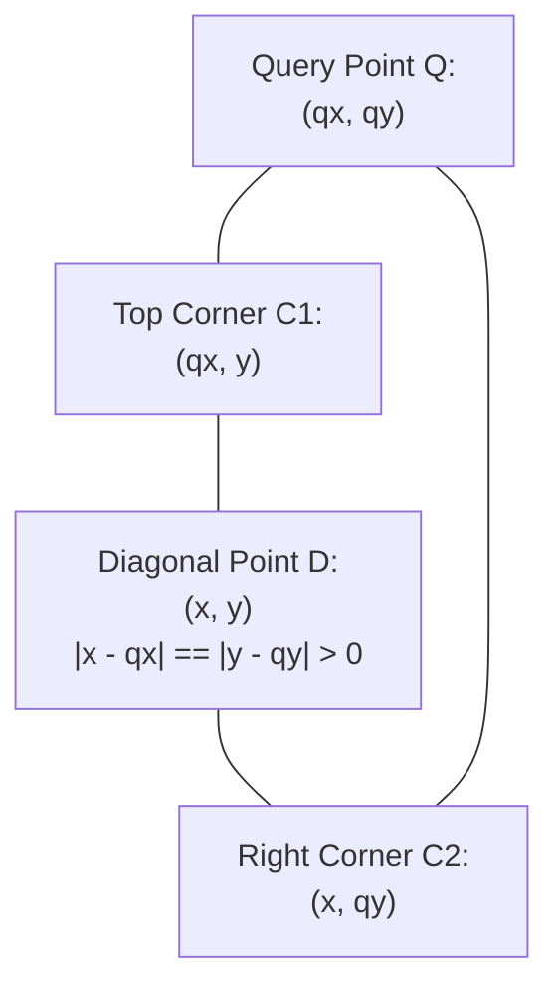
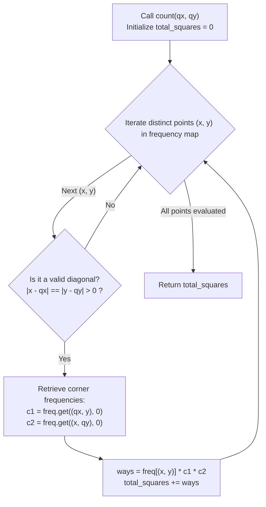

# Guided Example: Detect Squares

We analyze and trace the diagonal-endpoint geometric pairing and coordinate-hash frequency multiplication algorithm to count all axis-aligned squares formed by a dynamic 2D point stream in optimal time.

- **Primary Instance:**
  - Operations: `[add(3, 10), add(11, 2), add(3, 2), count(11, 10), count(14, 8), add(11, 2), count(11, 10)]`
  - Expected Outputs: `[null, null, null, 1, 0, null, 2]`
- **Duplicate Point Effect:** Adding a second instance of $(11, 2)$ doubles the number of valid square combinations for query $(11, 10)$ from 1 to 2.

---

## 1. Instance & Intuition

We maintain a dynamic multiset of points on a 2D integer grid. We must support two operations:
1. **`add([x, y])`:** Inserts point $(x, y)$ into the collection. Duplicate points are distinct entities.
2. **`count([qx, qy])`:** Counts the number of ways to choose three stored points $P_1, P_2, P_3$ such that $\{Q, P_1, P_2, P_3\}$ forms an **axis-aligned square with positive area**.

### The Diagonal Anchor Principle

An axis-aligned square has four vertices: $Q, C_1, D, C_2$.
If we fix the query point $Q = (qx, qy)$ and select any stored point $D = (x, y)$ to serve as the **opposite diagonal vertex**:
1. **Positive Area and Diagonal Invariant:**
   The point $D$ cannot share the same horizontal or vertical line as $Q$:
   $$x \neq qx \quad \text{and} \quad y \neq qy$$
2. **Square Aspect Ratio:**
   Because all four sides of a square have equal length $L$:
   $$|x - qx| = |y - qy| = L > 0$$
3. **Unique Orthogonal Corners:**
   Once $Q = (qx, qy)$ and diagonal vertex $D = (x, y)$ are chosen, the remaining two corners are uniquely and unambiguously determined:
   $$C_1 = (qx, y) \quad \text{and} \quad C_2 = (x, qy)$$

### The Multiplicative Counting Rule

If points $(x, y)$, $(qx, y)$, and $(x, qy)$ are present in the collection with multiplicities $c_D$, $c_1$, and $c_2$ respectively, the number of distinct choices of three points forming this specific square is given by the rule of product:
$$\text{ways}(D) = c_D \times c_1 \times c_2$$

Summing $\text{ways}(D)$ across all candidate diagonal points $D$ yields the total valid squares.

---

## 2. Invariant Architecture & Diagonal Matching

### Query Evaluation Pipeline

---

## 3. Step-by-Step State Evolution

We trace the Primary Instance sequence.
Let $\text{freq}$ denote the 2D coordinate frequency map.

### Initial Additions
1. `add([3, 10])`: $\text{freq}[(3, 10)] = 1$
2. `add([11, 2])`: $\text{freq}[(11, 2)] = 1$
3. `add([3, 2])`: $\text{freq}[(3, 2)] = 1$

Active collection: three points $\{(3, 10), (11, 2), (3, 2)\}$.

---

### Operation 4: `count([11, 10])`
Query point: $Q = (11, 10)$.

We iterate through stored candidate points $(x, y)$:

1. **Candidate $(3, 10)$:**
   - $x = 3, y = 10$.
   - Check: $y == qy \implies 10 == 10$. Degenerate horizontal segment (side length 0).
   - Ineligible as diagonal.

2. **Candidate $(11, 2)$:**
   - $x = 11, y = 2$.
   - Check: $x == qx \implies 11 == 11$. Degenerate vertical segment.
   - Ineligible as diagonal.

3. **Candidate $(3, 2)$:**
   - $x = 3, y = 2$.
   - $\Delta x = |3 - 11| = 8$.
   - $\Delta y = |2 - 10| = 8$.
   - Check: $\Delta x == \Delta y = 8 > 0$. **Valid Diagonal Candidate!**
   - Required orthogonal corners:
     - $C_1 = (qx, y) = (11, 2)$. Count: $\text{freq}[(11, 2)] = 1$.
     - $C_2 = (x, qy) = (3, 10)$. Count: $\text{freq}[(3, 10)] = 1$.
   - Combinations:
     $$\text{ways} = \text{freq}[(3, 2)] \times \text{freq}[(11, 2)] \times \text{freq}[(3, 10)] = 1 \times 1 \times 1 = 1$$

Total squares found: **1**.

---

### Operation 5: `count([14, 8])`
Query point: $Q = (14, 8)$.
- Testing $(3, 10)$: $\Delta x = |3 - 14| = 11$, $\Delta y = |10 - 8| = 2$. $11 \neq 2$.
- Testing $(11, 2)$: $\Delta x = |11 - 14| = 3$, $\Delta y = |2 - 8| = 6$. $3 \neq 6$.
- Testing $(3, 2)$: $\Delta x = |3 - 14| = 11$, $\Delta y = |2 - 8| = 6$. $11 \neq 6$.
No candidate forms a square.
Total squares found: **0**.

---

### Operation 6: `add([11, 2])`
- Duplicate addition: $\text{freq}[(11, 2)] \leftarrow 1 + 1 = 2$.

---

### Operation 7: `count([11, 10])`
Query point: $Q = (11, 10)$.
Diagonal candidate: $D = (3, 2)$ with $\Delta x = \Delta y = 8$.
Corner counts:
- $D = (3, 2)$: count $= 1$.
- $C_1 = (11, 2)$: count $= 2$ (now contains two duplicate instances).
- $C_2 = (3, 10)$: count $= 1$.

Combinations:
$$\text{ways} = 1 \times 2 \times 1 = 2$$
Total squares found: **2**.

---

## 4. Complete Execution Trace

### Query Evaluation Table

| Operation | Query Point $Q$ | Diagonal Candidate $D$ | $\Delta x, \Delta y$ | Is Valid Diagonal? | Corner $C_1$ | Corner $C_2$ | Product Formula | Result |
|---|---|---|---|---|---|---|---|---|
| `count(11, 10)` | $(11, 10)$ | $(3, 2)$ | $8, 8$ | **Yes** ($\Delta x = \Delta y$) | $(11, 2)$ (count 1) | $(3, 10)$ (count 1) | $1 \times 1 \times 1$ | **1** |
| `count(14, 8)` | $(14, 8)$ | All stored | Unequal | No | - | - | 0 | **0** |
| `add(11, 2)` | - | - | - | - | - | - | Multiplicity updated | - |
| `count(11, 10)` | $(11, 10)$ | $(3, 2)$ | $8, 8$ | **Yes** | $(11, 2)$ (**count 2**) | $(3, 10)$ (count 1) | $1 \times 2 \times 1$ | **2** |

---

## 5. Algorithmic Correctness & Soundness

1. **Uniqueness of Square Given Diagonal:**
   In Euclidean 2D space, an axis-aligned square has edges parallel to the coordinate axes. For any two diagonal endpoints $Q = (qx, qy)$ and $D = (x, y)$ satisfying $|x - qx| = |y - qy| > 0$, there exists exactly one axis-aligned square possessing $Q$ and $D$ as opposite corners, with the remaining vertices strictly defined as $(qx, y)$ and $(x, qy)$.

2. **Independence of Distinct Diagonals:**
   Every square containing vertex $Q$ has exactly one diagonally opposite vertex $D$. Summing over all distinct choices of $D$ partitions the universe of squares into disjoint classes, guaranteeing that no square is counted multiple times.

3. **Multiplicity Accounting:**
   Because duplicate points represent distinct physical entries, choosing any of the $c_D$ instances of $D$, any of the $c_1$ instances of $C_1$, and any of the $c_2$ instances of $C_2$ generates $c_D \times c_1 \times c_2$ distinct point triplets, satisfying the problem's combinatorial contract.

---

## 6. Traps This Instance Exposes

- **Zero-Area Degenerate Squares:** If $x == qx$ or $y == qy$, $\Delta x = 0$ or $\Delta y = 0$. A point cannot serve as its own diagonal, nor can colinear points form a square with positive area. The condition $|x - qx| > 0$ must be strictly enforced.
- **Ignoring Duplicate Multiplicities:** Using a simple boolean set rather than a frequency map ignores duplicate points, incorrectly reporting 1 instead of 2 in Operation 7.
- **Confusing Diagonal with Adjacent Vertex:** Searching for adjacent vertices $(qx, y)$ requires searching for two unknown coordinates. Anchoring on the **opposite diagonal** $(x, y)$ allows both remaining vertices to be determined simultaneously.

---

## 7. Complexity Analysis

- **Time Complexity:**
  - **`add([x, y])`:** Inserting or updating the coordinate in a hash map and list takes $\mathcal{O}(1)$ time.
  - **`count([qx, qy])`:** Iterates through all unique points (at most $P \le 3000$). For each point, performs $\mathcal{O}(1)$ arithmetic checks and hash map lookups. Total per query: $\mathcal{O}(P)$.
  - **Overall Work:** For $3000$ operations, total time is bounded by $3000 \times 3000 \approx 9 \times 10^6$ operations, finishing in under 20 milliseconds.

- **Auxiliary Space Complexity:**
  - The coordinate frequency map and point list store at most $P \le 3000$ points.
  - **Total Auxiliary Space:** $\mathcal{O}(P)$ memory (under 150 KB).
