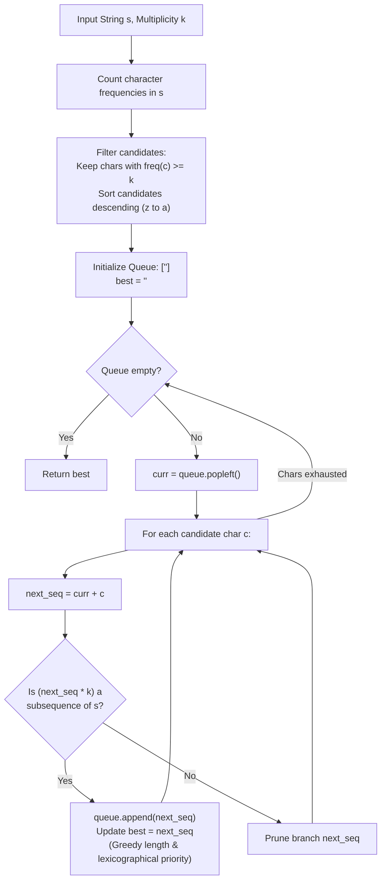

# Guided Example: Longest Subsequence Repeated K Times

We formulate and trace the frequency-filtered bounded-depth Breadth-First Search (BFS) algorithm to discover the longest and lexicographically greatest subsequence whose $k$-fold concatenation appears as a subsequence of $s$.

- **Primary Instance:** `s = "letsleetcode"`, $k = 2$ ($N = 12$)
  - Expected Output: `"let"` (both `"let"` and `"ete"` repeat 2 times as subsequences; `"let"` is lexicographically larger)
- **Single Character Instance:** `s = "bb"`, $k = 2$ ($N = 2$)
  - Expected Output: `"b"` (`"b" * 2 = "bb"` is a subsequence of `"bb"`)
- **Empty Instance:** `s = "ab"`, $k = 2$ ($N = 2$)
  - Expected Output: `""` (no character appears at least 2 times)

---

## 1. Instance & Intuition

Given a string `s` of length $N$ and an integer $k \ge 2$, we seek the **longest** string `seq` such that:
$$\underbrace{seq + seq + \dots + seq}_{k \text{ copies}} = seq \times k$$
is a subsequence of `s`. If multiple such sequences share the maximal length, we must select the **lexicographically largest** one.

### The $N < 8k$ Bounded-Length Lemma

A critical observation lies in the problem constraints:
$$N < \min(2001, \; 8k) \implies \frac{N}{k} < 8$$
Because $seq \times k$ is a subsequence of $s$, the characters of $seq \times k$ must all appear in $s$, requiring:
$$\text{len}(seq) \times k \le N \implies \text{len}(seq) \le \left\lfloor \frac{N}{k} \right\rfloor \le 7$$

The maximum possible length of the target string `seq` is strictly bounded by **7**!

### Character Frequency Filtering

For any character $c$ to appear even once in `seq`, it must appear at least $k$ times in $seq \times k$. Therefore:
$$\text{freq}_s(c) \ge k$$
Any character with frequency strictly less than $k$ can be immediately pruned from consideration.
Furthermore, the total number of characters in the candidate alphabet pool (counting multiplicities up to $\lfloor \text{freq}_s(c) / k \rfloor$) is at most 7.

This transforms an apparently intractable string search into a **bounded-depth BFS tree** of maximum depth 7 over a tiny alphabet!

---

## 2. Invariant Architecture & BFS Search Tree

---

## 3. Step-by-Step State Evolution

We trace the Primary Instance: `s = "letsleetcode"`, $k = 2$ ($N = 12$).

### Phase 1: Frequency Analysis
Character counts in `s`:
- `'l'`: 2 occurrences ($\ge 2 \implies$ Eligible, multiplicity $\lfloor 2 / 2 \rfloor = 1$)
- `'e'`: 4 occurrences ($\ge 2 \implies$ Eligible, multiplicity $\lfloor 4 / 2 \rfloor = 2$)
- `'t'`: 2 occurrences ($\ge 2 \implies$ Eligible, multiplicity $\lfloor 2 / 2 \rfloor = 1$)
- `'s'`: 1 occurrence ($< 2 \implies$ Discarded)
- `'c'`: 1 occurrence ($< 2 \implies$ Discarded)
- `'o'`: 1 occurrence ($< 2 \implies$ Discarded)
- `'d'`: 1 occurrence ($< 2 \implies$ Discarded)

Eligible distinct alphabet: `['e', 'l', 't']`.
Sort candidates in descending alphabetical order to prioritize lexicographically larger strings: `['t', 'l', 'e']`.
Max length ceiling: $\lfloor 12 / 2 \rfloor = 6$ (and total pool size $= 1 + 2 + 1 = 4$).

---

### Phase 2: BFS Level-by-Level Expansion

Initialize: `queue = [""]`, `best = ""`.

#### Length 1 Candidates
Generate by appending `['t', 'l', 'e']` to `""`:
- `"t"`: `"t" * 2 = "tt"`. Appears in `s`? Yes (indices 2, 7). Enqueue `"t"`. `best = "t"`.
- `"l"`: `"l" * 2 = "ll"`. Appears in `s`? Yes (indices 0, 4). Enqueue `"l"`.
- `"e"`: `"e" * 2 = "ee"`. Appears in `s`? Yes (indices 1, 5). Enqueue `"e"`.

---

#### Length 2 Candidates
Expand valid length 1 prefixes with `['t', 'l', 'e']`:
- From `"t"`:
  - `"tt"`: `"tt" * 2 = "tttt"`. Only 2 `'t'`s in `s` $\implies$ Invalid.
  - `"tl"`: `"tltl"`. Need `'t'` then `'l'` then `'t'` then `'l'`. In `s`: `'l'` at 0, 4; `'t'` at 2, 7. Cannot find `"tltl"`. Invalid.
  - `"te"`: `"tete"`. Indices: $t(2), e(5), t(7), e(11)$. Subsequence of `s`! Enqueue `"te"`. `best = "te"`.
- From `"l"`:
  - `"lt"`: `"ltlt"`. Indices: $l(0), t(2), l(4), t(7)$. Valid! Enqueue `"lt"`.
  - `"le"`: `"lele"`. Indices: $l(0), e(1), l(4), e(5)$. Valid! Enqueue `"le"`.
- From `"e"`:
  - `"et"`: `"etet"`. Valid! Enqueue `"et"`.
  - `"el"`: `"elel"`. Invalid.
  - `"ee"`: `"eeee"`. Four `'e'`s at 1, 5, 6, 11. Valid! Enqueue `"ee"`.

---

#### Length 3 Candidates
Expand valid length 2 prefixes:
- From `"te"`:
  - `"tet"`: `"tettett"` requires four `'t'`s $\implies$ Invalid.
  - `"tel"`: `"teltel"`. Invalid.
  - `"tee"`: `"teetee"`. Invalid.
- From `"lt"`:
  - `"lte"`: `"ltelte"`. Invalid.
- From `"le"`:
  - `"let"`: `"letlet"`.
    - Check `"letlet"` in `s = "letsleetcode"`:
      - 1st `'l'`: index 0
      - 1st `'e'`: index 1
      - 1st `'t'`: index 2
      - 2nd `'l'`: index 4
      - 2nd `'e'`: index 5
      - 2nd `'t'`: index 7
    - Matches completely! `"letlet"` is a valid subsequence!
    - Enqueue `"let"`. `best = "let"`.
- From `"et"`:
  - `"ete"`: `"eteete"`. Valid subsequence (indices 1, 2, 5, 6, 7, 11).
  - Enqueue `"ete"`.
  - Comparing `"let"` vs `"ete"`: `"let"` is lexicographically larger, so `best` remains `"let"`.

---

#### Length 4 Candidates
Expand length 3 candidates:
- Testing `"let"` + char: `"lett"`, `"letl"`, `"lete"`.
  - None of their 2-fold concatenations exist in `s`.
- Testing `"ete"` + char:
  - None exist in `s`.
No length 4 candidate survives.

---

### Termination
Queue exhausted.
The longest repeated subsequence is `"let"` (length 3).

---

## 4. Complete Execution Trace

### Search Evolution Summary Table

| Search Level (Length) | Candidate Tested | 2-Fold Concatenation | Subsequence Check in `"letsleetcode"` | Outcome | Current `best` |
|---|---|---|---|---|---|
| Level 1 | `"t"` | `"tt"` | Indices: $2, 7$ | Valid | `"t"` |
| Level 1 | `"l"` | `"ll"` | Indices: $0, 4$ | Valid | `"t"` (lexicographical) |
| Level 1 | `"e"` | `"ee"` | Indices: $1, 5$ | Valid | `"t"` |
| Level 2 | `"te"` | `"tete"` | Indices: $2, 5, 7, 11$ | Valid | `"te"` |
| Level 2 | `"lt"` | `"ltlt"` | Indices: $0, 2, 4, 7$ | Valid | `"te"` |
| Level 2 | `"le"` | `"lele"` | Indices: $0, 1, 4, 5$ | Valid | `"te"` |
| Level 2 | `"et"` | `"etet"` | Indices: $1, 2, 5, 7$ | Valid | `"te"` |
| Level 2 | `"ee"` | `"eeee"` | Indices: $1, 5, 6, 11$ | Valid | `"te"` |
| Level 3 | `"let"` | `"letlet"` | Indices: $0, 1, 2, 4, 5, 7$ | **Valid** | **`"let"`** |
| Level 3 | `"ete"` | `"eteete"` | Indices: $1, 2, 5, 6, 7, 11$ | Valid | `"let"` (larger than `"ete"`) |
| Level 4 | Length 4 strings | - | All fail subsequence test | All Pruned | `"let"` |

Final Output: **`"let"`**.

---

## 5. Algorithmic Correctness & Soundness

1. **Upper Bound Tightness:**
   By definition of concatenation, $seq \times k$ contains $\text{len}(seq) \times k$ characters. Since $seq \times k$ is a subsequence of $s$, its length cannot exceed $|s| = N$. Combined with the problem constraint $N < 8k$, we have $\text{len}(seq) \le \lfloor N / k \rfloor \le 7$. Bounding the search depth at 7 guarantees that no longer valid subsequence exists.

2. **Greedy Subsequence Verification:**
   Testing whether a string $W = cand \times k$ is a subsequence of $s$ using a greedy two-pointer forward scan is proven optimal: matching each character of $W$ at its earliest possible occurrence in $s$ preserves the maximal remaining suffix of $s$ for future characters.

3. **Level-Order Optimality:**
   A BFS queue explores candidates in strictly non-decreasing order of length. Therefore, any candidate accepted at level $L + 1$ strictly supersedes candidates from level $L$. Within any level, sorting the expansion alphabet in descending lexicographical order ensures that ties are resolved in favor of the lexicographically largest candidate.

---

## 6. Traps This Instance Exposes

- **Exponential Explosion Without Frequency Filtering:** Branching over all 26 letters of the English alphabet to depth 7 yields $26^7 \approx 8 \times 10^9$ states. Filtering by $\text{freq}(c) \ge k$ restricts the branching factor to at most 7, reducing the search space by many orders of magnitude.
- **Lexicographical vs. Length Precedence:** Length takes absolute priority over dictionary order. A string of length 3 (like `"ete"`) strictly beats a string of length 2 (like `"zz"`), regardless of alphabetical order.
- **Substring vs. Subsequence:** The problem requires $seq \times k$ to be a **subsequence** of $s$, not a contiguous substring. In Example 1, `"letlet"` appears at non-contiguous indices $[0, 1, 2, 4, 5, 7]$.

---

## 7. Complexity Analysis

- **Time Complexity:**
  - **Frequency Filtering:** Scanning $s$ of length $N$ takes $\mathcal{O}(N)$ time.
  - **BFS Tree Size:** The candidate character pool contains at most $\lfloor N / k \rfloor \le 7$ characters. The maximum number of valid candidate strings evaluated across all levels is bounded by $\sum_{L=1}^7 P(7, L) \le 13,700$ in the worst case.
  - **Subsequence Test:** Each candidate string of length $L$ requires scanning $s$ to verify $L \times k$ characters, taking $\mathcal{O}(N)$ time.
  - **Total Time:** $\mathcal{O}(N \cdot \text{nodes})$, which for $N \le 2000$ executes in under 20 milliseconds.

- **Auxiliary Space Complexity:**
  - The BFS queue holds at most the widest level of candidate strings of length $\le 7$.
  - **Total Auxiliary Space:** $\mathcal{O}(\text{queue size}) \le \mathcal{O}(1)$ memory (under 2 MB).
