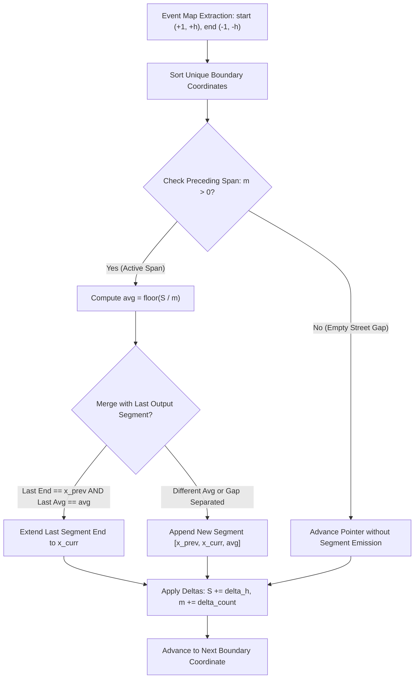

# Guided Example: Average Height of Buildings in Each Segment

## 1. Concrete Problem Restatement & Input Data

A straight street is mapped along a one-dimensional coordinate line. We are provided with a collection of building specifications, where each building is designated as a triplet $[\text{start}, \text{end}, \text{height}]$. Each building occupies the half-open continuous interval $[\text{start}, \text{end})$, contributing its constant vertical height throughout this span. 

Where multiple buildings overlap along a portion of the street, the aggregate height is defined as the arithmetic mean of all overlapping buildings rounded down to the nearest integer ($\lfloor \frac{\sum h}{k} \rfloor$). Our objective is to partition the entirely covered regions of the street into the minimal number of contiguous, non-overlapping segments $[\text{left}, \text{right}, \text{average}]$, satisfying:
1. Every sub-segment in the output must have a constant average integer height throughout its entire span.
2. Contiguous segments possessing identical average heights must be merged into a single maximal segment, even if the underlying composition of buildings changes across intermediate boundary points.
3. Completely uncovered gaps (where zero buildings exist) are omitted from the output and strictly prohibit merging between segments separated by the empty gap.

### Sample Input Dataset

Consider the representative configuration:
$$\text{buildings} = [[1, 3, 2], [2, 5, 3], [2, 8, 3]]$$

We also contrast this with the disconnected pair:
$$\text{buildings}_{\text{gap}} = [[1, 2, 1], [5, 6, 1]]$$
to observe how vacant intervals affect merging decisions.

---

## 2. Conceptual Walkthrough & Visual Intuition

A building's presence begins precisely at coordinate $\text{start}$ and vanishes precisely at coordinate $\text{end}$. Because building boundaries are sparse points on a potentially vast continuum ($0 \le \text{start} < \text{end} \le 10^8$), discretizing every integer point is infeasible. Instead, we use a sweep-line differential event framework.

Every building $[s_i, e_i, h_i]$ introduces two critical point events:
- At coordinate $s_i$: an entry event adding $+1$ to active building count and $+h_i$ to active height sum.
- At coordinate $e_i$: an exit event subtracting $-1$ from active building count and $-h_i$ from active height sum.

Across any open interval $(x_j, x_{j+1})$ between adjacent sorted boundary coordinates, no building starts or ends. Thus, the active building count $m$ and the active total height sum $S$ remain strictly constant. The average height across the entire span $[x_j, x_{j+1})$ is identically $\lfloor S / m \rfloor$.

When transitioning across coordinate $x_j$:
- If the prior interval $[x_{j-1}, x_j)$ had active buildings ($m > 0$), its average height is evaluated.
- If the immediately preceding committed segment in our output stream has the identical average height and ends exactly at $x_{j-1}$, the two adjacent segments coalesce into a single continuous segment.
- If the previous segment has a different average, or if a gap intervened ($m = 0$), a fresh segment is initiated.

---

## 3. Step-by-Step State Progression Table

Let us trace $\text{buildings} = [[1, 3, 2], [2, 5, 3], [2, 8, 3]]$.

First, we aggregate the discrete boundary changes:
- At $x = 1$: $+1$ building, $+2$ height.
- At $x = 2$: $+2$ buildings, $+6$ height.
- At $x = 3$: $-1$ building, $-2$ height.
- At $x = 5$: $-1$ building, $-3$ height.
- At $x = 8$: $-1$ building, $-3$ height.

The sorted unique coordinates are $[1, 2, 3, 5, 8]$.

| Current $x$ | Preceding Interval | Active $S, m$ in Preceding Span | Preceding Span Average | Action & Merging Decision | Output Accumulator | Delta Applied at $x$ | New Active $(S, m)$ |
|---|---|---|---|---|---|---|---|
| $1$ | None | $S=0, m=0$ | N/A | Initialize sweep line; start of street coverage | `[]` | $\Delta S = +2, \Delta m = +1$ | $S=2, m=1$ |
| $2$ | $[1, 2)$ | $S=2, m=1$ | $\lfloor 2/1 \rfloor = 2$ | Append initial segment $[1, 2, 2]$ | `[[1, 2, 2]]` | $\Delta S = +6, \Delta m = +2$ | $S=8, m=3$ |
| $3$ | $[2, 3)$ | $S=8, m=3$ | $\lfloor 8/3 \rfloor = 2$ | Last segment ends at $2$ with avg $2$. Equal avg and adjacent: extend segment to $[1, 3, 2]$ | `[[1, 3, 2]]` | $\Delta S = -2, \Delta m = -1$ | $S=6, m=2$ |
| $5$ | $[3, 5)$ | $S=6, m=2$ | $\lfloor 6/2 \rfloor = 3$ | Last segment ends at $3$ but has avg $2 \neq 3$. Append new segment $[3, 5, 3]$ | `[[1, 3, 2], [3, 5, 3]]` | $\Delta S = -3, \Delta m = -1$ | $S=3, m=1$ |
| $8$ | $[5, 8)$ | $S=3, m=1$ | $\lfloor 3/1 \rfloor = 3$ | Last segment ends at $5$ with avg $3$. Equal avg and adjacent: extend segment to $[3, 8, 3]$ | `[[1, 3, 2], [3, 8, 3]]` | $\Delta S = -3, \Delta m = -1$ | $S=0, m=0$ |

Final structured output segments:
$$[[1, 3, 2], [3, 8, 3]]$$

---

## 4. Key Transition Dynamics & Boundary Handling

The transition across boundary coordinates involves three distinct phases:

1. **Preceding Interval Evaluation**: When visiting boundary $x_k$, the interval $[x_{k-1}, x_k)$ has length $x_k - x_{k-1} > 0$. The active state during this entire length was governed by the height sum $S$ and count $m$ computed at $x_{k-1}$.
   - If $m > 0$, the average height was $\lfloor S / m \rfloor$.
   - If $m = 0$, the street was completely vacant, meaning no segment is emitted for $[x_{k-1}, x_k)$.

2. **Adjacency and Continuity Invariant**: Two segments $[\ell_1, r_1, a_1]$ and $[\ell_2, r_2, a_2]$ can merge into $[\ell_1, r_2, a_1]$ if and only if:
   $$r_1 = \ell_2 \quad \text{and} \quad a_1 = a_2$$
   Notice that if a gap occurred between $r_1$ and $\ell_2$ (for instance, $r_1 < \ell_2$), $r_1 \neq \ell_2$ holds naturally because the preceding span had $m = 0$, and the next active interval begins at $\ell_2$.

3. **Multi-event Coalescence at a Single Coordinate**: Multiple buildings may share the exact same start or end coordinates. For instance, in our sample at $x = 2$, two buildings begin simultaneously. Storing changes in a hash map or sorted dictionary ensures that all changes at coordinate $2$ coalesce into a single combined delta ($\Delta S = +6, \Delta m = +2$) before the line moves forward to coordinate $3$.

| Scenario | Prior State | Incoming Interval | Condition Check | Resulting Modification |
|---|---|---|---|---|
| Same Average, Adjacent | $[1, 2, 2]$ | $[2, 3)$ with avg $2$ | $\text{last\_end} == 2 \land \text{last\_avg} == 2$ | Update right bound: $[1, 3, 2]$ |
| Different Average, Adjacent | $[1, 3, 2]$ | $[3, 5)$ with avg $3$ | $\text{last\_end} == 3 \land \text{last\_avg} \neq 3$ | Append distinct record: $[3, 5, 3]$ |
| Same Average, Gap Separated | $[1, 2, 1]$ | $[5, 6)$ with avg $1$ | $\text{last\_end} == 2 \neq 5$ | Distinct records preserved: $[1, 2, 1], [5, 6, 1]$ |
| Vacant Segment | Any | $[2, 5)$ with $m = 0$ | $m == 0$ | Suppress output emission |

---

## 5. Algorithmic Correctness & Soundness

The correctness of the sweep-line interval reconstruction rests on two invariant properties:

### Invariant 1: Piecewise Constancy of Heights
Between any two consecutive points in the sorted union of all start and end coordinates, no building starts, finishes, or changes height. Consequently, the set of active buildings is strictly invariant over the open interval $(x_k, x_{k+1})$. Because each building provides a constant height, the sum of heights $S$ and the number of active buildings $m$ are constant functions of $x$ over $(x_k, x_{k+1})$. The floor division $\lfloor S / m \rfloor$ is therefore an exact, unique representative of the average height across every point in $[x_k, x_{k+1})$.

### Invariant 2: Maximality and Minimality of Partition
The problem demands the *minimum* number of segments. By greedily extending an existing segment whenever $r_{\text{last}} = x_k$ and $a_{\text{last}} = a_{\text{curr}}$, no two adjacent segments in the output can have the same average height. Since splitting any segment would strictly increase the segment count, and merging across different averages or across empty gaps would violate problem rules, this greedy maximal extension produces the unique minimal partition.

---

## 6. Edge Cases & Common Pitfalls

1. **Uncovered Gaps Between Equal Averages**: In $\text{buildings}_{\text{gap}} = [[1, 2, 1], [5, 6, 1]]$, both components have average height $1$. A naive post-processing step that aggregates all segments by average height would mistakenly combine them into $[1, 6, 1]$, falsely claiming the street is covered on $[2, 5)$. Checking $r_{\text{last}} = x_{\text{prev}}$ ensures that gaps prevent illegitimate merges.
2. **Integer Division Truncation**: Average calculation must use integer floor division ($\lfloor S / m \rfloor$). For example, a sum of $8$ across $3$ buildings yields $\lfloor 8/3 \rfloor = 2$.
3. **Overlapping Building Endpoints**: If building $A$ ends at coordinate $c$ and building $B$ starts at coordinate $c$, their intervals $[s_A, c)$ and $[c, e_B)$ meet at $c$. At point $c$, building $A$ is no longer active, while building $B$ becomes active. If both have the same average height, they seamlessly merge across $c$ into $[s_A, e_B)$.
4. **Massive Coordinate Ranges**: Coordinates can range up to $10^8$. Any attempt to use a dense prefix array of size $10^8$ will result in out-of-memory errors. The coordinate-compression / event-map sweep line processes only at most $2B$ boundary points, remaining independent of the numerical magnitude of the endpoints.

---

## 7. Complexity Analysis

### Time Complexity
- **Event Extraction**: Extracting the start and end event deltas for $B$ buildings requires iterating through the input list once: $\mathcal{O}(B)$ operations.
- **Coordinate Sorting**: There are at most $2B$ distinct boundary coordinates. Sorting these discrete coordinates takes $\mathcal{O}(B \log B)$ time.
- **Sweep-Line Traversal**: Traversing the sorted coordinates, updating running totals $S$ and $m$, and conditionally appending or extending output segments takes constant $\mathcal{O}(1)$ time per boundary point, totaling $\mathcal{O}(B)$ time.
- **Total Time Complexity**: $\mathcal{O}(B \log B)$, which is optimal for comparison-based event scheduling.

### Space Complexity
- **Event Storage**: The event map stores at most $2B$ unique coordinate entries, with associated delta values for height and count: $\mathcal{O}(B)$ auxiliary space.
- **Output Storage**: In the worst-case scenario where no two adjacent intervals merge, the output contains at most $2B - 1$ segments, consuming $\mathcal{O}(B)$ space.
- **Total Auxiliary Space**: $\mathcal{O}(B)$, scaling linearly with the number of input buildings.
