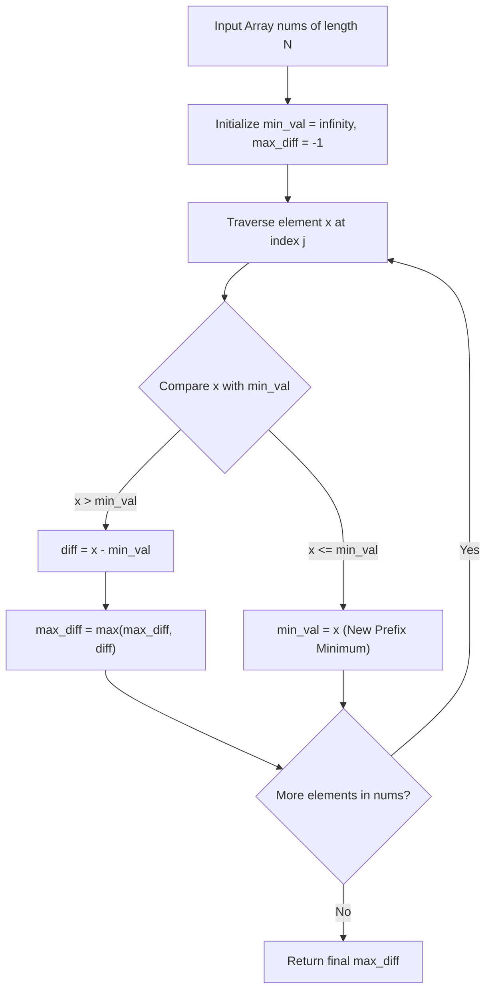

# Guided Example: Maximum Difference Between Increasing Elements

## 1. Concrete Problem Restatement & Input Data

Given a zero-indexed array of positive integers $\text{nums}$ of length $N$, we seek to identify a pair of indices $(i, j)$ such that:
1. $0 \le i < j < N$ (the first index precedes the second index in chronological order).
2. $\text{nums}[i] < \text{nums}[j]$ (the value at the earlier index is strictly less than the value at the later index).

Among all valid pairs satisfying both constraints, we must determine the maximum possible value of the difference:
$$\Delta = \text{nums}[j] - \text{nums}[i]$$

If no pair exists where an earlier element is strictly smaller than a subsequent element (for example, if the array is non-increasing throughout), the procedure must report $-1$.

### Sample Input Dataset

Consider the representative sequence:
$$\text{nums} = [7, 1, 5, 4]$$

We also examine the monotonic descent sequence:
$$\text{nums}_{\text{desc}} = [9, 4, 3, 2]$$
and the multi-valley progression:
$$\text{nums}_{\text{multi}} = [1, 5, 2, 10]$$

---

## 2. Conceptual Walkthrough & Visual Intuition

A brute-force search would examine all $\frac{N(N-1)}{2}$ index pairs $(i, j)$, requiring quadratic $\mathcal{O}(N^2)$ comparisons. However, notice that for any fixed candidate right endpoint $j$, we wish to maximize:
$$\text{nums}[j] - \text{nums}[i] \quad \text{subject to } 0 \le i < j \text{ and } \text{nums}[i] < \text{nums}[j]$$

Because $\text{nums}[j]$ is fixed at step $j$, maximizing $\text{nums}[j] - \text{nums}[i]$ is mathematically equivalent to minimizing the subtracted term $\text{nums}[i]$. Thus, the optimal earlier partner for index $j$ is simply the absolute minimum element in the prefix slice $\text{nums}[0 \dots j-1]$:
$$\mu_{j-1} = \min_{0 \le i < j} \text{nums}[i]$$

If $\text{nums}[j] > \mu_{j-1}$, the difference $\text{nums}[j] - \mu_{j-1}$ is strictly positive and represents the best possible profit/spread achievable using $j$ as the right endpoint. If $\text{nums}[j] \le \mu_{j-1}$, then $\text{nums}[j]$ cannot be strictly greater than any prior element; instead, it establishes a new or equal prefix minimum for future candidate right endpoints.

By maintaining a single running minimum accumulator as we traverse from left to right, we can evaluate each element in $\mathcal{O}(1)$ time.

---

## 3. Step-by-Step State Progression Table

Let us trace the primary sample $\text{nums} = [7, 1, 5, 4]$ through the single-pass scan.

Initial state:
- Running prefix minimum: $\mu = \infty$
- Best recorded difference: $\Delta_{\max} = -1$

| Step $j$ | Element $\text{nums}[j]$ | Prior Prefix Minimum $\mu$ | Condition $\text{nums}[j] > \mu$? | Candidate Difference | Updated $\Delta_{\max}$ | New Prefix Minimum $\mu$ | Action Taken |
|---|---|---|---|---|---|---|---|
| $0$ | $7$ | $\infty$ | No ($7 \le \infty$) | N/A | $-1$ | $7$ | Anchor initial minimum at index $0$ |
| $1$ | $1$ | $7$ | No ($1 \le 7$) | N/A | $-1$ | $1$ | Reset minimum to lower value $1$ |
| $2$ | $5$ | $1$ | Yes ($5 > 1$) | $5 - 1 = 4$ | $\max(-1, 4) = 4$ | $1$ | Record positive spread from index $1$ to $2$ |
| $3$ | $4$ | $1$ | Yes ($4 > 1$) | $4 - 1 = 3$ | $\max(4, 3) = 4$ | $1$ | Candidate spread $3 \le 4$, retain best spread $4$ |

Final result returned: $4$.

---

## 4. Key Transition Dynamics & Boundary Handling

The transition logic at each index $j$ adheres to a strict binary branch:

$$\text{Transition}(x, \mu, \Delta_{\max}) = \begin{cases} (\mu, \max(\Delta_{\max}, x - \mu)) & \text{if } x > \mu \\ (x, \Delta_{\max}) & \text{if } x \le \mu \end{cases}$$

Notice that when $x = \mu$, updating $\mu \leftarrow x$ leaves the minimum unchanged, and no difference is evaluated because the problem specifies *strictly increasing* pairs ($\text{nums}[i] < \text{nums}[j]$). A difference of zero is disallowed.

| Input Pattern | Array Example | Prefix Minimum Progression | Condition Behavior | Final $\Delta_{\max}$ | Structural Insight |
|---|---|---|---|---|---|
| Monotonically Decreasing | $[9, 4, 3, 2]$ | $\infty \to 9 \to 4 \to 3 \to 2$ | $x > \mu$ is never satisfied | $-1$ | Correctly identifies absence of any increasing pair |
| All Equal Elements | $[5, 5, 5, 5]$ | $\infty \to 5 \to 5 \to 5 \to 5$ | $x \le \mu$ on every step | $-1$ | Strict inequality check prevents zero from being reported |
| Disjoint Valleys | $[1, 5, 2, 10]$ | $1 \to 1 \to 1 \to 1$ | Step 1 yields $+4$; Step 3 yields $10 - 1 = 9$ | $9$ | Earlier absolute minimum $1$ correctly spans across intermediate trough $2$ |
| Trough After Peak | $[6, 8, 1, 2]$ | $6 \to 6 \to 1 \to 1$ | Step 1 yields $+2$; Step 3 yields $2 - 1 = 1$ | $2$ | Peak $8$ cannot pair with subsequent trough $1$ |

---

## 5. Algorithmic Correctness & Soundness

The correctness of the single-pass greedy scan is established by induction over the array length.

### Invariant: Prefix Minimum Representation
At the start of iteration $j$, the variable $\mu$ holds:
$$\mu = \min_{0 \le k < j} \text{nums}[k]$$
This holds initially for $j=1$ with $\mu = \text{nums}[0]$, and by induction, each step updates $\mu \leftarrow \min(\mu, \text{nums}[j])$.

### Optimality of Fixed Endpoint Difference
For any fixed right index $j$, the maximum difference formed with an earlier index $i < j$ satisfying $\text{nums}[i] < \text{nums}[j]$ is:
$$\max_{\substack{0 \le i < j \\ \text{nums}[i] < \text{nums}[j]}} (\text{nums}[j] - \text{nums}[i]) = \text{nums}[j] - \min_{\substack{0 \le i < j \\ \text{nums}[i] < \text{nums}[j]}} \text{nums}[i]$$

If $\text{nums}[j] > \mu$, then the global minimum of the prefix $\mu = \min_{0 \le i < j} \text{nums}[i]$ is strictly smaller than $\text{nums}[j]$. Hence $\mu$ itself is a valid left endpoint index, and because it is the smallest possible subtracted value, it achieves the absolute maximum difference for right endpoint $j$. 

If $\text{nums}[j] \le \mu$, no index $i < j$ exists with $\text{nums}[i] < \text{nums}[j]$, so index $j$ cannot serve as a valid right endpoint.

Because every valid right endpoint $j \in [1, N-1]$ is tested against its optimal partner, the global maximum over all valid pairs is guaranteed to be found.

---

## 6. Edge Cases & Common Pitfalls

1. **Strict Inequality vs Non-Decreasing**: The condition demands $\text{nums}[i] < \text{nums}[j]$. If $\text{nums}[j] = \text{nums}[i]$, the difference is $0$, but this does not constitute an increasing pair. Initializing $\Delta_{\max} = -1$ and only updating when $\text{nums}[j] > \mu$ ensures zero is never mistakenly reported.
2. **Strict Chronological Ordering**: A minimum element that appears *after* the maximum element cannot be paired with it. For example, in $[10, 1]$, the minimum is $1$ and maximum is $10$, but $i < j$ requires $10$ to precede $1$, which gives no valid pair. The single forward pass naturally enforces the temporal constraint $i < j$.
3. **Minimum Length Arrays**: With $N=2$, the algorithm executes exactly one comparison between $\text{nums}[1]$ and $\text{nums}[0]$, cleanly returning $\text{nums}[1] - \text{nums}[0]$ if positive, or $-1$ otherwise.
4. **Large Element Values**: Values can reach $10^9$. The maximum difference can be up to $10^9 - 1$, which fits comfortably in standard 64-bit integer representations without overflow.

---

## 7. Complexity Analysis

### Time Complexity
- **Single Linear Scan**: The algorithm processes each element of $\text{nums}$ exactly once in a single forward pass.
- **Constant Time Transitions**: At each step $j$, the comparison $\text{nums}[j] > \mu$, the subtraction $\text{nums}[j] - \mu$, the maximum selection $\max(\Delta_{\max}, \text{diff})$, and the minimum update $\mu = \text{nums}[j]$ all execute in $\mathcal{O}(1)$ time.
- **Total Time Complexity**: $\mathcal{O}(N)$, where $N$ is the length of $\text{nums}$. This is strictly optimal since any algorithm must inspect every element at least once.

### Space Complexity
- **State Variables**: Only two scalar variables are maintained: the prefix minimum $\mu$ and the maximum difference accumulator $\Delta_{\max}$.
- **Auxiliary Memory**: No heap allocations, dynamic tables, or auxiliary arrays are created.
- **Total Auxiliary Space**: $\mathcal{O}(1)$, achieving true constant extra space.
