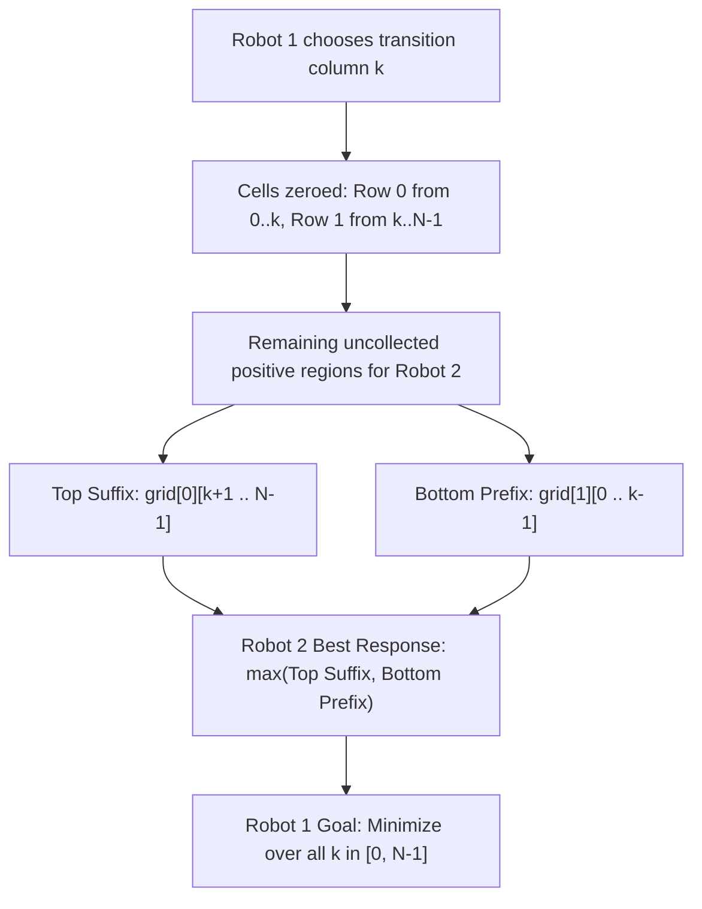

# Guided Example: Grid Game

## 1. Concrete Problem Restatement & Input Data

We are given a 2D integer matrix $\text{grid}$ consisting of exactly $2$ rows and $N$ columns ($2 \times N$). Two automated players, Robot 1 and Robot 2, navigate across the grid starting at the top-left cell $(0, 0)$ and terminating at the bottom-right cell $(1, N-1)$. 

Movement is strictly constrained: from any cell $(r, c)$, a robot may only move right to $(r, c+1)$ or move down to $(r+1, c)$. Because the grid has only $2$ rows, any valid path from $(0, 0)$ to $(1, N-1)$ travels horizontally along row $0$ up to some chosen column $k$, transitions downward from $(0, k)$ to $(1, k)$, and then travels horizontally along row $1$ from column $k$ to column $N-1$. Every path is uniquely parameterized by this single transition column $k \in [0, N-1]$.

The game proceeds in two sequential phases:
1. **Robot 1 Moves First**: Robot 1 selects a valid path and collects the sum of values on that path. As Robot 1 traverses cells, the value in every visited cell is permanently set to $0$.
2. **Robot 2 Moves Second**: Robot 2 traverses a path through the modified grid, collecting the sum of the remaining cell values.
3. **Adversarial Objectives**: Robot 1 wants to **minimize** the total score collected by Robot 2. Conversely, Robot 2 wants to **maximize** its own collected score.

We must compute the final score achieved by Robot 2 under optimal play by both participants.

### Sample Input Dataset

Consider the grid configuration:
$$\text{grid} = \begin{bmatrix} 2 & 5 & 4 \\ 1 & 5 & 1 \end{bmatrix}$$

We also examine:
$$\text{grid}_{\text{asym}} = \begin{bmatrix} 3 & 3 & 1 \\ 8 & 5 & 2 \end{bmatrix}$$
and the wider matrix:
$$\text{grid}_{\text{wide}} = \begin{bmatrix} 1 & 3 & 1 & 15 \\ 1 & 3 & 3 & 1 \end{bmatrix}$$

---

## 2. Conceptual Walkthrough & Visual Intuition

Suppose Robot 1 chooses column $k$ to transition from row $0$ to row $1$. The cells zeroed out by Robot 1 are:
- In row $0$: all cells from index $0$ to $k$.
- In row $1$: all cells from index $k$ to $N-1$.

Now consider Robot 2 choosing its transition column $j$:
- **Case 1: $j > k$ (Robot 2 turns later than Robot 1)**:
  In row $0$, Robot 2 traverses columns $0 \dots j$. Columns $0 \dots k$ are already zeroed out, leaving only columns $k+1 \dots j$ with positive values. In row $1$, Robot 2 traverses columns $j \dots N-1$, all of which were already zeroed out by Robot 1. To maximize its reward, Robot 2 should stay on row $0$ as long as possible, turning at $j = N-1$. Its collected score is the entire remaining suffix of row $0$:
  $$\text{Score}_{\text{top}} = \sum_{c = k+1}^{N-1} \text{grid}[0][c]$$

- **Case 2: $j < k$ (Robot 2 turns earlier than Robot 1)**:
  In row $0$, Robot 2 traverses columns $0 \dots j$, all of which were already zeroed out. In row $1$, Robot 2 traverses columns $j \dots N-1$. Since columns $k \dots N-1$ are zeroed out, Robot 2 only collects values from columns $j \dots k-1$. To maximize this sum, Robot 2 should turn at the very start ($j = 0$). Its collected score is the entire remaining prefix of row $1$:
  $$\text{Score}_{\text{bottom}} = \sum_{c = 0}^{k-1} \text{grid}[1][c]$$

- **Case 3: $j = k$**: Robot 2 replicates Robot 1's exact path, visiting only zeroed cells and collecting $0$.

Because Robot 2 acts greedily to maximize its score, for any chosen $k$, Robot 2 will inevitably collect:
$$\text{Payoff}(k) = \max \left( \sum_{c = k+1}^{N-1} \text{grid}[0][c], \sum_{c = 0}^{k-1} \text{grid}[1][c] \right)$$

Robot 1's optimal strategy is therefore to select $k$ that minimizes this maximum payoff:
$$\text{Optimal Score} = \min_{0 \le k < N} \max \left( \sum_{c = k+1}^{N-1} \text{grid}[0][c], \sum_{c = 0}^{k-1} \text{grid}[1][c] \right)$$

---

## 3. Step-by-Step State Progression Table

Let us trace $\text{grid} = \begin{bmatrix} 2 & 5 & 4 \\ 1 & 5 & 1 \end{bmatrix}$ with $N = 3$.

Initial setup:
- Total sum of row $0$: $S_1 = 2 + 5 + 4 = 11$.
- Running sum of row $1$: $S_2 = 0$.
- Best forced score initialized: $\text{ans} = \infty$.

| Candidate Column $k$ | Row 0 Element $\text{grid}[0][k]$ | Remaining Top Suffix $S_1 \leftarrow S_1 - \text{grid}[0][k]$ | Bottom Prefix $S_2$ (columns $0 \dots k-1$) | Robot 2 Payoff $\max(S_1, S_2)$ | Running Best $\text{ans} = \min(\text{ans}, \text{payoff})$ | New Bottom Prefix $S_2 \leftarrow S_2 + \text{grid}[1][k]$ |
|---|---|---|---|---|---|---|
| $k = 0$ | $2$ | $11 - 2 = 9$ | $0$ | $\max(9, 0) = 9$ | $\min(\infty, 9) = 9$ | $0 + 1 = 1$ |
| $k = 1$ | $5$ | $9 - 5 = 4$ | $1$ | $\max(4, 1) = 4$ | $\min(9, 4) = 4$ | $1 + 5 = 6$ |
| $k = 2$ | $4$ | $4 - 4 = 0$ | $6$ | $\max(0, 6) = 6$ | $\min(4, 6) = 4$ | $6 + 1 = 7$ |

Final outcome: Robot 1 chooses $k = 1$, restricting Robot 2 to a maximum payoff of $4$.

---

## 4. Key Transition Dynamics & Boundary Handling

Evaluating Robot 2's options across boundary columns reveals the interplay between the two row sums:

1. **Extreme Left Turning Column ($k = 0$)**:
   - Robot 1 turns immediately at column $0$.
   - Bottom prefix is empty: $S_2 = 0$.
   - Top suffix is the entire tail: $\sum_{c=1}^{N-1} \text{grid}[0][c]$.
   - Robot 2 achieves $\max(S_1, 0) = S_1$.

2. **Extreme Right Turning Column ($k = N-1$)**:
   - Robot 1 stays on row $0$ until the final cell.
   - Top suffix is empty: $S_1 = 0$.
   - Bottom prefix is the entire head: $\sum_{c=0}^{N-2} \text{grid}[1][c]$.
   - Robot 2 achieves $\max(0, S_2) = S_2$.

3. **Monotonicity Across the Columns**:
   - As $k$ increases from $0$ to $N-1$, the top suffix $S_1(k)$ is strictly non-increasing.
   - Concurrently, the bottom prefix $S_2(k)$ is strictly non-decreasing.
   - The point of minimum $\max(S_1(k), S_2(k))$ occurs near the intersection of these two monotonic curves.

| Configuration Example | Candidate Turning Options | Top Suffix Values | Bottom Prefix Values | Payoffs per $k$ | Optimal Turning Column $k^*$ | Resulting Score |
|---|---|---|---|---|---|---|
| $\begin{bmatrix} 3 & 3 & 1 \\ 8 & 5 & 2 \end{bmatrix}$ | $k \in [0, 1, 2]$ | $[4, 1, 0]$ | $[0, 8, 13]$ | $[4, 8, 13]$ | $k = 0$ | $4$ |
| $\begin{bmatrix} 1 & 3 & 1 & 15 \\ 1 & 3 & 3 & 1 \end{bmatrix}$ | $k \in [0, 1, 2, 3]$ | $[19, 16, 15, 0]$ | $[0, 1, 4, 7]$ | $[19, 16, 15, 7]$ | $k = 3$ | $7$ |
| Single Column $N = 1$ | $k = 0$ | $0$ | $0$ | $0$ | $k = 0$ | $0$ |

---

## 5. Algorithmic Correctness & Soundness

### Soundness of Robot 2's Domain Reduction
Any path Robot 2 takes is specified by some turn index $j \in [0, N-1]$. The cells collected by Robot 2 are:
$$\mathcal{C}(j) = \{(0, c) \mid 0 \le c \le j\} \cup \{(1, c) \mid j \le c \le N-1\}$$
Since Robot 1 visited $\mathcal{R}_1 = \{(0, c) \mid 0 \le c \le k\} \cup \{(1, c) \mid k \le c \le N-1\}$, the non-zero cells accessible to Robot 2 are:
$$\mathcal{C}(j) \setminus \mathcal{R}_1 = \begin{cases} \{(1, c) \mid j \le c < k\} & \text{if } j < k \\ \emptyset & \text{if } j = k \\ \{(0, c) \mid k < c \le j\} & \text{if } j > k \end{cases}$$

For $j < k$, the sum $\sum_{c=j}^{k-1} \text{grid}[1][c]$ has non-negative terms and is maximized by choosing $j = 0$, giving $\sum_{c=0}^{k-1} \text{grid}[1][c]$.
For $j > k$, the sum $\sum_{c=k+1}^j \text{grid}[0][c]$ is maximized by choosing $j = N-1$, giving $\sum_{c=k+1}^{N-1} \text{grid}[0][c]$.
Since $j = k$ yields $0$, Robot 2's optimal response is strictly:
$$\max \left( \sum_{c=k+1}^{N-1} \text{grid}[0][c], \sum_{c=0}^{k-1} \text{grid}[1][c] \right)$$
No other path can yield a higher sum.

### Global Min-Max Optimality
Robot 1 possesses complete information and knows Robot 2 will respond optimally to any chosen $k$. Because $k$ must be an integer in $\{0, 1, \dots, N-1\}$, evaluating all $N$ possibilities and selecting the minimum guarantees the exact game-theoretic minimax value.

---

## 6. Edge Cases & Common Pitfalls

1. **Selfish Greedy Trap for Robot 1**: A common mistake is attempting to make Robot 1 choose the path that maximizes Robot 1's *own* points. The problem explicitly states Robot 1's goal is to **minimize Robot 2's score**, regardless of what score Robot 1 personally collects.
2. **Double 0 Path for Robot 2**: If $N = 1$, Robot 1 visits $(0, 0)$ and $(1, 0)$, zeroing the entire grid. Robot 2 has no choice but to collect $0$.
3. **Integer Overflow**: With $N \le 5 \times 10^4$ and matrix values up to $10^5$, row sums can reach $5 \times 10^4 \times 10^5 = 5 \times 10^9$, exceeding standard 32-bit signed integers ($2^{31}-1 \approx 2.14 \times 10^9$). Calculations must utilize 64-bit integer accumulators.
4. **Off-by-one in Subarray Bounds**: The top suffix excludes column $k$ (starts at $k+1$), and the bottom prefix excludes column $k$ (ends at $k-1$). Column $k$ itself was visited by Robot 1 and thus contains $0$ in both rows.

---

## 7. Complexity Analysis

### Time Complexity
- **Initial Top Row Sum**: Summing the elements of row $0$ takes $\mathcal{O}(N)$ operations.
- **Single Traversal**: In a single pass through column indices $k = 0, 1, \dots, N-1$, we decrement $S_1$ by $\text{grid}[0][k]$, evaluate $\max(S_1, S_2)$, update the running minimum, and increment $S_2$ by $\text{grid}[1][k]$. Each step executes in $\mathcal{O}(1)$ time.
- **Total Time Complexity**: $\mathcal{O}(N)$, which is optimal since every grid entry must be inspected.

### Space Complexity
- **Scalar Accumulators**: Only scalar variables are maintained ($S_1, S_2, \text{ans}$, and iteration index $k$).
- **No Auxiliary Arrays**: Prefix sums are updated in place during the iteration without allocating extra arrays.
- **Total Auxiliary Space**: $\mathcal{O}(1)$, requiring minimal constant additional memory.
