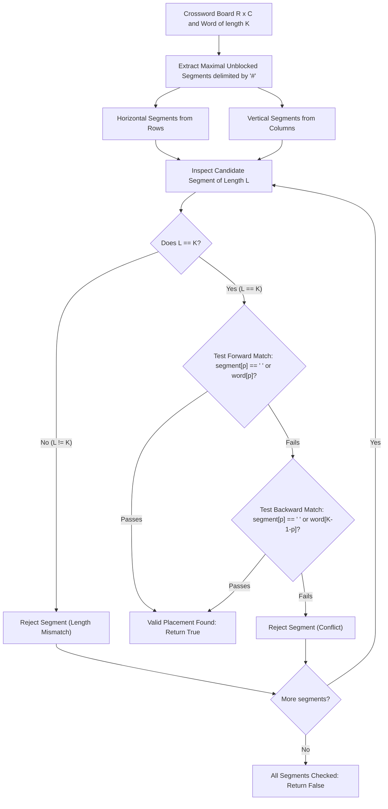

# Guided Example: Check if Word Can Be Placed In Crossword

## 1. Concrete Problem Restatement & Input Data

We are provided an $R \times C$ crossword board containing three categories of characters:
- Lowercase English letters (`'a'` through `'z'`), representing fixed pre-filled characters.
- Space characters (`' '`), representing vacant cells awaiting assignment.
- Hash characters (`'#'`), representing impassable barrier blocks.

We are also given a target lowercase string $\text{word}$ of length $K$. We must determine whether $\text{word}$ can be legally placed into the board along either a horizontal or a vertical line, reading in either forward (left-to-right / top-to-bottom) or reverse (right-to-left / bottom-to-top) order.

A placement is valid if and only if it satisfies all of the following rules:
1. **Unblocked Alignment**: Every cell in the span must be non-blocked (it cannot contain `'#'`).
2. **Character Compatibility**: At every position $p \in [0, K-1]$, the cell must either be a space `' '` or match the corresponding character of $\text{word}$ exactly.
3. **Exact Slot Boundary Rule**: The cells immediately preceding and immediately following the word along its orientation axis must be either off the board grid boundary or blocked by `'#'`. In other words, $\text{word}$ cannot occupy a proper subsegment of a longer unblocked run; the contiguous open segment must have length **identically equal to $K$**.

### Sample Input Dataset

Consider the board configuration with target string $\text{word} = \text{"abc"}$ ($K = 3$):
$$\text{board} = \begin{bmatrix} \text{\#'} & \text{' '} & \text{\#'} \\ \text{' '} & \text{' '} & \text{\#'} \\ \text{\#'} & \text{'c'} & \text{' '} \end{bmatrix}$$

We also examine the incompatible configuration with $\text{word} = \text{"ac"}$ ($K = 2$):
$$\text{board}_{\text{no}} = \begin{bmatrix} \text{' '} & \text{\#'} & \text{'a'} \\ \text{' '} & \text{\#'} & \text{'c'} \\ \text{' '} & \text{\#'} & \text{'a'} \end{bmatrix}$$
and a reverse horizontal placement with $\text{word} = \text{"ca"}$ ($K = 2$):
$$\text{board}_{\text{rev}} = \begin{bmatrix} \text{\#'} & \text{' '} & \text{\#'} \\ \text{' '} & \text{' '} & \text{\#'} \\ \text{\#'} & \text{' '} & \text{'c'} \end{bmatrix}$$

---

## 2. Conceptual Walkthrough & Visual Intuition

The crucial structural insight lies in rule 3: **the word must fill an entire maximal open segment**. A maximal open segment is a contiguous run of non-barrier cells bounded on both ends by either a grid edge or a `'#'` barrier.

Rather than checking all possible starting coordinates and directions arbitrarily, we can decompose the crossword grid into its constituent maximal 1D segments:
1. Every row of length $C$ is partitioned by `'#'` barriers into disjoint contiguous token segments.
2. Every column of length $R$ is partitioned by `'#'` barriers into disjoint contiguous token segments.

For each extracted segment:
- Let the length of the segment be $L$.
- **Length Filter**: If $L \neq K$, this segment can never accommodate $\text{word}$. If $L < K$, the word does not fit. If $L > K$, placing the word would leave unblocked cells before or after, violating the boundary rule.
- **Compatibility Verification**: If $L = K$, the segment is an exact geometric fit. We test whether the characters match in either direction:
  - **Forward Match**: For all $p \in [0, K-1]$, $\text{segment}[p] \in \{\text{' '}, \text{word}[p]\}$.
  - **Backward Match**: For all $p \in [0, K-1]$, $\text{segment}[p] \in \{\text{' '}, \text{word}[K - 1 - p]\}$.

If any segment across all rows or columns satisfies either forward or backward compatibility, we conclude $\text{true}$ immediately. If all maximal segments are exhausted without a match, we return $\text{false}$.

---

## 3. Step-by-Step State Progression Table

Let us trace the primary sample with $\text{word} = \text{"abc"}$ ($K = 3$):
$$\text{board} = \begin{bmatrix} \text{\#'} & \text{' '} & \text{\#'} \\ \text{' '} & \text{' '} & \text{\#'} \\ \text{\#'} & \text{'c'} & \text{' '} \end{bmatrix}$$

We extract all maximal unblocked segments from rows and columns:

| Orientation | Coordinate | Segment Index Range | Raw Cell Content | Length $L$ | Length Equals $K = 3$? | Forward Match Test against `"abc"` | Backward Match Test against `"cba"` | Verdict |
|---|---|---|---|---|---|---|---|---|
| Horizontal | Row $0$ | Col $1 \dots 1$ | `[' ']` | $1$ | No ($1 \neq 3$) | Skipped | Skipped | Discarded |
| Horizontal | Row $1$ | Col $0 \dots 1$ | `[' ', ' ']` | $2$ | No ($2 \neq 3$) | Skipped | Skipped | Discarded |
| Horizontal | Row $2$ | Col $1 \dots 2$ | `['c', ' ']` | $2$ | No ($2 \neq 3$) | Skipped | Skipped | Discarded |
| Vertical | Col $0$ | Row $1 \dots 1$ | `[' ']` | $1$ | No ($1 \neq 3$) | Skipped | Skipped | Discarded |
| Vertical | Col $1$ | Row $0 \dots 2$ | `[' ', ' ', 'c']` | $3$ | **Yes ($3 == 3$)** | Pos 0: `' '` vs `'a'` (OK) Pos 1: `' '` vs `'b'` (OK) Pos 2: `'c'` vs `'c'` (OK) | Not needed (Forward passed) | **Match Accepted** |
| Vertical | Col $2$ | Row $2 \dots 2$ | `[' ']` | $1$ | No ($1 \neq 3$) | Skipped | Skipped | Skipped (Already True) |

Column $1$ provides an exact geometric and character match reading vertically downwards. Result: `true`.

---

## 4. Key Transition Dynamics & Boundary Handling

Analyzing boundary conditions across different board topologies highlights why decomposing into maximal segments guarantees precision:

1. **Boundary Confinement**: A word cannot end adjacent to another blank cell without a barrier separating them. For example, if a row contains `[' ', ' ', ' ']` and $K = 2$, placing the word in the first two cells leaves an empty cell immediately following it, which violates the requirement that the placement must be bordered by `#` or the board edge.
2. **Bidirectional Complementarity**: In `board_rev`, row $2$ has cells `[' ', 'c']` with $K = 2$ and $\text{word} = \text{"ca"}$.
   - Reading left-to-right gives `' '` then `'c'`. The word needs `'c'` then `'a'`. Cell $1$ has `'c'` while the word expects `'a'` (conflict).
   - Reading right-to-left gives `'c'` then `' '`. The word needs `'c'` then `'a'`. Cell $1$ has `'c'` (matches) and cell $0$ has `' '` (wildcard matches `'a'`). The reverse orientation succeeds.

| Board Row / Column Content | Word | Target Length $K$ | Segment Length $L$ | Forward Fit | Backward Fit | Outcome Explanation |
|---|---|---|---|---|---|---|
| `['#', ' ', ' ', '#']` | `"hi"` | $2$ | $2$ | Both match wildcards | Both match wildcards | Valid: entirely blank slot of exact length |
| `[' ', ' ', ' ']` | `"hi"` | $2$ | $3$ | Ineligible | Ineligible | Invalid: slot length $3$ exceeds word length $2$ |
| `['#', 'a', 'c', '#']` | `"ca"` | $2$ | $2$ | Mismatch (`'a'` vs `'c'`) | Match (`'c'` vs `'c'`, `'a'` vs `'a'`) | Valid: backward orientation matches |
| `['#', 'b', 'c', '#']` | `"ca"` | $2$ | $2$ | Mismatch | Mismatch | Invalid: fixed letter `'b'` conflicts with both directions |

---

## 5. Algorithmic Correctness & Soundness

### Soundness of Segment Partitioning
Every potential word placement spans a contiguous set of cells along a single row or column. By definition of the crossword placement rules:
- The cell immediately prior to the start of the word must be either off-board or `'#'`.
- The cell immediately following the end of the word must be either off-board or `'#'`.
- No cell within the word can be `'#'`.

Therefore, every legitimate word placement corresponds **one-to-one** with a maximal contiguous subsequence of non-`'#'` characters within some row or column whose length is identically $K$.

Because rows and columns form independent one-dimensional sequences, partitioning each row and column into connected components separated by `'#'` generates the exhaustive set of all candidate slots.

### Completeness of Bidirectional Verification
For any candidate slot of length $K$, there are exactly two spatial orientations: forward along the index axis or reverse. A slot is viable if and only if every cell $p$ satisfies $\text{cell}[p] \in \{\text{' '}, \text{target}[p]\}$. Testing both orientations exhaustively checks all possibilities. Hence, no valid placement can be overlooked, and no invalid placement can be accepted.

---

## 6. Edge Cases & Common Pitfalls

1. **Subsegment Embedding Fallacy**: Assuming that because a row contains $5$ consecutive spaces, a $3$-letter word can simply be placed at the beginning. This is explicitly prohibited: the word must span from barrier to barrier (or edge).
2. **Asymmetric Grid Dimensions**: $R$ and $C$ need not be equal. A $1 \times N$ or $N \times 1$ grid contains only one direction of meaningful length, while the orthogonal direction consists solely of length-$1$ segments.
3. **Single Letter Words ($K = 1$)**: When $K = 1$, forward and backward orientations are identical. The slot must be an isolated single unblocked cell surrounded by `#` or grid edges.
4. **Pre-existing Fixed Letters**: Fixed letters must be strictly respected. A space `' '` acts as a wildcard, but an existing letter cannot be overwritten or altered.

---

## 7. Complexity Analysis

### Time Complexity
- **Grid Traversal & Segment Extraction**: Traversing the $R \times C$ board along rows visits each cell once, taking $\mathcal{O}(R \cdot C)$ operations. Traversing along columns similarly takes $\mathcal{O}(R \cdot C)$ operations.
- **Character Matching**: Each unblocked cell belongs to exactly one maximal horizontal segment and one maximal vertical segment. When a segment has length $K$, comparing characters forward and backward takes at most $2K$ character operations. Across the entire grid, the sum of lengths of candidate segments cannot exceed the total number of cells $R \cdot C$.
- **Total Time Complexity**: $\mathcal{O}(R \cdot C)$, which is strictly linear in the total number of board cells.

### Space Complexity
- **Iterative Extraction**: Maximal segments can be verified with running index pointers or by extracting tokens between `#` delimiters.
- **Memory Footprint**: Scanning with index pointers requires $\mathcal{O}(1)$ additional memory beyond storing the grid and word. Even if token slices are extracted row-by-row, the maximum memory at any moment is bounded by $\mathcal{O}(\max(R, C))$.
- **Total Auxiliary Space**: $\mathcal{O}(1)$ with pointer traversal, or $\mathcal{O}(\max(R, C))$ if buffering individual rows/columns.
