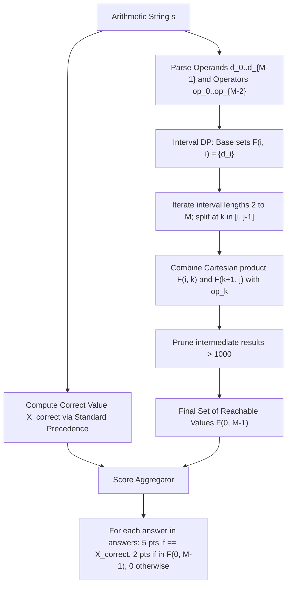

# Guided Example: The Score of Students Solving Math Expression

## 1. Concrete Problem Restatement & Input Data

We are given an arithmetic string $s$ consisting of single-digit integers (`'0'` through `'9'`) interleaved with binary operators (`'+'` and `'*'`). The expression contains $M$ operands and $M - 1$ operators, having total string length $2M - 1 \in [3, 31]$ (so $M \le 16$). We are also provided an array $\text{answers}$ containing $A$ integer responses submitted by students.

Grading follows strict scoring criteria:
1. **Correct Evaluation ($5$ points)**: The mathematically correct value $X_{\text{correct}}$ adheres to standard operator precedence: all multiplications are evaluated first from left to right, followed by all additions from left to right. Any student submission equal to $X_{\text{correct}}$ receives $5$ points.
2. **Erroneous Precedence / Parenthesization ($2$ points)**: If a student answer is not equal to $X_{\text{correct}}$, but could be generated by evaluating the exact sequence of numbers and operators under **some** legal full parenthesization (ignoring standard precedence rules), the submission receives $2$ points. Because student answers are bounded within $[0, 1000]$, we only need to track reachable values $\le 1000$.
3. **Invalid Calculation ($0$ points)**: Any answer that cannot be produced by any full parenthesization receives $0$ points.

Our task is to compute the total aggregate points earned across all $A$ students.

### Sample Input Dataset

Consider the expression with $M = 4$ digits:
$$s = \text{"7+3*1*2"}, \quad \text{answers} = [20, 13, 42]$$

We also examine the simpler $M = 3$ case:
$$s_{\text{simple}} = \text{"3+5*2"}, \quad \text{answers}_{\text{simple}} = [13, 0, 10, 13, 13, 16, 16]$$

---

## 2. Conceptual Walkthrough & Visual Intuition

The challenge decomposes cleanly into two distinct computational phases:

### Phase A: Standard Precedence Evaluation
Computing the correct answer $X_{\text{correct}}$ requires evaluating multiplications before additions:
- Traverse the expression while maintaining a running term product.
- Whenever a `'*'` is encountered, multiply into the current product.
- Whenever a `'+'` is encountered, accumulate the completed product into the running total and reset the product to the next digit.
- For $s = \text{"7+3*1*2"}$, the terms separated by `+` are $7$ and $3 \times 1 \times 2 = 6$. The correct sum is $7 + 6 = 13$.

### Phase B: All Possible Parenthesized Values via Interval DP
Every possible evaluation order corresponds to a binary expression tree over the sequence of operands $[d_0, d_1, \dots, d_{M-1}]$. We can compute the set of all reachable values for every contiguous sub-expression $d[i \dots j]$ using interval dynamic programming.

Let $\mathcal{F}(i, j)$ denote the set of all distinct arithmetic values reachable by fully parenthesizing the sub-expression from operand $i$ to operand $j$.
- **Base Cases**: For single operands ($i = j$), $\mathcal{F}(i, i) = \{d_i\}$.
- **Recurrence**: For an interval of length $\ge 2$ spanning $i$ to $j$, we consider every candidate final split operator $k \in [i, j-1]$ with operator $\text{op}_k$:
  $$\mathcal{F}(i, j) = \bigcup_{k=i}^{j-1} \left\{ u \odot_k v \;\middle|\; u \in \mathcal{F}(i, k), \; v \in \mathcal{F}(k+1, j), \; u \odot_k v \le 1000 \right\}$$
  where $\odot_k$ is addition if $\text{op}_k = \text{'+'}$, and multiplication if $\text{op}_k = \text{'*'}$.
- **Pruning**: Since all student answers are $\le 1000$, any intermediate or resulting value exceeding $1000$ can never match a valid student submission and is immediately discarded.

---

## 3. Step-by-Step State Progression Table

Let us trace $s = \text{"7+3*1*2"}$.
Operands: $d_0 = 7, d_1 = 3, d_2 = 1, d_3 = 2$.
Operators: $\text{op}_0 = \text{'+'}, \text{op}_1 = \text{'*'}, \text{op}_2 = \text{'*'}$.
Correct value: $7 + (3 \times 1 \times 2) = 13$.

We construct the interval DP table $\mathcal{F}(i, j)$:

| Interval Span $[i, j]$ | Length | Sub-expression | Split Positions $k$ & Subproblem Combinations | Resulting Set $\mathcal{F}(i, j)$ |
|---|---|---|---|---|
| $[0, 0]$ | $1$ | $7$ | Base case | $\{7\}$ |
| $[1, 1]$ | $1$ | $3$ | Base case | $\{3\}$ |
| $[2, 2]$ | $1$ | $1$ | Base case | $\{1\}$ |
| $[3, 3]$ | $1$ | $2$ | Base case | $\{2\}$ |
| $[0, 1]$ | $2$ | $7+3$ | $k=0: \mathcal{F}(0,0) + \mathcal{F}(1,1) = 7 + 3$ | $\{10\}$ |
| $[1, 2]$ | $2$ | $3*1$ | $k=1: \mathcal{F}(1,1) \times \mathcal{F}(2,2) = 3 \times 1$ | $\{3\}$ |
| $[2, 3]$ | $2$ | $1*2$ | $k=2: \mathcal{F}(2,2) \times \mathcal{F}(3,3) = 1 \times 2$ | $\{2\}$ |
| $[0, 2]$ | $3$ | $7+3*1$ | $k=0: \mathcal{F}(0,0) + \mathcal{F}(1,2) = 7 + 3 = 10$ $k=1: \mathcal{F}(0,1) \times \mathcal{F}(2,2) = 10 \times 1 = 10$ | $\{10\}$ |
| $[1, 3]$ | $3$ | $3*1*2$ | $k=1: \mathcal{F}(1,1) \times \mathcal{F}(2,3) = 3 \times 2 = 6$ $k=2: \mathcal{F}(1,2) \times \mathcal{F}(3,3) = 3 \times 2 = 6$ | $\{6\}$ |
| $[0, 3]$ | $4$ | $7+3*1*2$ | $k=0: \mathcal{F}(0,0) + \mathcal{F}(1,3) = 7 + 6 = 13$ $k=1: \mathcal{F}(0,1) \times \mathcal{F}(2,3) = 10 \times 2 = 20$ $k=2: \mathcal{F}(0,2) \times \mathcal{F}(3,3) = 10 \times 2 = 20$ | $\{13, 20\}$ |

The complete set of reachable outcomes is $\mathcal{F}(0, 3) = \{13, 20\}$.

Now we grade the candidate answers $[20, 13, 42]$:

| Student Answer | Equals Correct ($13$)? | Present in $\mathcal{F}(0, 3)$? | Points Awarded | Explanation |
|---|---|---|---|---|
| $20$ | No | Yes | $2$ | Produced by $((7+3)*1)*2$ |
| $13$ | Yes | Yes | $5$ | Matches standard precedence |
| $42$ | No | No | $0$ | Unreachable by any parenthesization |

Total score awarded: $2 + 5 + 0 = 7$.

---

## 4. Key Transition Dynamics & Boundary Handling

The transition dynamics rely on combining every element from the left sub-expression set with every element from the right sub-expression set:

1. **Cartesian Product Scaling**: If $|\mathcal{F}(i, k)| = p$ and $|\mathcal{F}(k+1, j)| = q$, the split at $k$ evaluates $p \times q$ potential results. Using sets automatically deduplicates identical numerical values, keeping the set sizes small.
2. **Strict Value Capping at $1000$**: Submissions are constrained to $0 \le \text{answer} \le 1000$. If a branch produces $15 \times 70 = 1050$, any student answer seeking to match this value would need to exceed $1000$, which is impossible by problem contract. Discarding values $> 1000$ prevents combinatorial explosion.
3. **Precedence Priority in Scoring**: If a student's answer equals $X_{\text{correct}}$, it receives $5$ points even if it is also generated by an incorrect parenthesization. The $5$-point award takes absolute precedence over the $2$-point award.

| Expression Example | Correct Precedence | Erroneous Parenthesization | Distinct Reachable Values | Scoring Distribution for $[13, 16, 8]$ |
|---|---|---|---|---|
| $3+5*2$ | $3 + (5 \times 2) = 13$ | $(3 + 5) \times 2 = 16$ | $\{13, 16\}$ | $13 \to 5\text{ pts}, 16 \to 2\text{ pts}, 8 \to 0\text{ pts}$ |
| $6+0*1$ | $6 + (0 \times 1) = 6$ | $(6 + 0) \times 1 = 6$ | $\{6\}$ | $6 \to 5\text{ pts}, \text{all others} \to 0\text{ pts}$ |
| $2*3+4*5$ | $(2 \times 3) + (4 \times 5) = 26$ | $(2 \times (3 + 4)) \times 5 = 70$ $2 \times ((3 + 4) \times 5) = 70$ $((2 \times 3) + 4) \times 5 = 50$ | $\{26, 50, 70\}$ | $26 \to 5\text{ pts}, 50/70 \to 2\text{ pts}$ |

---

## 5. Algorithmic Correctness & Soundness

### Completeness of Expression Tree Induction
Every valid parenthesization of an arithmetic expression corresponds to a full binary syntax tree where leaves represent operands and internal nodes represent binary operators.
- Any syntax tree on operands $d_i \dots d_j$ has a unique root operator $\text{op}_k$ with $i \le k < j$.
- The left child of the root is a valid parenthesization of $d_i \dots d_k$, and the right child is a valid parenthesization of $d_{k+1} \dots d_j$.
By strong mathematical induction on interval length $\ell = j - i + 1$, iterating over all split points $k \in [i, j-1]$ and taking the Cartesian product $\mathcal{F}(i, k) \odot_k \mathcal{F}(k+1, j)$ explores all possible binary syntax trees over the sub-expression.

### Monotonic Non-Negativity and Bound Sufficiency
All operands are non-negative digits ($0 \dots 9$) and all operators are either $+$ or $*$. Therefore, all intermediate evaluation values are non-negative integers. Because no operator can reduce the value of non-negative integers (except multiplication by $0$, which produces $0 \ge 0$), discarding values strictly greater than $1000$ cannot affect reachability of values $\le 1000$, ensuring zero false negatives.

---

## 6. Edge Cases & Common Pitfalls

1. **Multiplying by Zero**: An expression such as $6+0*1$ allows $(6 + 0) \times 1 = 6$, and also $6 + (0 \times 1) = 6$. When all parenthesizations yield the same answer as the correct evaluation, no student can earn $2$ points; every correct student gets $5$, and every incorrect student gets $0$.
2. **Frequency Aggregation**: Multiple students often submit the same answer. Using a frequency map allows grading each unique answer once and multiplying by its frequency, avoiding redundant set lookups.
3. **Double Counting Protection**: A student answering $X_{\text{correct}}$ must receive exactly $5$ points, not $5 + 2 = 7$. The check for $2$ points must strictly require $\text{ans} \neq X_{\text{correct}}$.
4. **Interval Traversal Order**: Dynamic programming intervals must be solved in order of increasing length $\ell = 1, 2, \dots, M$, ensuring subproblems $\mathcal{F}(i, k)$ and $\mathcal{F}(k+1, j)$ are fully solved before evaluating $\mathcal{F}(i, j)$.

---

## 7. Complexity Analysis

### Time Complexity
- **Standard Precedence Pass**: Evaluating $X_{\text{correct}}$ scans the string $s$ of length at most $31$ once, taking $\mathcal{O}(M)$ time.
- **Interval DP Traversal**: There are $M$ operands ($M \le 16$). The number of intervals $(i, j)$ is $\frac{M(M+1)}{2} \approx 136$. For each interval, there are at most $M$ split points $k$. At each split point, we compute the Cartesian product of two sets whose sizes are bounded by $V = 1001$ (in practice, typically $< 100$). The DP takes $\mathcal{O}(M^3 \cdot \min(V, C_M))$ operations, which completes in a few milliseconds.
- **Grading Step**: Checking $A$ student answers takes $\mathcal{O}(A)$ time using hash set lookups.
- **Total Time Complexity**: $\mathcal{O}(M^3 \cdot \min(V, C_M) + A)$, which easily runs within standard execution limits for $A \le 10^4$.

### Space Complexity
- **DP Table Storage**: An $M \times M$ grid of sets. Each set stores unique integers in the range $[0, 1000]$. The total memory is bounded by $M^2 \times 1001$ integers.
- **Frequency Map**: Storing distinct student responses requires $\mathcal{O}(\min(A, V))$ space.
- **Total Auxiliary Space**: $\mathcal{O}(M^2 \cdot V + A)$, well within memory limits.
