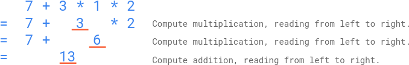

### 1. Description

You are given a string `s` that contains digits `0-9`, addition symbols `'+'`, and multiplication symbols `'*'` **only**, representing a **valid** math expression of **single digit numbers** (e.g., `3+5*2`). This expression was given to `n` elementary school students. The students were instructed to get the answer of the expression by following this **order of operations**:

- Compute **multiplication**, reading from **left to right**; Then,

- Compute **addition**, reading from **left to right**.

You are given an integer array `answers` of length `n`, which are the submitted answers of the students in no particular order. You are asked to grade the `answers`, by following these **rules**:

- If an answer **equals** the correct answer of the expression, this student will be rewarded `5` points;

- Otherwise, if the answer **could be interpreted** as if the student applied the operators **in the wrong order** but had **correct arithmetic**, this student will be rewarded `2` points;

- Otherwise, this student will be rewarded `0` points.

Return *the sum of the points of the students*.

### 2. Function Contract

**Inputs**

- `s`: Input parameter (`str`).
- `answers`: Input parameter (`List[int]`).

**Return value**

- Returns `int`.

### 3. Examples

#### Example 1

- **Input:** `s = "7+3*1*2", answers = [20,13,42]`
- **Output:** `7`
- **Explanation:** As illustrated above, the correct answer of the expression is 13, therefore one student is rewarded 5 points: [20,<u>**13**</u>,42]
A student might have applied the operators in this wrong order: ((7+3)*1)*2 = 20. Therefore one student is rewarded 2 points: [<u>**20**</u>,13,42]
The points for the students are: [2,5,0]. The sum of the points is 2+5+0=7.

#### Example 2

- **Input:** `s = "3+5*2", answers = [13,0,10,13,13,16,16]`
- **Output:** `19`
- **Explanation:** The correct answer of the expression is 13, therefore three students are rewarded 5 points each: [**<u>13</u>**,0,10,**<u>13</u>**,**<u>13</u>**,16,16]
A student might have applied the operators in this wrong order: ((3+5)*2 = 16. Therefore two students are rewarded 2 points: [13,0,10,13,13,**<u>16</u>**,**<u>16</u>**]
The points for the students are: [5,0,0,5,5,2,2]. The sum of the points is 5+0+0+5+5+2+2=19.

#### Example 3

- **Input:** `s = "6+0*1", answers = [12,9,6,4,8,6]`
- **Output:** `10`
- **Explanation:** The correct answer of the expression is 6.
If a student had incorrectly done (6+0)*1, the answer would also be 6.
By the rules of grading, the students will still be rewarded 5 points (as they got the correct answer), not 2 points.
The points for the students are: [0,0,5,0,0,5]. The sum of the points is 10.

### 4. Constraints

- $3 \le \text{s.length} \le 31$

- `s` represents a valid expression that contains only digits `0-9`, `'+'`, and `'*'` only.

- All the integer operands in the expression are in the **inclusive** range `[0, 9]`.

- $1 \le$ The count of all operators (`'+'` and `'*'`) in the math expression $\le 15$

- Test data are generated such that the correct answer of the expression is in the range of `[0, 1000]`.

- Test data are generated such that value never exceeds $10^{9}$ in intermediate steps of multiplication.

- $n = \text{answers.length}$

- $1 \le n \le 10^{4}$

- $0 \le \text{answers}[i] \le 1000$
