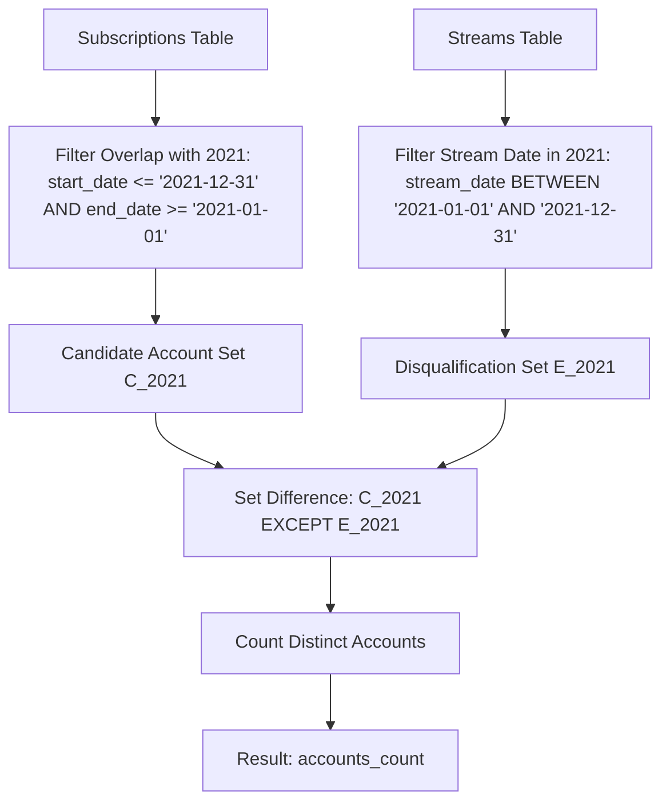

# Guided Example: Number of Accounts That Did Not Stream

## 1. Concrete Problem Restatement & Input Data

We are given two relational database tables that record streaming platform account subscriptions and viewer session history:

1. **`Subscriptions` Table**:
   - `account_id` (Primary Key): Unique identifier of each customer account.
   - `start_date`: Beginning calendar date of the subscription period.
   - `end_date`: Concluding calendar date of the subscription period ($start\_date \le end\_date$).

2. **`Streams` Table**:
   - `session_id` (Primary Key): Unique identifier of an individual streaming session.
   - `account_id`: The customer account initiating the session (foreign key to `Subscriptions`).
   - `stream_date`: The calendar date on which the streaming activity took place.

Our objective is to compute the exact count of unique accounts that fulfill two simultaneous relational conditions:
1. **Temporal Subscription Overlap**: The account held an active subscription that overlapped with calendar year $2021$ ($[\text{2021-01-01}, \text{2021-12-31}]$) for at least one day.
2. **Streaming Activity Absence**: The account recorded zero streaming sessions in calendar year $2021$ ($[\text{2021-01-01}, \text{2021-12-31}]$). Any streams occurring strictly prior to $2021$ or after $2021$ do not disqualify the account.

The output must be returned as a single-row, single-column table named `accounts_count`.

### Sample Input Dataset

Consider the following relational instances:

**`Subscriptions` Table**:
| `account_id` | `start_date` | `end_date` |
|---|---|---|
| $9$ | $2020\text{-}02\text{-}18$ | $2021\text{-}10\text{-}30$ |
| $3$ | $2021\text{-}09\text{-}21$ | $2021\text{-}11\text{-}13$ |
| $11$ | $2020\text{-}02\text{-}28$ | $2020\text{-}08\text{-}18$ |
| $4$ | $2021\text{-}10\text{-}26$ | $2022\text{-}03\text{-}05$ |

**`Streams` Table**:
| `session_id` | `account_id` | `stream_date` |
|---|---|---|
| $14$ | $9$ | $2020\text{-}04\text{-}06$ |
| $16$ | $3$ | $2021\text{-}01\text{-}26$ |
| $18$ | $11$ | $2020\text{-}04\text{-}05$ |
| $17$ | $13$ | $2021\text{-}04\text{-}29$ |

---

## 2. Conceptual Walkthrough & Visual Intuition

This problem is solved using set-theoretic relational filtering and anti-join logic across date intervals.

### Step A: Defining Interval Overlap
Two closed calendar intervals $[s_1, e_1]$ and $[s_2, e_2]$ have a non-empty intersection if and only if:
$$s_1 \le e_2 \quad \text{and} \quad e_1 \ge s_2$$
Here, calendar year $2021$ spans the closed range $[\text{2021-01-01}, \text{2021-12-31}]$. Therefore, an account's subscription overlaps $2021$ if:
$$\text{start\_date} \le \text{'2021-12-31'} \quad \land \quad \text{end\_date} \ge \text{'2021-01-01'}$$

This condition correctly captures:
- Subscriptions starting in or before $2020$ and ending during or after $2021$.
- Subscriptions entirely contained within $2021$.
- Subscriptions starting in $2021$ and extending into $2022$ or later.

### Step B: Identifying the Exclusion Set (Active 2021 Streamers)
Next, we isolate all accounts that logged at least one streaming event during $2021$:
$$\mathcal{E}_{2021} = \{ \text{account\_id} \in \text{Streams} \mid \text{'2021-01-01'} \le \text{stream\_date} \le \text{'2021-12-31'} \}$$
Crucially, any streaming sessions outside of $2021$ (such as account $9$'s session in $2020$) are excluded from $\mathcal{E}_{2021}$, so they do not disqualify the account.

### Step C: Relational Difference (Anti-Join) & Aggregation
Finally, we take the candidate accounts from Step A and eliminate any account belonging to $\mathcal{E}_{2021}$:
$$\text{Qualifying Accounts} = \{ \text{account\_id} \in \text{Active Subscriptions}_{2021} \mid \text{account\_id} \notin \mathcal{E}_{2021} \}$$
Counting the distinct cardinality of this set yields `accounts_count`.

---

## 3. Step-by-Step State Progression Table

Let us trace each account in the sample database through the two-stage predicate filter:

### Stage 1: Subscription Overlap Evaluation
Calendar year $2021$ window: $[\text{2021-01-01}, \text{2021-12-31}]$.

| Account ID | Subscription Period | $\text{start\_date} \le \text{'2021-12-31'}$ | $\text{end\_date} \ge \text{'2021-01-01'}$ | Overlaps 2021? | Candidate Status |
|---|---|---|---|---|---|
| $9$ | $[2020\text{-}02\text{-}18, 2021\text{-}10\text{-}30]$ | True ($2020\text{-}02\text{-}18 \le 2021\text{-}12\text{-}31$) | True ($2021\text{-}10\text{-}30 \ge 2021\text{-}01\text{-}01$) | **Yes** | Retained in candidate pool |
| $3$ | $[2021\text{-}09\text{-}21, 2021\text{-}11\text{-}13]$ | True ($2021\text{-}09\text{-}21 \le 2021\text{-}12\text{-}31$) | True ($2021\text{-}11\text{-}13 \ge 2021\text{-}01\text{-}01$) | **Yes** | Retained in candidate pool |
| $11$ | $[2020\text{-}02\text{-}28, 2020\text{-}08\text{-}18]$ | True ($2020\text{-}02\text{-}28 \le 2021\text{-}12\text{-}31$) | False ($2020\text{-}08\text{-}18 < 2021\text{-}01\text{-}01$) | **No** | Discarded (subscription expired before 2021) |
| $4$ | $[2021\text{-}10\text{-}26, 2022\text{-}03\text{-}05]$ | True ($2021\text{-}10\text{-}26 \le 2021\text{-}12\text{-}31$) | True ($2022\text{-}03\text{-}05 \ge 2021\text{-}01\text{-}01$) | **Yes** | Retained in candidate pool |

Candidate pool after Stage 1: $\{3, 4, 9\}$.

### Stage 2: Streaming Exclusion Evaluation & Final Verdict

| Candidate Account | Streaming Records in `Streams` | Sessions Falling in Year 2021 | Disqualified by 2021 Stream? | Final Qualification Verdict |
|---|---|---|---|---|
| $9$ | Session $14$ on $2020\text{-}04\text{-}06$ | None ($2020$ stream ignored) | No | **Included in final count** |
| $3$ | Session $16$ on $2021\text{-}01\text{-}26$ | Session $16$ ($2021\text{-}01\text{-}26$) | **Yes** | Disqualified |
| $4$ | None | None | No | **Included in final count** |

Final qualifying accounts: $\{4, 9\}$.
Aggregated total: $\text{accounts\_count} = 2$.

---

## 4. Key Transition Dynamics & Boundary Handling

The boundary handling highlights key temporal and relational nuances:

1. **Boundary Day Inclusivity**: If a subscription ends on `2021-01-01`, it was active for the first day of $2021$. Because $end\_date \ge \text{'2021-01-01'}$ evaluates to true, it correctly qualifies as active.
2. **Cross-Year Spanning**: Subscriptions starting before $2021$ (such as in $2019$ or $2020$) and concluding in $2021$ or beyond remain valid active candidates. Restricting solely by `EXTRACT(YEAR FROM start_date) = 2021` would improperly discard these valid subscribers.
3. **Out-of-Window Activity**: Streams occurring on `2020-12-31` or `2022-01-01` must not disqualify an account. The filter on `Streams` must be bounded strictly to the interval $[\text{2021-01-01}, \text{2021-12-31}]$.

| Test Scenario | Subscription Window | Stream Dates | Candidate Overlap? | 2021 Stream Found? | Outcome |
|---|---|---|---|---|---|
| Exact Single Day at Year Start | $[2021\text{-}01\text{-}01, 2021\text{-}01\text{-}01]$ | None | Yes | No | Qualifies ($+1$) |
| Multi-Year Span with Prior Stream | $[2019\text{-}01\text{-}01, 2023\text{-}01\text{-}01]$ | $2020\text{-}06\text{-}01$ | Yes | No ($2020$ stream safe) | Qualifies ($+1$) |
| Multi-Year Span with 2021 Stream | $[2019\text{-}01\text{-}01, 2023\text{-}01\text{-}01]$ | $2021\text{-}06\text{-}01$ | Yes | Yes | Disqualified ($0$) |
| Expired on Eve of 2021 | $[2020\text{-}01\text{-}01, 2020\text{-}12\text{-}31]$ | None | No ($end < 2021$) | N/A | Excluded ($0$) |

---

## 5. Algorithmic Correctness & Soundness

### Relational Equivalence and Non-Equi Interval Overlap
In Allen's interval algebra, two intervals $I_A = [s_A, e_A]$ and $I_B = [s_B, e_B]$ overlap if and only if neither interval completely precedes the other.
- $I_A$ completely precedes $I_B \iff e_A < s_B$.
- $I_B$ completely precedes $I_A \iff e_B < s_A$.
Negating the disjunction of these mutually exclusive separation conditions gives:
$$\neg (e_A < s_B \lor e_B < s_A) \iff (e_A \ge s_B \land s_A \le e_B)$$
Instantiating $I_B$ as the calendar year $2021$ ($s_B = \text{'2021-01-01'}$, $e_B = \text{'2021-12-31'}$), the condition simplifies directly to:
$$start\_date \le \text{'2021-12-31'} \quad \land \quad end\_date \ge \text{'2021-01-01'}$$
This proves that the predicate is both necessary and sufficient for year-2021 overlap.

### Anti-Join Soundness
Let $\mathcal{A}$ be the set of accounts active in $2021$, and let $\mathcal{S}$ be the set of accounts that streamed in $2021$. The problem statement requires counting $|\mathcal{A} \setminus \mathcal{S}|$. The relational operator `NOT IN` (or an `ANTI JOIN` / `NOT EXISTS`) computes exactly the set difference $\mathcal{A} \setminus \mathcal{S}$. Because `account_id` in `Subscriptions` is a non-null primary key, the anti-join exhibits no null-handling ambiguities and returns the exact theoretical cardinality.

---

## 6. Edge Cases & Common Pitfalls

1. **Year Extraction Fallacy**: Using `YEAR(start_date) = 2021` or `YEAR(end_date) = 2021` will erroneously miss subscriptions that started in $2020$ and ended in $2022$, even though they were active throughout the entirety of $2021$.
2. **Missing `COUNT(DISTINCT)`**: Although `account_id` is the primary key of `Subscriptions`, defensive SQL practices employ `COUNT(DISTINCT s.account_id)` to safeguard against potential Cartesian multiplication if alternate join formulations are used.
3. **Empty Output Set**: If every active account streamed during $2021$, the query must cleanly return $0$ as a scalar count, rather than `NULL` or an empty row set. Standard SQL `COUNT` inherently yields $0$ when aggregating over an empty relation.
4. **Accounts with No Streams Recorded**: Accounts with active subscriptions that never recorded any stream in the `Streams` table must be included. A simple `LEFT JOIN` where the stream row is `NULL` or a `NOT IN` subquery naturally preserves these accounts.

---

## 7. Complexity Analysis

### Time Complexity
- **Subscription Overlap Scan**: Filtering `Subscriptions` with $S$ rows against constant date boundaries takes $\mathcal{O}(S)$ time, or $\mathcal{O}(\log S + k)$ if index scans on `(start_date, end_date)` are available.
- **Streams Exclusion Scan**: Filtering `Streams` with $T$ rows for dates in $2021$ takes $\mathcal{O}(T)$ time, or $\mathcal{O}(\log T + m)$ with an index on `stream_date`.
- **Set Difference / Anti-Join**: Using hash anti-join or B-tree index lookup takes $\mathcal{O}(S + T)$ operations in relational query engines.
- **Total Time Complexity**: $\mathcal{O}(S + T)$, which is linear with respect to the total number of records across both tables.

### Space Complexity
- **Hash Table / Filter Buffers**: An in-memory hash set of unique `account_id`s from the exclusion subquery requires $\mathcal{O}(\min(T, U))$ space, where $U$ is the number of distinct accounts.
- **Scalar Result**: The final aggregation produces a single scalar integer.
- **Total Auxiliary Space**: $\mathcal{O}(\min(T, U))$, scaling strictly with the number of streaming accounts in the target year.
