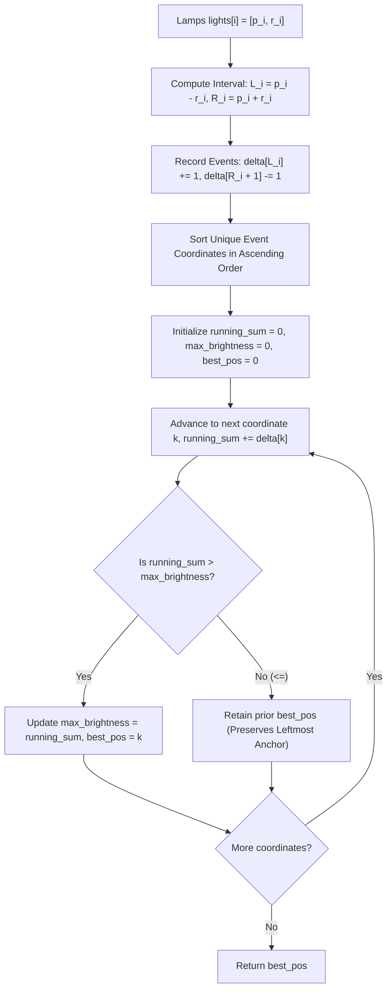

# Guided Example: Brightest Position on Street

## 1. Concrete Problem Restatement & Input Data

A straight road is modeled as an unbounded continuous one-dimensional integer coordinate line. We are provided a list of $N$ streetlamps, where each lamp entry is defined by a pair $\text{lights}[i] = [p_i, r_i]$. The value $p_i$ denotes the integer center position of the lamp along the street, and $r_i$ represents its non-negative illumination radius.

A lamp covers every integer point within its inclusive closed interval:
$$[p_i - r_i, \; p_i + r_i]$$

The illumination brightness at any integer position $x$ is defined as the total number of lamps whose illumination intervals cover $x$:
$$\text{Brightness}(x) = \sum_{i=1}^N \mathbf{1}_{p_i - r_i \le x \le p_i + r_i}$$

Our objective is to locate the position $x^*$ that achieves the global maximum brightness:
$$x^* = \arg\max_{x \in \mathbb{Z}} \text{Brightness}(x)$$
If multiple integer positions achieve the identical maximum brightness value, we must return the **smallest** (leftmost) such coordinate.

### Sample Input Dataset

Consider the three-lamp configuration:
$$\text{lights} = [[-3, 2], [1, 2], [3, 3]]$$

We also examine the two-point overlap:
$$\text{lights}_{\text{touch}} = [[1, 0], [0, 1]]$$
and the single isolated lamp:
$$\text{lights}_{\text{single}} = [[1, 2]]$$

---

## 2. Conceptual Walkthrough & Visual Intuition

The coordinate space spans from $-10^8$ to $10^8$. Scanning every integer point individually is computationally impossible ($2 \times 10^8$ operations). However, the brightness function is piecewise-constant: it only changes at discrete entry and exit boundary points.

Every lamp with coverage $[L_i, R_i] = [p_i - r_i, p_i + r_i]$ creates two discrete differential impulse events:
- **Coverage Begins at $L_i$**: The brightness increases by $+1$ starting at $x = L_i$.
- **Coverage Ends After $R_i$**: Because the interval is inclusive of $R_i$, the brightness drops by $-1$ starting at $x = R_i + 1$.

By mapping all discrete change points into an event accumulator and scanning through the coordinates in ascending numerical order, we can maintain a running brightness sum.

Because the coordinates are processed in strictly increasing order, applying a strict inequality check ($\text{running\_sum} > \text{max\_brightness}$) ensures that the first (smallest) coordinate reaching the peak value is selected and never overwritten by subsequent equal peaks.

---

## 3. Step-by-Step State Progression Table

Let us trace $\text{lights} = [[-3, 2], [1, 2], [3, 3]]$.

First, convert each lamp into entry and exit events:
- Lamp $0$: Center $-3$, Range $2 \implies [-5, -1]$. Entry at $-5$ ($+1$), Exit at $0$ ($-1$).
- Lamp $1$: Center $1$, Range $2 \implies [-1, 3]$. Entry at $-1$ ($+1$), Exit at $4$ ($-1$).
- Lamp $2$: Center $3$, Range $3 \implies [0, 6]$. Entry at $0$ ($+1$), Exit at $7$ ($-1$).

We aggregate all discrete deltas at identical coordinates:
- At coordinate $-5$: $\Delta = +1$
- At coordinate $-1$: $\Delta = +1$
- At coordinate $0$: $\Delta = -1 + 1 = 0$
- At coordinate $4$: $\Delta = -1$
- At coordinate $7$: $\Delta = -1$

The sorted unique coordinates are $[-5, -1, 0, 4, 7]$.

| Step | Coordinate $k$ | Net Event Delta $\Delta[k]$ | Running Brightness $S \leftarrow S + \Delta[k]$ | Prior Peak $M$ | Condition $S > M$? | Updated Peak $M$ | Optimal Coordinate $x^*$ | State Transition Rationale |
|---|---|---|---|---|---|---|---|---|
| $1$ | $-5$ | $+1$ | $0 + 1 = 1$ | $0$ | **Yes ($1 > 0$)** | $1$ | $-5$ | Lamp 0 begins coverage |
| $2$ | $-1$ | $+1$ | $1 + 1 = 2$ | $1$ | **Yes ($2 > 1$)** | $2$ | $-1$ | Lamp 1 begins coverage; reaches new peak $2$ |
| $3$ | $0$ | $0$ | $2 + 0 = 2$ | $2$ | No ($2 \not> 2$) | $2$ | $-1$ | Lamp 0 ends, Lamp 2 begins (net zero change); tie broken in favor of earlier $-1$ |
| $4$ | $4$ | $-1$ | $2 - 1 = 1$ | $2$ | No ($1 \not> 2$) | $2$ | $-1$ | Lamp 1 coverage terminates |
| $5$ | $7$ | $-1$ | $1 - 1 = 0$ | $2$ | No ($0 \not> 2$) | $2$ | $-1$ | Lamp 2 coverage terminates |

The global maximum brightness is $2$, achieved over the entire span $[-1, 3]$. The smallest integer coordinate in this maximal range is $-1$.

---

## 4. Key Transition Dynamics & Boundary Handling

The sweep line exhibits three critical transition dynamics:

1. **Inclusive Endpoint Handling**: Because coverage $[L_i, R_i]$ includes $R_i$, the brightness at position $R_i$ is still supported by lamp $i$. The downward step occurs strictly at $R_i + 1$. Placing the decrement at $R_i$ would prematurely drop the brightness at the right boundary.
2. **Cancellation of Simultaneous Events**: When one lamp ends at $R_A$ and another begins at $L_B = R_A + 1$, the coordinate $R_A + 1$ sees both a $-1$ and a $+1$, producing a net delta of $0$. The running brightness maintains continuity without spurious dips.
3. **Strict Inequality for Leftmost Tie-Breaking**: When multiple contiguous coordinates share the same maximal brightness (e.g., coordinates $-1, 0, 1, 2, 3$ all have brightness $2$), checking $S > M$ strictly prevents updating $x^*$. Thus, $x^*$ remains fixed at $-1$.

| Scenario | Lamps Config | Event Deltas Generated | Sorted Event Trace | Peak Value | Output Position | Structural Takeaway |
|---|---|---|---|---|---|---|
| Point Overlap | $[[1, 0], [0, 1]]$ | Lamp 0: $[1, 1] \implies 1 (+1), 2 (-1)$ Lamp 1: $[-1, 1] \implies -1 (+1), 2 (-1)$ | $-1 \to 1$ $1 \to 2$ $2 \to 0$ | $2$ | $1$ | Range 0 lamp produces a single-point peak at $x = 1$ |
| Flat Plateau | $[[1, 2]]$ | Lamp 0: $[-1, 3] \implies -1 (+1), 4 (-1)$ | $-1 \to 1$ $4 \to 0$ | $1$ | $-1$ | Single lamp covers $[-1, 3]$; leftmost point $-1$ selected |
| Disjoint Lamps | $[[0, 1], [10, 1]]$ | Lamp 0: $[-1, 2]$ Lamp 1: $[9, 12]$ | $-1 \to 1, 3 \to 0$ $9 \to 1, 13 \to 0$ | $1$ | $-1$ | Both peaks have brightness 1; earlier peak at $-1$ selected |

---

## 5. Algorithmic Correctness & Soundness

### Invariant: Exact Prefix Integration
Let $\mathcal{X} = \{x_1, x_2, \dots, x_m\}$ be the sorted set of all unique transition coordinates in $\bigcup_i \{p_i - r_i, p_i + r_i + 1\}$.
By definition, for any $x \in [x_k, x_{k+1} - 1]$, no lamp begins or terminates within this interval. Hence:
$$\text{Brightness}(x) = \text{Brightness}(x_k) = \sum_{j=1}^k \Delta[x_j]$$
The prefix sum of deltas up to coordinate $x_k$ computes the exact brightness throughout the entire interval $[x_k, x_{k+1}-1]$.

### Completeness of Candidate Maximizers
Because brightness is constant on $[x_k, x_{k+1}-1]$, the maximum brightness over all integers $\mathbb{Z}$ must be achieved at one of the discrete boundary coordinates $x_k \in \mathcal{X}$.
Furthermore, within any plateau $[x_k, x_{k+1}-1]$, the smallest coordinate is $x_k$ itself.
Therefore, restricting our candidate search exclusively to $\mathcal{X}$ and applying strict comparison $S > M$ guarantees identifying the minimal maximizer.

---

## 6. Edge Cases & Common Pitfalls

1. **Zero Radius Lamps ($r_i = 0$)**: A lamp with range $0$ illuminates only its exact center: $[p_i, p_i]$. The delta events are correctly generated as $+1$ at $p_i$ and $-1$ at $p_i + 1$.
2. **Negative Coordinates**: Coordinates can be deeply negative (down to $-10^8 - 10^8 = -2 \times 10^8$). The algorithm uses coordinate-based event keys, remaining entirely agnostic to whether coordinates are negative, zero, or positive.
3. **Net Zero Delta Retention**: When events cancel to $\Delta = 0$ (such as at $x = 0$ in our walkthrough), the running sum does not change, and checking $S > M$ correctly ignores it.
4. **Tie Breaking Direction**: Returning $\ge$ instead of $>$ would erroneously overwrite the optimal coordinate with the rightmost point of the maximal brightness plateau instead of the leftmost.

---

## 7. Complexity Analysis

### Time Complexity
- **Event Extraction**: Transforming $N$ lamps into $2N$ boundary points takes $\mathcal{O}(N)$ operations.
- **Coordinate Sorting**: There are at most $2N$ distinct coordinates. Sorting these coordinates takes $\mathcal{O}(N \log N)$ time.
- **Linear Sweep**: Iterating through the sorted coordinates and maintaining the running sum takes $\mathcal{O}(N)$ time.
- **Total Time Complexity**: $\mathcal{O}(N \log N)$, which easily scales to $N = 10^5$ well within standard execution budgets.

### Space Complexity
- **Event Map / Hash Storage**: Storing at most $2N$ coordinate-delta pairs requires $\mathcal{O}(N)$ auxiliary memory.
- **Sorted Keys Buffer**: Storing the distinct coordinates for iteration takes $\mathcal{O}(N)$ space.
- **Total Auxiliary Space**: $\mathcal{O}(N)$, scaling linearly with the number of input lamps.
